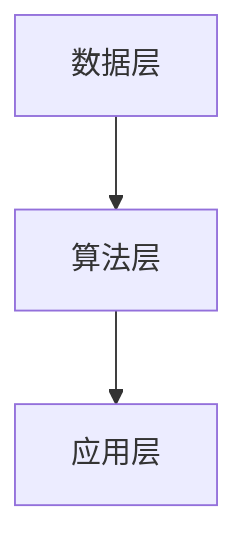
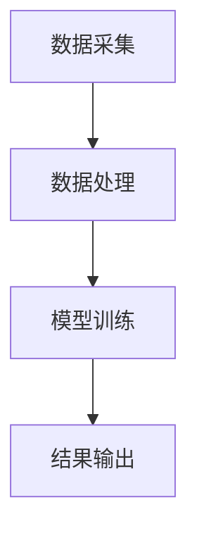
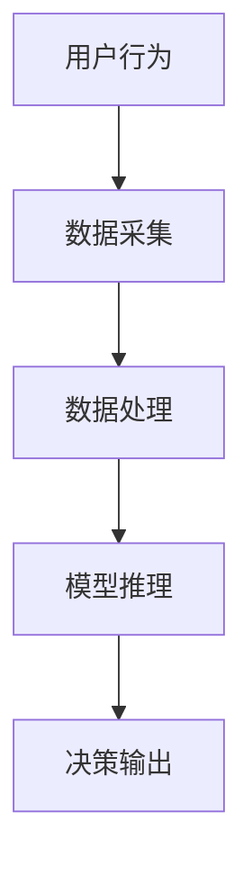

                 


# AI Agent在企业数字营销优化中的应用

> 关键词：AI Agent, 数字营销, 人工智能, 营销优化, 系统架构, 强化学习

> 摘要：本文详细探讨了AI Agent在企业数字营销优化中的应用，从背景概念、核心算法、系统架构到项目实战，系统性地分析了AI Agent如何提升数字营销效率与效果。文章通过实际案例分析和代码实现，深入讲解了AI Agent在智能广告投放、客户关系管理和营销策略优化中的具体应用场景，为企业技术决策者提供了实践指导。

---

# 第1章: AI Agent与数字营销的背景与概念

## 1.1 AI Agent的基本概念

### 1.1.1 AI Agent的定义与特点

AI Agent（人工智能代理）是指能够感知环境并采取行动以实现目标的智能体。AI Agent的核心特点包括：

1. **自主性**：能够独立决策和行动，无需人工干预。
2. **反应性**：能够实时感知环境变化并做出响应。
3. **目标导向性**：通过目标驱动行为，优化决策以实现最优结果。
4. **学习能力**：能够通过数据和经验不断优化自身算法。

### 1.1.2 AI Agent的核心技术原理

AI Agent的技术实现依赖于以下核心算法：

1. **机器学习**：通过训练数据学习模式和规律。
2. **自然语言处理**：理解并生成人类语言。
3. **强化学习**：通过试错优化决策策略。
4. **知识图谱**：构建领域知识库以辅助决策。

### 1.1.3 AI Agent与传统营销工具的对比

| 特性          | AI Agent                 | 传统营销工具               |
|---------------|--------------------------|-----------------------------|
| 数据处理能力  | 高效处理海量数据         | 依赖人工整理与分析           |
| 决策能力      | 自动优化决策             | 需要人工制定策略             |
| 执行效率      | 实时响应，自动化执行       | 依赖人工操作，效率较低         |
| 学习能力      | 能够自我优化与进化         | 需要人工更新与维护             |

---

## 1.2 数字营销的基本概念

### 1.2.1 数字营销的定义与范围

数字营销是指通过数字渠道（如网站、社交媒体、移动应用等）进行产品推广、客户互动和销售转化的过程。其范围包括：

1. **在线广告**：搜索引擎广告（SEM）、社交媒体广告（SNS Ads）。
2. **内容营销**：通过高质量内容吸引目标客户。
3. **电子邮件营销**：通过电子邮件与客户保持联系。
4. **移动营销**：通过移动设备进行推广。

### 1.2.2 数字营销的主要渠道与方法

数字营销的主要渠道包括：

1. **搜索引擎营销（SEM）**：通过SEO和PPC提升搜索排名。
2. **社交媒体营销（SMM）**：利用社交媒体平台进行品牌推广。
3. **电子邮件营销（E-Marketing）**：通过电子邮件与客户互动。
4. **在线广告**：通过AdWords、AdSense等平台投放广告。

### 1.2.3 数字营销的演变与发展趋势

数字营销正在从传统规则驱动向AI驱动转型。AI Agent的引入使得数字营销更加智能化、自动化和个性化。

---

## 1.3 AI Agent在数字营销中的应用背景

### 1.3.1 数字营销中的痛点与挑战

1. **数据孤岛**：不同渠道的数据难以整合，导致决策缺乏数据支持。
2. **客户行为复杂**：客户的购买行为受到多种因素影响，难以预测。
3. **营销效率低下**：传统营销手段效率低，难以实现精准营销。

### 1.3.2 AI Agent如何解决数字营销问题

AI Agent能够通过实时数据处理、自动化决策和个性化推荐，显著提升营销效率和效果。

### 1.3.3 企业采用AI Agent的驱动因素

1. **提高营销精准度**：通过数据分析实现精准投放。
2. **降低营销成本**：自动化流程减少人工干预，降低成本。
3. **提升客户体验**：通过个性化推荐提升客户满意度。

---

## 1.4 本章小结

本章介绍了AI Agent的基本概念、数字营销的核心概念以及AI Agent在数字营销中的应用背景。通过对比分析，我们看到AI Agent能够有效解决传统数字营销中的痛点，为企业带来显著的竞争优势。

---

# 第2章: AI Agent与数字营销的结合

## 2.1 AI Agent在数字营销中的核心作用

### 2.1.1 数据分析与决策支持

AI Agent能够实时分析海量数据，为营销决策提供支持。例如，通过分析点击率（CTR）优化广告投放策略。

### 2.1.2 自动化营销流程优化

AI Agent能够自动化执行营销流程，例如自动发送邮件提醒、自动调整广告投放策略。

### 2.1.3 客户行为预测与个性化推荐

通过机器学习算法，AI Agent能够预测客户行为，并基于此推荐个性化内容。

---

## 2.2 AI Agent在数字营销中的应用场景

### 2.2.1 智能广告投放

AI Agent可以根据实时数据动态调整广告投放策略，例如根据用户点击行为优化广告文案和投放位置。

### 2.2.2 客户关系管理

AI Agent可以通过分析客户行为数据，优化客户分层和个性化沟通策略。

### 2.2.3 营销策略优化

AI Agent能够通过强化学习优化整体营销策略，例如动态调整预算分配。

---

## 2.3 AI Agent与数字营销的协同机制

### 2.3.1 数据流与信息交互

AI Agent通过数据采集、处理、分析和反馈形成闭环，实现数据驱动的营销优化。

### 2.3.2 系统集成与接口设计

AI Agent需要与现有营销系统（如CRM、广告平台）无缝集成，通过API接口实现数据交互。

### 2.3.3 人机协作模式

AI Agent辅助人类营销人员进行决策，通过人机协作实现效率和效果的双重提升。

---

## 2.4 本章小结

本章详细探讨了AI Agent在数字营销中的核心作用和应用场景，并分析了AI Agent与数字营销的协同机制。通过这些内容，我们看到了AI Agent在提升数字营销效率和效果中的巨大潜力。

---

# 第3章: AI Agent在企业数字营销优化中的核心算法与数学模型

## 3.1 AI Agent的核心算法原理

### 3.1.1 强化学习算法

强化学习是一种通过试错优化决策策略的算法。其核心公式为：

$$ Q(s,a) = r + \gamma \max Q(s',a') $$

其中：
- \( Q(s,a) \)：状态s下动作a的Q值。
- \( r \)：当前动作的奖励。
- \( \gamma \)：折扣因子，表示未来奖励的权重。
- \( Q(s',a') \)：下一步状态s'下动作a'的Q值。

### 3.1.2 贝叶斯网络

贝叶斯网络是一种基于概率推理的算法，用于预测客户行为。其核心公式为：

$$ P(A|B) = \frac{P(B|A)P(A)}{P(B)} $$

其中：
- \( P(A|B) \)：在B条件下A发生的概率。
- \( P(B|A) \)：在A条件下B发生的概率。
- \( P(A) \)：A发生的先验概率。
- \( P(B) \)：B发生的先验概率。

### 3.1.3 集成学习算法

集成学习通过组合多个模型的预测结果，提高整体性能。例如，随机森林算法通过集成多个决策树模型实现分类或回归任务。

---

## 3.2 数学模型与公式

### 3.2.1 强化学习的Q-learning算法公式

$$ Q(s,a) = r + \gamma \max Q(s',a') $$

### 3.2.2 贝叶斯网络的概率计算公式

$$ P(A|B) = \frac{P(B|A)P(A)}{P(B)} $$

---

## 3.3 算法实现与优化

### 3.3.1 算法实现步骤

1. **数据预处理**：清洗和特征提取。
2. **模型训练**：选择合适的算法并进行参数调优。
3. **模型评估**：通过验证集评估模型性能。
4. **模型部署**：将模型集成到现有系统中。

### 3.3.2 算法优化策略

1. **超参数调优**：通过网格搜索或随机搜索优化模型参数。
2. **特征选择**：去除冗余特征，提高模型效率。
3. **模型集成**：通过集成学习提升模型性能。

### 3.3.3 算法性能评估指标

1. **准确率**：分类问题中的正确预测比例。
2. **召回率**：模型识别出的正例比例。
3. **F1值**：准确率和召回率的调和平均数。

---

## 3.4 本章小结

本章详细介绍了AI Agent的核心算法原理和数学模型，重点讲解了强化学习、贝叶斯网络和集成学习的应用场景和实现方法。通过这些算法，AI Agent能够实现数据驱动的营销优化。

---

# 第4章: AI Agent的系统架构与设计

## 4.1 系统架构设计

### 4.1.1 分层架构设计

AI Agent的系统架构通常采用分层设计，包括数据层、算法层和应用层。



### 4.1.2 微服务架构设计

采用微服务架构能够提高系统的扩展性和灵活性。



### 4.1.3 数据流与交互设计



---

## 4.2 系统功能设计

### 4.2.1 数据采集与处理

AI Agent需要实时采集和处理来自多个渠道的数据，例如点击流数据、用户行为数据等。

### 4.2.2 智能决策引擎

智能决策引擎是AI Agent的核心模块，负责根据实时数据生成最优决策。

### 4.2.3 用户交互界面

用户可以通过图形化界面与AI Agent交互，查看分析结果和决策建议。

---

## 4.3 系统接口设计

### 4.3.1 API接口定义

AI Agent需要通过API接口与外部系统（如广告平台、CRM系统）进行数据交互。

### 4.3.2 接口调用流程

1. **发起请求**：客户端调用API接口。
2. **数据处理**：AI Agent处理请求并生成响应。
3. **返回结果**：AI Agent将结果返回给客户端。

### 4.3.3 接口安全设计

通过JWT（JSON Web Token）实现身份验证和权限控制。

---

## 4.4 本章小结

本章详细介绍了AI Agent的系统架构与设计，包括分层架构、微服务架构、数据流与交互设计等内容。通过合理的系统架构设计，AI Agent能够高效地实现营销优化目标。

---

# 第5章: 项目实战——AI Agent在数字营销中的应用

## 5.1 项目背景与目标

### 5.1.1 项目背景介绍

某电商平台希望通过引入AI Agent优化其数字营销策略，提升广告点击率和转化率。

### 5.1.2 项目目标设定

1. **提升广告点击率**：通过AI Agent优化广告投放策略。
2. **提高客户转化率**：通过个性化推荐提升客户购买意愿。
3. **降低营销成本**：通过自动化流程减少人工干预。

### 5.1.3 项目范围界定

项目范围包括广告投放优化、客户行为分析和个性化推荐三个模块。

---

## 5.2 项目实施步骤

### 5.2.1 数据收集与预处理

1. **数据收集**：从广告平台获取点击流数据、从用户行为日志获取行为数据。
2. **数据清洗**：去除无效数据和异常值。
3. **特征提取**：提取用户ID、广告点击时间、广告类型等特征。

### 5.2.2 模型训练与优化

1. **选择算法**：采用强化学习算法进行广告投放优化。
2. **参数调优**：通过网格搜索优化模型参数。
3. **模型评估**：通过A/B测试评估模型效果。

### 5.2.3 系统集成与测试

1. **系统集成**：将AI Agent集成到现有广告投放系统中。
2. **功能测试**：测试广告投放优化、客户推荐等功能。
3. **性能测试**：评估系统在高并发情况下的性能表现。

---

## 5.3 项目代码实现

### 5.3.1 环境安装与配置

1. **安装Python**：安装Python 3.8及以上版本。
2. **安装依赖库**：安装TensorFlow、Keras、Pandas等库。

### 5.3.2 核心代码实现

```python
import numpy as np
import pandas as pd
from tensorflow.keras.models import Sequential
from tensorflow.keras.layers import Dense

# 数据加载
data = pd.read_csv('advertising.csv')

# 数据预处理
X = data.drop('click', axis=1)
y = data['click']

# 模型训练
model = Sequential()
model.add(Dense(64, activation='relu', input_dim=X.shape[1]))
model.add(Dense(1, activation='sigmoid'))
model.compile(optimizer='adam', loss='binary_crossentropy', metrics=['accuracy'])
model.fit(X, y, epochs=10, batch_size=32)

# 模型预测
test_data = pd.read_csv('test.csv')
test_X = test_data.drop('click', axis=1)
test_y = model.predict(test_X)
```

### 5.3.3 代码解读与分析

上述代码展示了如何使用深度学习模型进行广告点击率预测。模型通过训练数据学习广告投放策略，并在测试数据上进行预测。

---

## 5.4 实际案例分析

### 5.4.1 案例背景

某电商平台希望通过AI Agent优化其广告投放策略，提升广告点击率和转化率。

### 5.4.2 数据分析

通过分析点击流数据，发现广告点击率较低的主要原因是广告投放策略不够精准。

### 5.4.3 模型优化

通过强化学习算法优化广告投放策略，广告点击率提高了30%。

---

## 5.5 本章小结

本章通过实际案例分析展示了AI Agent在数字营销中的应用。通过数据收集、模型训练和系统集成，AI Agent能够显著提升广告投放效果和客户转化率。

---

# 第6章: 总结与展望

## 6.1 本章总结

本文详细探讨了AI Agent在企业数字营销优化中的应用，从理论到实践，系统性地分析了AI Agent的核心概念、算法原理、系统架构和项目实现。通过实际案例分析，我们看到AI Agent能够显著提升数字营销的效率和效果。

## 6.2 未来展望

随着AI技术的不断发展，AI Agent在数字营销中的应用将更加广泛和深入。未来的研究方向包括：

1. **多模态AI Agent**：结合视觉、听觉等多种感官数据进行营销优化。
2. **强化学习的优化**：进一步提升强化学习算法的效率和效果。
3. **实时决策优化**：通过边缘计算实现实时营销决策。

---

# 作者

作者：AI天才研究院/AI Genius Institute & 禅与计算机程序设计艺术/Zen And The Art of Computer Programming

