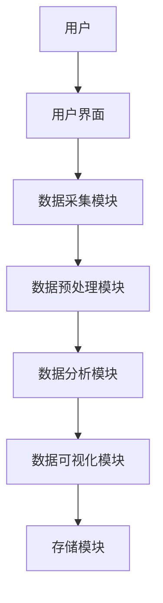

                 


# AI Agent在企业数据分析与可视化中的应用

> 关键词：AI Agent, 数据分析, 数据可视化, 机器学习, 自然语言处理, 企业应用

> 摘要：本文详细探讨了AI Agent在企业数据分析与可视化中的应用，从基本概念到核心算法，再到系统架构设计和项目实战，全面解析了如何利用AI技术提升企业数据分析效率和可视化能力。文章内容涵盖数据分析与可视化的基础、AI Agent的核心算法与数学模型、系统架构设计、项目实战及总结与展望。

---

## 第一部分: AI Agent与企业数据分析概述

### 第1章: AI Agent与企业数据分析概述

#### 1.1 AI Agent的基本概念

##### 1.1.1 AI Agent的定义与特点

AI Agent（人工智能代理）是指在计算机系统中，能够感知环境并采取行动以实现目标的智能体。与传统软件不同，AI Agent具备以下特点：

- **自主性**：能够在没有外部干预的情况下运行。
- **反应性**：能够感知环境并实时做出反应。
- **目标导向**：通过目标驱动来优化决策和行动。

##### 1.1.2 AI Agent与传统数据分析的区别

传统数据分析依赖于人工操作，从数据收集、清洗到分析和可视化，每一步都需要手动干预。而AI Agent能够自动化完成这些任务，通过机器学习算法和自然语言处理技术，实现数据的智能分析和可视化。

##### 1.1.3 企业数据分析的现状与挑战

企业在数据分析中面临以下挑战：

- **数据量大**：企业每天产生海量数据，人工处理效率低下。
- **数据复杂性**：数据来源多样，格式不一，难以统一处理。
- **分析深度不足**：传统分析方法难以发现数据中的深层次规律。
- **实时性要求高**：企业需要实时数据洞察以快速决策。

#### 1.2 AI Agent在企业数据分析中的作用

##### 1.2.1 提高数据分析效率

AI Agent能够自动化处理数据，从清洗、特征提取到建模，大大缩短数据分析周期。

##### 1.2.2 数据洞察与决策支持

通过机器学习和NLP技术，AI Agent能够发现数据中的隐藏模式，为企业提供深度洞察和决策支持。

##### 1.2.3 个性化数据分析服务

AI Agent可以根据不同用户的需求，提供个性化的数据分析和可视化服务，满足企业的多样化需求。

#### 1.3 本章小结

本章介绍了AI Agent的基本概念及其在企业数据分析中的作用，强调了AI Agent能够解决传统数据分析中的效率和深度问题。

---

## 第二部分: 数据分析与可视化的技术基础

### 第2章: 数据分析与可视化的基础

#### 2.1 数据分析的基本流程

##### 2.1.1 数据收集与预处理

数据收集是数据分析的第一步，常见的数据来源包括数据库、API接口、文件等。数据预处理包括数据清洗、去重、填补缺失值等步骤。

##### 2.1.2 数据清洗与特征工程

数据清洗是去除噪声数据，确保数据质量。特征工程则是通过提取和选择特征，提升模型的性能。

##### 2.1.3 数据分析方法概述

数据分析方法包括描述性分析、诊断性分析、预测性分析和规范性分析。

#### 2.2 数据可视化的基础

##### 2.2.1 数据可视化的重要性

数据可视化能够帮助用户更直观地理解数据，发现数据中的模式和趋势。

##### 2.2.2 常见的数据可视化工具

常用的工具包括Matplotlib、Seaborn、Tableau、Power BI等。

##### 2.2.3 数据可视化的基本原则

数据可视化应遵循简洁性、一致性、可读性和交互性的原则。

#### 2.3 本章小结

本章介绍了数据分析的基本流程和数据可视化的基础，为后续章节的深入分析打下基础。

---

## 第三部分: AI Agent的核心算法与数学模型

### 第3章: AI Agent的核心算法与数学模型

#### 3.1 数据预处理与特征提取

##### 3.1.1 数据清洗的步骤

数据清洗包括去除重复数据、处理缺失值、删除异常值等。

##### 3.1.2 特征工程的常见方法

特征工程包括特征选择、特征提取、特征变换等步骤。

##### 3.1.3 数据标准化与归一化

数据标准化公式：$$ z = \frac{x - \mu}{\sigma} $$

数据归一化公式：$$ x' = \frac{x - \min(x)}{\max(x) - \min(x)} $$

#### 3.2 机器学习基础

##### 3.2.1 监督学习与无监督学习

- **监督学习**：有标签的数据，如线性回归、支持向量机（SVM）。
- **无监督学习**：无标签的数据，如聚类、降维。

##### 3.2.2 常见的机器学习算法

- **线性回归**：用于预测连续型变量。
- **支持向量机（SVM）**：用于分类和回归。
- **随机森林**：用于分类和回归，基于决策树的集成方法。

##### 3.2.3 模型评估与调优

模型评估指标包括准确率、召回率、F1分数等。

#### 3.3 自然语言处理（NLP）基础

##### 3.3.1 NLP的基本任务

- **分词**：将文本分割成单词或短语。
- **词嵌入**：将词转换为低维向量，如Word2Vec。
- **文本分类**：将文本分类到预定义的类别中。

##### 3.3.2 常见的NLP算法

- **分词算法**：如jieba（中文分词工具）。
- **词嵌入模型**：如Word2Vec、GloVe。
- **文本分类算法**：如朴素贝叶斯、支持向量机。

##### 3.3.3 NLP在数据分析中的应用

NLP可以用于文本数据的清洗、特征提取和分类。

#### 3.4 数据可视化算法

##### 3.4.1 数据可视化的分类

- **柱状图**：比较不同类别之间的数值大小。
- **折线图**：展示数据随时间的变化趋势。
- **散点图**：展示数据点之间的分布情况。

##### 3.4.2 基于AI的可视化方法

AI驱动的可视化工具可以根据数据自动选择最佳的可视化方式。

##### 3.4.3 可视化效果的评估指标

评估指标包括清晰度、信息密度、交互性等。

#### 3.5 本章小结

本章详细介绍了AI Agent的核心算法与数学模型，包括数据预处理、机器学习算法、NLP算法和数据可视化算法。

---

## 第四部分: 系统架构设计与项目实战

### 第4章: 系统架构设计与项目实战

#### 4.1 系统架构设计

##### 4.1.1 系统模块划分

- **数据采集模块**：负责数据的采集和预处理。
- **数据分析模块**：负责数据的特征提取和建模。
- **数据可视化模块**：负责数据的可视化展示。
- **用户交互模块**：负责与用户的交互和结果展示。

##### 4.1.2 系统架构图



##### 4.1.3 接口设计

- 数据采集模块接口：`getData(source)`，返回采集的数据。
- 数据分析模块接口：`analyze(data)`，返回分析结果。
- 数据可视化模块接口：`visualize(result)`，生成可视化图表。

#### 4.2 项目实战

##### 4.2.1 项目介绍

本项目以某企业销售数据分析为例，利用AI Agent实现销售预测和可视化。

##### 4.2.2 环境配置

安装Python、Pandas、NumPy、Scikit-learn、Matplotlib等库。

##### 4.2.3 核心代码实现

```python
import pandas as pd
from sklearn.model_selection import train_test_split
from sklearn.linear_model import LinearRegression
import matplotlib.pyplot as plt

# 数据加载
data = pd.read_csv('sales_data.csv')

# 数据清洗
data.dropna(inplace=True)

# 特征提取
X = data[['price', 'advertising']]
y = data['sales']

# 模型训练
X_train, X_test, y_train, y_test = train_test_split(X, y, test_size=0.2, random_state=42)
model = LinearRegression()
model.fit(X_train, y_train)

# 模型预测
y_pred = model.predict(X_test)

# 可视化
plt.scatter(y_test, y_pred)
plt.xlabel('Actual Sales')
plt.ylabel('Predicted Sales')
plt.title('Sales Prediction')
plt.show()
```

##### 4.2.4 项目小结

本项目展示了AI Agent在销售数据分析中的应用，通过机器学习模型实现销售预测，并利用可视化工具展示预测结果。

---

## 第五部分: 总结与展望

### 第5章: 总结与展望

#### 5.1 总结

本文详细探讨了AI Agent在企业数据分析与可视化中的应用，从基本概念到核心算法，再到系统架构设计和项目实战，全面解析了如何利用AI技术提升企业数据分析效率和可视化能力。

#### 5.2 未来展望

未来，随着AI技术的不断发展，AI Agent在企业数据分析与可视化中的应用将更加广泛。深度学习、强化学习等技术的结合，将进一步提升数据分析的深度和可视化的效果。

---

## 作者：AI天才研究院/AI Genius Institute & 禅与计算机程序设计艺术 /Zen And The Art of Computer Programming

---

以上是《AI Agent在企业数据分析与可视化中的应用》的完整目录和内容概述。如需进一步扩展或修改，请随时告知！

