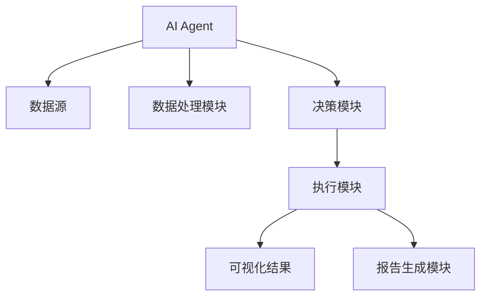
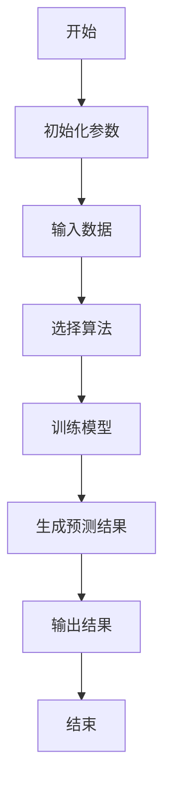
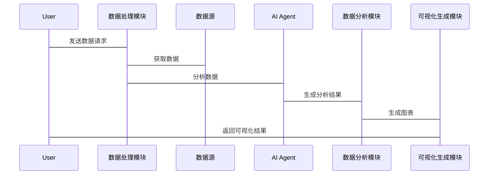

                 


# AI Agent在企业数据可视化与报告生成中的应用

## 关键词：
AI Agent, 数据可视化, 报告生成, 机器学习, 强化学习, 数据处理

## 摘要：
本文探讨AI Agent在企业数据可视化与报告生成中的应用，分析其核心原理、系统架构设计及实际案例，展示如何通过AI技术提升数据处理效率和报告生成的智能化水平。

---

## 第一部分: 背景介绍

### 第1章: AI Agent与企业数据可视化概述

#### 1.1 AI Agent的基本概念
- **1.1.1 AI Agent的定义与特点**
  - AI Agent是一种智能代理，具备感知环境、做出决策和执行任务的能力。
  - 其特点包括自主性、反应性、目标导向和社会能力。
- **1.1.2 企业数据可视化的定义与价值**
  - 数据可视化是将数据转化为图形化信息的过程，帮助企业更好地理解和分析数据。
  - 其价值在于提升数据的可读性和决策效率。
- **1.1.3 AI Agent在数据可视化中的作用**
  - AI Agent能够自动分析数据，生成动态可视化图表，并提供数据洞察。

#### 1.2 问题背景与描述
- **1.2.1 传统数据可视化的局限性**
  - 数据处理耗时且复杂，难以应对海量数据。
  - 可视化图表生成依赖人工操作，效率低下。
- **1.2.2 企业报告生成的痛点**
  - 数据来源多样，整合困难。
  - 报告生成过程繁琐，缺乏智能化。
- **1.2.3 AI Agent如何解决这些问题**
  - 通过自动化数据处理和智能分析，显著提高数据可视化的效率和准确性。

#### 1.3 应用价值与前景
- **1.3.1 AI Agent在数据可视化中的优势**
  - 提高数据处理速度，优化资源利用率。
  - 提供实时数据监控和预测分析。
- **1.3.2 企业数据报告生成的智能化趋势**
  - AI驱动的报告生成工具将逐步取代传统方法。
  - 智能报告生成能够适应不同用户的需求。
- **1.3.3 未来发展方向与挑战**
  - 探索更高效的算法和模型，提升AI Agent的智能化水平。
  - 应对数据隐私和安全的挑战，确保合规性。

---

## 第二部分: 核心概念与联系

### 第2章: AI Agent的核心原理

#### 2.1 AI Agent的感知、决策与执行
- **2.1.1 感知层：数据采集与处理**
  - AI Agent通过传感器或API接口采集数据。
  - 使用数据清洗和特征提取技术处理数据。
- **2.1.2 决策层：算法与模型选择**
  - 基于强化学习和监督学习的算法选择。
  - 使用Q-learning模型进行决策优化。
- **2.1.3 执行层：生成可视化报告**
  - 根据分析结果生成图表和报告。
  - 使用Matplotlib或Tableau等工具展示数据。

#### 2.2 数据可视化与报告生成的关联
- **2.2.1 数据分析与可视化的流程**
  - 数据收集、处理、分析、可视化和报告生成。
- **2.2.2 AI Agent如何优化报告生成**
  - 自动调整图表样式，优化数据展示效果。
  - 自动生成报告内容，减少人工干预。
- **2.2.3 可视化结果的反馈机制**
  - 用户反馈用于优化AI Agent的行为。
  - 实时更新可视化结果，提升用户体验。

#### 2.3 核心概念对比分析
- **2.3.1 AI Agent与传统数据处理工具的对比**
  | 特性             | AI Agent              | 传统工具           |
  |------------------|-----------------------|-------------------|
  | 自动化能力       | 高                    | 低                |
  | 决策能力         | 强                    | 无                |
  | 可扩展性         | 高                    | 低                |
- **2.3.2 数据可视化与报告生成的流程对比**
  - 传统方法：人工操作，效率低。
  - AI Agent方法：自动化处理，效率高。

#### 2.4 实体关系图


---

## 第三部分: 算法原理讲解

### 第3章: AI Agent的算法与模型

#### 3.1 强化学习算法
- **3.1.1 强化学习的基本原理**
  - 使用Q-learning算法，通过状态、动作和奖励进行学习。
  - 状态表示当前数据处理的状态，动作是AI Agent的操作，奖励是结果的好坏。
- **3.1.2 Q-learning算法的数学模型**
  $$ Q(s, a) = Q(s, a) + \alpha [r + \max_{a'} Q(s', a') - Q(s, a)] $$
  - 其中，$\alpha$是学习率，$r$是奖励，$s'$是下一个状态。
- **3.1.3 算法实现步骤**
  1. 初始化Q表。
  2. 与环境交互，获取状态和奖励。
  3. 更新Q表中的值。
  4. 重复步骤2和3，直到收敛。

#### 3.2 监督学习算法
- **3.2.1 监督学习的基本原理**
  - 使用回归或分类算法，基于标注数据进行训练。
  - 常用算法包括线性回归和随机森林。
- **3.2.2 算法实现步骤**
  1. 收集并标注数据。
  2. 将数据分为训练集和测试集。
  3. 训练模型并进行预测。
  4. 评估模型性能并优化。

#### 3.3 算法流程图


---

## 第四部分: 系统分析与架构设计方案

### 第4章: 企业数据可视化与报告生成的系统设计

#### 4.1 系统功能设计
- **4.1.1 功能模块**
  - 数据采集模块：负责数据的获取和初步处理。
  - 数据分析模块：使用AI算法进行数据分析。
  - 可视化生成模块：生成动态图表和报告。
- **4.1.2 领域模型**
  ```mermaid
  classDiagram
      class 数据源 {
          数据字段
          数据类型
      }
      class 数据处理模块 {
          清洗数据
          提取特征
      }
      class AI Agent {
          感知
          决策
          执行
      }
      数据源 --> 数据处理模块
      数据处理模块 --> AI Agent
      AI Agent --> 可视化结果
  ```

#### 4.2 系统架构设计
- **4.2.1 架构图**
  ```mermaid
  container 数据层 {
      数据库
      数据文件
  }
  container 服务层 {
      数据处理服务
      AI算法服务
  }
  container 前端层 {
      可视化界面
      用户交互
  }
  数据层 --> 服务层
  服务层 --> 前端层
  ```
- **4.2.2 系统接口设计**
  - 数据采集接口：`GET /api/data`
  - 数据分析接口：`POST /api/analyze`
  - 可视化生成接口：`POST /api/generate`

#### 4.3 系统交互流程图


---

## 第五部分: 项目实战

### 第5章: 实战项目与代码实现

#### 5.1 环境安装
- **Python安装与配置**
  - 安装Python 3.8或更高版本。
  - 安装所需的库：`numpy`, `pandas`, `scikit-learn`, `matplotlib`。
- **开发工具配置**
  - 使用Jupyter Notebook进行开发和调试。

#### 5.2 核心代码实现
- **数据处理代码**
  ```python
  import pandas as pd
  import numpy as np

  def data_cleaning(data):
      # 处理缺失值
      data = data.dropna()
      # 标准化处理
      data = (data - data.mean()) / data.std()
      return data

  data = pd.read_csv('data.csv')
  cleaned_data = data_cleaning(data)
  ```

- **AI算法实现**
  ```python
  import numpy as np
  import matplotlib.pyplot as plt

  def q_learning(env, num_episodes=1000):
      Q = np.zeros(env.observation_space, env.action_space)
      for episode in range(num_episodes):
          state = env.reset()
          while not env.done:
              action = np.argmax(Q[state])
              next_state, reward, done = env.step(action)
              Q[state][action] += reward
              state = next_state
      return Q

  # 示例环境
  class Environment:
      def __init__(self):
          self.observation_space = 5
          self.action_space = 4
          self.done = False

      def reset(self):
          self.done = False
          return 0

      def step(self, action):
          reward = action == 2
          self.done = True
          return (1, reward, self.done)

  Q = q_learning(Environment())
  ```

- **可视化生成代码**
  ```python
  import matplotlib.pyplot as plt

  def generate_visualization(data):
      plt.figure(figsize=(10, 6))
      plt.plot(data.index, data.values)
      plt.title('Data Visualization')
      plt.xlabel('Time')
      plt.ylabel('Value')
      plt.show()

  generate_visualization(cleaned_data)
  ```

#### 5.3 实际案例分析
- **案例背景**
  - 某企业需要生成月度销售报告。
- **数据处理与分析**
  - 使用数据清洗和特征提取技术处理销售数据。
  - 应用Q-learning算法预测未来销售趋势。
- **可视化与报告生成**
  - 生成折线图展示销售趋势。
  - 自动生成包含预测分析的报告文档。

#### 5.4 项目小结
- **经验总结**
  - 数据预处理是关键，确保数据质量。
  - 算法选择要根据具体问题而定。
- **改进建议**
  - 结合多种算法提升准确性。
  - 定期更新模型应对数据变化。

---

## 第六部分: 最佳实践

### 第6章: 实践技巧与注意事项

#### 6.1 数据处理技巧
- **数据清洗的重要性**
  - 去除重复数据和异常值。
  - 处理缺失值，确保数据完整性。
- **特征工程的技巧**
  - 选择合适的特征，避免维度灾难。
  - 使用PCA进行降维处理。

#### 6.2 模型调优技巧
- **参数调优**
  - 调整学习率和折扣因子。
  - 使用网格搜索优化模型参数。
- **模型评估**
  - 使用交叉验证评估模型性能。
  - 计算准确率、召回率和F1分数。

#### 6.3 安全与隐私
- **数据安全**
  - 加密敏感数据。
  - 权限控制，确保数据访问安全。
- **隐私保护**
  - 遵守数据隐私法规，如GDPR。
  - 匿化处理敏感信息。

#### 6.4 系统性能优化
- **并行计算**
  - 使用多线程或多进程优化数据处理。
  - 利用分布式计算框架处理海量数据。
- **资源管理**
  - 合理分配计算资源，避免资源浪费。
  - 监控系统性能，及时优化配置。

#### 6.5 拓展阅读
- 推荐书籍：
  - 《机器学习实战》
  - 《Python机器学习》
- 推荐博客：
  - Towards Data Science
  - Medium上的AI相关文章

---

## 结语
通过本文的详细介绍，读者可以全面了解AI Agent在企业数据可视化与报告生成中的应用。从核心概念到算法实现，从系统设计到项目实战，再到最佳实践，每一步都进行了深入探讨。未来，随着AI技术的不断发展，AI Agent将在企业数据处理中发挥更大的作用，为企业创造更大的价值。

---

## 作者：AI天才研究院 & 禅与计算机程序设计艺术

