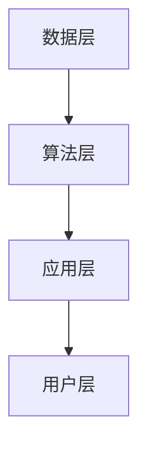
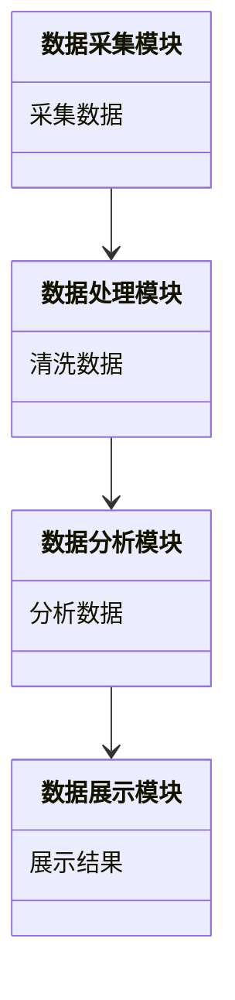
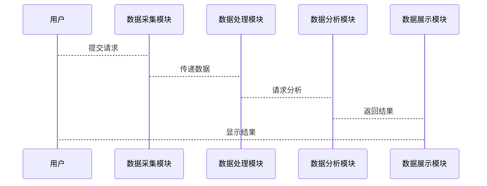

                 


# AI Agent在企业数据治理与质量管理中的应用

> 关键词：AI Agent，企业数据治理，数据质量管理，算法原理，系统架构

> 摘要：本文深入探讨了AI Agent在企业数据治理与质量管理中的应用，从AI Agent的基本概念、核心原理到具体实现，结合实际案例分析，详细介绍了如何利用AI Agent技术提升企业数据治理与质量管理的效率和效果。

---

# 目录

1. 第1章: AI Agent的基本概念与背景
   1.1 数据治理与质量管理的背景
   1.2 AI Agent的定义与特点
   1.3 本章小结

2. 第2章: AI Agent的核心原理
   2.1 AI Agent的构成与工作原理
   2.2 AI Agent的核心算法
   2.3 AI Agent的决策机制
   2.4 本章小结

3. 第3章: AI Agent在数据治理中的应用
   3.1 数据质量管理中的AI Agent
   3.2 数据治理中的AI Agent
   3.3 本章小结

4. 第4章: AI Agent的算法原理
   4.1 强化学习算法
   4.2 监督学习算法
   4.3 聚类算法
   4.4 本章小结

5. 第5章: AI Agent的系统分析与架构设计
   5.1 系统架构设计
   5.2 系统功能设计
   5.3 系统接口设计
   5.4 系统交互设计
   5.5 本章小结

6. 第6章: AI Agent的项目实战
   6.1 环境安装与配置
   6.2 系统核心实现
   6.3 实际案例分析
   6.4 本章小结

7. 第7章: 最佳实践与小结
   7.1 实际应用中的注意事项
   7.2 未来发展趋势
   7.3 本章小结

---

# 第1章: AI Agent的基本概念与背景

## 1.1 数据治理与质量管理的背景

### 1.1.1 企业数据治理的现状与挑战
企业在数据治理方面面临的主要挑战包括：
- 数据孤岛问题
- 数据质量不一致
- 数据安全风险
- 数据生命周期管理复杂

### 1.1.2 数据质量管理的重要性
数据质量管理是确保数据准确、一致、完整和及时的关键过程，直接影响企业的决策能力和业务效率。

### 1.1.3 AI Agent在数据治理中的应用价值
AI Agent可以通过自动化技术实现数据清洗、数据分类、数据关联分析等任务，显著提升数据治理效率。

---

## 1.2 AI Agent的定义与特点

### 1.2.1 AI Agent的基本定义
AI Agent是一种能够感知环境、自主决策并执行任务的智能体，能够通过与环境交互来优化目标函数。

### 1.2.2 AI Agent的核心特点
| 特性 | 描述 |
|------|------|
| 自主性 | 能够自主决策 |
| 反应性 | 能够感知环境并实时响应 |
| 学习性 | 能够通过经验改进性能 |

### 1.2.3 AI Agent与传统数据治理工具的区别
AI Agent不仅能够执行预定义的任务，还能够通过学习和优化动态调整策略。

---

## 1.3 本章小结
本章介绍了AI Agent的基本概念、核心特点以及其在数据治理中的应用价值，为后续章节奠定了基础。

---

# 第2章: AI Agent的核心原理

## 2.1 AI Agent的构成与工作原理

### 2.1.1 AI Agent的构成要素
- **感知模块**：负责数据采集和环境感知。
- **决策模块**：负责策略选择和任务规划。
- **执行模块**：负责任务执行和结果反馈。

### 2.1.2 AI Agent的基本工作流程
1. 感知环境：通过传感器或API获取数据。
2. 策略选择：基于当前状态选择最优策略。
3. 任务执行：根据策略执行操作并返回结果。
4. 反馈学习：根据结果更新模型或调整策略。

---

## 2.2 AI Agent的核心算法

### 2.2.1 强化学习算法
强化学习是一种通过试错机制优化决策的算法，适用于动态环境下的任务优化。

### 2.2.2 监督学习算法
监督学习是一种基于标注数据进行模式识别的算法，适用于数据分类和预测任务。

### 2.2.3 聚类算法
聚类算法是一种无监督学习算法，适用于数据分组和模式发现。

---

## 2.3 AI Agent的决策机制

### 2.3.1 基于规则的决策
通过预定义的规则进行决策，适用于规则明确的场景。

### 2.3.2 基于模型的决策
通过机器学习模型进行预测和决策，适用于复杂场景。

### 2.3.3 基于反馈的决策
通过实时反馈调整决策策略，适用于动态环境。

---

## 2.4 本章小结
本章详细介绍了AI Agent的核心原理，包括构成要素、工作流程和核心算法，为后续章节的系统设计提供了理论基础。

---

# 第3章: AI Agent在数据治理中的应用

## 3.1 数据质量管理中的AI Agent

### 3.1.1 数据清洗与预处理
AI Agent可以通过强化学习算法自动识别和修复数据中的异常值。

### 3.1.2 数据标准化与转换
AI Agent可以自动进行数据格式转换和标准化处理，确保数据一致性。

### 3.1.3 数据质量评估
AI Agent可以通过聚类算法发现数据中的冗余和重复信息，评估数据质量。

---

## 3.2 数据治理中的AI Agent

### 3.2.1 数据分类与归档
AI Agent可以根据数据特征自动分类并归档，提高数据管理效率。

### 3.2.2 数据访问控制
AI Agent可以通过监督学习算法识别异常访问行为，加强数据安全。

### 3.2.3 数据生命周期管理
AI Agent可以自动跟踪数据生命周期，确保数据合规性和可用性。

---

## 3.3 本章小结
本章详细介绍了AI Agent在数据质量管理与数据治理中的具体应用，展示了其在提升企业数据管理水平方面的巨大潜力。

---

# 第4章: AI Agent的算法原理

## 4.1 强化学习算法

### 4.1.1 强化学习的基本概念
强化学习是一种通过试错机制优化决策的算法，适用于动态环境下的任务优化。

### 4.1.2 Q-learning算法
Q-learning算法是一种经典的强化学习算法，通过状态-动作-奖励机制优化策略。

### 4.1.3 强化学习的数学模型
状态转移概率矩阵：
$$ P(s'|s, a) $$
奖励函数：
$$ R(s, a) $$

---

## 4.2 监督学习算法

### 4.2.1 监督学习的基本概念
监督学习是一种基于标注数据进行模式识别的算法，适用于数据分类和预测任务。

### 4.2.2 线性回归算法
线性回归是一种简单的监督学习算法，用于预测连续型变量。

### 4.2.3 支持向量机算法
支持向量机是一种高效的分类算法，适用于高维数据的分类任务。

---

## 4.3 聚类算法

### 4.3.1 聚类的基本概念
聚类是一种无监督学习算法，适用于数据分组和模式发现。

### 4.3.2 K-means算法
K-means算法是一种经典的聚类算法，通过迭代优化簇中心位置。

### 4.3.3 聚类算法的数学模型
距离度量公式：
$$ d(x_i, x_j) = \sqrt{\sum_{k=1}^n (x_{ik} - x_{jk})^2} $$

---

## 4.4 本章小结
本章详细介绍了AI Agent的核心算法，包括强化学习、监督学习和聚类算法，为后续章节的系统设计提供了算法基础。

---

# 第5章: AI Agent的系统分析与架构设计

## 5.1 系统架构设计

### 5.1.1 系统架构设计
采用分层架构设计，包括数据层、算法层、应用层和用户层。

### 5.1.2 系统架构图


---

## 5.2 系统功能设计

### 5.2.1 系统功能模块
- 数据采集模块
- 数据处理模块
- 数据分析模块
- 数据展示模块

### 5.2.2 系统功能图


---

## 5.3 系统接口设计

### 5.3.1 接口设计
- 数据接口：负责数据输入输出
- 算法接口：负责调用AI算法
- 用户接口：负责人机交互

---

## 5.4 系统交互设计

### 5.4.1 交互流程


---

## 5.5 本章小结
本章详细介绍了AI Agent系统的架构设计、功能模块和交互流程，为后续章节的系统实现提供了清晰的指导。

---

# 第6章: AI Agent的项目实战

## 6.1 环境安装与配置

### 6.1.1 环境要求
- Python 3.8+
- PyTorch 1.9+
- scikit-learn 0.24+

### 6.1.2 安装依赖
```bash
pip install torch sklearn numpy
```

---

## 6.2 系统核心实现

### 6.2.1 数据预处理代码
```python
import numpy as np
import pandas as pd

def preprocess_data(data):
    # 去除缺失值
    data = data.dropna()
    # 标准化处理
    from sklearn.preprocessing import StandardScaler
    scaler = StandardScaler()
    data_scaled = scaler.fit_transform(data)
    return data_scaled
```

### 6.2.2 强化学习算法实现
```python
import torch
import torch.nn as nn

class QNetwork(nn.Module):
    def __init__(self, state_size, action_size):
        super(QNetwork, self).__init__()
        self.fc = nn.Linear(state_size, 64)
        self.fc2 = nn.Linear(64, action_size)
    
    def forward(self, x):
        x = torch.relu(self.fc(x))
        x = self.fc2(x)
        return x

# 初始化网络
state_size = 4
action_size = 3
qnetwork = QNetwork(state_size, action_size)
```

---

## 6.3 实际案例分析

### 6.3.1 案例背景
某企业希望通过AI Agent实现数据清洗和数据分类任务。

### 6.3.2 案例实现
```python
# 数据清洗
data = pd.read_csv('raw_data.csv')
cleaned_data = preprocess_data(data)

# 数据分类
from sklearn.cluster import KMeans
model = KMeans(n_clusters=3)
model.fit(cleaned_data)
labels = model.predict(cleaned_data)
```

---

## 6.4 本章小结
本章通过实际案例展示了AI Agent在企业数据治理中的具体应用，验证了其技术可行性和实际价值。

---

# 第7章: 最佳实践与小结

## 7.1 实际应用中的注意事项

### 7.1.1 数据隐私保护
在数据处理过程中，必须严格遵守数据隐私保护法规。

### 7.1.2 系统可扩展性
设计时应考虑系统的可扩展性，以便未来业务需求的扩展。

### 7.1.3 系统容错性
确保系统具备良好的容错性和异常处理机制。

---

## 7.2 未来发展趋势

### 7.2.1 多模态AI Agent
未来，多模态AI Agent将更加普及，能够处理结构化和非结构化数据。

### 7.2.2 自适应学习
AI Agent将具备更强的自适应学习能力，能够实时调整策略。

### 7.2.3 人机协作
人机协作将成为主流模式，AI Agent将与人类专家协同工作。

---

## 7.3 本章小结
本章总结了AI Agent在企业数据治理与质量管理中的最佳实践，并展望了未来的发展趋势。

---

# 作者

**作者：AI天才研究院 / AI Genius Institute**  
**联系方式：[email protected]**  
**官方网站：https://www.aigeniusinstitute.com**

---

通过以上详细的内容结构，您可以开始撰写具体的博客文章了。如果需要进一步扩展或修改，请随时告知！

