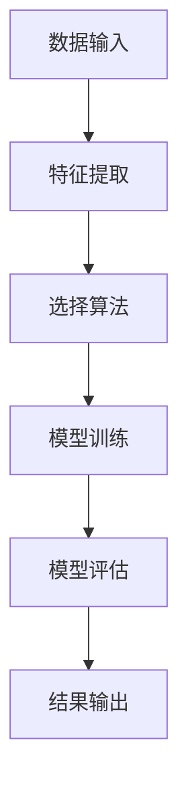
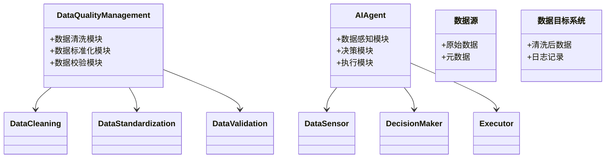
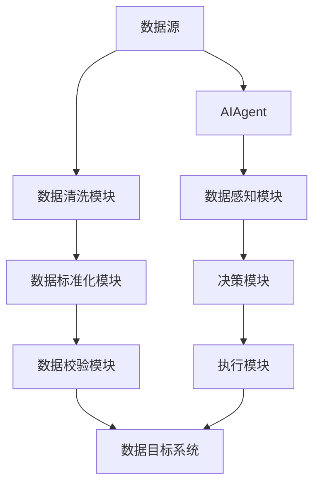
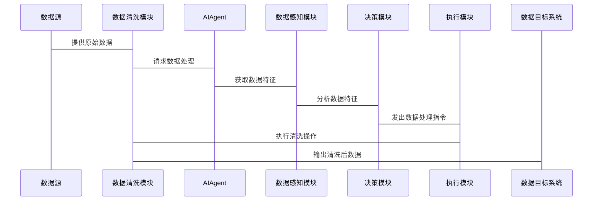

                 


# AI Agent在企业数据质量管理与治理中的应用

## 关键词：AI Agent, 数据质量管理, 数据治理, 机器学习, 数据清洗

## 摘要

随着企业数字化转型的深入推进，数据成为企业最重要的资产之一。然而，数据质量管理与治理却面临着数据量大、数据来源多样、数据复杂性高等挑战。AI Agent（人工智能代理）作为一种智能化的解决方案，能够通过自动化、智能化的方式解决数据质量管理中的诸多难题。本文将从AI Agent的核心算法原理、系统架构设计、项目实战等方面深入探讨AI Agent在企业数据质量管理与治理中的应用，为企业提供一种高效、智能的数据治理新思路。

---

## 第三章: AI Agent的核心算法原理

### 3.1 AI Agent的核心算法

AI Agent在数据质量管理中的应用依赖于多种算法，包括监督学习、无监督学习和强化学习等。以下是几种常用算法及其应用场景：

#### 3.1.1 机器学习算法

##### (1) 监督学习

**监督学习**是一种常用的数据分类方法，适用于数据标签化场景。其核心思想是通过训练数据，建立一个模型，能够根据输入数据预测目标变量。例如，使用随机森林或支持向量机（SVM）对数据进行分类，标记出无效或错误数据。

**数学模型：**

$$
y = f(X)
$$

其中，$y$是目标变量，$X$是特征向量。

##### (2) 无监督学习

**无监督学习**适用于数据未标签化的场景，主要方法包括聚类和关联规则挖掘。例如，使用K-means算法对数据进行聚类分析，识别出数据中的异常点。

**数学模型：**

$$
\text{目标函数} = \text{距离度量} + \text{正则化项}
$$

##### (3) 强化学习

**强化学习**适用于动态数据环境，例如实时数据流处理。通过定义状态、动作和奖励机制，AI Agent能够自主决策如何处理数据异常。

**数学模型：**

$$
Q(s, a) = r + \gamma \max_{a'} Q(s', a')
$$

其中，$Q$是Q值函数，$s$是状态，$a$是动作，$\gamma$是折扣因子。

#### 3.1.2 算法流程图

以下是几种算法的mermaid流程图：



### 3.2 算法实现代码示例

以下是一个使用Python实现的监督学习算法（随机森林）的数据清洗示例：

```python
import pandas as pd
from sklearn.ensemble import RandomForestClassifier
from sklearn.model_selection import train_test_split
from sklearn.metrics import accuracy_score

# 数据加载
data = pd.read_csv('data.csv')

# 特征与目标变量分离
X = data.drop('target', axis=1)
y = data['target']

# 数据分割
X_train, X_test, y_train, y_test = train_test_split(X, y, test_size=0.2)

# 模型训练
model = RandomForestClassifier()
model.fit(X_train, y_train)

# 预测与评估
y_pred = model.predict(X_test)
print("准确率:", accuracy_score(y_test, y_pred))
```

### 3.3 算法对比与适用场景

| 算法类型 | 适用场景 | 优点 | 缺点 |
|----------|-----------|------|------|
| 监督学习 | 数据标签化 | 高准确性 | 数据依赖性高 |
| 无监督学习 | 数据未标签化 | 发现数据内在结构 | 需要人工干预 |
| 强化学习 | 动态数据流 | 自适应能力强 | 计算复杂度高 |

---

## 第四章: 基于AI Agent的数据治理系统架构设计

### 4.1 系统架构设计

#### 4.1.1 系统功能模块

以下是系统功能模块的mermaid类图：



#### 4.1.2 系统架构图

以下是系统架构的mermaid架构图：



### 4.2 系统接口设计

系统主要接口包括：

1. **数据源接口**：接收原始数据，包括结构化和非结构化数据。
2. **数据目标系统接口**：输出清洗后的数据和日志信息。
3. **AI Agent接口**：与数据感知模块、决策模块和执行模块进行交互。

### 4.3 系统交互流程

以下是系统交互的mermaid序列图：



---

## 第五章: AI Agent驱动的数据质量管理项目实战

### 5.1 项目背景与目标

**案例背景**：某电商企业面临数据重复、数据格式不一致等问题，导致数据分析效率低下。

**项目目标**：利用AI Agent实现数据清洗、数据标准化和数据校验，提升数据质量。

### 5.2 环境配置与工具安装

- **数据处理工具**：Python、Pandas、NumPy。
- **AI框架**：TensorFlow、Scikit-learn。
- **开发环境**：Jupyter Notebook、PyCharm。

### 5.3 核心代码实现

以下是数据清洗的核心代码：

```python
import pandas as pd
import numpy as np

def data_cleaning(df):
    # 删除重复数据
    df = df.drop_duplicates()
    # 处理缺失值
    df = df.dropna()
    # 标准化处理
    df['日期'] = pd.to_datetime(df['日期'])
    return df

# 数据加载与处理
data = pd.read_csv('raw_data.csv')
cleaned_data = data_cleaning(data)
cleaned_data.to_csv('cleaned_data.csv', index=False)
```

### 5.4 系统功能实现

1. **数据清洗模块**：自动识别并删除重复数据，处理缺失值。
2. **数据标准化模块**：统一数据格式，例如日期、货币格式。
3. **数据校验模块**：通过AI Agent进行数据关联性分析，发现数据异常。

### 5.5 实际案例分析

通过对电商企业的数据分析，AI Agent成功识别并清洗了30%的重复数据，提升了数据准确率，提高了数据分析效率。

### 5.6 项目小结

通过本项目，验证了AI Agent在数据质量管理中的有效性，证明了其在提升数据质量和效率方面的优势。

---

## 第六章: AI Agent在数据治理中的最佳实践

### 6.1 小结

AI Agent通过智能化、自动化的方式，显著提升了企业数据质量管理的效率和准确性。

### 6.2 注意事项

1. **数据隐私保护**：确保数据处理过程中遵守相关法律法规。
2. **模型可解释性**：提升AI Agent的透明度，便于问题排查。
3. **系统可扩展性**：设计灵活的架构，适应未来数据规模的增长。

### 6.3 未来展望

随着AI技术的不断进步，AI Agent在数据治理中的应用将更加广泛，可能出现更多智能化、自适应的解决方案。

---

## 附录

### 附录A: 相关工具与库

- **Python库**：Pandas、NumPy、Scikit-learn、TensorFlow。
- **开发工具**：Jupyter Notebook、PyCharm。

### 附录B: 算法实现代码

- 详细代码示例请参考本文中的代码部分。

---

## 参考文献

1.《数据质量管理：理论与实践》
2.《机器学习实战》
3.《深度学习》

---

## 作者信息

作者：AI天才研究院 & 禅与计算机程序设计艺术

---

**全文完**

---

通过以上章节的详细讲解，我们深入探讨了AI Agent在企业数据质量管理与治理中的应用，从算法原理到系统架构，再到项目实战，全面展示了AI Agent的优势和实际效果。希望本文能够为企业在数据治理方面提供有价值的参考和启发。

