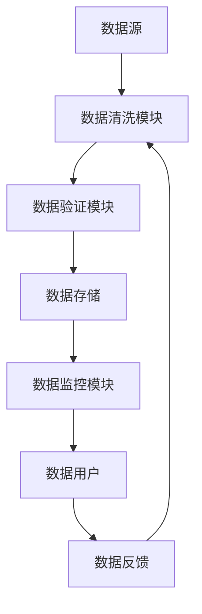
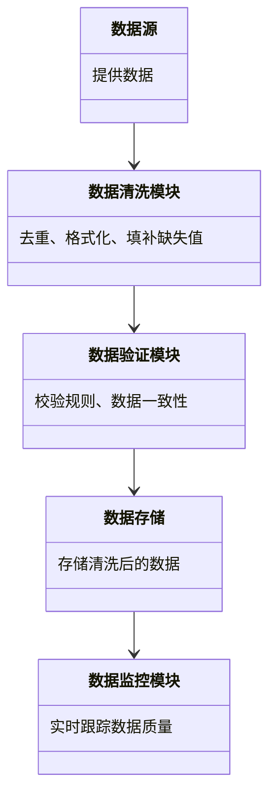
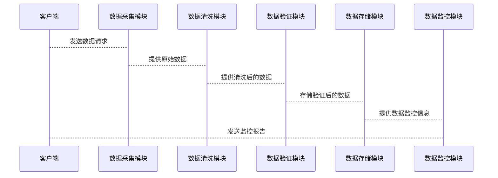

                 


# AI Agent在企业数据质量管理与治理自动化中的应用

## 关键词：AI Agent，数据质量管理，数据治理，自动化，企业数据管理，人工智能

## 摘要：  
随着企业数据量的快速增长，数据质量管理与治理已成为企业数字化转型中的关键挑战。本文深入探讨AI Agent在企业数据质量管理中的应用，结合数据治理的自动化需求，详细分析AI Agent的核心概念、算法原理、系统架构以及实际应用场景，为企业提供一套高效、智能的数据管理解决方案。文章最后总结了AI Agent在数据治理中的优势与未来发展方向。

---

# 第一部分：AI Agent与企业数据质量管理的背景介绍

## 第1章：数据质量管理的背景与挑战

### 1.1 数据质量管理的背景

#### 1.1.1 数据在企业中的重要性
数据是企业决策的核心资产。随着数字化转型的推进，企业每天产生的数据量呈指数级增长，涵盖业务、客户、财务、供应链等多方面。高质量的数据能够支持精准的决策，而低质量的数据可能导致错误的结论和巨大的损失。

#### 1.1.2 数据质量管理的定义与目标
数据质量管理（Data Quality Management, DQM）是指通过一系列方法和技术，确保数据的准确性、完整性、一致性、及时性和合规性。其目标是消除数据中的错误、冗余和不一致，提高数据的可用性和可靠性。

#### 1.1.3 数据质量管理的现状与趋势
尽管数据质量管理在企业中得到了广泛重视，但许多企业在实践中仍然面临以下挑战：
- 数据孤岛问题：不同部门或系统之间的数据格式、标准不统一。
- 数据冗余与不完整性：重复数据和缺失数据导致分析结果偏差。
- 数据安全与隐私保护：数据泄露和滥用风险增加。
- 数据治理的复杂性：涉及多个部门和系统的协调。

AI Agent作为一种智能代理，能够通过自动化技术解决这些挑战，提高数据质量管理的效率和效果。

---

### 1.2 数据质量管理中的问题与挑战

#### 1.2.1 数据孤岛与不一致性
数据孤岛是指数据分散在不同的系统中，缺乏统一的标准和格式。例如，客户信息可能在CRM系统中存储为“张三”，而在财务系统中存储为“张三”。这种不一致性会导致数据分析的困难。

#### 1.2.2 数据冗余与不完整性
数据冗余是指同一数据在多个地方重复存储，导致数据混乱和管理复杂。数据不完整性则是指某些数据字段缺失，例如客户的地址信息不完整。

#### 1.2.3 数据安全与隐私保护
随着数据量的增加，数据安全和隐私保护成为重要问题。企业需要确保数据在存储和传输过程中不被泄露或篡改。

#### 1.2.4 数据治理的复杂性
数据治理涉及多个方面，包括数据标准制定、数据访问权限管理、数据生命周期管理等。这些复杂性使得传统的人工管理方式效率低下。

---

### 1.3 AI Agent在数据质量管理中的作用

#### 1.3.1 AI Agent的基本概念
AI Agent（人工智能代理）是一种能够感知环境、自主决策并执行任务的智能系统。它可以基于上下文信息做出决策，优化任务执行效率。

#### 1.3.2 AI Agent在数据治理中的优势
- **自动化能力**：AI Agent能够自动识别数据中的错误和不一致，减少人工干预。
- **智能化决策**：通过机器学习算法，AI Agent能够预测数据质量风险并提出优化建议。
- **实时监控**：AI Agent可以实时监控数据源的变化，确保数据的准确性和完整性。

#### 1.3.3 数据质量管理中的AI Agent应用场景
- 数据清洗与转换：AI Agent可以自动识别并纠正数据中的错误。
- 数据验证与校验：AI Agent可以验证数据是否符合预定义的规则和标准。
- 数据监控与预警：AI Agent可以实时监控数据质量，及时发出预警。

---

## 第2章：企业数据治理的自动化需求

### 2.1 数据治理的定义与范围

#### 2.1.1 数据治理的目标
数据治理的目标是确保数据的准确、完整、一致和合规，同时优化数据的使用效率。

#### 2.1.2 数据治理的关键环节
数据治理包括数据规划、数据建模、数据安全、数据访问控制、数据生命周期管理等多个环节。

#### 2.1.3 数据治理的组织架构
数据治理通常涉及数据治理委员会、数据管理员、数据 stewards 等角色，确保数据治理工作的顺利推进。

---

### 2.2 数据治理中的自动化需求

#### 2.2.1 自动化数据清洗
数据清洗是数据质量管理中的重要环节，包括去重、格式化、填补缺失值等。AI Agent可以通过自然语言处理（NLP）和机器学习算法自动识别和处理数据中的错误。

#### 2.2.2 自动化数据验证
数据验证是确保数据符合预定义规则的过程。AI Agent可以通过规则引擎和机器学习模型自动验证数据的合规性。

#### 2.2.3 自动化数据监控
数据监控是实时跟踪数据质量变化的过程。AI Agent可以通过流数据处理技术，实时分析数据源的变化，并及时发出预警。

---

### 2.3 AI Agent在数据治理自动化中的应用前景

#### 2.3.1 AI Agent的智能化能力
AI Agent可以通过自然语言处理、计算机视觉、机器学习等技术，实现数据的智能分析和优化。

#### 2.3.2 数据治理自动化的核心价值
数据治理自动化能够显著提高数据质量管理的效率，降低人工成本，同时减少人为错误。

#### 2.3.3 未来趋势与挑战
未来，AI Agent在数据治理中的应用将更加广泛，但也面临数据隐私、模型可解释性等挑战。

---

# 第二部分：AI Agent的核心概念与算法原理

## 第3章：AI Agent的核心概念与联系

### 3.1 核心概念原理

AI Agent在数据质量管理中的核心原理包括：
- **感知环境**：通过数据采集和分析，了解数据源的状态。
- **决策与规划**：基于感知到的信息，制定数据治理策略。
- **执行任务**：通过自动化工具执行数据清洗、验证等任务。
- **反馈与优化**：根据执行结果优化后续操作。

---

### 3.2 核心概念属性特征对比表格

| 概念         | 特性                   | 示例                       |
|--------------|------------------------|-----------------------------|
| 数据清洗     | 去重、格式化、填补缺失值 | 自动识别并纠正数据错误       |
| 数据验证     | 校验规则、数据一致性   | 验证数据是否符合标准         |
| 数据监控     | 实时跟踪、异常检测     | 监控数据源变化并发出预警     |
| AI Agent     | 智能化、自动化、实时性 | 自动化处理数据问题           |

---

### 3.3 数据质量管理中的ER实体关系图



---

## 第4章：AI Agent的算法原理

### 4.1 数据清洗算法

数据清洗通常涉及以下步骤：
1. **识别重复数据**：通过哈希算法或相似度算法，识别重复记录。
2. **格式化数据**：将数据转换为统一的格式，例如日期格式。
3. **填补缺失值**：使用均值、中位数或回归算法填补缺失值。

### 4.2 数据验证算法

数据验证可以通过以下步骤实现：
1. **规则校验**：根据预定义的规则，检查数据是否符合要求。
2. **模式匹配**：使用正则表达式匹配数据格式。
3. **机器学习分类**：训练分类模型，识别异常数据。

---

### 4.3 数据监控算法

数据监控可以通过流数据处理技术实现：
1. **实时数据采集**：通过API或日志采集数据。
2. **异常检测**：使用统计方法或机器学习模型检测数据中的异常。
3. **预警通知**：当检测到异常时，通过邮件或消息队列通知相关人员。

---

## 第5章：AI Agent的系统架构设计

### 5.1 项目背景介绍

假设我们正在开发一个企业级的数据质量管理平台，目标是通过AI Agent实现数据清洗、验证和监控的自动化。

---

### 5.2 系统功能设计



---

### 5.3 系统架构设计


---

### 5.4 接口与交互设计



---

# 第三部分：AI Agent的项目实战

## 第6章：项目实战

### 6.1 环境安装

需要安装以下工具：
- Python 3.8+
- Pandas、NumPy、Scikit-learn 等数据处理库
- Jupyter Notebook 或 VS Code 等开发环境

---

### 6.2 核心实现代码

```python
import pandas as pd
from sklearn.impute import SimpleImputer
from sklearn.preprocessing import StandardScaler

# 数据清洗示例
def data_cleaning(data):
    # 去重
    data = data.drop_duplicates()
    # 填补缺失值
    imputer = SimpleImputer(strategy='mean')
    data_imputed = imputer.fit_transform(data)
    return data_imputed

# 数据验证示例
def data_validation(data, rules):
    valid_data = []
    for row in data:
        if all(rules[row]()):
            valid_data.append(row)
    return valid_data

# 数据监控示例
def data_monitoring(data_stream):
    scaler = StandardScaler()
    normalized_data = scaler.fit_transform(data_stream)
    return normalized_data
```

---

### 6.3 案例分析与总结

通过上述代码实现，我们可以看到AI Agent在数据清洗、验证和监控中的具体应用。数据清洗模块可以自动识别并纠正数据错误，数据验证模块可以确保数据符合预定义规则，数据监控模块可以实时跟踪数据质量。

---

# 第四部分：最佳实践与总结

## 第7章：最佳实践与总结

### 7.1 小结

本文详细探讨了AI Agent在企业数据质量管理与治理自动化中的应用，结合了数据质量管理的背景、核心概念、算法原理和系统架构设计。通过实际案例分析，展示了AI Agent在数据清洗、验证和监控中的具体应用。

---

### 7.2 注意事项

- 数据隐私和安全是数据治理中的重要问题，需要特别注意。
- AI Agent的模型需要定期更新，以适应数据变化和新需求。
- 数据治理需要跨部门协作，确保数据质量和合规性。

---

### 7.3 拓展阅读

- 《Data Quality: The Ultimate Guide》
- 《Applied Machine Learning: Data Handling and Preparation》
- 《Designing Data-Intensive Applications》

---

# 作者：AI天才研究院 & 禅与计算机程序设计艺术

---

通过以上内容，您已经了解了AI Agent在企业数据质量管理与治理自动化中的应用。如果您有更多问题或需要进一步探讨，请随时联系！

