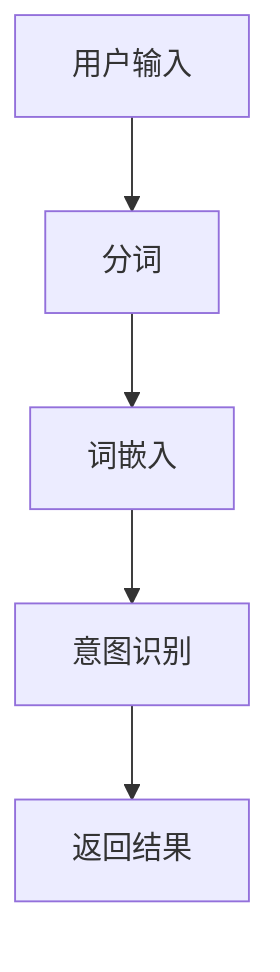
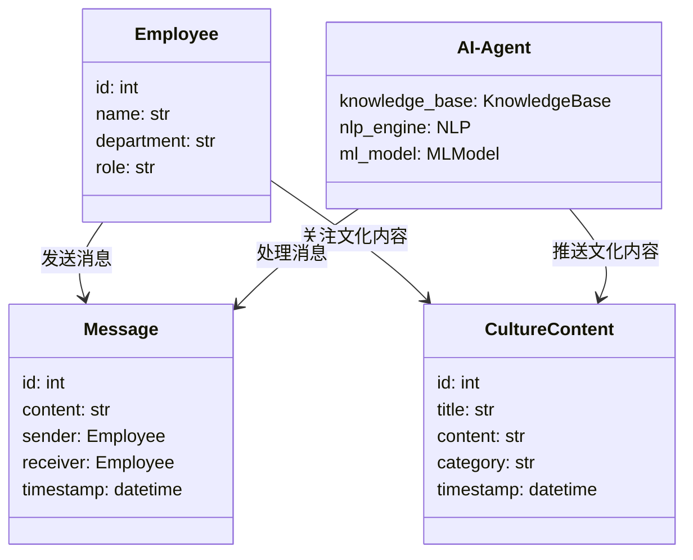
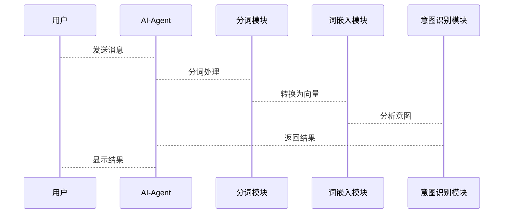

                 


# AI Agent在企业文化建设与内部沟通中的创新应用

## 关键词：AI Agent, 企业文化, 内部沟通, 自然语言处理, 机器学习, 知识图谱

## 摘要：  
本文探讨了AI Agent在企业文化建设与内部沟通中的创新应用。首先介绍了AI Agent的基本概念和核心特征，分析了AI Agent在企业内部沟通中的应用场景。接着，详细阐述了AI Agent如何促进企业文化传播与塑造，通过自然语言处理、机器学习和知识图谱等技术实现智能化内部沟通。最后，通过具体案例分析，展示了AI Agent在企业文化建设中的实际应用价值，并提出了最佳实践和未来发展建议。

---

# 第一部分: AI Agent与企业文化建设的背景与概念

## 第1章: AI Agent的基本概念与背景

### 1.1 AI Agent的定义与核心特征

#### 1.1.1 AI Agent的定义
AI Agent（人工智能代理）是指能够感知环境、自主决策并采取行动以实现目标的智能体。它通过与环境交互，利用传感器获取信息，并通过执行器采取行动，以达到预定目标。

#### 1.1.2 AI Agent的核心特征
- **自主性**：AI Agent能够在没有外部干预的情况下自主决策。
- **反应性**：能够实时感知环境变化并做出相应的反应。
- **目标导向性**：所有行动都是为了实现特定目标。
- **学习能力**：通过机器学习技术不断优化自身性能。

#### 1.1.3 AI Agent与传统AI的区别
AI Agent不仅仅是一个静态的知识库或规则引擎，而是具有动态适应能力和目标导向性的智能体。与传统AI相比，AI Agent更加注重与环境的交互和自主决策能力。

### 1.2 企业文化建设的内涵与挑战

#### 1.2.1 企业文化的内涵
企业文化是指企业在长期经营中形成的，由企业成员共同认可的价值观、行为准则和工作方式。它包括企业愿景、使命、核心价值观、员工关系等多个方面。

#### 1.2.2 企业文化建设的常见挑战
- **信息不对称**：新员工难以快速了解企业文化。
- **文化传递效率低**：文化信息传递过程中容易出现失真或不一致。
- **员工参与度低**：员工对企业的认同感和归属感不足。
- **文化适应性差**：企业在快速变化的环境中难以及时调整文化策略。

#### 1.2.3 AI Agent在企业文化建设中的潜在价值
AI Agent可以通过智能化的方式，高效地传播企业文化信息，提升员工的文化认同感和参与感，同时帮助企业更好地适应外部环境的变化。

## 第2章: AI Agent在企业内部沟通中的创新应用

### 2.1 企业内部沟通的传统模式与痛点

#### 2.1.1 传统内部沟通的模式
传统企业内部沟通主要依赖于邮件、会议、公告栏等渠道。这种方式信息传递效率较低，且容易出现信息孤岛和沟通不畅的问题。

#### 2.1.2 传统内部沟通的主要痛点
- **信息分散**：各部门之间的信息难以整合，员工难以快速获取所需信息。
- **沟通效率低**：信息传递过程繁琐，容易出现延误或误解。
- **员工参与度低**：员工对内部信息的兴趣不高，导致企业文化难以深入人心。

#### 2.1.3 AI Agent如何解决这些痛点
AI Agent可以通过智能化的信息分发、实时反馈和个性化推荐，提高内部沟通的效率和员工参与度。

### 2.2 AI Agent在内部沟通中的应用场景

#### 2.2.1 智能消息分发与员工关怀
AI Agent可以根据员工的职责和兴趣，智能推送相关的企业信息和公告，减少信息冗余，提升信息传递效率。

#### 2.2.2 跨部门协作的智能化支持
AI Agent可以协助员工快速找到相关同事或部门，提供实时沟通支持，促进跨部门协作。

#### 2.2.3 内部知识管理与经验共享
AI Agent可以通过自然语言处理技术，帮助员工快速检索内部知识库，促进经验共享和知识传承。

#### 2.2.4 员工反馈与问题解决的智能化
AI Agent可以实时收集员工反馈，并通过自然语言处理技术分析问题，提供解决方案，帮助员工快速解决问题。

## 第3章: AI Agent与企业文化建设的结合

### 3.1 AI Agent如何促进企业文化传播

#### 3.1.1 企业文化传播的数字化路径
AI Agent可以通过数字化渠道，如企业内部聊天机器人，实时传播企业文化信息，使员工随时随地了解企业动态。

#### 3.1.2 AI Agent在企业文化传播中的作用
- **信息精准推送**：根据员工的岗位和兴趣，推送相关企业文化信息。
- **互动式传播**：通过对话形式与员工互动，增强文化传播的趣味性和参与感。
- **数据驱动优化**：通过分析员工的反馈和行为数据，不断优化文化传播策略。

#### 3.1.3 具体应用场景与案例分析
例如，企业可以通过AI Agent定期向员工推送企业文化故事、员工风采等内容，并通过互动问答形式增强员工的文化认同感。

### 3.2 AI Agent在企业文化塑造中的创新价值

#### 3.2.1 数据驱动的企业文化塑造
AI Agent可以通过收集和分析员工的行为数据，帮助企业更精准地了解员工需求，从而制定更有针对性的文化政策。

#### 3.2.2 AI Agent在企业文化评估中的应用
AI Agent可以通过自然语言处理技术，分析员工反馈和社交媒体数据，帮助企业评估文化传播效果。

#### 3.2.3 AI Agent如何提升员工参与感与归属感
通过智能化的员工关怀和个性化服务，AI Agent可以增强员工的归属感和参与感，从而提升企业文化的凝聚力。

## 第4章: AI Agent的核心技术与实现原理

### 4.1 AI Agent的主要技术组成

#### 4.1.1 自然语言处理（NLP）
自然语言处理技术使AI Agent能够理解并生成人类语言，实现与员工的自然对话。

#### 4.1.2 机器学习与深度学习
机器学习和深度学习技术用于训练AI Agent的学习模型，使其能够从数据中学习并不断优化性能。

#### 4.1.3 知识图谱与语义理解
知识图谱和语义理解技术帮助AI Agent更好地理解企业的知识体系和文化内涵。

### 4.2 AI Agent的算法原理与流程

#### 4.2.1 知识表示与存储
知识图谱用于将企业的文化信息、组织结构等知识进行结构化存储，方便AI Agent快速检索和理解。

#### 4.2.2 意图识别与对话管理
通过自然语言处理技术，AI Agent能够识别员工的意图，并根据上下文进行对话管理，提供精准的服务。

#### 4.2.3 算法实现
以下是一个简单的意图识别算法流程：



代码实现：
```python
def intent_recognition(text):
    # 分词
    words = tokenize(text)
    # 词嵌入
    embeddings = word_to_vec(words)
    # 训练好的意图分类模型
    model = load_model()
    # 预测意图
    intent = model.predict(embeddings)
    return intent
```

---

# 第二部分: 系统设计与项目实战

## 第5章: 系统分析与架构设计方案

### 5.1 问题场景介绍
企业内部沟通效率低下，员工对企业文化了解不足，跨部门协作困难。

### 5.2 项目介绍
构建一个基于AI Agent的企业内部沟通系统，实现智能化信息分发、跨部门协作支持和企业文化传播。

### 5.3 系统功能设计

#### 5.3.1 领域模型设计


### 5.4 系统架构设计


### 5.5 系统接口设计
- **API接口**：提供RESTful API，供前端调用。
- **数据接口**：与企业现有的数据库和知识库进行对接。

### 5.6 系统交互设计



## 第6章: 项目实战

### 6.1 环境安装
需要安装Python、TensorFlow、spaCy、Flask等工具。

### 6.2 系统核心实现源代码
以下是一个简单的AI Agent实现示例：

```python
from flask import Flask, request, jsonify
import spacy

nlp = spacy.load("en_core_web_sm")

app = Flask(__name__)

@app.route('/process_message', methods=['POST'])
def process_message():
    data = request.json
    message = data['message']
    # 分词
    doc = nlp(message)
    # 提取关键词
    keywords = [token.text for token in doc]
    # 返回结果
    return jsonify({'keywords': keywords})

if __name__ == '__main__':
    app.run(debug=True)
```

### 6.3 代码应用解读与分析
上述代码实现了基本的消息处理功能，包括消息接收、分词和关键词提取。实际应用中，还需要添加意图识别、知识库查询等功能。

### 6.4 实际案例分析
通过一个具体的案例，展示AI Agent在企业内部沟通中的实际应用效果。

### 6.5 项目小结
总结项目实现的关键点和经验教训，提出改进建议。

---

## 第7章: 最佳实践与小结

### 7.1 最佳实践
- **数据隐私保护**：确保员工数据的安全性和隐私性。
- **技术选型**：根据企业需求选择合适的技术栈。
- **持续优化**：定期收集反馈，优化AI Agent的性能和用户体验。

### 7.2 小结
AI Agent在企业文化建设与内部沟通中的应用前景广阔。通过智能化的信息分发、跨部门协作支持和企业文化传播，AI Agent可以帮助企业提高内部沟通效率，增强员工的文化认同感和归属感。

### 7.3 注意事项
- **技术可行性**：确保技术实现的可行性。
- **用户接受度**：关注员工对AI Agent的接受度和使用习惯。
- **文化适应性**：根据不同企业文化的特性，调整AI Agent的应用策略。

### 7.4 拓展阅读
建议读者进一步了解自然语言处理、机器学习和知识图谱等技术，深入研究AI Agent在其他领域的应用。

---

# 作者：AI天才研究院 & 禅与计算机程序设计艺术  
#

