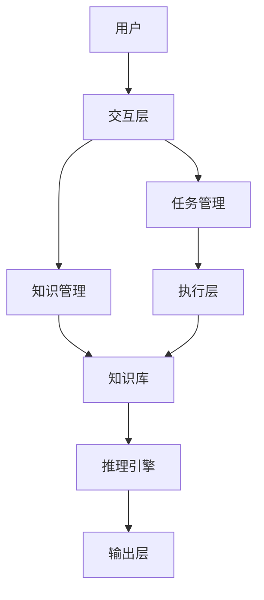

                 


# AI Agent在企业智能办公中的全面应用

> **关键词**：AI Agent, 企业智能办公, 自然语言处理, 知识图谱, 系统架构设计, 项目实战  
>
> **摘要**：随着人工智能技术的快速发展，AI Agent（人工智能代理）在企业智能办公中的应用越来越广泛。本文从AI Agent的核心概念出发，深入分析其技术原理、系统架构设计，并结合实际应用场景，详细阐述其在企业办公中的价值和实现方案。文章最后通过项目实战和最佳实践，为企业智能化办公提供全面指导和参考。

---

## 目录

1. **AI Agent 的核心概念与背景**
   - 1.1 AI Agent 的定义与演进
   - 1.2 AI Agent 的分类与应用场景
   - 1.3 AI Agent 的核心价值与优势
   - 1.4 本章小结

2. **AI Agent 的核心原理**
   - 2.1 AI Agent 的工作原理
   - 2.2 AI Agent 的技术架构
   - 2.3 AI Agent 的实现方法
   - 2.4 本章小结

3. **AI Agent 在企业办公中的应用场景**
   - 3.1 智能助手与个人效率提升
   - 3.2 会议管理与协作工具
   - 3.3 知识管理与文档处理
   - 3.4 企业内部沟通与反馈
   - 3.5 本章小结

4. **企业级AI Agent 系统架构设计**
   - 4.1 系统设计背景与目标
   - 4.2 系统功能模块设计
   - 4.3 系统架构设计（Mermaid 图）
   - 4.4 本章小结

5. **AI Agent 的实现方案**
   - 5.1 基于自然语言处理的实现
   - 5.2 知识图谱与推理引擎实现
   - 5.3 系统接口与交互设计
   - 5.4 本章小结

6. **项目实战：企业级AI Agent 系统实现**
   - 6.1 项目背景与目标
   - 6.2 环境搭建与工具安装
   - 6.3 核心功能实现（代码示例）
   - 6.4 项目案例分析与总结
   - 6.5 本章小结

7. **最佳实践与未来发展**
   - 7.1 企业智能化办公的挑战与机遇
   - 7.2 AI Agent 的部署与维护
   - 7.3 AI Agent 的未来发展
   - 7.4 本章小结

---

## 第一部分: AI Agent 的核心概念与背景

### 第1章: AI Agent 的定义与背景

#### 1.1 AI Agent 的定义与演进

AI Agent（人工智能代理）是一种能够感知环境、自主决策并执行任务的智能体。它能够根据输入的信息（如文本、语音、图像等）进行分析、推理和决策，并通过执行操作（如生成文本、触发动作等）实现目标。

- **从传统办公到智能办公的演进**  
  传统的办公方式依赖人工操作，效率低且容易出错。随着AI技术的发展，AI Agent逐渐成为企业办公的核心工具，能够自动化处理大量重复性任务，提升办公效率。

- **AI Agent 的定义与核心特征**  
  AI Agent 具有以下核心特征：
  - **自主性**：无需人工干预，能够自主决策。
  - **反应性**：能够实时感知环境并做出反应。
  - **学习能力**：通过数据和反馈不断优化自身能力。
  - **可扩展性**：能够处理多种任务和复杂场景。

- **企业智能办公的背景与需求**  
  随着企业规模的扩大和业务的复杂化，传统的办公方式难以满足高效、灵活的需求。AI Agent 的引入能够帮助企业实现智能化转型，提升竞争力。

#### 1.2 AI Agent 的分类与应用场景

AI Agent 可以根据功能、任务和应用场景进行分类。

- **基于任务的AI Agent 分类**  
  - **信息查询类**：如智能搜索、问答系统。
  - **任务执行类**：如自动化任务处理、流程管理。
  - **决策支持类**：如数据分析、决策建议。

- **企业办公中的典型应用场景**  
  - **智能助手**：帮助用户管理日程、提醒任务。
  - **会议管理**：自动安排会议、记录会议内容。
  - **知识管理**：智能分类、检索文档。
  - **内部沟通**：智能聊天机器人、邮件自动处理。

- **AI Agent 的边界与外延**  
  AI Agent 的边界在于其功能和任务的范围。随着技术进步，AI Agent 的外延将不断扩大，涵盖更多企业办公场景。

#### 1.3 AI Agent 的核心价值与优势

- **提升办公效率的核心价值**  
  AI Agent 能够自动化处理大量重复性任务，节省时间，提升效率。

- **降低企业成本的关键优势**  
  通过自动化和智能化手段，AI Agent 可以降低人力成本和资源浪费。

- **优化决策过程的潜力**  
  AI Agent 可以通过数据分析和推理，提供更精准的决策支持。

#### 1.4 本章小结

本章介绍了AI Agent 的定义、分类和应用场景，并分析了其在企业智能办公中的核心价值和优势。通过这些内容，读者可以全面了解AI Agent 的基本概念和潜在价值。

---

## 第二部分: AI Agent 的核心原理与技术架构

### 第2章: AI Agent 的核心原理

#### 2.1 AI Agent 的工作原理

AI Agent 的工作流程包括感知、决策和执行三个阶段。

- **感知与理解**  
  AI Agent 通过自然语言处理（NLP）等技术，理解输入的信息（如用户指令、文档内容等）。

- **决策与执行**  
  基于理解的信息，AI Agent 进行推理和决策，并执行相应的操作（如生成文本、触发动作等）。

- **学习与优化**  
  AI Agent 通过机器学习算法，不断优化自身的模型和策略，提升性能。

#### 2.2 AI Agent 的技术架构

AI Agent 的技术架构主要包括输入处理、知识表示与推理、决策与执行三部分。

- **多模态输入处理**  
  支持多种输入形式，如文本、语音、图像等。

- **知识表示与推理**  
  使用知识图谱和推理引擎，进行逻辑推理和知识检索。

- **决策与执行**  
  基于推理结果，生成相应的输出或触发相关动作。

#### 2.3 AI Agent 的实现方法

AI Agent 的实现方法主要包括基于规则、基于模型和基于强化学习三种。

- **基于规则的实现**  
  通过预定义的规则和逻辑，实现简单的任务处理。

- **基于模型的实现**  
  使用机器学习模型（如深度学习模型）进行复杂任务的处理。

- **基于强化学习的实现**  
  通过强化学习算法，优化AI Agent 的行为策略。

#### 2.4 本章小结

本章详细讲解了AI Agent 的工作原理和技术架构，并分析了其主要实现方法。这些内容为后续章节的应用场景和系统设计奠定了基础。

---

## 第三部分: AI Agent 在企业办公中的应用场景

### 第3章: 企业智能办公中的AI Agent 应用场景

#### 3.1 智能助手与个人效率提升

- **个人日程管理**  
  AI Agent 可以帮助用户管理日程安排，提醒重要任务。

- **信息检索与知识管理**  
  AI Agent 可以快速检索信息，帮助用户整理和管理知识。

- **任务提醒与优先级排序**  
  AI Agent 可以根据任务的重要性和紧急性，智能排序并提醒用户。

#### 3.2 会议管理与协作工具

- **智能会议安排**  
  AI Agent 可以根据参会者的时间表，自动安排会议。

- **会议记录与总结生成**  
  AI Agent 可以实时记录会议内容，并生成会议总结。

- **协作工具的智能辅助**  
  AI Agent 可以辅助团队协作工具，优化工作流程。

#### 3.3 知识管理与文档处理

- **智能文档分类与归档**  
  AI Agent 可以根据内容自动分类和归档文档。

- **知识图谱构建与检索**  
  AI Agent 可以构建知识图谱，并支持高效的检索功能。

- **智能写作与编辑辅助**  
  AI Agent 可以提供写作建议，帮助用户优化文档内容。

#### 3.4 企业内部沟通与反馈

- **智能聊天机器人**  
  AI Agent 可以作为智能聊天机器人，提供实时的沟通支持。

- **情况反馈与数据分析**  
  AI Agent 可以收集反馈信息，并进行数据分析，为企业决策提供支持。

- **智能邮件处理与**  
  AI Agent 可以自动处理邮件，帮助用户快速筛选和分类邮件。

#### 3.5 本章小结

本章详细介绍了AI Agent 在企业办公中的各种应用场景，包括智能助手、会议管理、知识管理和内部沟通等方面。这些场景展示了AI Agent 在企业智能办公中的广泛价值和潜力。

---

## 第四部分: 企业级AI Agent 系统架构设计

### 第4章: 企业级AI Agent 系统架构设计

#### 4.1 系统设计背景与目标

企业级AI Agent 系统的设计目标是实现高效、稳定、可扩展的智能化办公支持。

- **系统设计背景**  
  随着企业规模的扩大，传统的办公系统难以满足智能化需求。

- **系统目标**  
  实现智能化办公支持，提升企业效率和竞争力。

#### 4.2 系统功能模块设计

企业级AI Agent 系统主要包括以下几个功能模块：

- **用户管理模块**  
  负责用户信息的管理与权限控制。

- **任务管理模块**  
  负责任务的分配、执行和反馈。

- **知识管理模块**  
  负责知识的存储、检索和更新。

- **交互管理模块**  
  负责与用户的交互，包括文本、语音等多种形式。

#### 4.3 系统架构设计（Mermaid 图）



- **系统架构设计说明**  
  用户通过交互层与系统进行交互，系统根据需求调用任务管理模块和知识管理模块，最终通过执行层和推理引擎完成任务。

#### 4.4 本章小结

本章详细设计了企业级AI Agent 系统的架构，包括功能模块和系统架构图。这些设计为后续的实现方案奠定了基础。

---

## 第五部分: AI Agent 的实现方案

### 第5章: AI Agent 的实现方案

#### 5.1 基于自然语言处理的实现

- **自然语言处理技术**  
  使用自然语言处理（NLP）技术，实现文本的理解和生成。

- **代码示例**  
  ```python
  import spacy
  nlp = spacy.load("en_core_web_sm")
  doc = nlp("What is the meaning of life?")
  for token in doc:
      print(token.text)
  ```

#### 5.2 知识图谱与推理引擎实现

- **知识图谱构建**  
  使用知识图谱技术，构建企业知识库。

- **推理引擎实现**  
  使用推理引擎（如RDF）进行逻辑推理。

- **代码示例**  
  ```python
  from rdflib import Graph
  g = Graph()
  g.parse("example.owl")
  qres = g.query("SELECT * WHERE { ?s ?p ?o }")
  for row in qres:
      print(row)
  ```

#### 5.3 系统接口与交互设计

- **系统接口设计**  
  定义清晰的API接口，便于与其他系统集成。

- **交互设计**  
  设计友好的用户界面，提升用户体验。

#### 5.4 本章小结

本章详细讲解了AI Agent 的实现方案，包括自然语言处理、知识图谱和系统接口设计。这些内容为后续的项目实战提供了技术支持。

---

## 第六部分: 项目实战

### 第6章: 项目实战：企业级AI Agent 系统实现

#### 6.1 项目背景与目标

- **项目背景**  
  某企业希望引入AI Agent 技术，提升办公效率。

- **项目目标**  
  实现一个企业级AI Agent 系统，支持智能助手、会议管理和知识管理等功能。

#### 6.2 环境搭建与工具安装

- **环境搭建**  
  安装Python、TensorFlow、Spacy等工具。

- **工具安装**  
  ```bash
  pip install python-spacy
  pip install tensorflow
  ```

#### 6.3 核心功能实现（代码示例）

- **智能助手功能实现**  
  ```python
  def schedule_meeting(participants, time):
      # 实现会议安排逻辑
      pass
  ```

- **会议记录与总结生成**  
  ```python
  def generate_summary(transcript):
      # 实现会议总结生成逻辑
      pass
  ```

#### 6.4 项目案例分析与总结

- **案例分析**  
  通过实际案例，分析系统实现的效果和问题。

- **总结**  
  总结项目实施的经验和教训，为后续优化提供参考。

#### 6.5 本章小结

本章通过项目实战，详细讲解了企业级AI Agent 系统的实现过程，包括环境搭建、功能实现和案例分析。

---

## 第七部分: 最佳实践与未来发展

### 第7章: 最佳实践与未来发展

#### 7.1 企业智能化办公的挑战与机遇

- **挑战**  
  数据安全、模型优化等。

- **机遇**  
  技术进步为企业智能化办公提供了更多可能性。

#### 7.2 AI Agent 的部署与维护

- **部署策略**  
  根据企业需求选择合适的部署方式。

- **维护策略**  
  定期更新模型和优化系统性能。

#### 7.3 AI Agent 的未来发展

- **技术趋势**  
  AI Agent 将更加智能化、个性化。

- **应用领域**  
  在企业办公、教育、医疗等领域有更广泛的应用。

#### 7.4 本章小结

本章总结了AI Agent 在企业智能化办公中的最佳实践，并展望了其未来的发展方向。

---

## 作者：AI天才研究院/AI Genius Institute & 禅与计算机程序设计艺术 /Zen And The Art of Computer Programming

---

以上是《AI Agent在企业智能办公中的全面应用》的文章目录和初步内容框架，每章的具体内容可以根据上述大纲进一步扩展和详细阐述。

