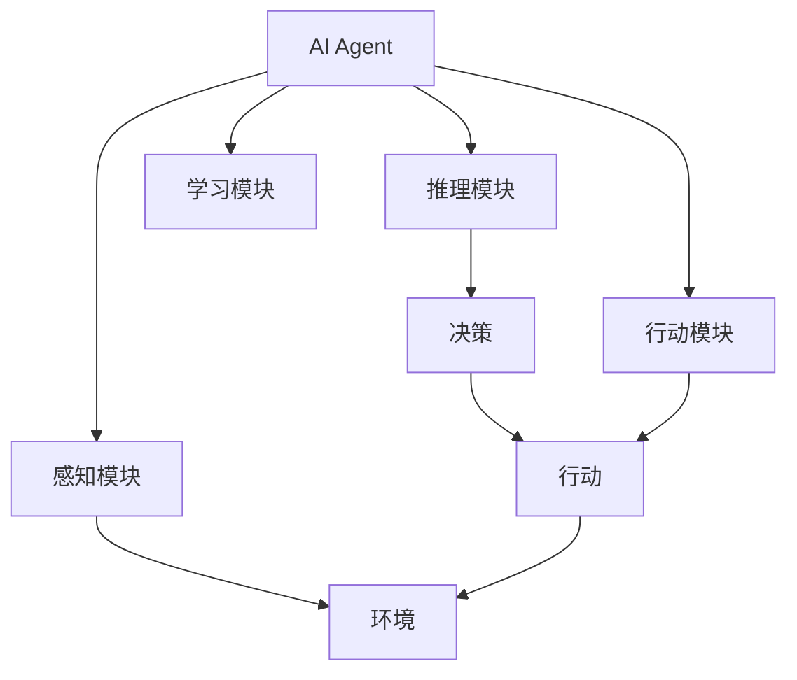
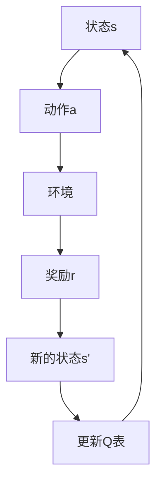
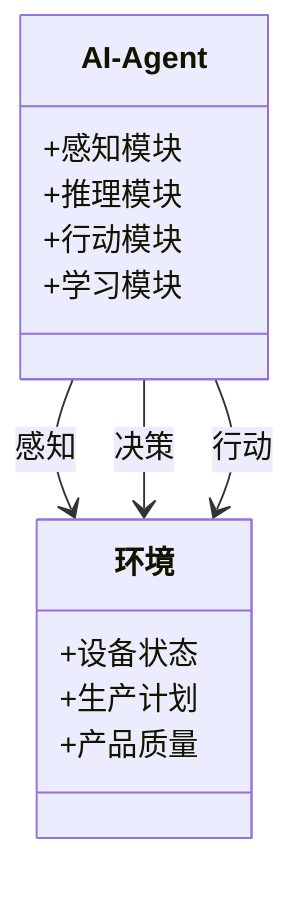
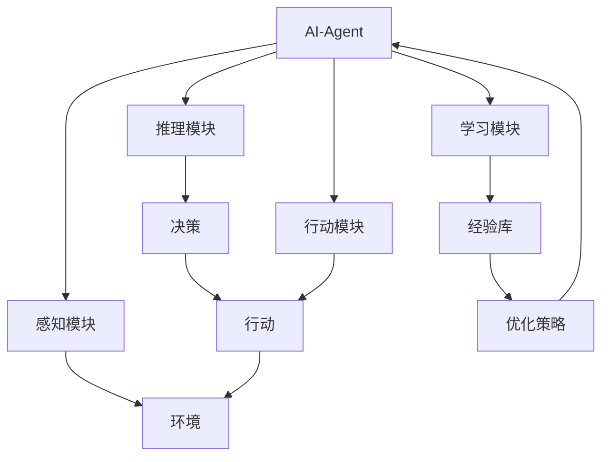
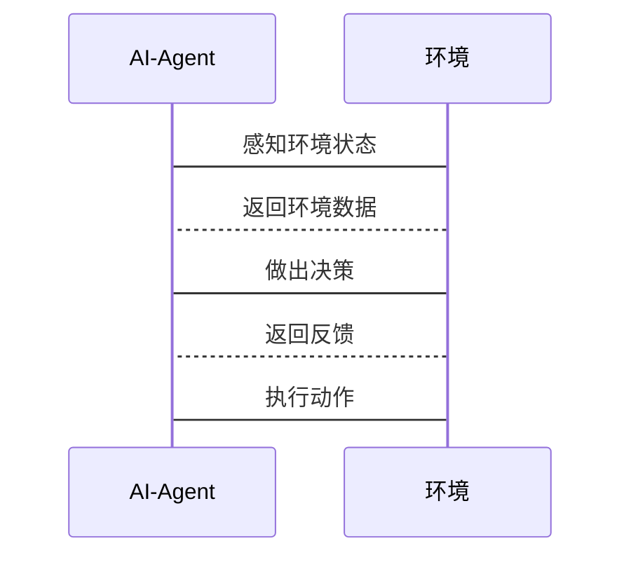

                 


# AI Agent在企业智能工厂管理中的全面应用

> 关键词：AI Agent, 智能工厂, 智能制造, 强化学习, 实体关系图, 算法原理, 系统架构

> 摘要：本文全面探讨了AI Agent在企业智能工厂管理中的应用，从AI Agent的基本概念、核心原理到实际应用场景，系统地分析了其在智能制造中的重要性。文章通过详细的技术原理、系统架构设计和实战案例，展示了AI Agent如何优化企业智能工厂的管理流程，提高生产效率和决策能力。最后，本文还总结了AI Agent在智能工厂管理中的优势与挑战，并给出了实际应用的建议。

---

# 第一章: AI Agent与智能工厂管理概述

## 1.1 AI Agent的基本概念

### 1.1.1 AI Agent的定义与特点
AI Agent（人工智能代理）是一种能够感知环境、自主决策并执行任务的智能实体。其特点包括：
- **自主性**：无需外部干预，自主完成任务。
- **反应性**：能够实时感知环境变化并做出响应。
- **主动性**：主动采取行动以实现目标。
- **学习能力**：通过经验或数据优化决策能力。

### 1.1.2 AI Agent的核心属性与特征
AI Agent的核心属性包括：
- **知识表示**：通过知识库表示问题、状态和解决方案。
- **推理机制**：基于知识和逻辑进行推理和决策。
- **规划能力**：制定行动计划以实现目标。
- **学习能力**：通过强化学习等方法优化决策策略。

### 1.1.3 AI Agent与传统自动化系统的区别
AI Agent与传统自动化系统的区别在于：
- **智能化**：AI Agent能够自主决策，而传统系统依赖预设规则。
- **适应性**：AI Agent能够根据环境变化调整行为，传统系统则不具备这种能力。
- **学习能力**：AI Agent能够通过经验优化性能，而传统系统无法实现。

## 1.2 智能工厂管理的背景与挑战

### 1.2.1 智能工厂的定义与发展现状
智能工厂是基于工业4.0理念，通过物联网、大数据和人工智能技术实现生产过程的智能化管理。当前，智能工厂已经在汽车制造、电子制造等领域得到广泛应用。

### 1.2.2 智能工厂管理中的主要挑战
智能工厂管理面临以下挑战：
- **复杂性**：生产过程涉及多个环节，需要协调众多设备和资源。
- **实时性**：需要快速响应生产过程中的异常情况。
- **不确定性**：生产环境中的不确定性可能导致传统规则难以应对。

### 1.2.3 AI Agent在智能工厂管理中的作用
AI Agent在智能工厂管理中的作用包括：
- **优化生产计划**：通过预测和优化生产计划，提高资源利用率。
- **实时监控与决策**：实时感知生产状态，快速做出调整决策。
- **故障预测与维护**：通过分析设备数据，预测潜在故障并安排维护。

## 1.3 AI Agent在企业智能工厂管理中的应用前景

### 1.3.1 AI Agent的潜在应用场景
AI Agent在智能工厂中的应用场景包括：
- **生产优化**：优化生产流程，降低生产成本。
- **设备维护**：预测设备故障，减少停机时间。
- **质量控制**：实时监控产品质量，确保符合标准。

### 1.3.2 企业采用AI Agent的优势
企业采用AI Agent的优势包括：
- **提高效率**：通过智能化管理，提高生产效率。
- **降低成本**：通过优化资源利用，降低生产成本。
- **增强灵活性**：能够快速适应生产环境的变化。

### 1.3.3 AI Agent应用的挑战与机遇
AI Agent应用的挑战包括：
- **技术复杂性**：AI Agent的开发和部署需要较高的技术门槛。
- **数据依赖性**：AI Agent依赖于高质量的数据，数据不足可能导致决策失误。
- **安全与隐私**：AI Agent可能面临数据泄露和网络攻击的风险。

---

# 第二章: AI Agent的核心概念与原理

## 2.1 AI Agent的核心概念

### 2.1.1 AI Agent的构成要素
AI Agent的构成要素包括：
- **感知模块**：感知环境状态。
- **推理模块**：基于感知信息进行推理和决策。
- **行动模块**：根据决策结果采取行动。
- **学习模块**：通过学习优化决策策略。

### 2.1.2 AI Agent的决策机制
AI Agent的决策机制包括：
- **基于规则的决策**：根据预设规则进行决策。
- **基于模型的决策**：通过建立数学模型进行决策。
- **基于强化学习的决策**：通过强化学习优化决策策略。

### 2.1.3 AI Agent的通信与协作
AI Agent的通信与协作包括：
- **Agent之间的通信**：通过消息传递机制进行通信。
- **多Agent协作**：多个Agent协同完成复杂任务。
- **分布式决策**：在分布式环境中进行决策。

## 2.2 AI Agent的分类与特征对比

### 2.2.1 基于任务的AI Agent分类
基于任务的AI Agent分类包括：
- **简单任务Agent**：处理简单任务。
- **复杂任务Agent**：处理复杂任务。
- **协作任务Agent**：处理需要协作的任务。

### 2.2.2 基于智能水平的AI Agent分类
基于智能水平的AI Agent分类包括：
- **反应式Agent**：基于当前感知做出反应。
- **认知式Agent**：具有推理和学习能力。
- **混合式Agent**：结合反应式和认知式Agent的特点。

### 2.2.3 AI Agent特征对比表格
以下是一个AI Agent特征对比表格：

| 特征                | 反应式Agent       | 认知式Agent       | 混合式Agent       |
|---------------------|-------------------|-------------------|-------------------|
| 智能水平            | 低                | 高                | 中                |
| 决策能力            | 基于当前感知      | 基于推理和学习    | 综合当前感知和推理 |
| 适应性              | 强                | 强                | 较强             |
| 应用场景            | 简单任务          | 复杂任务          | 复杂协作任务      |

### 2.2.4 AI Agent的实体关系图
以下是一个AI Agent的实体关系图（Mermaid图示）：



---

# 第三章: AI Agent的算法原理

## 3.1 AI Agent的核心算法

### 3.1.1 强化学习（Reinforcement Learning）
强化学习是一种通过试错方式优化决策策略的算法。AI Agent通过与环境交互，逐步优化其行为策略。

### 3.1.2 Q-learning算法（Mermaid流程图示）
以下是一个Q-learning算法的流程图（Mermaid图示）：



### 3.1.3 其他相关算法简介
其他相关算法包括：
- **DQN算法**：基于深度学习的强化学习算法。
- **PPO算法**：基于策略梯度的强化学习算法。

## 3.2 AI Agent的数学模型与公式

### 3.2.1 Q-learning数学模型
Q-learning的数学模型如下：
$$ Q(s, a) = Q(s, a) + \alpha (r + \gamma \max Q(s', a') - Q(s, a)) $$
其中：
- \( Q(s, a) \)：状态-动作对的价值。
- \( \alpha \)：学习率。
- \( r \)：奖励。
- \( \gamma \)：折扣因子。
- \( Q(s', a') \)：下一个状态的最大价值。

### 3.2.2 其他相关公式
- **期望值公式**：
$$ E[X] = \sum_{x} x P(X=x) $$
- **概率更新公式**：
$$ P'(X) = P(X) + \Delta P $$

---

# 第四章: AI Agent的系统分析与架构设计

## 4.1 问题场景介绍

### 4.1.1 智能工厂管理问题
智能工厂管理中存在以下问题：
- **生产计划优化**：如何优化生产计划以提高资源利用率。
- **设备维护管理**：如何预测设备故障并安排维护。
- **质量控制**：如何实时监控产品质量。

### 4.1.2 项目介绍
本项目旨在开发一个基于AI Agent的智能工厂管理系统，实现生产计划优化、设备维护管理和质量控制。

## 4.2 系统功能设计

### 4.2.1 领域模型（Mermaid类图）
以下是一个智能工厂管理系统的领域模型（Mermaid类图）：



## 4.3 系统架构设计

### 4.3.1 系统架构（Mermaid架构图）
以下是一个智能工厂管理系统的架构图（Mermaid图示）：



## 4.4 系统接口设计

### 4.4.1 系统接口
系统接口包括：
- **感知接口**：用于获取环境数据。
- **决策接口**：用于做出决策。
- **行动接口**：用于执行动作。

## 4.5 系统交互流程（Mermaid序列图）



---

# 第五章: AI Agent的项目实战

## 5.1 环境安装

### 5.1.1 系统要求
- 操作系统：Windows、Linux、macOS
- Python版本：3.6以上
- 其他依赖：NumPy、TensorFlow、Keras

### 5.1.2 安装步骤
1. 安装Python。
2. 安装NumPy。
3. 安装TensorFlow。
4. 安装Keras。

## 5.2 系统核心实现

### 5.2.1 AI Agent的核心代码
以下是一个AI Agent的核心代码示例（Python）：

```python
class AI-Agent:
    def __init__(self, learning_rate=0.1, gamma=0.9):
        self.learning_rate = learning_rate
        self.gamma = gamma
        self.q_table = {}

    def perceive(self, environment):
        # 获取环境数据
        return environment.get_state()

    def decide(self, state):
        # 选择动作
        if state not in self.q_table:
            self.q_table[state] = 0
        return self.choose_action(state)

    def learn(self, state, action, reward, next_state):
        # 更新Q表
        q_current = self.q_table[(state, action)]
        q_next = max([self.q_table.get((next_state, action), 0) for action in self.possible_actions])
        self.q_table[(state, action)] = q_current + self.learning_rate * (reward + self.gamma * q_next - q_current)

    def choose_action(self, state):
        # 随机选择动作
        actions = self.possible_actions
        return actions[np.random.randint(len(actions))]
```

### 5.2.2 环境实现
以下是一个环境实现示例（Python）：

```python
class Environment:
    def __init__(self, num_states=10):
        self.num_states = num_states
        self.current_state = 0

    def get_state(self):
        return self.current_state

    def set_state(self, state):
        self.current_state = state

    def reward(self, action):
        # 返回奖励
        return 1 if action == self.current_state else -1
```

## 5.3 代码应用解读与分析

### 5.3.1 代码功能分析
- **AI-Agent类**：实现AI Agent的核心功能，包括感知、决策和学习。
- **Environment类**：实现环境的交互，包括获取状态和返回奖励。

### 5.3.2 代码实现细节
- **perceive方法**：获取环境数据。
- **decide方法**：选择动作。
- **learn方法**：更新Q表。
- **choose_action方法**：随机选择动作。

## 5.4 实际案例分析

### 5.4.1 案例背景
假设我们有一个简单的生产计划优化问题，需要通过AI Agent优化生产计划。

### 5.4.2 案例实现
以下是一个简单的生产计划优化示例（Python）：

```python
def main():
    env = Environment(num_states=10)
    agent = AI-Agent(learning_rate=0.1, gamma=0.9)
    for _ in range(100):
        state = agent.perceive(env)
        action = agent.decide(state)
        reward = env.reward(action)
        next_state = env.get_state()
        agent.learn(state, action, reward, next_state)

if __name__ == "__main__":
    main()
```

### 5.4.3 案例分析
通过上述代码，AI Agent能够通过学习优化生产计划，提高生产效率。

## 5.5 项目小结

---

# 第六章: 总结与展望

## 6.1 总结
本文全面探讨了AI Agent在企业智能工厂管理中的应用，从基本概念到实际应用，详细分析了其在智能制造中的重要性。

## 6.2 最佳实践
- **数据质量**：确保数据的准确性和完整性。
- **算法选择**：根据具体场景选择合适的算法。
- **系统架构**：设计合理的系统架构，确保系统的可扩展性和可维护性。

## 6.3 未来展望
未来，AI Agent在智能工厂管理中的应用将更加广泛，随着技术的发展，AI Agent将具备更强的智能性和适应性，为企业创造更大的价值。

---

# 作者：AI天才研究院/AI Genius Institute & 禅与计算机程序设计艺术/Zen And The Art of Computer Programming

