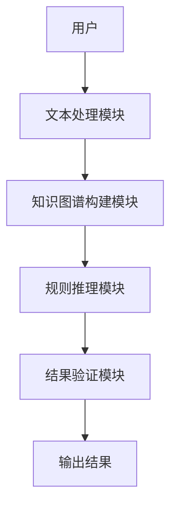

                 


# AI Agent在企业法律合规检查中的应用

> 关键词：AI Agent, 企业法律合规, 自然语言处理, 知识图谱, 法律文本分析, 监督学习

> 摘要：  
> 随着人工智能技术的快速发展，AI Agent（人工智能代理）在企业法律合规检查中的应用逐渐成为热点。本文系统地探讨了AI Agent在企业法律合规中的应用背景、核心技术、系统架构及项目实战，详细分析了自然语言处理、知识图谱构建、法律规则推理等关键环节，并结合实际案例展示了AI Agent在法律合规检查中的优势与挑战。通过本文的阐述，读者可以全面了解AI Agent在企业法律合规中的应用现状、技术实现及未来发展方向。

---

# 第一部分: AI Agent与企业法律合规概述

## 第1章: AI Agent的基本概念与法律合规背景

### 1.1 AI Agent的定义与核心特征

#### 1.1.1 AI Agent的基本概念  
AI Agent（人工智能代理）是指能够感知环境、自主决策并执行任务的智能实体。它可以通过自然语言处理、机器学习等技术与用户交互，并根据任务需求执行复杂操作。  

#### 1.1.2 AI Agent的核心特征  
- **自主性**：AI Agent能够在无外部干预的情况下自主完成任务。  
- **反应性**：能够实时感知环境变化并做出响应。  
- **目标导向**：基于明确的目标执行操作。  
- **学习能力**：通过数据和经验不断优化自身性能。  

#### 1.1.3 AI Agent与传统法律合规工具的对比  
传统的法律合规工具通常依赖人工操作，效率低且容易出错。AI Agent通过自动化技术，能够快速分析大量法律文本，显著提升合规效率和准确性。  

### 1.2 企业法律合规的基本概念

#### 1.2.1 企业法律合规的定义  
企业法律合规是指企业在经营活动中遵守相关法律法规、行业标准和企业内部规章制度的行为。  

#### 1.2.2 企业法律合规的主要领域  
- 合同审查与合规性评估  
- 数据隐私与个人信息保护  
- 反腐败与反贿赂合规  
- 税务合规与财务合规  

#### 1.2.3 企业法律合规的挑战与痛点  
- **法律法规复杂性**：法律法规不断更新，合规要求日益严格。  
- **数据量大**：企业需要处理海量法律文本和数据，人工处理效率低下。  
- **合规成本高**：传统合规检查依赖人工，时间和资金成本高昂。  

### 1.3 AI Agent在法律合规中的应用背景

#### 1.3.1 法律合规领域的技术需求  
- 快速分析大量法律文本  
- 自动识别合规风险  
- 提供实时合规建议  

#### 1.3.2 AI Agent在法律合规中的优势  
- 高效性：AI Agent能够快速处理大量法律文本，显著提升合规效率。  
- 准确性：通过深度学习模型，AI Agent能够准确识别法律条文中的关键信息。  
- 智能性：AI Agent能够根据实时数据动态调整合规策略。  

#### 1.3.3 当前应用现状与发展趋势  
当前，AI Agent在法律合规领域的应用还处于起步阶段，主要集中在合同审查和数据隐私保护等领域。未来，随着技术的进步，AI Agent将在更多合规领域发挥重要作用。

### 1.4 本章小结  
本章介绍了AI Agent的基本概念及其在法律合规中的应用背景，分析了企业法律合规的主要挑战和AI Agent的核心优势，为后续章节的展开奠定了基础。

---

# 第二部分: AI Agent的核心技术与法律合规结合的原理

## 第2章: 自然语言处理技术在法律文本分析中的应用

### 2.1 自然语言处理的基本原理

#### 2.1.1 词法分析  
词法分析是自然语言处理的基础，主要包括分词、词性标注和实体识别。  
- **分词**：将连续的字符分割成有意义的词语。  
- **词性标注**：识别词语的词性（如名词、动词、形容词等）。  
- **实体识别**：识别文本中的实体（如人名、地名、组织名等）。  

#### 2.1.2 句法分析  
句法分析旨在理解句子的语法结构，包括句法树的构建和依存关系分析。  
- **句法树**：展示词语之间的语法关系。  
- **依存关系分析**：分析词语之间的依存关系，如主语、谓语、宾语等。  

#### 2.1.3 实体识别  
实体识别是法律文本分析中的重要环节，能够帮助AI Agent准确理解法律文本中的关键信息。  

#### 2.1.4 示例：法律文本的分词与实体识别  
**示例文本**：  
“根据《中华人民共和国合同法》，合同双方应当遵守约定条款。”  
**分词结果**：  
`根据`、`《中华人民共和国合同法》`、`，`、`合同`、`双方`、`应当`、`遵守`、`约定条款`、`。”`  
**实体识别结果**：  
- 法律法规：《中华人民共和国合同法》  
- 实体：合同、双方  

#### 2.1.5 代码实现：分词与实体识别  
```python
import jieba
from spacy.lang.zh import Chinese

# 示例文本
text = "根据《中华人民共和国合同法》，合同双方应当遵守约定条款。"

# 分词
words = list(jieba.cut(text))
print("分词结果：", words)

# 实体识别（使用spaCy）
nlp = Chinese()
doc = nlp(text)
for ent in doc.ents:
    print("实体识别结果：", ent.text, "，实体类型：", ent.label_)
```

---

## 第3章: 知识图谱与法律合规规则的构建

### 3.1 知识图谱的基本概念

#### 3.1.1 知识图谱的定义  
知识图谱是一种以图结构形式表示知识的工具，由节点（实体）和边（关系）组成。  

#### 3.1.2 知识图谱的构建方法  
- **数据采集**：从法律文本中提取实体和关系。  
- **数据清洗**：去除重复和错误数据。  
- **知识融合**：将多个数据源的信息整合到同一知识图谱中。  
- **知识推理**：基于已有知识进行推理和扩展。  

#### 3.1.3 知识图谱的表示与存储  
知识图谱通常使用RDF（资源描述框架）或图数据库（如Neo4j）进行存储和表示。  

### 3.2 法律合规规则的构建

#### 3.2.1 法律合规规则的分类  
- **合同合规规则**：如合同条款的合法性、有效性等。  
- **数据合规规则**：如数据隐私保护、数据跨境传输等。  
- **税务合规规则**：如税务申报的准确性、合规性等。  

#### 3.2.2 法律合规规则的表示方法  
法律合规规则可以通过自然语言描述、逻辑表达式或规则引擎进行表示。  

#### 3.2.3 法律合规规则的推理与验证  
AI Agent需要能够根据知识图谱中的实体和关系，推理出具体的合规规则，并验证其有效性。  

#### 3.2.4 示例：合同合规规则的推理  
**知识图谱**：  
- 实体：合同、条款、法律条文  
- 关系：合同包含条款，条款引用法律条文。  

**推理过程**：  
1. 合同包含条款。  
2. 条款引用法律条文。  
3. 因此，合同需要符合引用的法律条文。  

### 3.3 代码实现：知识图谱的构建与推理

```python
from py2neo import Graph, Node, Relationship

# 创建知识图谱
graph = Graph("http://localhost:7474", auth=("neo4j", "password"))

# 添加实体
contract = Node("Contract", name="合同")
clause = Node("Clause", name="条款")
legal_text = Node("LegalText", name="《中华人民共和国合同法》")

# 添加关系
graph.create(Relationship(contract, "CONTAINS", clause))
graph.create(Relationship(clause, "REFERENCES", legal_text))

# 查询知识图谱
for clause_node in graph.match("Clause", name="条款"):
    print("条款节点：", clause_node)
    for rel in clause_node.relationships:
        print("关系：", rel)
        for neighbor in rel.connected_to:
            print("关联节点：", neighbor)
```

---

## 第4章: 法律合规规则的推理与验证

### 4.1 法律合规规则的推理方法

#### 4.1.1 基于知识图谱的推理  
AI Agent可以通过知识图谱进行路径分析、关联推理等操作，验证合规规则的有效性。  

#### 4.1.2 基于逻辑推理的验证  
通过逻辑推理（如布尔逻辑、逻辑编程）对合规规则进行验证。  

### 4.2 法律合规规则的验证流程

#### 4.2.1 数据清洗与预处理  
对法律文本进行分词、实体识别、句法分析等预处理操作。  

#### 4.2.2 规则匹配  
将预处理后的数据与法律合规规则进行匹配，识别潜在的合规风险。  

#### 4.2.3 结果验证  
通过知识图谱和推理引擎对匹配结果进行验证，确保合规性。  

### 4.3 代码实现：法律合规规则的验证

```python
from yargy import parser, rule, and_, or_, not_, match, tag

# 示例法律文本
text = "合同双方应当遵守约定条款。"

# 定义法律合规规则
rule_contract = rule(
    match("合同"),
    tag("SUB"),
    and_(
        match("双方"),
        tag("SUB")
    )
)

# 解析法律文本
parsed = parser(text)
matches = parsed.findall(rule_contract)

# 验证结果
if matches:
    print("合同合规规则匹配成功。")
else:
    print("合同合规规则匹配失败。")
```

---

# 第三部分: 系统架构与项目实战

## 第5章: 企业法律合规AI Agent的系统架构

### 5.1 系统功能设计

#### 5.1.1 需求分析  
- **法律文本分析**：对合同、法律文件等进行文本分析。  
- **合规规则推理**：根据法律文本生成合规规则并进行推理。  
- **结果验证**：验证合规规则的正确性并输出结果。  

#### 5.1.2 功能模块划分  
- **文本处理模块**：负责法律文本的分词、实体识别和句法分析。  
- **知识图谱构建模块**：构建法律知识图谱。  
- **规则推理模块**：根据知识图谱进行规则推理。  
- **结果验证模块**：验证推理结果的正确性。  

### 5.2 系统架构设计

#### 5.2.1 系统架构图  


#### 5.2.2 实现细节  
- **文本处理模块**：使用自然语言处理工具（如spaCy、jieba）进行文本分析。  
- **知识图谱构建模块**：使用图数据库（如Neo4j）构建知识图谱。  
- **规则推理模块**：基于知识图谱进行路径分析和逻辑推理。  
- **结果验证模块**：通过对比推理结果与实际法律条文验证合规性。  

### 5.3 接口设计与交互流程

#### 5.3.1 系统接口设计  
- **输入接口**：接收法律文本或文件路径。  
- **输出接口**：输出合规性结果及建议。  

#### 5.3.2 交互流程  
1. 用户输入法律文本或文件路径。  
2. 系统对文本进行分词、实体识别和句法分析。  
3. 构建知识图谱并进行规则推理。  
4. 验证推理结果并输出合规性报告。  

---

## 第6章: 项目实战——企业合同合规检查系统

### 6.1 项目介绍

#### 6.1.1 项目目标  
开发一个基于AI Agent的企业合同合规检查系统，实现合同文本的自动分析与合规性检查。  

#### 6.1.2 项目技术选型  
- **自然语言处理工具**：spaCy、jieba  
- **知识图谱构建工具**：Neo4j  
- **规则推理引擎**：yargy  

### 6.2 系统实现

#### 6.2.1 环境安装  
```bash
pip install spacy jieba neo4j yargy
python -m spacy download zh
```

#### 6.2.2 核心代码实现

##### 6.2.2.1 文本处理模块  
```python
import spacy
from yargy import parser, rule, and_, or_, not_, match, tag

# 加载中文模型
nlp = spacy.load("zh")

# 示例合同文本
text = "合同双方应当遵守约定条款。"

# 分词与实体识别
doc = nlp(text)
for token in doc:
    print(f"{token.text}({token.pos_})")
```

##### 6.2.2.2 知识图谱构建模块  
```python
from py2neo import Graph, Node, Relationship

# 创建知识图谱
graph = Graph("http://localhost:7474", auth=("neo4j", "password"))

# 添加实体
contract = Node("Contract", name="合同")
clause = Node("Clause", name="条款")
legal_text = Node("LegalText", name="《中华人民共和国合同法》")

# 添加关系
graph.create(Relationship(contract, "CONTAINS", clause))
graph.create(Relationship(clause, "REFERENCES", legal_text))
```

##### 6.2.2.3 规则推理模块  
```python
from yargy import parser, rule, and_, or_, not_, match, tag

# 示例法律文本
text = "合同双方应当遵守约定条款。"

# 定义法律合规规则
rule_contract = rule(
    match("合同"),
    tag("SUB"),
    and_(
        match("双方"),
        tag("SUB")
    )
)

# 解析法律文本
parsed = parser(text)
matches = parsed.findall(rule_contract)

# 验证结果
if matches:
    print("合同合规规则匹配成功。")
else:
    print("合同合规规则匹配失败。")
```

##### 6.2.2.4 结果验证模块  
```python
from yargy import parser, rule, and_, or_, not_, match, tag

# 示例合同文本
text = "根据《中华人民共和国合同法》，合同双方应当遵守约定条款。"

# 定义合同合规规则
rule_contract = rule(
    match("根据"),
    match("《中华人民共和国合同法》"),
    match("，"),
    match("合同"),
    match("双方"),
    match("应当"),
    match("遵守"),
    match("约定条款"),
    match("。")
)

# 解析法律文本
parsed = parser(text)
matches = parsed.findall(rule_contract)

# 验证结果
if matches:
    print("合同合规规则匹配成功。")
else:
    print("合同合规规则匹配失败。")
```

### 6.3 项目小结

#### 6.3.1 项目成果  
成功开发了一个基于AI Agent的企业合同合规检查系统，能够自动分析合同文本并验证其合规性。  

#### 6.3.2 项目经验  
- **技术实现**：自然语言处理和知识图谱在法律合规中的应用。  
- **挑战与解决方案**：  
  - 数据质量：需要高质量的法律文本数据进行训练。  
  - 规则复杂性：复杂的法律合规规则需要灵活的规则定义和推理方法。  

---

# 第四部分: 最佳实践与未来展望

## 第7章: 最佳实践与注意事项

### 7.1 数据隐私与安全

#### 7.1.1 数据隐私保护  
在处理企业法律合规数据时，需要严格遵守数据隐私保护相关法律法规，如GDPR（通用数据保护条例）。  

#### 7.1.2 数据安全措施  
- 数据加密存储与传输。  
- 访问控制：限制未经授权的访问。  

### 7.2 模型可解释性

#### 7.2.1 可解释性的重要性  
AI Agent的决策过程需要透明，以便用户理解和信任结果。  

#### 7.2.2 提升可解释性的方法  
- 使用可解释的模型（如基于规则的模型）。  
- 提供推理过程的详细解释。  

### 7.3 持续优化与维护

#### 7.3.1 持续优化  
- 定期更新法律知识库。  
- 根据新法律法规调整合规规则。  

#### 7.3.2 系统维护  
- 定期检查系统性能，确保高效运行。  
- 及时修复系统漏洞。  

## 第8章: 未来展望与总结

### 8.1 未来发展趋势

#### 8.1.1 技术进步  
- 更先进的自然语言处理技术（如大语言模型）。  
- 更复杂的知识图谱构建与推理方法。  

#### 8.1.2 应用领域扩展  
AI Agent在更多法律合规领域的应用，如知识产权保护、合规报告自动生成等。  

### 8.2 本文总结  
本文系统地探讨了AI Agent在企业法律合规检查中的应用，从核心技术到系统架构，再到项目实战，全面展示了AI Agent在法律合规中的优势与挑战。未来，随着技术的进步，AI Agent将在企业法律合规中发挥更大的作用。

---

# 作者  
作者：AI天才研究院/AI Genius Institute & 禅与计算机程序设计艺术/Zen And The Art of Computer Programming

