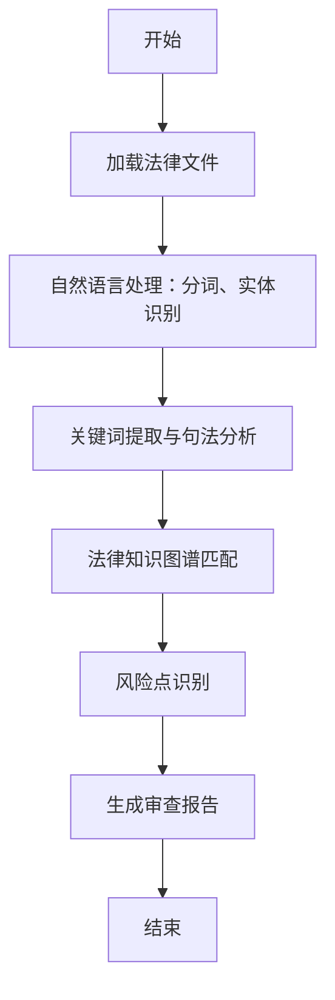
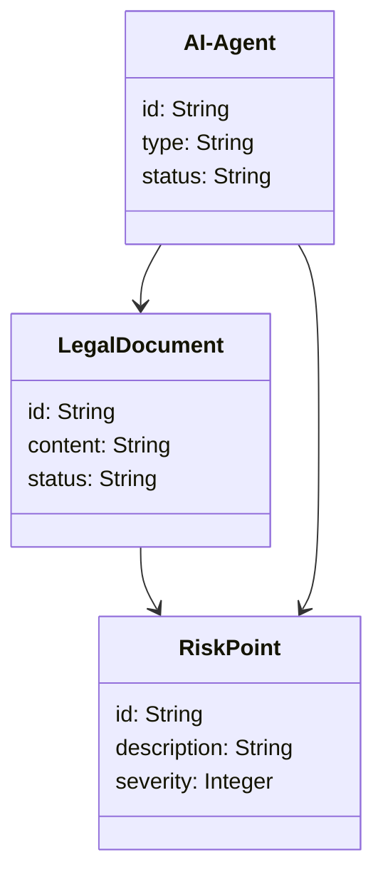

                 


# AI Agent在企业法律文件审查与风险识别中的自动化应用

> 关键词：AI Agent, 企业法律文件审查, 风险识别, 自然语言处理, 法律知识图谱, 机器学习, 自动化应用

> 摘要：本文深入探讨了AI Agent在企业法律文件审查与风险识别中的应用。通过分析传统法律文件审查的痛点，结合AI Agent的核心概念、技术基础、算法原理、系统架构设计以及实际项目案例，展示了如何利用自然语言处理、法律知识图谱和机器学习等技术实现法律文件审查的自动化与智能化。文章还总结了AI Agent在企业法律文件审查中的优势、挑战及未来发展方向。

---

## 第一部分: AI Agent与企业法律文件审查概述

### 第1章: AI Agent与企业法律文件审查概述

#### 1.1 问题背景与描述

##### 1.1.1 传统企业法律文件审查的痛点

企业法律文件审查是企业合规管理中的重要环节，传统做法通常依赖人工审查，存在以下痛点：

1. **效率低下**：人工审查需要大量时间，特别是在处理大量法律文件时，效率明显不足。
2. **成本高昂**：需要大量专业律师参与，增加了企业的法律服务成本。
3. **主观性较强**：审查结果受律师个人经验和知识储备的影响，可能存在遗漏或误判。
4. **一致性不足**：不同律师对同一文件的审查结果可能不同，导致标准不统一。

##### 1.1.2 AI Agent在法律文件审查中的应用价值

AI Agent（人工智能代理）是一种能够自动执行任务的智能系统，能够显著提升企业法律文件审查的效率和准确性。其应用价值体现在：

1. **自动化处理**：AI Agent可以自动分析和识别法律文件中的关键条款、风险点，减少人工干预。
2. **提高准确性**：通过机器学习和自然语言处理技术，AI Agent能够更精准地识别和分类法律条款，降低误判率。
3. **成本节约**：自动化审查减少了对专业律师的依赖，降低了企业的法律服务成本。
4. **一致性与可扩展性**：AI Agent能够保证审查标准的统一性，同时可以处理大量的法律文件，具备良好的可扩展性。

##### 1.1.3 问题解决的边界与外延

AI Agent在法律文件审查中的应用并非万能的，存在一定的边界和限制。其解决的边界包括：

1. **适用范围**：适用于标准化程度较高的法律文件，如合同、合规性文件等，对于复杂、涉及多方利益的法律文件可能需要人工辅助。
2. **技术限制**：AI Agent的准确性和智能性依赖于算法和数据质量，目前仍需依赖大量标注数据进行训练。
3. **法律复杂性**：对于涉及复杂法律关系的文件，AI Agent可能需要结合上下文和专业法律知识进行判断，这在当前技术水平下仍具挑战性。

#### 1.2 核心概念与联系

##### 1.2.1 AI Agent的核心概念原理

AI Agent是一种能够感知环境、自主决策并执行任务的智能系统。其核心概念包括：

1. **感知能力**：通过输入数据（如文本、图像）感知环境。
2. **决策能力**：基于感知信息，利用算法和模型进行决策。
3. **执行能力**：根据决策结果执行相应操作。

##### 1.2.2 法律文件审查的关键要素

法律文件审查的关键要素包括：

1. **关键条款识别**：识别合同中的关键条款，如违约条款、知识产权条款等。
2. **风险点识别**：识别潜在的法律风险点，如不合理条款、模糊条款等。
3. **合规性检查**：检查文件是否符合相关法律法规和企业内部政策。

##### 1.2.3 AI Agent与法律文件审查的实体关系图

以下是AI Agent与法律文件审查的实体关系图：

```mermaid
entity LegalFile {
  id: String
  content: String
  status: String
}
entity AI-Agent {
  id: String
  type: String
  status: String
}
entity RiskPoint {
  id: String
  description: String
  severity: Integer
}
relationship Has {
  from: LegalFile
  to: RiskPoint
}
relationship Analyzes {
  from: AI-Agent
  to: LegalFile
}
```

---

## 第二部分: AI Agent的核心概念与原理

### 第2章: AI Agent的核心概念与原理

#### 2.1 AI Agent的定义与特征

##### 2.1.1 AI Agent的定义

AI Agent是一种智能代理系统，能够通过感知环境、自主决策并执行任务，以实现特定目标。它可以在多种场景中应用，如法律文件审查、客户服务、自动化流程管理等。

##### 2.1.2 AI Agent的核心特征对比表格

以下是AI Agent与传统规则引擎的对比表格：

| 特征         | 传统规则引擎 | 基于模型的AI Agent |
|--------------|--------------|---------------------|
| 处理方式      | 基于规则     | 基于模型推理       |
| 灵活性        | 较低         | 较高               |
| 学习能力      | 无           | 有                 |

---

#### 2.2 AI Agent的算法原理

##### 2.2.1 基于自然语言处理的法律文件分析

自然语言处理（NLP）是AI Agent实现法律文件审查的核心技术之一。NLP技术能够对法律文件中的文本进行分词、句法分析、实体识别等处理，提取关键信息。例如，使用BERT模型对法律文本进行编码，提取关键词和关键句子。

##### 2.2.2 基于机器学习的法律风险识别

机器学习算法（如支持向量机、随机森林、深度学习模型）可以用于法律风险识别。通过训练数据中的标签，模型能够学习识别风险点。例如，使用监督学习算法，将法律文件中的风险点进行分类。

##### 2.2.3 算法流程图

以下是法律文件审查的算法流程图：



---

## 第三部分: 系统分析与架构设计

### 第3章: 系统架构设计与实现

#### 3.1 系统功能设计

##### 3.1.1 领域模型设计

以下是法律文件审查系统的领域模型：



##### 3.1.2 系统架构设计

以下是法律文件审查系统的架构图：

```mermaid
container Database {
  LegalDocumentDB
  RiskPointDB
}
container ServiceLayer {
  LegalDocumentService
  RiskPointService
}
container ApplicationLayer {
  AI-Agent
  UserInterface
}
Database --> ServiceLayer
ServiceLayer --> ApplicationLayer
```

---

### 第4章: 项目实战与案例分析

#### 4.1 项目环境与安装

##### 4.1.1 环境要求

- 操作系统：Windows/Mac/Linux
- Python版本：3.8及以上
- 需要安装的库：Python的NLP库（如spaCy、NLTK）、机器学习库（如Scikit-learn、TensorFlow）、自然语言处理模型（如BERT）

##### 4.1.2 核心代码实现

以下是法律文件审查系统的核心代码示例：

```python
import spacy

nlp = spacy.load("en_core_web_sm")

def analyze_legal_document(document_content):
    doc = nlp(document_content)
    keywords = [token.text for token in doc if token.is_stop is False and token.is_punct is False]
    return keywords

document = "This is a sample legal document."
result = analyze_legal_document(document)
print(result)
```

---

## 第五部分: 最佳实践与未来展望

### 第5章: 最佳实践与注意事项

#### 5.1 小结

AI Agent在企业法律文件审查中的应用具有显著优势，能够提高效率、降低成本，并确保审查的一致性。然而，其应用也面临技术限制和法律复杂性等挑战。

#### 5.2 注意事项

1. **数据质量**：AI Agent的性能依赖于训练数据的质量，需确保数据的多样性和代表性。
2. **法律合规性**：在设计和应用AI Agent时，必须确保符合相关法律法规，避免法律风险。
3. **模型更新**：法律知识和法规不断变化，需定期更新AI Agent的模型和知识库。

---

## 结语

AI Agent在企业法律文件审查与风险识别中的应用是人工智能技术在法律领域的典型应用之一。通过自然语言处理、机器学习等技术，AI Agent能够显著提升法律文件审查的效率和准确性。未来，随着技术的不断进步，AI Agent将在企业法律合规管理中发挥越来越重要的作用。

---

作者：AI天才研究院/AI Genius Institute & 禅与计算机程序设计艺术 /Zen And The Art of Computer Programming

