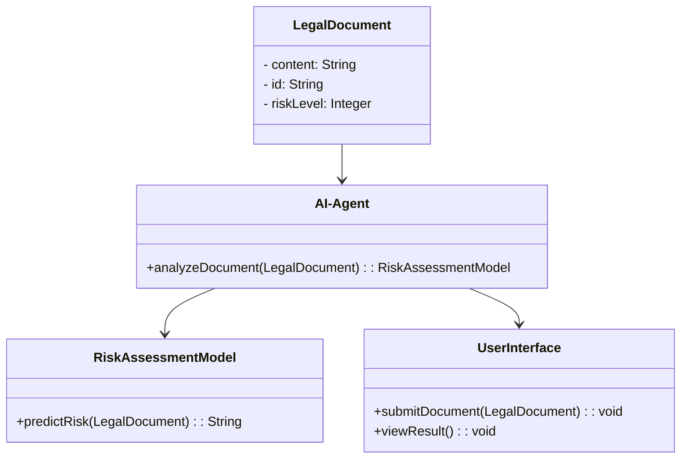
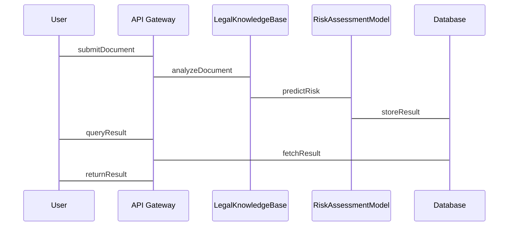

                 


# AI Agent在企业法律风险评估与合同审查中的应用

## 关键词：
- AI Agent
- 法律风险评估
- 合同审查
- 人工智能
- 法律技术

## 摘要：
随着人工智能技术的快速发展，AI Agent在企业法律风险评估与合同审查中的应用越来越广泛。本文从AI Agent的基本概念出发，详细分析了其在法律风险评估与合同审查中的核心原理、应用场景和技术实现。通过具体的案例分析和系统架构设计，探讨了AI Agent如何帮助企业提高法律事务处理的效率和准确性。本文还总结了AI Agent在法律领域的优势和未来的发展趋势。

---

# 第1章: 企业法律风险评估与合同审查的背景

## 1.1 企业法律风险评估的背景

### 1.1.1 企业法律风险的定义与分类
企业法律风险是指企业在经营活动中可能面临的法律纠纷、法律责任或法律制裁。常见的法律风险包括合同风险、知识产权风险、合规风险等。法律风险可以分为内部风险（如内部政策不合规）和外部风险（如市场环境变化）。

### 1.1.2 企业法律风险的来源与影响
企业法律风险的主要来源包括：
- **合同风险**：合同条款不明确、履行不及时等。
- **合规风险**：企业行为不符合相关法律法规。
- **知识产权风险**：专利、商标等知识产权被侵权或被侵权。
- **劳动法律风险**：劳动关系中的争议，如工资、劳动合同等。

法律风险对企业的影响包括经济损失、声誉损失、法律责任等。

### 1.1.3 传统法律风险评估的局限性
传统的法律风险评估主要依赖人工审查和经验判断，存在以下问题：
- **效率低**：人工审查需要大量时间，难以应对海量的法律文件。
- **主观性**：依赖个人经验，可能导致遗漏或误判。
- **成本高**：需要大量法律专业人士参与，成本较高。

## 1.2 合同审查的挑战与重要性

### 1.2.1 合同审查的基本概念
合同审查是指对合同的合法性、合规性和可执行性进行检查，确保合同内容符合法律法规，并保护企业的利益。

### 1.2.2 传统合同审查的痛点
- **效率低下**：人工审查需要逐字逐句阅读，耗时耗力。
- **一致性差**：不同律师对合同的理解可能不同，导致审查结果不一致。
- **风险高**：人工审查容易遗漏关键条款或潜在风险。

### 1.2.3 数字化合同审查的必要性
随着企业规模的扩大和业务的复杂化，合同数量急剧增加，人工审查已难以满足需求。数字化合同审查通过AI技术可以显著提高效率和准确性。

## 1.3 AI技术在法律领域的应用前景

### 1.3.1 AI在法律领域的应用现状
AI技术已经在法律领域得到广泛应用，包括合同审查、法律咨询、案例分析等。

### 1.3.2 AI Agent在法律服务中的优势
AI Agent（人工智能代理）具有以下优势：
- **高效性**：可以快速处理大量法律文件。
- **准确性**：通过机器学习模型，可以提高审查的准确性。
- **可扩展性**：可以同时处理多个任务，满足企业的需求。

### 1.3.3 企业法律服务的智能化转型
企业正在逐步将法律服务智能化，通过AI Agent实现法律事务的自动化处理，降低人工成本，提高效率。

## 1.4 本章小结
本章介绍了企业法律风险评估和合同审查的背景，分析了传统方法的局限性，并探讨了AI技术在法律领域的应用前景。AI Agent的出现为企业提供了更高效、更准确的法律服务解决方案。

---

# 第2章: AI Agent的核心概念与技术原理

## 2.1 AI Agent的基本概念

### 2.1.1 AI Agent的定义与特点
AI Agent是一种智能代理，能够感知环境、执行任务并做出决策。其特点包括智能性、自主性、反应性和社交性。

### 2.1.2 AI Agent的分类与应用场景
AI Agent可以分为以下几类：
- **基于规则的Agent**：通过预定义的规则进行决策。
- **基于机器学习的Agent**：通过机器学习模型进行预测和决策。
- **混合型Agent**：结合规则和机器学习的混合模型。

应用场景包括合同审查、法律咨询、风险评估等。

### 2.1.3 AI Agent与传统法律工具的对比
AI Agent相比传统法律工具具有更高的效率和准确性，但需要依赖大量的数据和先进的算法。

## 2.2 法律知识图谱的构建

### 2.2.1 知识图谱的基本概念
知识图谱是一种结构化的知识表示方法，能够将法律知识以图谱形式表示，便于机器理解和推理。

### 2.2.2 法律知识图谱的构建方法
法律知识图谱的构建包括数据采集、数据清洗、知识抽取、知识关联和知识存储等步骤。

### 2.2.3 法律知识图谱的表示与推理
法律知识图谱可以通过图数据库进行存储，使用图推理技术进行法律知识的推理和分析。

## 2.3 AI Agent在法律风险评估中的工作原理

### 2.3.1 数据输入与预处理
AI Agent需要输入企业的法律文件和相关数据，并进行清洗和结构化处理。

### 2.3.2 风险识别与评估模型
AI Agent使用机器学习模型对法律文件进行风险识别和评估，常见的模型包括逻辑回归、支持向量机和深度学习模型。

### 2.3.3 结果输出与反馈机制
AI Agent将风险评估结果输出，并根据用户反馈不断优化模型。

## 2.4 本章小结
本章详细介绍了AI Agent的核心概念和技术原理，特别是法律知识图谱的构建和风险评估模型的应用。

---

# 第3章: AI Agent在企业法律风险评估中的应用

## 3.1 企业法律风险评估的流程

### 3.1.1 风险识别与分类
AI Agent通过自然语言处理技术对法律文件进行风险识别和分类。

### 3.1.2 风险评估与优先级排序
AI Agent根据风险的严重性和概率进行评估，并确定优先级。

### 3.1.3 风险应对策略制定
AI Agent为企业制定风险应对策略，如风险规避、风险转移等。

## 3.2 AI Agent在风险识别中的作用

### 3.2.1 自然语言处理技术的应用
AI Agent使用NLP技术对法律文件进行文本分析和关键词提取。

### 3.2.2 风险关键词的提取与分析
通过关键词提取技术，AI Agent可以识别出潜在的法律风险点。

### 3.2.3 风险案例的匹配与推理
AI Agent可以匹配历史风险案例，并进行推理和分析。

## 3.3 基于AI Agent的风险评估模型

### 3.3.1 模型的输入与输出
模型的输入包括企业法律文件和相关数据，输出包括风险评估结果和应对策略。

### 3.3.2 模型的训练与优化
通过机器学习模型的训练和优化，可以提高风险评估的准确性和效率。

### 3.3.3 模型的评估与验证
通过测试数据对模型进行评估和验证，确保模型的稳定性和可靠性。

## 3.4 本章小结
本章详细探讨了AI Agent在企业法律风险评估中的应用，特别是风险识别和评估模型的构建与优化。

---

# 第4章: AI Agent在合同审查中的应用

## 4.1 合同审查的基本流程

### 4.1.1 合同内容的结构化处理
将合同内容进行结构化处理，便于机器分析和理解。

### 4.1.2 风险点的识别与标记
AI Agent通过关键词提取和自然语言处理技术识别合同中的风险点。

### 4.1.3 合同合规性评估
AI Agent对合同的合规性进行评估，并提出修改建议。

## 4.2 AI Agent在合同审查中的具体应用

### 4.2.1 合同条款的自动审查
AI Agent可以自动审查合同条款，确保其符合法律法规。

### 4.2.2 合同模板的自动生成
通过AI技术，可以自动生成标准化的合同模板，提高效率。

### 4.2.3 合同风险的预测与预警
AI Agent可以预测合同履行中的潜在风险，并进行预警。

## 4.3 本章小结
本章介绍了AI Agent在合同审查中的具体应用，包括合同条款审查、合同模板生成和合同风险预测。

---

# 第5章: 系统分析与架构设计方案

## 5.1 问题场景介绍

### 5.1.1 企业法律风险评估的场景
企业需要对大量的法律文件进行风险评估，确保合规性。

### 5.1.2 合同审查的场景
企业需要对合同进行快速、准确的审查，确保合同的合法性和可执行性。

## 5.2 项目介绍

### 5.2.1 项目目标
开发一个基于AI Agent的企业法律风险评估与合同审查系统。

### 5.2.2 项目范围
包括法律知识图谱的构建、风险评估模型的设计和系统架构的实现。

## 5.3 系统功能设计

### 5.3.1 领域模型（Mermaid类图）


### 5.3.2 系统架构设计（Mermaid架构图）


### 5.3.3 系统接口设计
系统接口包括文档提交接口、风险评估接口和结果查询接口。

### 5.3.4 系统交互设计（Mermaid序列图）


## 5.4 本章小结
本章通过系统架构设计和功能设计，详细描述了AI Agent在企业法律风险评估与合同审查中的实现方案。

---

# 第6章: 项目实战——基于AI Agent的合同审查系统

## 6.1 环境安装

### 6.1.1 开发环境
- Python 3.8+
- Jupyter Notebook
- PyTorch或TensorFlow

### 6.1.2 依赖安装
```bash
pip install transformers torch numpy pandas
```

## 6.2 系统核心实现源代码

### 6.2.1 法律知识图谱的构建
```python
import pandas as pd
from transformers import AutoTokenizer, AutoModelForTokenClassification

tokenizer = AutoTokenizer.from_pretrained('bert-base-uncased')
model = AutoModelForTokenClassification.from_pretrained('bert-base-uncased')
```

### 6.2.2 风险评估模型的实现
```python
import torch
import torch.nn as nn

class RiskAssessmentModel(nn.Module):
    def __init__(self, input_size, hidden_size, output_size):
        super(RiskAssessmentModel, self).__init__()
        self.fc1 = nn.Linear(input_size, hidden_size)
        self.fc2 = nn.Linear(hidden_size, output_size)
    
    def forward(self, x):
        x = torch.relu(self.fc1(x))
        x = torch.sigmoid(self.fc2(x))
        return x
```

### 6.2.3 合同审查系统的实现
```python
def analyze_contract(contract_text):
    # 数据预处理
    inputs = tokenizer(contract_text, return_tensors='np')
    # 模型推理
    outputs = model(**inputs)
    # 获取结果
    return outputs
```

## 6.3 代码解读与分析

### 6.3.1 法律知识图谱的构建
使用BERT模型进行法律文本的分词和实体识别。

### 6.3.2 风险评估模型的实现
使用深度学习模型进行风险预测，输出风险等级。

### 6.3.3 合同审查系统的实现
通过自然语言处理技术对合同文本进行分析，并生成审查结果。

## 6.4 实际案例分析

### 6.4.1 案例背景
某企业需要审查一份长期合作协议。

### 6.4.2 数据输入
合同文本：`"长期合作协议" ...`

### 6.4.3 模型推理
模型输出风险等级：低风险。

### 6.4.4 结果解读
审查结果：合同内容符合法律法规，无明显风险。

## 6.5 本章小结
本章通过具体的项目实战，详细展示了AI Agent在合同审查系统中的应用，包括环境搭建、代码实现和案例分析。

---

# 第7章: 最佳实践与未来展望

## 7.1 小结

### 7.1.1 AI Agent的优势
- 高效性
- 准确性
- 可扩展性

### 7.1.2 传统方法的不足
- 效率低
- 成本高
- 主观性强

## 7.2 注意事项

### 7.2.1 数据质量
确保法律数据的准确性和完整性。

### 7.2.2 模型优化
定期更新模型，提高预测精度。

### 7.2.3 伦理与法律
确保AI Agent的应用符合伦理和法律法规。

## 7.3 拓展阅读

### 7.3.1 推荐书籍
- 《人工智能：一种现代的方法》
- 《法律逻辑与计算机科学》

### 7.3.2 推荐论文
- "AI in Legal Risk Assessment"
- "Contract Review with Machine Learning"

## 7.4 本章小结
本章总结了AI Agent在企业法律风险评估与合同审查中的优势和注意事项，并提供了拓展阅读的建议。

---

# 作者：AI天才研究院/AI Genius Institute & 禅与计算机程序设计艺术 /Zen And The Art of Computer Programming

