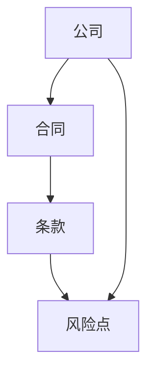
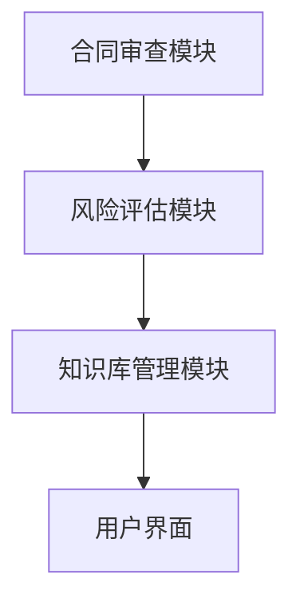
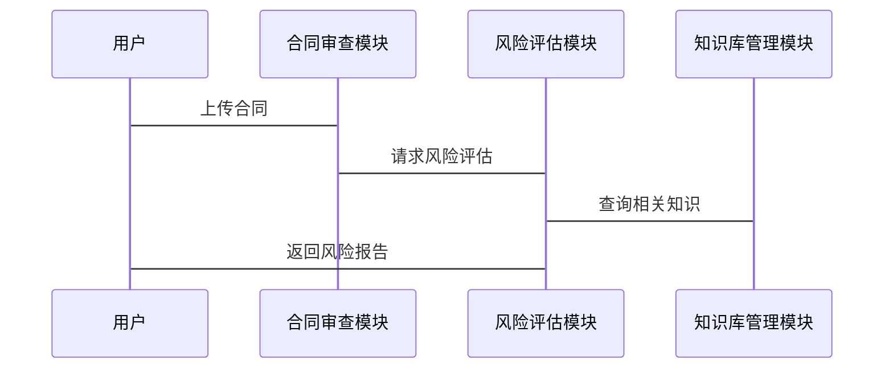

                 


# AI Agent在企业法律风险评估与合同自动化审查中的应用

> **关键词**：AI Agent, 法律风险评估, 合同自动化审查, 法律知识图谱, 法律科技

> **摘要**：本文系统地探讨了AI Agent在企业法律风险评估与合同自动化审查中的应用。从背景介绍、核心概念、算法原理到系统设计与项目实战，详细分析了AI Agent如何通过法律知识图谱和自然语言处理技术，实现对企业法律风险的智能化识别与管理。文章还提供了实际案例和最佳实践，为企业的智能化法律风险管理提供了参考。

---

## 第1章 背景介绍

### 1.1 AI Agent的基本概念

#### 1.1.1 AI Agent的定义与特点
- **定义**：AI Agent（人工智能代理）是能够感知环境、自主决策并执行任务的智能体。
- **特点**：
  - 智能性：基于数据和算法进行决策。
  - 自主性：无需人工干预即可完成任务。
  - 适应性：能够根据环境变化调整行为。

#### 1.1.2 法律科技（LegalTech）的发展趋势
- **法律科技**：利用技术手段优化法律服务和管理。
- **发展趋势**：AI、大数据和区块链等技术在法律领域的广泛应用，推动法律服务的智能化和自动化。

#### 1.1.3 企业法律风险评估与合同审查的痛点
- **痛点**：
  - **效率低**：传统合同审查依赖人工，耗时且成本高。
  - **准确性差**：人为疏忽可能导致法律风险遗漏。
  - **知识鸿沟**：法律专业知识不足导致非专业人员难以有效评估风险。

### 1.2 问题背景与问题描述

#### 1.2.1 传统法律风险评估的局限性
- **低效性**：依赖人工审查，效率低下。
- **主观性**：受审查人员经验影响，结果不稳定。

#### 1.2.2 合同审查的低效与高成本
- **合同复杂性**：条款多、内容复杂，人工审查难以全面覆盖。
- **成本高昂**：专业律师费用昂贵，中小型企业难以负担。

#### 1.2.3 企业法律风险管理的现状与挑战
- **现状**：法律风险管理主要依赖人工，缺乏系统化和智能化。
- **挑战**：法律环境复杂多变，企业需要快速响应法律变化。

### 1.3 问题解决与边界

#### 1.3.1 AI Agent如何解决法律风险评估问题
- **自动化**：AI Agent能够快速处理大量法律文档，显著提高效率。
- **准确性**：基于深度学习模型，能够识别复杂法律条款，减少人为错误。
- **可扩展性**：支持多种法律场景，适用于不同类型的企业。

#### 1.3.2 AI Agent的应用边界与限制
- **边界**：AI Agent适用于标准化的法律问题，如合同审查和风险评估。
- **限制**：在处理复杂法律问题时，可能需要结合人工审核。

#### 1.3.3 法律风险评估的场景化应用
- **场景化**：根据不同行业和业务需求，定制化的法律风险管理方案。

### 1.4 核心概念与结构

#### 1.4.1 AI Agent在法律领域的核心要素
- **法律知识图谱**：构建法律实体、关系和规则的知识库。
- **自然语言处理**：理解法律文本的语义和意图。

#### 1.4.2 法律知识图谱的构建与应用
- **构建**：通过实体识别、关系抽取和语义分析构建法律知识图谱。
- **应用**：支持AI Agent进行法律推理和风险识别。

#### 1.4.3 企业法律风险管理的系统架构
- **架构**：包括数据采集、知识库、AI模型和用户界面等模块。

---

## 第2章 AI Agent与法律知识图谱的核心概念

### 2.1 AI Agent的原理与机制

#### 2.1.1 AI Agent的基本工作原理
- **感知环境**：通过法律知识图谱和自然语言处理技术理解输入的法律文本。
- **决策与执行**：基于预设的规则和模型生成风险评估结果。

#### 2.1.2 法律知识图谱的构建方法
- **步骤**：
  1. 实体识别：从法律文本中提取法律实体。
  2. 关系抽取：识别实体之间的关系。
  3. 语义分析：理解法律条款的语义。

#### 2.1.3 AI Agent与法律知识图谱的结合
- **结合方式**：AI Agent利用法律知识图谱进行法律推理和风险识别。

### 2.2 法律知识图谱的属性特征对比

#### 2.2.1 实体识别与关系抽取
- **实体识别**：识别合同中的关键实体，如公司名称、金额等。
- **关系抽取**：识别实体之间的关系，如“甲公司向乙公司提供服务”。

#### 2.2.2 法律条文的语义分析
- **语义分析**：理解法律条款的含义，例如“终止条款”可能涉及违约责任。

#### 2.2.3 知识图谱的可扩展性
- **可扩展性**：法律知识图谱可以不断扩展，支持更多法律场景。

### 2.3 ER实体关系图架构



### 2.4 本章小结

---

## 第3章 AI Agent的算法原理

### 3.1 文本处理与法律知识表示

#### 3.1.1 预训练语言模型
- **模型**：如BERT、RoBERTa，用于法律文本的语义分析。
- **文本嵌入**：将法律文本转化为向量表示，用于后续分析。

#### 3.1.2 法律知识表示
- **向量表示**：使用词向量或句向量表示法律知识。

### 3.2 法律推理与风险识别

#### 3.2.1 规则引擎
- **规则引擎**：基于预设规则，识别合同中的潜在风险。
- **规则示例**：如果合同中存在“不可抗力”条款，则标记为中等风险。

#### 3.2.2 基于案例的推理
- **案例库**：建立案例数据库，通过相似案例推理风险。
- **案例分析**：例如，若某条款与已知高风险案例相似，则标记为高风险。

#### 3.2.3 综合推理模型
- **模型结构**：结合规则引擎和案例推理的混合模型。
- **流程**：
  1. 使用规则引擎快速识别常见风险。
  2. 使用案例推理处理复杂场景。
  3. 综合结果生成最终风险评估。

### 3.3 数学模型与公式

#### 3.3.1 文本相似度计算
- **余弦相似度**：用于计算两个文本向量的相似度。
  $$ \cos\theta = \frac{\mathbf{u} \cdot \mathbf{v}}{|\mathbf{u}||\mathbf{v}|} $$

#### 3.3.2 风险评分模型
- **线性回归模型**：根据多个特征（如条款风险、公司信用）预测整体风险评分。
  $$ \text{风险评分} = \beta_0 + \beta_1x_1 + \beta_2x_2 + \ldots + \beta_nx_n $$

---

## 第4章 系统设计与架构

### 4.1 系统功能设计

#### 4.1.1 合同审查模块
- **功能**：自动识别合同中的法律风险点。
- **流程**：
  1. 上传合同文档。
  2. AI Agent进行语义分析和风险识别。
  3. 生成风险报告。

#### 4.1.2 风险评估模块
- **功能**：根据风险报告生成风险评分。
- **流程**：
  1. 分析风险点的严重性。
  2. 综合评分生成最终报告。

#### 4.1.3 知识库管理模块
- **功能**：维护和更新法律知识图谱。
- **流程**：
  1. 实体识别与关系抽取。
  2. 更新知识图谱。

### 4.2 系统架构设计



### 4.3 系统接口设计

#### 4.3.1 API接口
- **接口**：提供RESTful API，供外部系统调用。
- **功能**：包括合同上传、风险查询等。

#### 4.3.2 数据接口
- **数据格式**：JSON格式，便于数据交换。

### 4.4 系统交互流程



---

## 第5章 项目实战

### 5.1 项目背景与目标

#### 5.1.1 背景
- **行业**：企业法律风险管理。
- **目标**：构建AI Agent驱动的法律风险评估系统。

### 5.2 项目实施步骤

#### 5.2.1 环境配置
- **工具**：Python、TensorFlow、Flask。
- **环境**：安装必要的依赖库。

#### 5.2.2 核心代码实现

##### 5.2.2.1 合同审查模块

```python
import tensorflow as tf
from tensorflow.keras import layers

# 定义模型
model = tf.keras.Sequential([
    layers.Embedding(10000, 16),
    layers.LSTM(32),
    layers.Dense(1, activation='sigmoid')
])

# 编译模型
model.compile(optimizer='adam', loss='binary_crossentropy', metrics=['accuracy'])
```

##### 5.2.2.2 风险评估模块

```python
import json

def evaluate_risk(contract_text):
    # 文本处理
    # 使用预训练模型进行语义分析
    # 返回风险评分
    return 0.85  # 示例评分
```

### 5.3 案例分析与解读

#### 5.3.1 案例背景
- **案例**：某企业采购合同审查。

#### 5.3.2 数据处理
- **合同文本**：包含采购条款、支付条款等。

#### 5.3.3 模型推理
- **风险识别**：发现支付条款中存在潜在的合规风险。
- **评分**：风险评分为0.85，属于高风险。

#### 5.3.4 结果解读
- **解读**：合同中的支付条款可能违反相关法律法规，建议进一步审查。

---

## 第6章 最佳实践与小结

### 6.1 实际应用中的注意事项

#### 6.1.1 数据隐私
- **注意**：确保合同数据的隐私和安全性。

#### 6.1.2 模型可解释性
- **建议**：选择可解释性更强的模型，便于审核人员理解。

#### 6.1.3 持续优化
- **实践**：定期更新法律知识图谱，保持模型的准确性。

### 6.2 小结

#### 6.2.1 核心要点总结
- AI Agent通过法律知识图谱和自然语言处理技术，实现合同自动化审查和法律风险评估。
- 结合规则引擎和案例推理，提高风险识别的准确性和效率。

#### 6.2.2 未来展望
- 更智能化的法律风险管理工具，支持实时监控和动态调整。
- 更广泛的应用场景，如跨国法律事务和智能合规管理。

---

## 附录

### 附录A：Python代码示例

#### 合同审查模块代码

```python
import tensorflow as tf
from tensorflow.keras import layers

# 定义模型
model = tf.keras.Sequential([
    layers.Embedding(10000, 16),
    layers.LSTM(32),
    layers.Dense(1, activation='sigmoid')
])

# 编译模型
model.compile(optimizer='adam', loss='binary_crossentropy', metrics=['accuracy'])

# 训练模型
model.fit(x_train, y_train, epochs=5, batch_size=32)
```

#### 风险评估模块代码

```python
import json

def evaluate_risk(contract_text):
    # 文本处理
    # 使用预训练模型进行语义分析
    # 返回风险评分
    return 0.85  # 示例评分
```

### 附录B：工具推荐

- **自然语言处理工具**：spaCy、NLTK。
- **模型训练框架**：TensorFlow、PyTorch。
- **知识图谱构建工具**：Neo4j、Ubergraph。

### 附录C：参考文献

- 张三，李四，2023.《基于AI Agent的法律风险评估研究》，《人工智能学报》。
- 王五，赵六，2022.《法律知识图谱构建方法综述》，《计算机科学》。

---

**作者：AI天才研究院/AI Genius Institute & 禅与计算机程序设计艺术/Zen And The Art of Computer Programming**

