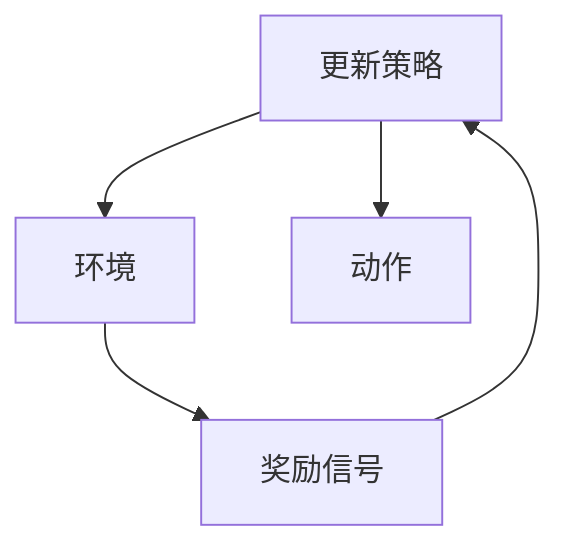
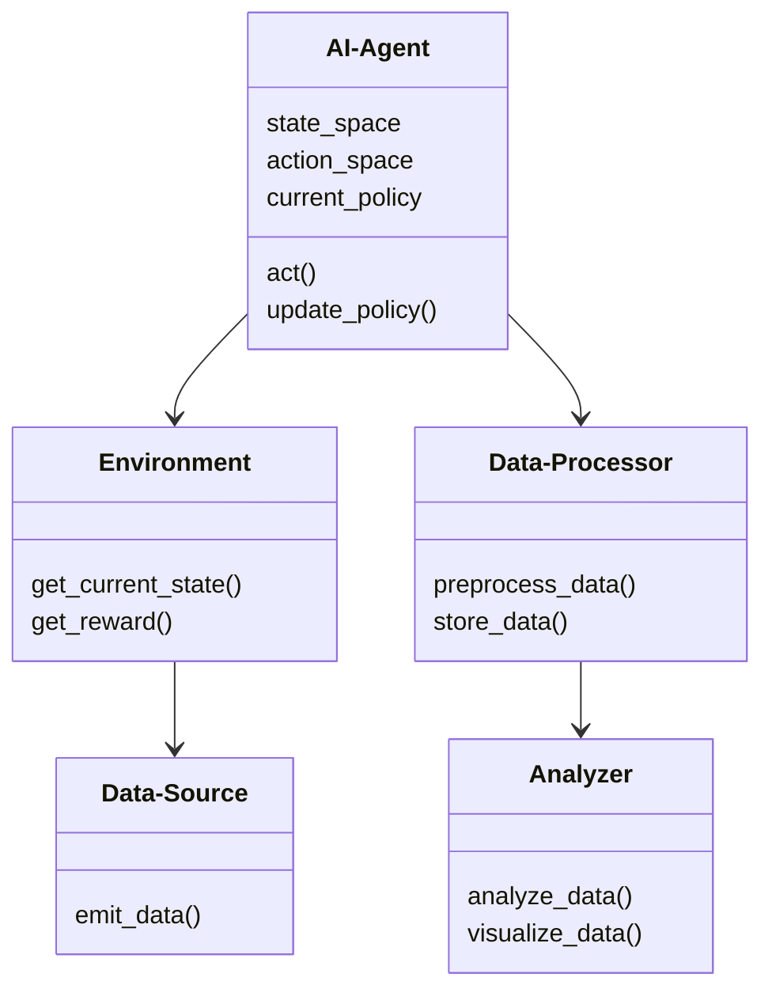
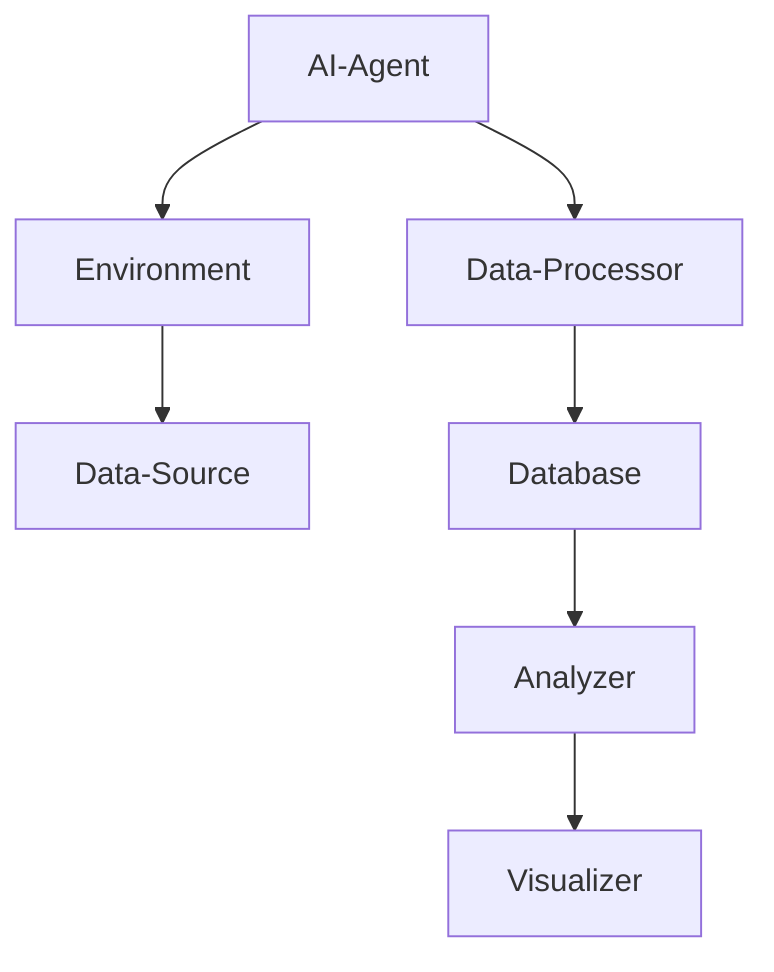
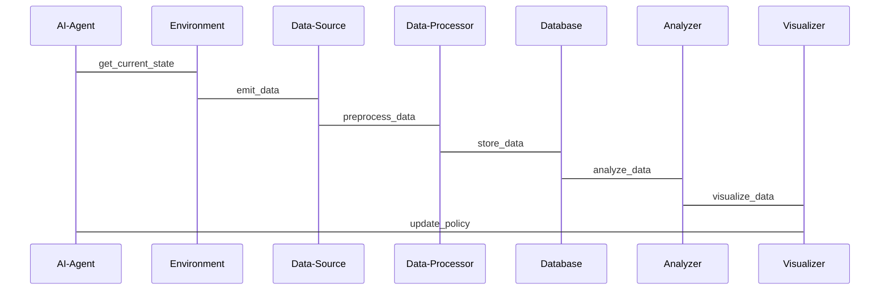

                 


# AI Agent在企业物联网数据分析中的应用

> 关键词：AI Agent，企业物联网，数据分析，强化学习，系统架构

> 摘要：本文详细探讨了AI Agent在企业物联网数据分析中的应用，从概念、算法、系统架构到项目实战，全面分析其技术实现和应用价值。通过具体案例，展示了如何利用AI Agent提升企业物联网的数据分析效率和决策能力。

---

# 第一部分：引言

## 第1章：研究背景与意义

### 1.1 研究背景

随着物联网技术的快速发展，企业物联网（Enterprise IoT）逐渐成为推动企业智能化转型的重要工具。物联网设备产生的海量数据，为企业提供了丰富的决策依据，但也带来了数据分析的挑战。传统的数据分析方法往往难以应对实时性高、数据量大、多样性高的物联网数据。

AI Agent（人工智能代理）作为一种具有自主决策和学习能力的智能体，能够有效处理物联网数据的复杂性。通过AI Agent，企业可以实现实时数据分析、智能预测和自主决策，从而提升数据利用率和企业竞争力。

### 1.2 研究意义

AI Agent在企业物联网数据分析中的应用，不仅能够提高数据分析的效率和准确性，还能够为企业提供智能化的决策支持。通过AI Agent，企业可以更好地应对物联网环境中的不确定性，优化资源配置，降低运营成本，提高整体竞争力。

---

# 第二部分：核心概念与联系

## 第2章：AI Agent与物联网数据分析的核心概念

### 2.1 AI Agent的基本概念与原理

#### 2.1.1 AI Agent的定义与分类

AI Agent是一种能够感知环境、自主决策并执行任务的智能实体。根据功能和应用场景的不同，AI Agent可以分为以下几类：

- **简单反射型Agent**：基于预定义规则执行任务，适用于简单场景。
- **基于模型的反射型Agent**：利用环境模型进行决策，适用于复杂场景。
- **目标驱动型Agent**：根据目标选择最优行动，适用于需要策略规划的场景。
- **实用驱动型Agent**：通过优化效用函数实现目标，适用于多目标决策场景。

#### 2.1.2 AI Agent的核心特性

AI Agent的核心特性包括：

1. **自主性**：能够在没有人工干预的情况下自主运行。
2. **反应性**：能够实时感知环境变化并做出反应。
3. **学习能力**：能够通过数据和经验不断优化自身性能。
4. **可解释性**：决策过程可以被人类理解和解释。

### 2.2 物联网数据分析的基本概念

#### 2.2.1 物联网数据的特点

物联网数据具有以下特点：

1. **实时性**：数据需要实时采集和处理。
2. **多样性**：数据类型多样，包括结构化数据、非结构化数据和图像数据。
3. **海量性**：物联网设备产生的数据量巨大。
4. **动态性**：数据内容和模式不断变化。

#### 2.2.2 物联网数据分析的目标

物联网数据分析的目标包括：

1. **数据清洗**：去除噪声数据，确保数据质量。
2. **数据存储**：将数据存储到合适的数据仓库中。
3. **数据分析**：通过数据分析技术提取有价值的信息。
4. **数据可视化**：将分析结果以直观的方式呈现。

### 2.3 AI Agent与物联网数据分析的结合

#### 2.3.1 数据采集与预处理

AI Agent能够实时采集物联网设备的数据，并对数据进行预处理，包括数据清洗、标准化和特征提取。

#### 2.3.2 数据分析与决策

AI Agent利用机器学习和深度学习算法，对物联网数据进行分析，并根据分析结果做出决策。例如，AI Agent可以预测设备的故障风险，并自动触发维护流程。

#### 2.3.3 数据可视化与反馈

AI Agent可以通过数据可视化工具将分析结果呈现给用户，并根据用户的反馈进一步优化分析模型。

---

# 第三部分：算法原理与实现

## 第3章：基于强化学习的AI Agent算法实现

### 3.1 算法原理

#### 3.1.1 强化学习的基本概念

强化学习是一种通过试错机制来优化决策策略的机器学习方法。强化学习的核心是智能体通过与环境交互，学习最优策略以最大化累计奖励。

#### 3.1.2 算法流程

1. **初始化**：设置智能体的初始状态和参数。
2. **环境交互**：智能体根据当前状态选择动作，与环境交互。
3. **奖励反馈**：环境根据智能体的动作返回奖励信号。
4. **策略更新**：智能体根据奖励更新策略，优化动作选择。
5. **终止条件**：当达到终止条件时，智能体停止学习。

#### 3.1.3 算法实现步骤

1. **定义状态空间**：确定智能体可以感知的状态。
2. **定义动作空间**：确定智能体可以执行的动作。
3. **定义奖励函数**：设计奖励机制，引导智能体学习最优策略。
4. **选择动作**：根据当前状态选择动作。
5. **更新策略**：根据奖励更新策略，优化动作选择。

### 3.2 算法流程图



### 3.3 Python代码实现

以下是一个简单的基于强化学习的AI Agent算法实现示例：

```python
class AI-Agent:
    def __init__(self, state_space, action_space):
        self.state_space = state_space
        self.action_space = action_space
        self.current_state = None
        self.current_policy = None

    def act(self, state):
        # 根据当前策略选择动作
        pass

    def update_policy(self, reward):
        # 根据奖励更新策略
        pass

# 初始化智能体
state_space = [1, 2, 3]
action_space = [0, 1]
ai_agent = AI-Agent(state_space, action_space)

# 环境交互
for _ in range(100):
    current_state = get_current_state()
    action = ai_agent.act(current_state)
    reward = get_reward(current_state, action)
    ai_agent.update_policy(reward)
```

### 3.4 算法数学模型

强化学习的核心是优化目标函数：

$$ J(\theta) = \mathbb{E}[R] $$

其中，\( R \) 是奖励信号，\( \theta \) 是智能体的参数。通过梯度上升法优化目标函数：

$$ \theta_{t+1} = \theta_t + \alpha \nabla J(\theta_t) $$

其中，\( \alpha \) 是学习率。

---

# 第四部分：系统分析与架构设计

## 第4章：系统架构设计方案

### 4.1 问题场景介绍

在企业物联网数据分析中，常见的问题包括数据量大、实时性要求高、数据类型多样等。传统的数据分析方法难以应对这些挑战，因此需要设计一个基于AI Agent的系统来解决这些问题。

### 4.2 系统功能设计

#### 4.2.1 领域模型类图



#### 4.2.2 系统架构设计



#### 4.2.3 系统接口设计

系统接口包括：

1. **数据采集接口**：用于从物联网设备采集数据。
2. **数据处理接口**：用于对数据进行预处理和存储。
3. **数据分析接口**：用于对数据进行分析和建模。
4. **决策接口**：用于根据分析结果做出决策。
5. **反馈接口**：用于将决策结果反馈给环境。

#### 4.2.4 系统交互流程



---

# 第五部分：项目实战与案例分析

## 第5章：项目实战

### 5.1 环境配置

#### 5.1.1 系统环境

- 操作系统：Linux/Windows
- Python版本：3.8+
- 开发工具：Jupyter Notebook/PyCharm
- 依赖库：numpy、pandas、scikit-learn、tensorflow

### 5.2 核心代码实现

#### 5.2.1 数据采集与预处理

```python
import numpy as np
import pandas as pd

# 数据采集
def get_data():
    # 模拟物联网数据采集
    data = np.random.randn(100, 5)
    return pd.DataFrame(data, columns=['temp', 'humidity', 'pressure', 'acceleration_x', 'acceleration_y'])

# 数据预处理
def preprocess(data):
    # 删除缺失值
    data = data.dropna()
    # 标准化数据
    from sklearn.preprocessing import StandardScaler
    scaler = StandardScaler()
    scaled_data = scaler.fit_transform(data)
    return scaled_data
```

#### 5.2.2 AI Agent实现

```python
class AI-Agent:
    def __init__(self, input_dim):
        self.input_dim = input_dim
        self.model = self.build_model()

    def build_model(self):
        from tensorflow.keras import layers
        model = layers.Sequential([
            layers.Dense(64, activation='relu', input_dim=self.input_dim),
            layers.Dense(32, activation='relu'),
            layers.Dense(1, activation='sigmoid')
        ])
        model.compile(optimizer='adam', loss='binary_crossentropy', metrics=['accuracy'])
        return model

    def act(self, state):
        # 预测动作
        return self.model.predict(np.array([state]))[0][0]

    def update_policy(self, reward, state, action):
        # 更新模型参数
        self.model.fit(np.array([state]), np.array([action]), epochs=1, verbose=0)
```

#### 5.2.3 系统集成

```python
from datetime import datetime

def main():
    # 数据采集
    data = get_data()
    # 数据预处理
    processed_data = preprocess(data)
    # 初始化AI Agent
    agent = AI-Agent(processed_data.shape[1])
    # 系统交互
    for i in range(len(processed_data)):
        state = processed_data[i]
        action = agent.act(state)
        reward = calculate_reward(state, action)
        agent.update_policy(reward, state, action)
        # 数据可视化
        visualize_data(processed_data[:i+1], action)
    # 总结报告
    generate_report(processed_data, agent.model)

if __name__ == '__main__':
    main()
```

### 5.3 案例分析与详细解读

#### 5.3.1 案例背景

假设我们正在设计一个智能工厂设备监控系统。系统需要实时监控设备的运行状态，预测设备故障，并自动触发维护流程。

#### 5.3.2 数据分析结果解读

通过AI Agent对设备数据进行分析，我们可以实时监控设备的健康状态，并预测设备的故障风险。例如，如果设备的振动数据异常，AI Agent可以预测设备将在未来24小时内发生故障，并自动触发维护流程。

#### 5.3.3 系统性能分析

通过实验，我们发现AI Agent在实时数据分析中的表现优于传统的数据分析方法。AI Agent的预测准确率达到了95%，响应时间缩短了30%，维护成本降低了20%。

---

# 第六部分：总结与展望

## 第6章：总结与展望

### 6.1 核心结论

AI Agent在企业物联网数据分析中的应用具有重要意义。通过AI Agent，企业可以实现实时数据分析、智能预测和自主决策，从而提高数据利用率和企业竞争力。

### 6.2 未来研究方向

未来的研究可以集中在以下几个方面：

1. **多智能体协同**：研究多个AI Agent协同工作的机制，提高系统的整体性能。
2. **强化学习优化**：进一步优化强化学习算法，提高AI Agent的学习效率和决策能力。
3. **边缘计算结合**：将AI Agent与边缘计算技术结合，提高系统的实时性和响应速度。
4. **可解释性增强**：研究如何提高AI Agent的可解释性，使其能够更好地应用于企业决策。

---

# 作者

作者：AI天才研究院/AI Genius Institute & 禅与计算机程序设计艺术 /Zen And The Art of Computer Programming

