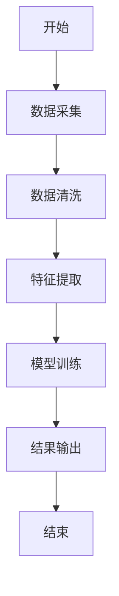
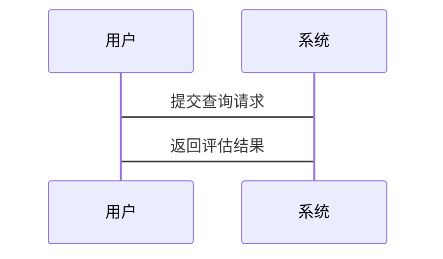

                 


# AI Agent在企业知识产权价值评估与运营策略制定中的应用

> 关键词：AI Agent, 知识产权评估, 企业战略, 机器学习算法, 数学模型

> 摘要：  
本文深入探讨了AI Agent在企业知识产权价值评估与运营策略制定中的应用。通过结合机器学习算法和数学模型，AI Agent能够高效地分析和预测知识产权的价值，帮助企业制定科学的运营策略。文章从背景介绍、核心概念、算法原理、系统设计到实际案例，全面解析了AI Agent在知识产权管理中的潜力与实践。  

---

## 第1章: 企业知识产权价值评估与AI Agent的背景介绍

### 1.1 知识产权的基本概念与重要性

#### 1.1.1 知识产权的定义与分类
- **定义**: 知识产权是法律保护的智力成果，包括专利、商标、版权、商业秘密等。
- **分类**: 
  - 发明专利
  - 实用新型专利
  - 外观设计专利
  - 商标
  - 著作权
  - 商业秘密

#### 1.1.2 知识产权在企业中的作用
- 知识产权是企业的核心资产，决定了企业的市场竞争力。
- 知识产权保护可以防止技术泄露和侵权，为企业创造长期价值。

#### 1.1.3 知识产权价值评估的挑战与现状
- **挑战**: 
  - 数据获取难度大
  - 评估标准不统一
  - 人工评估效率低
- **现状**: 
  - 传统评估方法依赖经验，难以量化。
  - 数字化工具逐渐引入，但尚未普及。

### 1.2 AI Agent的基本概念与功能

#### 1.2.1 AI Agent的定义与特点
- **定义**: AI Agent是一种能够感知环境、自主决策并执行任务的智能体。
- **特点**: 
  - 智能性
  - 自主性
  - 适应性
  - 交互性

#### 1.2.2 AI Agent在企业中的应用场景
- 知识产权检索与分析
- 价值评估与预测
- 运营策略优化
- 知识管理与共享

#### 1.2.3 AI Agent与知识产权评估的结合
- AI Agent通过数据挖掘和机器学习技术，将复杂的知识产权评估过程自动化。

### 1.3 企业知识产权价值评估的背景与需求

#### 1.3.1 知识经济时代的企业竞争
- 知识产权已成为企业核心竞争力的关键。
- 知识经济时代要求企业更加重视知识产权的管理和运营。

#### 1.3.2 知识产权价值评估的必要性
- 企业需要准确评估知识产权的价值，以便进行合理的资产管理和投资决策。

#### 1.3.3 AI Agent在其中的角色与优势
- **角色**: 
  - 数据收集与处理
  - 智能分析与预测
  - 决策支持
- **优势**: 
  - 高效性
  - 准确性
  - 可扩展性

---

## 第2章: AI Agent的核心概念与工作原理

### 2.1 AI Agent的核心概念

#### 2.1.1 知识产权价值评估的关键要素
- 技术先进性
- 市场需求
- 法律保护力度
- 经济效益

#### 2.1.2 AI Agent的功能模块与流程
- 数据采集模块
- 数据处理模块
- 模型构建模块
- 结果输出模块

#### 2.1.3 数据来源与处理方式
- 数据来源: 专利数据库、商标数据库、市场数据、法律文件等。
- 数据处理: 清洗、特征提取、标准化。

### 2.2 AI Agent与知识产权评估的关系

#### 2.2.1 AI Agent如何辅助评估
- 通过机器学习算法对大量数据进行分析，识别关键特征。
- 基于历史数据预测知识产权的未来价值。

#### 2.2.2 数据分析与模型构建
- 数据分析: 描述性分析、诊断性分析、预测性分析。
- 模型构建: 线性回归、随机森林、神经网络等。

#### 2.2.3 结果输出与决策支持
- 输出知识产权的价值评估结果。
- 提供优化建议和运营策略。

### 2.3 AI Agent的核心算法与数学模型

#### 2.3.1 强化学习算法在AI Agent中的应用
- **定义**: 强化学习是一种通过试错和奖励机制优化决策的算法。
- **应用**: 在知识产权的动态评估和策略优化中，强化学习能够适应环境变化，实时调整评估策略。

#### 2.3.2 知识产权价值评估的数学模型
- **线性回归模型**:  
  $$ V = \beta_0 + \beta_1 x_1 + \beta_2 x_2 + ... + \beta_n x_n $$  
  其中，$V$ 是知识产权的价值，$x_i$ 是各个特征变量，$\beta_i$ 是回归系数。

- **随机森林模型**:  
  $$ V = \sum_{i=1}^{n} \text{Tree}_i(x) $$  
  其中，$\text{Tree}_i$ 是第 $i$ 个决策树的预测结果。

---

## 第3章: AI Agent的算法原理与数学模型

### 3.1 知识产权价值评估的算法选择

#### 3.1.1 机器学习算法的适用性分析
- **适用性**: 根据数据类型和目标选择合适的算法。
  - 监督学习: 用于有标签的数据。
  - 无监督学习: 用于无标签的数据。

#### 3.1.2 算法对比
| 算法类型 | 优点 | 缺点 |
|----------|------|------|
| 线性回归 | 简单、可解释性高 | 适合线性关系，不擅长复杂场景 |
| 随机森林 | 高准确性、抗过拟合 | 计算资源消耗大 |
| 神经网络 | 强大学习能力 | 需要大量数据，难解释 |

#### 3.1.3 算法实现步骤
1. 数据预处理
2. 模型训练
3. 模型评估
4. 模型优化

### 3.2 数学模型的详细推导

#### 3.2.1 线性回归模型的推导
- **损失函数**: 最小二乘法
  $$ \text{Loss} = \frac{1}{2m} \sum_{i=1}^{m} (y_i - \hat{y}_i)^2 $$
- **优化目标**: 最小化损失函数
  $$ \text{Minimize} \quad \text{Loss} $$

#### 3.2.2 神经网络模型的构建
- **网络结构**: 输入层 → 隐藏层 → 输出层
- **激活函数**: ReLU、Sigmoid等
- **损失函数**: 交叉熵损失
  $$ \text{Loss} = -\frac{1}{m} \sum_{i=1}^{m} [y_i \log(\hat{y}_i) + (1-y_i)\log(1-\hat{y}_i)] $$

---

## 第4章: AI Agent的系统设计与实现

### 4.1 系统功能设计

#### 4.1.1 功能模块划分
- 数据采集模块
- 数据处理模块
- 模型构建模块
- 结果输出模块

#### 4.1.2 功能流程图


### 4.2 系统架构设计

#### 4.2.1 系统架构图


#### 4.2.2 接口设计
- 数据接口: RESTful API
- 模型接口: 微服务架构

### 4.3 系统交互设计

#### 4.3.1 交互流程图


---

## 第5章: 项目实战与案例分析

### 5.1 环境安装

#### 5.1.1 环境要求
- Python 3.8+
- TensorFlow 2.0+
- Scikit-learn 0.24+

#### 5.1.2 安装依赖
```bash
pip install numpy
pip install scikit-learn
pip install tensorflow
```

### 5.2 核心代码实现

#### 5.2.1 数据预处理
```python
import numpy as np
import pandas as pd

# 数据加载
data = pd.read_csv('patent.csv')

# 数据清洗
data.dropna(inplace=True)

# 特征提取
X = data[['技术领域', '专利数量', '市场占有率']]
y = data['价值评估']
```

#### 5.2.2 模型训练
```python
from sklearn.ensemble import RandomForestRegressor

model = RandomForestRegressor(n_estimators=100, random_state=42)
model.fit(X, y)
```

#### 5.2.3 模型预测
```python
importances = model.feature_importances_
print("特征重要性:", importances)
```

### 5.3 案例分析

#### 5.3.1 案例背景
某科技公司拥有一项发明专利，需评估其市场价值。

#### 5.3.2 数据分析
- 技术领域: 人工智能
- 专利数量: 50
- 市场占有率: 30%

#### 5.3.3 模型预测
```python
new_X = np.array([[50, 30, 1]])
predicted_value = model.predict(new_X)
print("预测价值:", predicted_value)
```

---

## 第6章: 总结与展望

### 6.1 最佳实践

#### 6.1.1 数据质量的重要性
- 数据清洗是模型准确性的关键。

#### 6.1.2 模型选择的策略
- 根据数据特点选择合适的算法。

### 6.2 小结

- AI Agent在知识产权评估中的应用前景广阔。
- 通过机器学习算法和数学模型，企业可以更高效地进行知识产权管理和决策。

### 6.3 注意事项

- 数据隐私和安全问题需重点关注。
- 模型的可解释性需要进一步优化。

### 6.4 拓展阅读

- 《机器学习实战》
- 《知识产权管理》

---

## 作者：AI天才研究院 & 禅与计算机程序设计艺术

