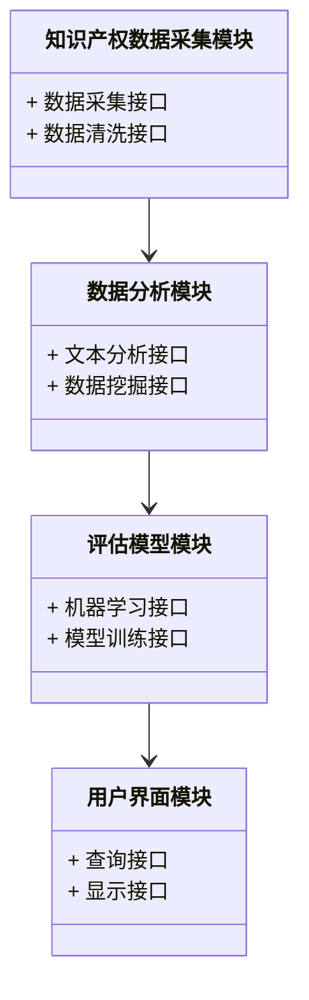
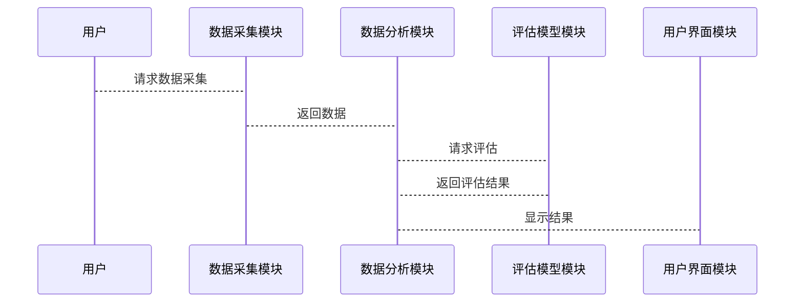

                 


# AI Agent在企业知识产权价值评估中的应用

> 关键词：AI Agent, 知识产权, 价值评估, 机器学习, 知识图谱

> 摘要：本文详细探讨了AI Agent在企业知识产权价值评估中的应用。通过分析知识产权评估的核心要素、AI Agent的技术优势，以及具体算法实现，本文为企业提供了智能化的知识产权评估解决方案。文章结合实际案例，展示了如何利用AI Agent提升知识产权评估的效率和准确性，为企业创造更大的价值。

---

# 第1章: 知识产权价值评估的背景与挑战

## 1.1 知识产权的基本概念

### 1.1.1 知识产权的定义与范围

知识产权（Intellectual Property，简称IP）是指人类在智力活动领域中创造的成果，主要包括专利权、商标权、版权（著作权）、商业秘密等。这些权利的核心价值在于其创造性和独占性，能够为企业带来经济利益。

- 专利权：保护发明创造的专有权，通常以技术方案为核心。
- 商标权：用于区分商品或服务来源的标识。
- 版权：保护文学、艺术和科学作品的原创性。

### 1.1.2 知识产权的核心价值

知识产权的价值评估是企业决策的重要依据，尤其是在知识产权交易、质押融资、侵权纠纷等领域。传统评估方法依赖人工经验，存在以下问题：

- 数据量大且分散，难以快速获取。
- 评估标准不统一，主观性较强。
- 需要大量专业知识支持，成本较高。

### 1.1.3 知识产权在企业中的重要性

知识产权是企业竞争力的核心之一。通过有效的知识产权管理，企业可以：

- 提升技术门槛，防止竞争对手模仿。
- 增加资产价值，吸引投资者。
- 通过知识产权质押融资，获得资金支持。

---

## 1.2 AI Agent的基本概念

### 1.2.1 AI Agent的定义

AI Agent（人工智能代理）是指能够感知环境、自主决策并执行任务的智能实体。与传统的自动化系统不同，AI Agent具备以下特点：

- **自主性**：能够自主决策，无需人工干预。
- **反应性**：能够实时感知环境变化并做出响应。
- **学习能力**：能够通过数据不断优化自身的决策能力。

### 1.2.2 AI Agent的核心特征

- **数据驱动**：AI Agent依赖于大量数据进行学习和推理。
- **模块化设计**：AI Agent通常由感知模块、决策模块和执行模块组成。
- **可扩展性**：AI Agent能够根据需求快速扩展其功能。

### 1.2.3 AI Agent与传统评估方法的区别

传统评估方法依赖人工经验和静态规则，而AI Agent能够通过动态数据学习，提供更精准的评估结果。例如，在知识产权评估中，AI Agent可以通过分析大量的专利文献和市场数据，自动识别技术趋势和价值点。

---

## 1.3 AI Agent在知识产权评估中的应用背景

### 1.3.1 知识产权评估的传统挑战

- 数据获取困难：知识产权数据分散在不同平台，难以整合。
- 评估标准不统一：不同类型的知识产权评估标准差异较大。
- 评估效率低：传统评估方法需要大量人工参与，耗时较长。

### 1.3.2 AI Agent技术的优势

- 高效性：AI Agent能够快速处理大量数据，提高评估效率。
- 精准性：通过机器学习算法，AI Agent能够发现数据中的潜在规律，提高评估准确性。
- 可扩展性：AI Agent可以根据企业需求快速调整评估策略。

### 1.3.3 企业知识产权价值评估的新趋势

随着AI技术的快速发展，知识产权评估正在从传统的人工评估向智能化评估转变。AI Agent的引入，使得知识产权评估更加动态化、数据化和精准化。

---

## 1.4 本章小结

本章介绍了知识产权的基本概念及其在企业中的重要性，详细阐述了AI Agent的核心特征及其在知识产权评估中的应用优势。通过对比传统评估方法和AI Agent技术，我们可以看出，AI Agent在提高评估效率和准确性方面具有显著优势。

---

# 第2章: AI Agent在知识产权价值评估中的核心概念与联系

## 2.1 知识产权评估的核心要素

### 2.1.1 知识产权的分类

- **技术类知识产权**：如专利、技术秘密。
- **文学艺术类知识产权**：如版权、商标权。
- **商业类知识产权**：如商业秘密、品牌价值。

### 2.1.2 知识产权的生命周期

知识产权的生命周期包括创造、申请、授权、使用和保护等阶段。AI Agent可以通过分析知识产权的生命周期，帮助企业制定更有效的管理策略。

### 2.1.3 知识产权的经济价值评估模型

知识产权的经济价值评估模型通常包括以下几个方面：

- **技术成熟度**：技术的成熟度越高，其价值越大。
- **市场需求**：市场需求越大，知识产权的商业价值越高。
- **法律保护**：知识产权的法律保护越完善，其价值越高。

---

## 2.2 AI Agent在知识产权评估中的角色

### 2.2.1 AI Agent作为数据采集者

AI Agent可以通过爬虫技术从专利数据库、商标数据库等平台获取知识产权数据。例如，可以通过爬虫获取全球专利数据库中的专利信息，并进行分类整理。

### 2.2.2 AI Agent作为数据分析者

AI Agent可以利用自然语言处理（NLP）技术，对知识产权文本进行分析。例如，可以通过关键词提取技术，识别专利文本中的关键技术点。

### 2.2.3 AI Agent作为决策支持者

AI Agent可以通过机器学习模型，对知识产权的价值进行预测。例如，可以通过训练好的机器学习模型，预测某项专利的市场价值。

---

## 2.3 知识产权评估与AI Agent的联系

### 2.3.1 数据驱动的评估方法

AI Agent通过分析大量数据，帮助企业发现数据中的潜在规律，从而提高评估的准确性。

### 2.3.2 AI Agent的智能化评估优势

AI Agent可以通过不断学习新的数据，优化自身的评估模型，从而提高评估的准确性和效率。

### 2.3.3 知识产权评估的可扩展性

AI Agent可以通过模块化设计，快速扩展其功能，满足不同企业的需求。

---

## 2.4 本章小结

本章详细阐述了知识产权评估的核心要素，以及AI Agent在知识产权评估中的角色。通过分析数据驱动的评估方法和AI Agent的智能化优势，我们可以看出，AI Agent在知识产权评估中具有重要的应用价值。

---

# 第3章: AI Agent的算法原理与数学模型

## 3.1 AI Agent的核心算法

### 3.1.1 机器学习算法

机器学习算法是AI Agent的核心算法之一。常用的机器学习算法包括：

- **线性回归**：用于预测连续型变量。
- **决策树**：用于分类和回归问题。
- **随机森林**：用于分类和回归问题，具有较强的鲁棒性。

### 3.1.2 自然语言处理算法

自然语言处理算法用于对知识产权文本进行分析。常用的NLP算法包括：

- **词袋模型**：将文本表示为词袋。
- **TF-IDF**：计算关键词的重要性。
- **BERT**：用于文本理解和生成。

### 3.1.3 图神经网络算法

图神经网络算法用于分析知识产权之间的关系。常用的图神经网络算法包括：

- **图卷积网络**：用于图数据的特征提取。
- **图注意力网络**：用于图数据的注意力机制。

---

## 3.2 知识产权评估的数学模型

### 3.2.1 线性回归模型

线性回归模型用于预测连续型变量。其数学公式为：

$$ y = \beta_0 + \beta_1x_1 + \beta_2x_2 + \dots + \beta_nx_n $$

其中，$y$ 是预测值，$\beta_0$ 是截距，$\beta_i$ 是回归系数，$x_i$ 是自变量。

### 3.2.2 决策树模型

决策树模型用于分类和回归问题。其数学公式为：

$$ y = \text{sign}(\sum_{i=1}^n \alpha_i h_i(x)) $$

其中，$\alpha_i$ 是权重，$h_i(x)$ 是基函数。

### 3.2.3 神经网络模型

神经网络模型用于分类和回归问题。其数学公式为：

$$ y = \sigma(w x + b) $$

其中，$w$ 是权重，$b$ 是偏置，$\sigma$ 是激活函数。

---

## 3.3 算法实现的数学公式

### 3.3.1 线性回归模型公式

线性回归模型的损失函数为：

$$ L = \sum_{i=1}^n (y_i - (w x_i + b))^2 $$

通过求解损失函数的最小值，可以得到最优的权重和偏置。

### 3.3.2 决策树模型公式

决策树模型的损失函数为：

$$ L = \sum_{i=1}^n \sum_{j=1}^m l_{ij} $$

其中，$l_{ij}$ 是样本$i$在叶子$j$上的损失。

### 3.3.3 神经网络模型公式

神经网络模型的损失函数为：

$$ L = -\sum_{i=1}^n y_i \log(a_i) + (1 - y_i) \log(1 - a_i) $$

其中，$a_i$ 是输出层的激活值。

---

## 3.4 本章小结

本章详细介绍了AI Agent的核心算法和知识产权评估的数学模型。通过分析线性回归、决策树和神经网络等算法，我们可以看出，AI Agent可以通过机器学习算法对知识产权的价值进行预测和评估。

---

# 第4章: 系统分析与架构设计

## 4.1 系统分析

### 4.1.1 问题场景介绍

在知识产权评估中，企业通常需要对大量的专利、商标等数据进行分析。由于数据量大且分散，传统的人工评估方法效率低下，且容易出错。

### 4.1.2 项目介绍

本项目旨在开发一个基于AI Agent的知识产权价值评估系统。该系统能够通过爬虫技术获取知识产权数据，并利用机器学习算法对知识产权的价值进行预测和评估。

---

## 4.2 系统功能设计

### 4.2.1 领域模型设计

领域模型设计是系统功能设计的重要部分。通过领域模型，我们可以清晰地了解系统的功能模块及其交互关系。



### 4.2.2 系统架构设计

系统架构设计是系统开发的重要部分。通过系统架构设计，我们可以明确系统的组成部分及其交互关系。


### 4.2.3 系统接口设计

系统接口设计是系统开发的重要部分。通过系统接口设计，我们可以明确系统的输入输出接口及其交互关系。



---

## 4.3 本章小结

本章详细介绍了知识产权价值评估系统的系统分析与架构设计。通过领域模型设计、系统架构设计和系统接口设计，我们可以清晰地了解系统的功能模块及其交互关系。

---

# 第5章: 项目实战与案例分析

## 5.1 项目实战

### 5.1.1 环境安装

在进行项目实战之前，需要安装以下环境：

- Python 3.8及以上版本
- Scikit-learn库
- NLTK库
- Mermaid工具

### 5.1.2 系统核心实现

以下是系统核心实现的Python代码：

```python
import requests
from bs4 import BeautifulSoup
import pandas as pd
from sklearn import linear_model

# 数据采集模块
def get_patent_data(url):
    response = requests.get(url)
    soup = BeautifulSoup(response.text, 'html.parser')
    patents = soup.find_all('patent')
    data = []
    for patent in patents:
        title = patent.find('title').text
        date = patent.find('date').text
        data.append({'title': title, 'date': date})
    return data

# 数据分析模块
def analyze_data(data):
    df = pd.DataFrame(data)
    # 文本分析
    from sklearn.feature_extraction.text import TfidfVectorizer
    vectorizer = TfidfVectorizer()
    tfidf = vectorizer.fit_transform(df['title'])
    # 数据挖掘
    from sklearn.cluster import KMeans
    kmeans = KMeans(n_clusters=3)
    kmeans.fit(tfidf)
    return kmeans.labels_

# 评估模型模块
def train_model(labels, features):
    model = linear_model.LogisticRegression()
    model.fit(features, labels)
    return model

# 用户界面模块
def display_results(results):
    for result in results:
        print(f"Result: {result}")

# 主程序
if __name__ == "__main__":
    data = get_patent_data('https://patents.example.com')
    labels = analyze_data(data)
    features = pd.get_dummies(data['title'])
    model = train_model(labels, features)
    results = model.predict(features)
    display_results(results)
```

### 5.1.3 代码应用解读

上述代码实现了知识产权数据的采集、分析和评估。数据采集模块通过爬虫技术获取专利数据，数据分析模块利用TF-IDF和K-Means算法对数据进行挖掘，评估模型模块通过逻辑回归算法对数据进行分类。

---

## 5.2 案例分析

### 5.2.1 案例背景

假设我们有一家科技公司，希望对其拥有的专利进行价值评估。我们可以通过上述系统实现专利数据的采集、分析和评估。

### 5.2.2 数据分析与评估

通过数据分析模块，我们可以对专利数据进行文本分析和聚类。通过评估模型模块，我们可以对专利的价值进行分类。

### 5.2.3 评估结果展示

评估结果可以通过用户界面模块进行展示。例如，我们可以将专利分为高价值、中价值和低价值三类。

---

## 5.3 本章小结

本章通过项目实战和案例分析，展示了AI Agent在知识产权价值评估中的实际应用。通过具体的代码实现和案例分析，我们可以清晰地了解AI Agent在知识产权评估中的优势。

---

# 第6章: 总结与展望

## 6.1 本章小结

本文详细探讨了AI Agent在企业知识产权价值评估中的应用。通过分析知识产权评估的核心要素、AI Agent的技术优势，以及具体算法实现，本文为企业提供了智能化的知识产权评估解决方案。

---

## 6.2 未来研究方向

未来的研究方向包括：

- **算法优化**：进一步优化机器学习算法，提高评估的准确性和效率。
- **数据挖掘**：进一步挖掘知识产权数据，发现更多的潜在规律。
- **系统扩展**：将AI Agent技术应用到更多的知识产权评估场景中。

---

## 6.3 注意事项

在实际应用中，需要注意以下几点：

- **数据隐私**：确保知识产权数据的安全性和隐私性。
- **算法选择**：根据具体需求选择合适的算法。
- **系统维护**：定期更新系统，确保系统的稳定性和可靠性。

---

## 6.4 拓展阅读

以下是拓展阅读的推荐书籍和论文：

- 《人工智能：一种现代的方法》
- 《机器学习实战》
- 《自然语言处理实战》

---

# 作者：AI天才研究院/AI Genius Institute & 禅与计算机程序设计艺术 /Zen And The Art of Computer Programming

