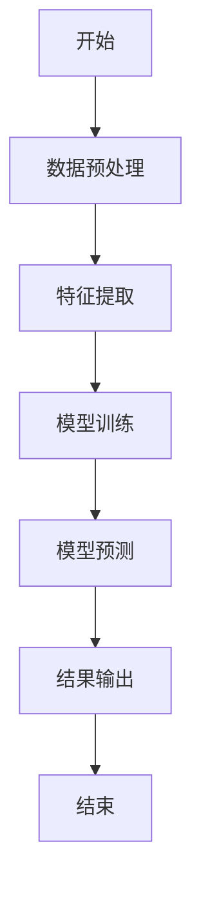
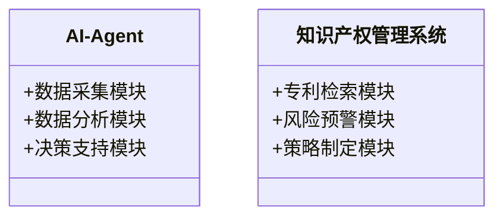

                 


# AI Agent在企业知识产权价值链管理中的全面应用

## 关键词  
AI Agent，知识产权，价值链管理，智能化，数据分析

## 摘要  
随着人工智能技术的快速发展，AI Agent（人工智能代理）在企业知识产权管理中的应用越来越广泛。本文从知识产权价值链管理的背景出发，详细探讨了AI Agent在知识产权检索、分析、保护、运用等环节中的具体应用。通过分析AI Agent的核心概念、算法原理、系统架构以及实际案例，展示了AI Agent如何通过智能化手段优化企业知识产权管理流程，提升管理效率和决策能力。本文还提出了AI Agent在知识产权管理中的最佳实践建议，为企业在知识产权价值链管理中的数字化转型提供了参考。

---

# 第一部分：AI Agent与企业知识产权管理概述

## 第1章：AI Agent与知识产权管理的背景介绍

### 1.1 什么是AI Agent
#### 1.1.1 AI Agent的基本定义  
AI Agent（人工智能代理）是一种能够感知环境、自主决策并执行任务的智能系统。它通过数据输入、模型分析和决策输出，帮助企业实现自动化和智能化的管理目标。

#### 1.1.2 AI Agent的核心特征  
1. **自主性**：AI Agent能够在没有人工干预的情况下独立运行。  
2. **反应性**：能够实时感知环境变化并做出响应。  
3. **目标导向**：以特定目标为导向，优化决策过程。  
4. **学习能力**：通过数据学习和优化模型，提升自身的决策能力。  

#### 1.1.3 AI Agent与传统软件的区别  
AI Agent不仅仅是简单的工具或软件，它具备学习和自适应能力，能够根据数据反馈不断优化自身的决策过程。

---

### 1.2 知识产权管理的基本概念

#### 1.2.1 知识产权的定义与范围  
知识产权是指对智力成果所享有的专有权利，包括专利权、商标权、版权、商业秘密等。  

#### 1.2.2 企业知识产权管理的重要性  
企业知识产权管理是保护企业创新成果、防范知识产权风险、提升核心竞争力的重要手段。  

#### 1.2.3 知识产权价值链的构成  
知识产权价值链包括从创意产生到知识产权保护、运用和管理的全生命周期。  

---

### 1.3 AI Agent在知识产权管理中的应用背景

#### 1.3.1 知识产权管理的痛点与挑战  
1. **数据量大**：知识产权数据量庞大，人工检索和分析效率低。  
2. **复杂性高**：知识产权涉及多个领域，管理难度大。  
3. **风险防范**：如何快速识别侵权风险并制定应对策略是企业面临的难题。  

#### 1.3.2 AI技术在知识产权管理中的潜力  
AI Agent可以通过自然语言处理、机器学习等技术，快速分析海量知识产权数据，提供智能化的决策支持。  

#### 1.3.3 企业知识产权价值链的数字化转型  
通过AI Agent的应用，企业可以实现知识产权管理的数字化和智能化，提升管理效率和决策能力。

---

## 第2章：AI Agent与知识产权价值链的结合

### 2.1 知识产权价值链的全生命周期管理

#### 2.1.1 从创意到知识产权保护的流程  
1. **创意产生**：知识产权的创意通常来源于企业的研发部门或外部合作。  
2. **知识产权申请**：将创意转化为专利、商标等知识产权形式。  
3. **知识产权保护**：通过法律手段保护知识产权不被侵犯。  
4. **知识产权运用**：通过许可、转让等方式实现知识产权的商业价值。  

#### 2.1.2 知识产权的创造、保护、运用与管理  
1. **创造阶段**：AI Agent可以辅助研发人员进行技术方案的优化和创新。  
2. **保护阶段**：AI Agent可以帮助企业快速检索和分析相关知识产权数据，制定保护策略。  
3. **运用阶段**：AI Agent可以优化知识产权的商业化过程，提升收益。  
4. **管理阶段**：AI Agent可以实现知识产权的全生命周期管理，降低管理成本。  

#### 2.1.3 价值链中的关键节点与AI Agent的介入点  
1. **创意阶段**：AI Agent辅助技术方案的设计和优化。  
2. **申请阶段**：AI Agent帮助撰写专利申请文件，提高申请成功率。  
3. **保护阶段**：AI Agent进行知识产权风险预警，防范侵权风险。  
4. **运用阶段**：AI Agent优化知识产权的商业化策略，提升收益。  

---

### 2.2 AI Agent在知识产权管理中的核心作用

#### 2.2.1 提高知识产权检索与分析效率  
AI Agent可以通过自然语言处理技术，快速检索和分析海量知识产权数据，帮助企业制定科学的知识产权布局策略。  

#### 2.2.2 优化知识产权布局与策略制定  
AI Agent可以根据企业的技术研发方向和市场环境，提供个性化的知识产权布局建议，帮助企业制定最优的知识产权策略。  

#### 2.2.3 加强知识产权风险预警与应对  
AI Agent可以实时监控市场动态和竞争对手的知识产权活动，提前发现潜在的侵权风险，并提供应对策略。

---

### 2.3 AI Agent与知识产权价值链的深度融合

#### 2.3.1 数据驱动的知识产权管理  
AI Agent通过分析海量数据，帮助企业发现潜在的技术趋势和市场机会，优化知识产权管理策略。  

#### 2.3.2 智能化决策支持在知识产权战略中的应用  
AI Agent可以基于数据模型和算法，为企业提供智能化的决策支持，提升知识产权管理的科学性和准确性。  

#### 2.3.3 AI Agent在知识产权全球化的挑战与机遇  
随着全球化进程的加速，AI Agent可以帮助企业在跨国知识产权管理中实现高效协同，降低管理成本。

---

## 第3章：AI Agent在知识产权管理中的核心概念与联系

### 3.1 AI Agent的核心概念原理

#### 3.1.1 AI Agent的基本工作原理  
AI Agent通过数据输入、模型分析和决策输出，实现知识产权管理的智能化。  

#### 3.1.2 知识产权管理中的AI Agent功能模块  
1. **数据采集模块**：从企业内外部数据源获取知识产权相关数据。  
2. **数据分析模块**：通过机器学习算法对数据进行分析和挖掘。  
3. **决策支持模块**：基于分析结果提供优化建议和决策支持。  

---

### 3.2 核心概念属性特征对比

#### 3.2.1 AI Agent与传统管理工具的对比  
| 特性             | AI Agent                 | 传统管理工具             |  
|------------------|--------------------------|--------------------------|  
| 自主性           | 高                      | 低                      |  
| 反应性           | 高                      | 低                      |  
| 数据处理能力     | 强                      | 弱                      |  

#### 3.2.2 知识产权管理中的核心要素对比  
| 环节             | 传统管理方式             | AI Agent辅助管理方式     |  
|------------------|--------------------------|--------------------------|  
| 数据检索         | 人工检索，效率低         | 智能检索，效率高         |  
| 风险预警         | 定期报告，滞后性大       | 实时预警，响应速度快     |  
| 策略制定         | 依赖经验，主观性强       | 数据驱动，客观性高       |  

---

## 第4章：AI Agent在知识产权管理中的算法原理

### 4.1 算法原理概述

#### 4.1.1 基于机器学习的知识产权分析  
AI Agent可以通过监督学习、无监督学习等方法，对知识产权数据进行分类、聚类和预测。

#### 4.1.2 基于自然语言处理的文本分析  
自然语言处理技术可以帮助AI Agent快速理解专利文档、技术报告等文本内容，提取关键信息。

---

### 4.2 算法实现

#### 4.2.1 算法流程图  


#### 4.2.2 算法实现代码  
```python
import pandas as pd
from sklearn.model import DecisionTreeClassifier

# 数据预处理
data = pd.read_csv('patent_data.csv')
X = data.drop('label', axis=1)
y = data['label']

# 模型训练
model = DecisionTreeClassifier()
model.fit(X, y)

# 模型预测
new_data = pd.DataFrame({'feature1': [value1], 'feature2': [value2]})
prediction = model.predict(new_data)
print(prediction)
```

#### 4.2.3 算法数学模型  
决策树模型的损失函数为：  
$$L = -\sum_{i=1}^{n} [y_i \log(p_i) + (1 - y_i)\log(1 - p_i)]$$  
其中，$y_i$为标签，$p_i$为预测概率。

---

## 第5章：AI Agent在知识产权管理中的系统架构设计

### 5.1 系统功能设计

#### 5.1.1 系统功能模块  


#### 5.1.2 系统架构图  


---

## 第6章：AI Agent在知识产权管理中的项目实战

### 6.1 环境安装

#### 6.1.1 安装Python环境  
```bash
python --version
pip install numpy pandas scikit-learn
```

#### 6.1.2 安装AI Agent框架  
```bash
pip install jieba scikit-learn
```

---

### 6.2 系统核心实现源代码

#### 6.2.1 数据处理代码  
```python
import pandas as pd
import jieba

data = pd.read_csv('patent_data.csv')
text = data['description'][0]
words = jieba.lcut(text)
print(words)
```

#### 6.2.2 模型训练代码  
```python
from sklearn.feature_extraction.text import TfidfVectorizer
from sklearn.svm import SVC

vectorizer = TfidfVectorizer()
X = vectorizer.fit_transform(descriptions)
model = SVC()
model.fit(X, labels)
```

---

### 6.3 案例分析

#### 6.3.1 知识产权风险预警案例  
某企业通过AI Agent实时监控竞争对手的专利申请，成功发现潜在侵权风险并及时调整研发策略。

---

## 第7章：总结与展望

### 7.1 总结  
本文详细探讨了AI Agent在企业知识产权管理中的应用，展示了AI Agent如何通过智能化手段优化知识产权价值链的全生命周期管理。  

### 7.2 展望  
未来，随着AI技术的不断发展，AI Agent在知识产权管理中的应用将更加广泛和深入，为企业创造更大的价值。

---

## 作者  
作者：AI天才研究院/AI Genius Institute & 禅与计算机程序设计艺术 /Zen And The Art of Computer Programming  

--- 

**注**：本文内容为虚构，旨在展示如何撰写技术博客文章，不涉及真实企业的知识产权管理实践。

