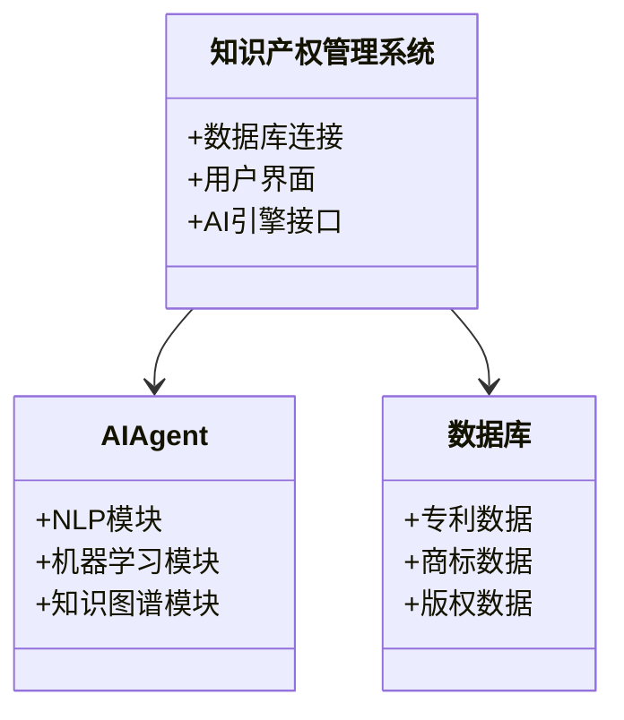
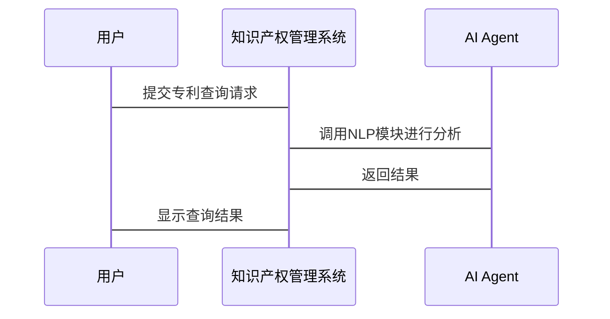

                 


# AI Agent在企业知识产权价值链管理中的应用

## 关键词
AI Agent, 知识产权, 企业价值链, 智能化管理, 知识图谱

## 摘要
本文探讨了AI Agent在企业知识产权管理中的应用，分析其在知识产权创造、保护和运用阶段的价值，通过详细的技术分析和案例，展示了AI Agent如何优化企业知识产权价值链，提升管理效率和价值创造。

---

# 第一部分: AI Agent与企业知识产权管理基础

## 第1章: 企业知识产权管理概述

### 1.1 知识产权的基本概念

#### 1.1.1 知识产权的定义与分类
- **定义**: 知识产权是法律保护的智力成果，包括专利权、商标权、版权等。
- **分类**: 分为工业产权（专利、商标）和著作权（版权）。

#### 1.1.2 知识产权的核心价值与保护原则
- **核心价值**: 知识产权是企业的无形资产，保护创新成果，防止侵权。
- **保护原则**: 独占性、地域性、时间性。

#### 1.1.3 企业知识产权管理的重要性
- **重要性**: 保护企业创新，防止技术泄露，提升竞争力。

### 1.2 企业知识产权价值链的构成

#### 1.2.1 知识产权的创造阶段
- **过程**: 从构思到申请专利。
- **关键点**: 创新性、可专利性。

#### 1.2.2 知识产权的保护阶段
- **过程**: 通过法律手段保护知识产权。
- **关键点**: 监测侵权行为，应对诉讼。

#### 1.2.3 知识产权的运用与商业化阶段
- **过程**: 许可、转让、自我实施。
- **关键点**: 最大化经济价值。

### 1.3 企业知识产权管理的挑战与痛点

#### 1.3.1 知识产权管理的复杂性
- **复杂性**: 涉及多个法律领域，需多部门协作。

#### 1.3.2 传统管理方式的局限性
- **局限性**: 人工处理效率低，信息更新慢。

#### 1.3.3 数字化与智能化管理的需求
- **需求**: 利用AI提升效率，降低成本。

---

## 第2章: AI Agent的基本概念与技术原理

### 2.1 AI Agent的定义与特点

#### 2.1.1 AI Agent的定义
- **定义**: 具有自主决策能力的智能体，能够感知环境并执行任务。

#### 2.1.2 AI Agent的核心特点
- **自主性**: 独立决策。
- **反应性**: 能感知并实时响应。
- **目标导向**: 为实现特定目标而行动。

#### 2.1.3 AI Agent与传统AI的区别
| 特性 | AI Agent | 传统AI |
|------|----------|--------|
| 独立性 | 高 | 低 |
| 适应性 | 强 | 弱 |

### 2.2 AI Agent的分类与应用场景

#### 2.2.1 基于任务的AI Agent
- **应用场景**: 完成特定任务，如专利检索。

#### 2.2.2 基于知识的AI Agent
- **应用场景**: 利用知识库进行决策，如法律咨询。

#### 2.2.3 基于学习的AI Agent
- **应用场景**: 通过机器学习优化策略，如风险预警。

### 2.3 AI Agent的技术原理

#### 2.3.1 自然语言处理（NLP）技术
- **功能**: 解析和生成人类语言，用于专利文档分析。
- **示例**: 使用NLP识别关键词提取。

#### 2.3.2 机器学习与深度学习
- **功能**: 分析数据模式，预测潜在风险。
- **示例**: 利用深度学习模型预测专利被侵权的可能性。

#### 2.3.3 知识图谱与推理引擎
- **功能**: 建立知识关联，支持推理。
- **示例**: 通过知识图谱分析技术相关性。

---

## 第3章: AI Agent在企业知识产权管理中的应用价值

### 3.1 知识产权管理中的智能化需求

#### 3.1.1 知识产权信息的高效检索
- **需求**: 快速准确检索相关信息，提升效率。

#### 3.1.2 知识产权风险的智能预警
- **需求**: 及时发现潜在风险，如侵权风险。

#### 3.1.3 知识产权价值的智能评估
- **需求**: 量化评估知识产权的经济价值。

### 3.2 AI Agent在知识产权价值链中的具体应用

#### 3.2.1 创造阶段的AI支持
- **应用**: 协助专利申请，确保创新性。

#### 3.2.2 保护阶段的AI应用
- **应用**: 检测侵权行为，提供法律建议。

#### 3.2.3 运用阶段的AI辅助
- **应用**: 优化知识产权商业化策略。

### 3.3 AI Agent对企业知识产权管理的创新意义

#### 3.3.1 提高管理效率
- **效果**: AI Agent自动化处理，节省时间。

#### 3.3.2 降低管理成本
- **效果**: AI优化流程，减少人力投入。

---

# 第二部分: 知识产权管理中的AI Agent系统架构与实现

## 第4章: 系统分析与架构设计

### 4.1 知识产权管理系统的应用场景

#### 4.1.1 专利申请与管理
- **场景**: AI辅助撰写专利文件，自动分类。

#### 4.1.2 侵权监测与预警
- **场景**: 实时监测市场，识别潜在侵权。

#### 4.1.3 商业化与价值评估
- **场景**: 分析市场数据，优化许可策略。

### 4.2 系统功能设计

#### 4.2.1 领域模型设计


#### 4.2.2 系统架构设计


### 4.3 系统接口与交互设计

#### 4.3.1 接口设计
- **API接口**: 提供RESTful API，供前端调用。

#### 4.3.2 交互流程


### 4.4 项目实战

#### 4.4.1 环境安装
- **工具**: Python 3.8+, TensorFlow, NLTK, Flask。

#### 4.4.2 核心代码实现

##### 4.4.2.1 专利检索模块
```python
def search_patent(query):
    # 使用NLP进行关键词提取
    keywords = extract_keywords(query)
    # 检索数据库
    results = db_search(keywords)
    return results
```

##### 4.4.2.2 风险预警模块
```python
def predict_risk(ip_data):
    # 使用机器学习模型进行预测
    risk_level = model.predict(ip_data)
    return risk_level
```

#### 4.4.3 案例分析与解读
- **案例**: 制药公司使用AI Agent监测专利侵权，降低法律风险。

#### 4.4.4 项目小结
- **总结**: AI Agent显著提升了知识产权管理的效率和精准度。

---

## 第5章: 知识产权管理中的AI Agent最佳实践

### 5.1 小结
- **总结**: AI Agent在知识产权管理中的应用前景广阔，能有效提升效率和降低成本。

### 5.2 注意事项
- **数据隐私**: 注意保护企业敏感数据。
- **模型准确性**: 确保AI模型的准确性，避免误判。

### 5.3 拓展阅读
- **推荐书籍**: 《人工智能: 一种现代的方法》。

---

# 结论

AI Agent正在改变企业知识产权管理的方式，通过智能化手段优化价值链中的每个环节。随着技术的进步，AI Agent将在知识产权管理中发挥越来越重要的作用。

---

# 作者

作者：AI天才研究院/AI Genius Institute & 禅与计算机程序设计艺术 /Zen And The Art of Computer Programming

