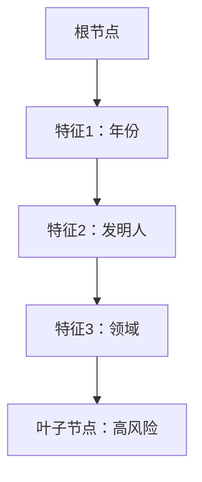
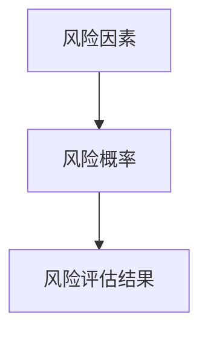
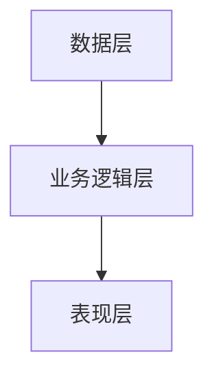
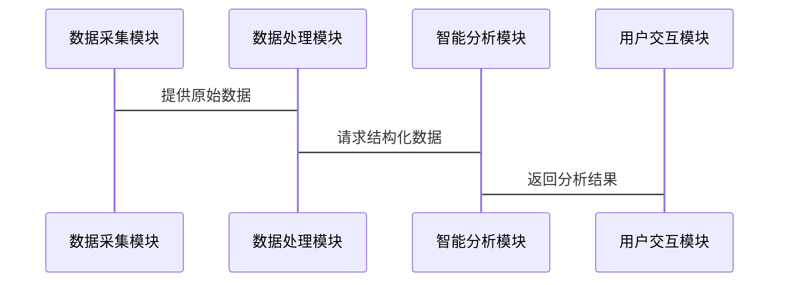

                 


# AI Agent在企业知识产权管理中的应用

> 关键词：AI Agent，知识产权管理，智能化管理，企业应用，技术实现

> 摘要：随着人工智能技术的快速发展，AI Agent在企业知识产权管理中的应用日益广泛。本文详细探讨了AI Agent的基本概念、其在知识产权管理中的核心作用，以及如何通过具体的技术手段实现智能化管理。文章从背景、核心概念、算法原理、系统架构到项目实战，层层剖析，为企业在知识产权管理中的智能化转型提供理论支持和实践指导。

---

## 第一部分：AI Agent与知识产权管理的背景与基础

### 第1章：AI Agent与知识产权管理概述

#### 1.1 AI Agent的基本概念

##### 1.1.1 什么是AI Agent
AI Agent（人工智能代理）是指能够感知环境、自主决策并执行任务的智能实体。它通过传感器获取信息，利用算法处理数据，并通过执行器完成目标。

**关键特征：**
- **自主性**：无需人工干预，自主完成任务。
- **反应性**：能够实时感知环境变化并做出反应。
- **目标导向性**：所有行为都以实现特定目标为导向。

##### 1.1.2 AI Agent的核心特点
- **智能性**：具备学习、推理和决策能力。
- **适应性**：能够根据环境变化调整策略。
- **协作性**：可与其他系统或人类协同工作。

##### 1.1.3 AI Agent与传统软件的区别
| 特性 | 传统软件 | AI Agent |
|------|-----------|----------|
| 决策能力 | 预先编程，固定逻辑 | 具备自主决策能力 |
| 学习能力 | 无学习能力 | 可通过数据学习和优化 |
| 适应性 | 静态，适应性差 | 动态适应环境变化 |

#### 1.2 知识产权管理的基本概念

##### 1.2.1 知识产权的定义
知识产权是指依法保护的创造性智力成果，包括专利权、商标权、著作权、商业秘密等。

##### 1.2.2 知识产权管理的范围
- **专利管理**：专利申请、维护、检索、分析。
- **商标管理**：商标注册、监测、侵权检测。
- **版权管理**：作品登记、版权保护、侵权监测。
- **商业秘密保护**：防止技术泄露和商业机密被窃取。

##### 1.2.3 企业知识产权管理的重要性
- 提升企业核心竞争力。
- 保护创新成果，防止侵权。
- 优化知识产权布局，提升资产价值。

#### 1.3 AI Agent在知识产权管理中的结合

##### 1.3.1 知识产权管理的智能化需求
随着知识产权数量的激增，传统的人工管理模式效率低下，亟需智能化解决方案。

##### 1.3.2 AI Agent在知识产权管理中的优势
- **高效检索**：快速从海量数据中筛选相关信息。
- **智能分析**：自动识别潜在风险和机会。
- **自动化处理**：自动完成专利申请、监控等流程。

##### 1.3.3 当前应用现状与未来趋势
当前，AI Agent在知识产权管理中的应用尚处于起步阶段，主要集中在初步的检索和监测。未来，随着技术进步，AI Agent将在分析、决策领域发挥更大作用。

---

## 第2章：AI Agent的核心概念与技术

### 2.1 AI Agent的感知机制

#### 2.1.1 数据采集与处理
AI Agent通过多种传感器或数据源获取信息，包括文本数据、图像数据和结构化数据。

#### 2.1.2 自然语言处理技术
自然语言处理（NLP）用于理解和生成人类语言，是AI Agent进行文本分析的关键技术。

**示例：**
- **文本分词**：将文本分割为词语或短语。
- **实体识别**：识别文本中的关键实体（如人名、组织名）。

#### 2.1.3 知识图谱构建
知识图谱是一种结构化的数据表示方法，用于存储实体及其关系。

**示例：**
- **专利知识图谱**：存储专利申请号、发明人、所属领域等信息。

### 2.2 AI Agent的决策机制

#### 2.2.1 知识表示与推理
知识表示通过符号逻辑或概率模型描述问题，推理则是基于知识库进行逻辑推理。

**示例：**
- **符号逻辑推理**：使用谓词逻辑进行推导。
- **概率推理**：基于贝叶斯网络进行概率计算。

#### 2.2.2 机器学习算法
机器学习算法用于训练模型，使其能够从数据中学习规律。

**示例：**
- **监督学习**：使用标记数据训练分类器。
- **无监督学习**：从无标记数据中发现结构。

#### 2.2.3 决策树算法
决策树是一种常见的分类算法，适合处理结构化数据。

**mermaid流程图：**


### 2.3 AI Agent的执行机制

#### 2.3.1 行为规划
行为规划是指AI Agent根据当前状态和目标，规划最优行为路径。

**示例：**
- **路径规划**：在复杂环境中找到最优路径。

#### 2.3.2 多智能体协作
多个AI Agent协同工作，共同完成复杂任务。

**示例：**
- **分布式任务处理**：多个AI Agent分别处理不同的子任务，最终汇总结果。

---

## 第3章：AI Agent在知识产权管理中的算法原理

### 3.1 知识产权检索与分类的算法

#### 3.1.1 基于自然语言处理的文本分类
文本分类用于自动将专利文档分类到特定领域。

**Python代码示例：**
```python
from sklearn.feature_extraction.text import TfidfVectorizer
from sklearn.svm import SVC

# 假设corpus为专利文档列表
vectorizer = TfidfVectorizer()
X = vectorizer.fit_transform(corpus)
clf = SVC()
clf.fit(X, labels)
```

#### 3.1.2 基于机器学习的相似度计算
使用余弦相似度计算文本相似度，用于检索相似专利。

**公式：**
$$ \text{相似度} = \frac{\vec{A} \cdot \vec{B}}{|\vec{A}| |\vec{B}|} $$

### 3.2 知识产权风险评估的算法

#### 3.2.1 基于贝叶斯网络的风险评估
贝叶斯网络用于建模变量之间的概率关系，评估知识产权风险。

**mermaid流程图：**


#### 3.2.2 基于决策树的侵权检测
决策树用于分类侵权行为，帮助识别潜在侵权风险。

**Python代码示例：**
```python
from sklearn.tree import DecisionTreeClassifier

# 假设X为特征向量，y为标签（侵权与否）
clf = DecisionTreeClassifier()
clf.fit(X, y)
```

---

## 第4章：AI Agent在知识产权管理中的系统架构

### 4.1 知识产权管理系统模块划分

#### 4.1.1 数据采集模块
负责从多种数据源采集知识产权数据，包括专利数据库、商标数据库等。

#### 4.1.2 数据处理模块
对采集到的数据进行清洗、预处理和结构化。

#### 4.1.3 智能分析模块
利用机器学习算法对数据进行分析，生成分析结果。

#### 4.1.4 用户交互模块
提供友好的用户界面，方便用户与系统交互。

### 4.2 系统架构设计

#### 4.2.1 分层架构设计
系统分为数据层、业务逻辑层和表现层，每一层都有明确的功能划分。

**mermaid架构图：**


#### 4.2.2 模块交互流程
从数据采集到最终结果输出的完整流程。

**mermaid序列图：**


---

## 第5章：AI Agent在知识产权管理中的项目实战

### 5.1 项目背景与目标

#### 5.1.1 项目背景
某企业希望利用AI技术优化其专利管理流程。

#### 5.1.2 项目目标
- 实现专利自动检索。
- 提供侵权风险预警。

### 5.2 系统设计与实现

#### 5.2.1 环境安装
安装Python、TensorFlow、Scikit-learn等工具。

#### 5.2.2 核心代码实现

##### 5.2.2.1 专利检索模块
```python
import requests

def search_patent(query):
    url = "https://api.patents.com/search"
    params = {'q': query, 'format': 'json'}
    response = requests.get(url, params=params)
    return response.json()
```

##### 5.2.2.2 风险评估模块
```python
from sklearn.naive_bayes import MultinomialNB

def train_model(X_train, y_train):
    clf = MultinomialNB()
    clf.fit(X_train, y_train)
    return clf
```

#### 5.2.3 功能实现

##### 5.2.3.1 专利检索功能
- 输入检索关键词。
- 返回相关专利列表。

##### 5.2.3.2 风险评估功能
- 分析检索结果。
- 生成风险报告。

### 5.3 测试与优化

#### 5.3.1 功能测试
- 测试检索功能的准确性。
- 测试风险评估的准确性。

#### 5.3.2 性能优化
- 优化算法效率。
- 提升检索速度。

### 5.4 项目总结

#### 5.4.1 成果展示
- 展示系统界面。
- 展示检索结果和风险报告。

#### 5.4.2 经验总结
- AI Agent在知识产权管理中的巨大潜力。
- 当前应用的局限性及未来改进方向。

---

## 第6章：AI Agent在知识产权管理中的最佳实践

### 6.1 小结

#### 6.1.1 核心内容回顾
- AI Agent的基本概念。
- 在知识产权管理中的应用。

#### 6.1.2 核心技术总结
- 自然语言处理。
- 机器学习算法。
- 系统架构设计。

### 6.2 注意事项

#### 6.2.1 数据隐私保护
- 注意保护知识产权数据的安全。
- 遵守相关法律法规。

#### 6.2.2 系统可扩展性
- 确保系统能够适应未来业务发展。
- 支持多种数据源接入。

### 6.3 拓展阅读

#### 6.3.1 推荐书籍
- 《人工智能：一种现代的方法》
- 《知识产权管理与保护》

#### 6.3.2 推荐技术博客
- Towards Data Science
- Medium上的AI相关专栏

---

## 作者

作者：AI天才研究院/AI Genius Institute & 禅与计算机程序设计艺术 /Zen And The Art of Computer Programming

---

通过以上内容，我们可以看到，AI Agent在企业知识产权管理中的应用前景广阔，能够显著提升管理效率和决策准确性。尽管目前还处于起步阶段，但随着技术的不断进步，AI Agent将在知识产权管理中发挥越来越重要的作用。

