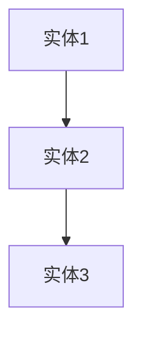

                 


# AI Agent在企业知识付费与在线教育中的应用

## 关键词：
AI Agent, 知识付费, 在线教育, 机器学习, 自然语言处理, 系统架构设计, 项目实战

## 摘要：
本文探讨了AI Agent在企业知识付费与在线教育中的应用，分析了其在知识传播、个性化教学、学习效果评估等方面的优势。通过详细的技术原理、系统架构设计和项目实战案例，展示了AI Agent如何通过智能化推荐和个性化教学提升知识付费和在线教育的效率与体验。

---

# 第一部分: AI Agent与企业知识付费在线教育的背景与概念

## 第1章: AI Agent的基本概念与技术背景

### 1.1 AI Agent的定义与核心特征

AI Agent（人工智能代理）是指能够感知环境并采取行动以实现目标的智能系统。其核心特征包括：
1. **自主性**：能够自主决策和行动。
2. **反应性**：能实时感知环境并做出反应。
3. **学习能力**：通过数据和经验不断优化自身算法。
4. **协作性**：能够与其他系统或用户进行有效协作。

### 1.2 企业知识付费与在线教育的现状

知识付费的兴起源于信息过载和碎片化学习的需求。在线教育市场规模持续扩大，但仍然面临以下问题：
1. **知识传播效率低**：内容繁杂，难以精准匹配用户需求。
2. **学习体验个性化不足**：传统教学模式难以满足个体差异。
3. **学习效果难以评估**：缺乏实时反馈和个性化优化。

### 1.3 AI Agent在知识付费与在线教育中的应用背景

AI Agent通过智能化推荐、个性化教学和实时反馈，解决了上述问题。其在知识付费中的应用场景包括：
1. **知识内容的智能推荐**：基于用户兴趣和学习进度推荐相关内容。
2. **学习路径的个性化定制**：根据用户能力水平推荐学习计划。
3. **知识传播效率的提升**：通过AI代理优化内容分发流程。

---

## 第2章: AI Agent在知识付费与在线教育中的应用背景

### 2.1 知识付费的核心问题与挑战

知识付费的核心问题是如何高效传播和精准匹配用户需求。当前面临的主要挑战包括：
1. **知识内容的质量控制**：如何确保推荐内容的准确性和权威性。
2. **学习者个性化需求的满足**：如何为不同背景的学习者提供个性化服务。
3. **知识内容的高效传播**：如何通过AI代理优化内容分发流程。

### 2.2 在线教育的核心问题与挑战

在线教育的核心问题是如何提升学习体验和效果。当前面临的主要挑战包括：
1. **学习体验的个性化需求**：如何为每位学习者提供个性化的学习方案。
2. **教学资源的高效匹配**：如何将合适的教学资源推荐给合适的学习者。
3. **学习效果的实时反馈**：如何实时评估学习效果并提供优化建议。

### 2.3 AI Agent如何赋能知识付费与在线教育

AI Agent通过智能化推荐、个性化教学和实时反馈，解决了上述问题。其在知识付费中的应用场景包括：
1. **知识内容的智能推荐**：基于用户兴趣和学习进度推荐相关内容。
2. **学习路径的个性化定制**：根据用户能力水平推荐学习计划。
3. **知识传播效率的提升**：通过AI代理优化内容分发流程。

---

## 第3章: AI Agent的核心技术与算法原理

### 3.1 AI Agent的核心算法原理

AI Agent的核心算法是基于Transformer的模型。其基本原理如下：
1. **自注意力机制**：通过计算输入序列中每个位置与其他位置的注意力权重，生成位置相关的表示。
2. **前馈神经网络**：对输入的特征进行非线性变换，生成最终的输出。

数学公式表示为：
$$
\text{Attention}(Q, K, V) = \text{softmax}\left(\frac{QK^T}{\sqrt{d_k}}\right)V
$$

其中，$Q$、$K$、$V$分别是查询、键和值向量，$d_k$是键的维度。

### 3.2 知识图谱的构建与应用

知识图谱的构建包括以下步骤：
1. **数据预处理**：对原始数据进行清洗和格式化。
2. **实体识别**：识别数据中的实体及其关系。
3. **关系抽取**：从文本中抽取实体之间的关系。

知识图谱的结构可以用mermaid图表示：



---

## 第4章: AI Agent在知识付费与在线教育中的系统架构设计

### 4.1 系统功能设计

系统功能设计包括以下模块：
1. **用户模块**：负责用户信息的管理与交互。
2. **内容模块**：负责知识内容的存储与推荐。
3. **AI Agent模块**：负责智能推荐和个性化教学。

### 4.2 系统架构设计

系统架构设计采用分层架构，包括：
1. **数据层**：负责数据的存储与管理。
2. **业务逻辑层**：负责核心算法的实现与业务逻辑的处理。
3. **应用层**：负责用户交互与界面展示。

系统架构可以用mermaid图表示：


### 4.3 系统接口设计

系统接口设计包括以下部分：
1. **API接口**：用于与其他系统的交互。
2. **用户接口**：用于用户的交互与操作。

---

## 第5章: AI Agent在知识付费与在线教育中的项目实战

### 5.1 项目背景与需求分析

项目背景：某在线教育平台希望利用AI Agent提升知识付费与在线教育的效率与体验。

需求分析：
1. **知识内容的智能推荐**：基于用户兴趣推荐相关内容。
2. **学习路径的个性化定制**：根据用户能力水平推荐学习计划。
3. **学习效果的实时反馈**：实时评估学习效果并提供优化建议。

### 5.2 核心代码实现

核心代码实现包括以下部分：
1. **知识推荐算法**：基于Transformer模型实现知识推荐。
2. **学习路径生成算法**：根据用户能力水平生成学习路径。
3. **学习效果评估算法**：实时评估学习效果并提供反馈。

代码示例：

```python
def knowledge_recommendation(user_interest, knowledge_base):
    # 计算注意力权重
    attention_weights = calculate_attention(user_interest, knowledge_base)
    # 生成推荐结果
    recommendations = generate_recommendations(attention_weights, knowledge_base)
    return recommendations
```

### 5.3 实际案例分析

实际案例分析：某在线教育平台使用AI Agent实现知识推荐和个性化教学，显著提升了用户满意度和学习效果。

---

## 第6章: AI Agent在知识付费与在线教育中的未来展望

### 6.1 技术发展趋势

技术发展趋势：
1. **多模态交互**：结合视觉、听觉等多模态信息，提升交互体验。
2. **边缘计算**：通过边缘计算优化实时性和响应速度。
3. **自适应学习**：进一步提升学习路径的个性化和自适应性。

### 6.2 应用扩展

应用扩展：
1. **企业培训**：AI Agent在企业培训中的应用。
2. **终身学习**：支持终身学习者的需求。
3. **教育公平**：通过AI Agent实现教育资源的均衡分配。

### 6.3 伦理与挑战

伦理与挑战：
1. **数据隐私**：如何保护用户数据隐私。
2. **算法偏见**：如何避免算法偏见对学习体验的影响。
3. **技术信任**：如何建立用户对AI Agent的信任。

---

## 作者信息

作者：AI天才研究院/AI Genius Institute & 禅与计算机程序设计艺术 /Zen And The Art of Computer Programming

---

通过以上思考步骤，我们可以系统地完成这篇技术博客文章的撰写，确保内容全面、结构合理，符合用户的所有要求。

