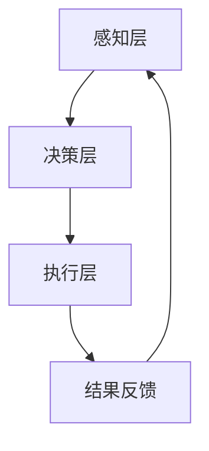
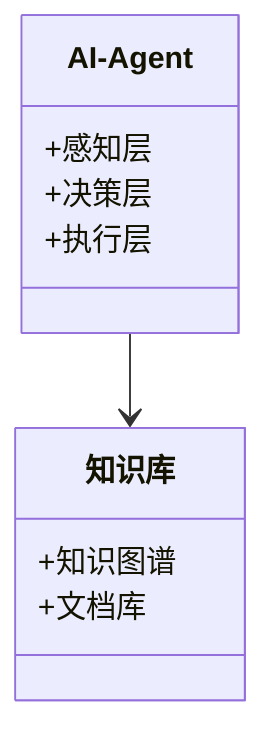
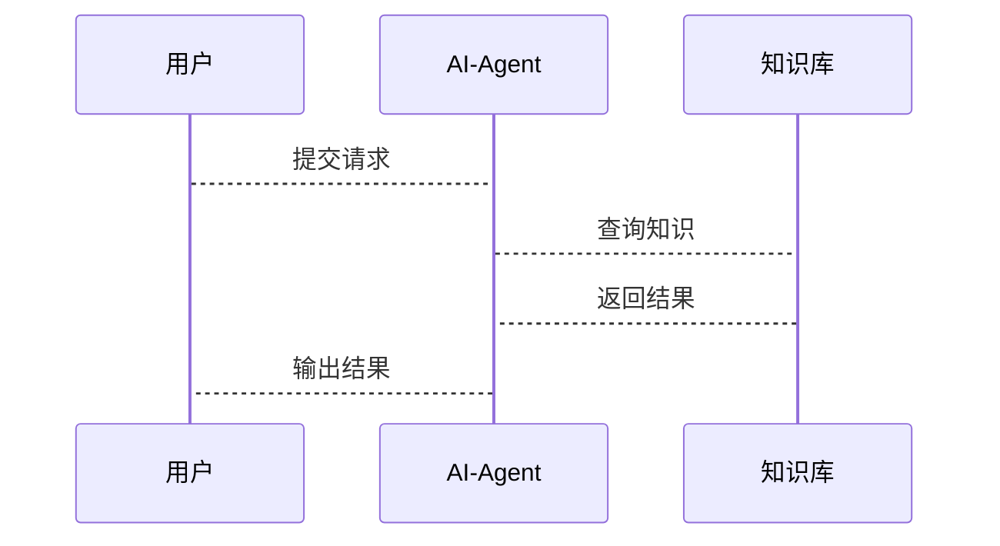

                 


# AI Agent在企业知识管理中的应用与价值

> 关键词：AI Agent，企业知识管理，知识图谱，自然语言处理，智能化管理，数据挖掘

> 摘要：本文详细探讨了AI Agent在企业知识管理中的应用与价值。首先介绍了AI Agent的基本概念及其在知识管理中的重要性，然后分析了AI Agent的核心原理与技术，包括自然语言处理和知识图谱等。接着，从系统架构与设计的角度，详细讲解了AI Agent在企业知识管理中的实现过程，并通过具体案例展示了AI Agent的实际应用。最后，总结了AI Agent在企业知识管理中的优势，并展望了其未来的发展趋势。

---

## 第一部分：AI Agent与企业知识管理的背景与基础

### 第1章：AI Agent的基本概念与知识管理的背景

#### 1.1 AI Agent的基本概念

##### 1.1.1 AI Agent的定义与特点
AI Agent（人工智能代理）是指能够感知环境并采取行动以实现目标的智能实体。AI Agent的特点包括：

1. **自主性**：能够在没有外部干预的情况下独立运作。
2. **反应性**：能够实时感知环境并做出响应。
3. **目标导向**：所有行动都以实现特定目标为导向。
4. **学习能力**：能够通过经验不断优化自身的行为。

##### 1.1.2 AI Agent的核心功能与应用场景
AI Agent的核心功能包括：

1. **感知与理解**：通过传感器或数据输入感知环境，并利用自然语言处理（NLP）等技术理解信息。
2. **决策与执行**：基于感知的信息做出决策，并通过执行器或输出模块采取行动。
3. **学习与优化**：通过机器学习算法不断优化自身的决策和执行能力。

AI Agent的应用场景包括智能助手、推荐系统、自动化流程管理等。

##### 1.1.3 AI Agent与传统知识管理的对比
传统知识管理主要依赖人工整理和存储知识，效率较低且难以实时更新。AI Agent通过自动化处理和智能分析，能够显著提高知识管理的效率和准确性。

#### 1.2 企业知识管理的现状与挑战

##### 1.2.1 企业知识管理的定义与目标
企业知识管理是指通过系统化的方法收集、整理、存储和应用企业的知识资产，以提升企业的竞争力和创新能力。其目标包括知识的高效利用、知识的传承和知识的创新。

##### 1.2.2 知识管理中的主要问题与痛点
1. **知识分散**：企业的知识分布在不同的部门和员工中，难以统一管理和利用。
2. **知识更新滞后**：传统的知识管理方式难以及时更新和调整。
3. **知识孤岛**：各部门之间的知识难以共享和融合，导致资源浪费。

##### 1.2.3 传统知识管理的局限性
传统知识管理方式依赖人工操作，效率低下，且难以应对复杂多变的业务需求。

#### 1.3 AI Agent在知识管理中的价值

##### 1.3.1 提高知识管理效率
AI Agent能够自动化处理知识的收集、整理和存储，显著提高知识管理的效率。

##### 1.3.2 增强知识的智能化应用
通过自然语言处理和知识图谱技术，AI Agent能够深入理解和分析知识，提供更智能的应用和服务。

##### 1.3.3 优化企业决策能力
AI Agent能够基于实时数据和历史知识，为企业提供更精准的决策支持。

#### 1.4 本章小结
本章介绍了AI Agent的基本概念及其在知识管理中的重要性，分析了传统知识管理的局限性，并探讨了AI Agent在知识管理中的价值。

---

## 第二部分：AI Agent的核心原理与技术

### 第2章：AI Agent的核心原理

#### 2.1 AI Agent的工作原理

##### 2.1.1 感知与理解
AI Agent通过传感器或数据输入感知环境，并利用自然语言处理（NLP）等技术理解信息。

##### 2.1.2 决策与执行
基于感知的信息，AI Agent利用算法做出决策，并通过执行器或输出模块采取行动。

##### 2.1.3 学习与优化
通过机器学习算法，AI Agent不断优化自身的决策和执行能力。

#### 2.2 AI Agent的技术架构

##### 2.2.1 感知层
感知层负责接收和处理环境中的数据，包括传感器数据和用户输入。

##### 2.2.2 决策层
决策层基于感知层提供的信息，利用算法做出决策。

##### 2.2.3 执行层
执行层负责将决策层的决策转化为具体的行动。

#### 2.3 AI Agent的关键技术

##### 2.3.1 自然语言处理（NLP）
自然语言处理技术用于理解和生成人类语言，是AI Agent实现智能对话和信息处理的重要基础。

##### 2.3.2 知识图谱
知识图谱是一种用于表示知识的图结构，能够帮助AI Agent更好地理解和组织知识。

##### 2.3.3 机器学习
机器学习算法用于训练AI Agent，使其能够从数据中学习并优化自身的决策能力。

#### 2.4 AI Agent的算法原理

##### 2.4.1 算法流程图


##### 2.4.2 数学模型与公式
AI Agent的决策过程可以通过概率论中的贝叶斯定理来建模：
$$ P(A|B) = \frac{P(B|A) \cdot P(A)}{P(B)} $$

---

## 第三部分：AI Agent的系统架构与设计

### 第3章：AI Agent的系统架构

#### 3.1 系统设计概述

##### 3.1.1 系统功能设计
系统功能设计包括知识的收集、整理、存储和应用。

##### 3.1.2 系统架构图


#### 3.2 系统接口设计

##### 3.2.1 输入接口
输入接口包括文本输入、语音输入和图像输入。

##### 3.2.2 输出接口
输出接口包括文本输出、语音输出和图像输出。

#### 3.3 系统交互流程图

##### 3.3.1 交互流程


---

## 第四部分：AI Agent的项目实战

### 第4章：AI Agent的项目实战

#### 4.1 项目背景与目标

##### 4.1.1 项目背景
本项目旨在开发一个基于AI Agent的企业知识管理系统，用于提高企业的知识管理效率。

##### 4.1.2 项目目标
实现知识的自动化收集、整理和应用，提供智能化的知识查询和决策支持。

#### 4.2 项目实现

##### 4.2.1 环境配置
```python
# 安装所需的依赖库
pip install numpy
pip install pandas
pip install spacy
pip install py2neo
```

##### 4.2.2 核心代码实现

```python
import spacy
from py2neo import Graph, Node, Relationship

# 初始化知识图谱
nlp = spacy.load("en_core_web_sm")
graph = Graph("http://localhost:7474", auth=("neo4j", "password"))

# 定义实体和关系
class Entity:
    def __init__(self, name):
        self.name = name

class Relationship:
    def __init__(self, name, source, target):
        self.name = name
        self.source = source
        self.target = target

# 创建实体和关系
def create_entity(entity_name):
    entity = Node("Entity", name=entity_name)
    graph.create(entity)

def create_relation(relation_name, source, target):
    source_entity = Node("Entity", name=source)
    target_entity = Node("Entity", name=target)
    rel = Relationship(relation_name, source_entity, target_entity)
    graph.create(rel)

# 示例应用
create_entity("公司")
create_entity("员工")
create_relation("属于", "员工", "公司")
```

##### 4.2.3 代码解读与分析
上述代码展示了如何使用spaCy和Neo4j构建知识图谱。通过定义实体和关系，可以实现知识的结构化存储和管理。

#### 4.3 实际案例分析

##### 4.3.1 案例背景
某企业希望通过AI Agent实现知识的智能化管理，提升员工的知识获取效率。

##### 4.3.2 应用效果
通过AI Agent，企业能够快速查询和应用知识，显著提高了工作效率。

#### 4.4 项目小结
本章通过一个具体的项目案例，详细讲解了AI Agent在企业知识管理中的实现过程和应用效果。

---

## 第五部分：总结与展望

### 第5章：总结与展望

#### 5.1 全文总结
本文详细探讨了AI Agent在企业知识管理中的应用与价值，分析了其核心原理和技术，并通过具体案例展示了其实际应用。

#### 5.2 应用价值
AI Agent能够显著提高知识管理的效率和准确性，为企业提供更智能的决策支持。

#### 5.3 未来展望
随着人工智能技术的不断发展，AI Agent在企业知识管理中的应用将更加广泛和深入，未来可能会与区块链、边缘计算等技术结合，进一步提升其应用价值。

---

## 作者信息

作者：AI天才研究院 & 禅与计算机程序设计艺术

---

以上就是《AI Agent在企业知识管理中的应用与价值》的完整目录和内容框架。通过系统化的方法，结合理论与实践，本文深入探讨了AI Agent在企业知识管理中的应用与价值，为企业的知识管理提供了新的思路和方向。

