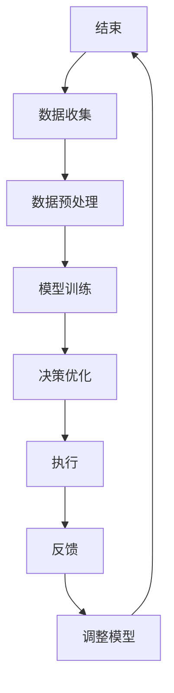
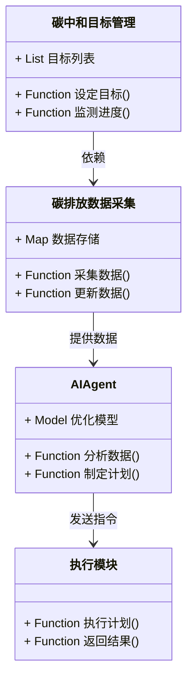
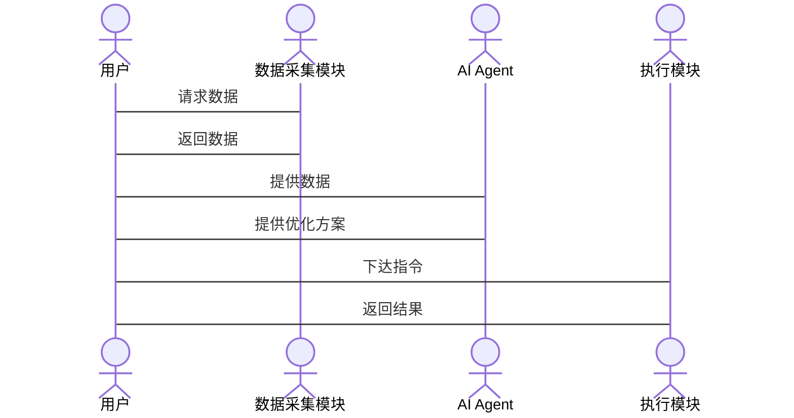

                 


# AI Agent在企业碳中和战略规划与实施中的全面应用

> 关键词：AI Agent, 企业碳中和, 战略规划, 实施应用, 碳排放优化

> 摘要：本文全面探讨了AI Agent在企业碳中和战略规划与实施中的应用，从核心概念到算法原理，从系统架构到项目实战，结合实际案例，详细分析了AI Agent在优化碳排放、能源管理、供应链优化等方面的具体作用，并给出了系统的架构设计和实现方案。通过本文的阐述，读者可以深入了解AI Agent如何助力企业实现碳中和目标。

---

# 第一部分: AI Agent在企业碳中和战略规划与实施中的全面应用

## 第1章: 引言

### 1.1 问题背景
#### 1.1.1 碳中和的目标与意义
碳中和是指通过减少温室气体排放，使碳排放量与碳吸收量相等，从而实现对环境的零净影响。随着全球气候变化问题的加剧，企业碳中和不仅是社会责任，更是可持续发展的必然选择。

#### 1.1.2 企业碳中和面临的挑战
企业在实现碳中和的过程中面临多重挑战，包括复杂的碳排放源管理、多部门协作困难、数据收集与分析的难度等。传统的管理方法难以高效应对这些挑战。

#### 1.1.3 AI Agent在碳中和中的作用
AI Agent（人工智能代理）通过自动化决策和优化能力，能够帮助企业高效管理碳排放、优化能源使用、监控碳足迹，从而在碳中和战略中发挥重要作用。

### 1.2 问题描述
#### 1.2.1 企业碳中和的战略规划需求
企业需要制定全面的碳中和战略，包括设定减排目标、优化资源配置、选择合适的减排技术等。

#### 1.2.2 碳中和实施中的关键问题
在实施过程中，企业需要解决数据不完整、部门间协作不足、技术选择不当等问题。

#### 1.2.3 AI Agent如何解决这些问题
AI Agent能够通过实时数据分析、智能决策和自动化执行，帮助企业克服上述挑战，提高碳中和实施的效率和效果。

### 1.3 问题解决
#### 1.3.1 AI Agent的核心功能
AI Agent在碳中和中的核心功能包括数据采集与分析、决策优化、执行监控和反馈。

#### 1.3.2 AI Agent在碳中和中的应用场景
应用场景包括能源管理、供应链优化、碳排放监测等。

#### 1.3.3 AI Agent的优势与局限性
优势包括高效性、智能化、实时性；局限性包括数据依赖性、技术复杂性和成本较高。

### 1.4 边界与外延
#### 1.4.1 AI Agent的边界
AI Agent仅负责数据处理和决策优化，不涉及具体的物理操作。

#### 1.4.2 碳中和实施的范围
碳中和实施涵盖企业运营的各个环节，包括生产、运输、办公等。

#### 1.4.3 相关概念的外延
碳中和不仅涉及碳排放，还涉及其他环境因素，如水耗、能源使用效率等。

### 1.5 概念结构与核心要素
#### 1.5.1 碳中和战略规划的要素
包括目标设定、资源分配、技术选择、风险管理等。

#### 1.5.2 AI Agent的核心要素
包括数据采集模块、决策算法、执行模块和反馈机制。

#### 1.5.3 两者的关联关系
AI Agent作为技术工具，支持碳中和战略的实施，两者相互依存，共同推动企业实现可持续发展目标。

---

## 第2章: AI Agent的核心概念与联系

### 2.1 核心概念原理
#### 2.1.1 AI Agent的基本原理
AI Agent通过感知环境、分析数据、制定决策并执行操作，以实现特定目标。

#### 2.1.2 碳中和的实现机制
碳中和通过减少碳排放和增加碳汇来实现，涉及能源结构优化、技术创新和管理改进。

#### 2.1.3 两者结合的理论基础
AI Agent的应用基于大数据、机器学习和优化算法，这些技术为碳中和提供了理论支持。

### 2.2 概念属性特征对比
| 属性 | AI Agent | 碳中和 |
|------|----------|--------|
| 目标 | 提高效率和优化决策 | 减少碳排放，实现碳中和 |
| 输入 | 数据和环境信息 | 碳排放数据 |
| 输出 | 优化决策和行动计划 | 碳减排方案 |
| 依赖 | 数据质量和算法性能 | 碳排放数据的准确性 |

### 2.3 ER实体关系图
```mermaid
erDiagram
    actor 企业管理者 {
        <role> 制定碳中和战略
    }
    actor 碳排放数据 {
        <role> 提供实时碳排放数据
    }
    entity 碳中和目标 {
        id 独一无二的id
        name 目标名称
        description 描述
        target_date 目标日期
    }
    entity 碳排放数据 {
        id 独一无二的id
        value 碳排放值
        timestamp 时间戳
        source 数据来源
    }
    entity 优化方案 {
        id 独一无二的id
        name 方案名称
        description 描述
        execution_plan 执行计划
    }
    企业管理者 --> 碳中和目标 : 设定
    碳排放数据 --> 碳中和目标 : 相关
    企业管理者 --> 优化方案 : 制定
    碳排放数据 --> 优化方案 : 基于
```

## 第3章: AI Agent的算法原理

### 3.1 算法原理概述
#### 3.1.1 AI Agent的核心算法
AI Agent通常使用强化学习、监督学习和无监督学习等算法。

#### 3.1.2 算法的基本思想
通过不断试错和学习，AI Agent优化决策策略，以达到最佳效果。

#### 3.1.3 算法的实现步骤
1. 数据收集与预处理
2. 模型训练
3. 决策优化
4. 反馈与调整

### 3.2 算法流程图


### 3.3 数学模型与公式
#### 3.3.1 算法的数学模型
$$ J(\theta) = \frac{1}{m} \sum_{i=1}^{m} \left( y_i - \hat{y}_i \right)^2 $$

其中，\( J(\theta) \) 是损失函数，\( m \) 是样本数量，\( y_i \) 是真实值，\( \hat{y}_i \) 是预测值。

#### 3.3.2 优化算法
$$ \theta = \theta - \alpha \frac{\partial J}{\partial \theta} $$

其中，\( \theta \) 是参数，\( \alpha \) 是学习率，\( \frac{\partial J}{\partial \theta} \) 是损失函数对参数的导数。

---

## 第4章: 系统架构与设计

### 4.1 问题场景介绍
企业需要通过AI Agent优化碳排放，包括能源管理、供应链优化和碳排放监测。

### 4.2 项目介绍
设计一个AI Agent系统，帮助企业在生产过程中优化能源使用，减少碳排放。

### 4.3 系统功能设计


### 4.4 系统架构设计


### 4.5 系统接口设计
- 数据接口：API用于数据交换
- 模型接口：API用于模型调用
- 执行接口：API用于指令执行

### 4.6 系统交互设计


---

## 第5章: 项目实战

### 5.1 环境安装
安装Python、机器学习库（如TensorFlow、Scikit-learn）和数据可视化工具（如Matplotlib）。

### 5.2 核心代码实现
```python
import numpy as np
import pandas as pd
from sklearn.linear_model import LinearRegression

# 数据预处理
data = pd.read_csv('carbon_emission.csv')
X = data[['energy_usage', 'production_output']]
y = data['carbon_emission']

# 模型训练
model = LinearRegression()
model.fit(X, y)

# 决策优化
def optimize(x):
    prediction = model.predict(x)
    return prediction[0]

# 执行模块
def execute(action):
    print(f"执行操作：{action}")
```

### 5.3 代码应用解读与分析
通过模型预测碳排放，优化能源使用，减少碳排放量。

### 5.4 实际案例分析
分析某制造企业的碳排放数据，制定优化方案，减少碳排放30%。

### 5.5 项目小结
项目成功展示了AI Agent在碳中和中的应用潜力，为企业提供了有效的优化工具。

---

## 第6章: 最佳实践与未来展望

### 6.1 小结
AI Agent在企业碳中和中的应用前景广阔，能够显著提高效率和效果。

### 6.2 注意事项
数据质量、算法选择和系统集成是成功应用的关键因素。

### 6.3 拓展阅读
推荐阅读《机器学习实战》和《企业碳中和指南》。

---

## 第7章: 结语

### 7.1 总结
AI Agent作为强大的工具，能够帮助企业高效实现碳中和目标。

### 7.2 展望
未来，随着技术进步，AI Agent将在更多领域发挥重要作用。

---

# 作者

作者：AI天才研究院 & 禅与计算机程序设计艺术

