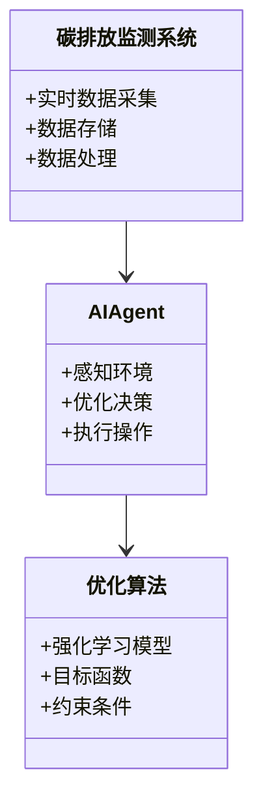
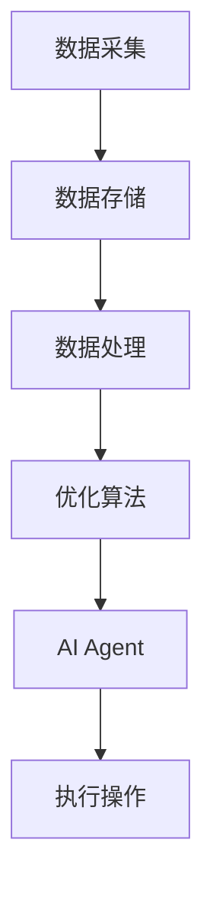
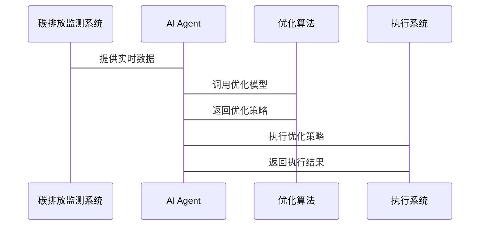

                 


# AI Agent在企业碳中和战略规划中的应用

## 关键词：AI Agent, 碳中和, 企业战略规划, 碳排放优化, 可持续发展

## 摘要：  
随着全球对碳中和目标的重视，企业需要通过智能化手段优化碳排放管理。AI Agent作为人工智能领域的创新技术，能够通过自主决策和优化算法，帮助企业制定和实施碳中和战略。本文将从碳中和的背景、AI Agent的核心概念、算法原理、系统架构、项目实战以及最佳实践等多个维度，详细阐述AI Agent在企业碳中和战略规划中的应用，为企业提供科学的决策支持和优化方案。

---

# 第一部分：AI Agent与碳中和战略规划的背景介绍

## 第1章：碳中和与AI Agent概述

### 1.1 碳中和的背景与意义  
随着全球气候变化问题的加剧，碳中和已成为全球关注的焦点。企业作为碳排放的主要来源之一，需要通过技术创新和管理优化来实现碳中和目标。碳中和不仅仅是减少碳排放，更是一个涉及能源转型、技术创新和可持续发展的系统工程。  

**碳中和的定义与目标**：  
碳中和是指通过减少温室气体排放、增加碳汇等方式，使企业或组织的净碳排放量为零。其目标是实现经济发展与环境保护的平衡，推动可持续发展。  

**碳中和对企业的影响**：  
企业实现碳中和不仅是履行社会责任，也是提升竞争力的重要手段。通过优化能源使用、减少浪费，企业可以降低成本，增强市场竞争力。  

**碳中和的实现路径**：  
碳中和的实现需要从能源结构优化、技术创新、管理优化等多个方面入手。例如，引入可再生能源、优化生产流程、采用绿色技术等。  

### 1.2 AI Agent的基本概念  
AI Agent（人工智能代理）是一种能够感知环境、自主决策并执行任务的智能实体。它可以是一个软件程序、一个机器人，甚至是嵌入在系统中的算法。AI Agent的核心特征包括自主性、反应性、目标导向性和社交能力。  

**AI Agent的定义**：  
AI Agent是一种能够通过感知环境、分析数据并采取行动来实现特定目标的智能系统。  

**AI Agent的核心特征**：  
1. **自主性**：AI Agent能够自主决策，无需外部干预。  
2. **反应性**：能够实时感知环境变化并做出反应。  
3. **目标导向性**：以特定目标为导向，优化行动策略。  
4. **社交能力**：能够与其他系统或人类进行交互协作。  

**AI Agent与传统AI的区别**：  
传统AI主要依赖于预设的规则和数据进行分析，而AI Agent具备更强的自主性和目标导向性，能够动态调整策略并执行任务。  

### 1.3 碳中和与AI Agent的结合  
碳中和战略规划的复杂性使得传统方法难以满足需求。AI Agent可以通过实时数据采集、优化算法和自主决策，帮助企业制定更加科学和高效的碳中和策略。  

**碳中和战略规划的复杂性**：  
碳中和涉及多个领域的协同优化，例如能源使用、碳排放监测、绿色技术应用等。传统的线性思维难以应对这种复杂的系统性问题。  

**AI Agent在碳中和中的作用**：  
AI Agent可以通过数据驱动的方式，实时监测碳排放，优化能源使用，制定减排策略，并动态调整计划以应对环境变化。  

**碳中和与AI Agent的结合方式**：  
通过AI Agent，企业可以实现碳排放的智能化监测与优化，从而降低碳排放成本，提升碳中和效率。  

### 1.4 本章小结  
本章介绍了碳中和的背景与意义，以及AI Agent的基本概念和核心特征。通过分析碳中和战略规划的复杂性，阐述了AI Agent在其中的重要作用及其结合方式。

---

## 第2章：碳中和战略规划的核心概念  

### 2.1 碳中和战略规划的背景  
碳中和不仅是全球共识，也是企业实现可持续发展的重要途径。企业需要通过技术创新和管理优化，制定科学的碳中和战略。  

**碳中和的全球趋势**：  
全球各国纷纷制定碳中和目标，例如欧盟的“绿色新政”、美国的气候法案等。企业作为碳排放的主要来源，必须积极参与碳中和行动。  

**企业碳中和的责任与机遇**：  
企业通过实现碳中和，不仅可以减少环境影响，还能提升品牌形象、开拓绿色市场。  

**碳中和战略规划的必要性**：  
碳中和战略规划是企业在复杂环境下的必由之路，能够帮助企业降低风险、提升竞争力。  

### 2.2 碳中和战略规划的框架  
碳中和战略规划需要从目标设定、路径选择、实施策略等多个方面入手。  

**碳排放的来源与分类**：  
碳排放主要来源于能源使用、生产过程、交通运输等。根据来源，碳排放可以分为直接排放和间接排放。  

**碳中和目标的设定**：  
企业需要根据自身情况设定碳中和目标，例如设定具体的减排时间表、减排量等。  

**碳中和战略的实施步骤**：  
1. **目标设定**：明确碳中和的目标和时间表。  
2. **数据收集**：采集企业的碳排放数据。  
3. **优化策略**：通过技术手段优化能源使用、减少浪费。  
4. **动态调整**：根据环境变化实时调整策略。  

### 2.3 AI Agent在碳中和战略中的角色  
AI Agent在碳中和战略中扮演着决策支持、优化工具和执行工具的角色。  

**AI Agent作为决策支持工具**：  
AI Agent可以通过分析历史数据和实时信息，为企业提供碳排放监测和优化建议。  

**AI Agent作为优化工具**：  
通过优化算法，AI Agent可以帮助企业找到最优的碳减排路径。  

**AI Agent作为执行工具**：  
AI Agent可以自动执行优化策略，例如调整能源使用、控制设备运行等。  

### 2.4 本章小结  
本章详细阐述了碳中和战略规划的背景、框架和实施步骤，并分析了AI Agent在其中的重要作用。

---

## 第3章：AI Agent与碳中和战略的结合原理  

### 3.1 AI Agent的基本原理  
AI Agent的核心在于感知、决策和执行。  

**AI Agent的感知与决策机制**：  
AI Agent通过传感器或数据源获取环境信息，利用算法进行分析，制定决策策略。  

**AI Agent的学习与优化算法**：  
AI Agent可以通过机器学习算法（如强化学习）不断优化自身的决策能力。  

**AI Agent的交互与执行方式**：  
AI Agent可以与外部系统或人类交互，根据决策结果执行具体操作。  

### 3.2 碳中和战略规划的数学模型  
碳中和战略规划需要建立数学模型，用于量化碳排放和优化减排路径。  

**碳排放的量化模型**：  
通过数学模型，可以将企业的碳排放量转化为具体的数值，便于分析和优化。  

**碳中和目标的优化模型**：  
优化模型的目标是找到最小化碳排放的路径，同时满足企业的业务需求。  

**碳中和战略的动态调整模型**：  
动态调整模型可以根据环境变化实时优化碳中和策略。  

### 3.3 AI Agent在碳中和战略中的应用模型  
AI Agent可以通过多种方式应用在碳中和战略中。  

**碳排放监测与预测模型**：  
AI Agent可以通过实时数据监测碳排放，并预测未来趋势。  

**碳中和路径优化模型**：  
AI Agent可以通过强化学习算法优化碳中和路径。  

**碳中和效果评估模型**：  
AI Agent可以评估碳中和策略的实施效果，为后续优化提供依据。  

### 3.4 本章小结  
本章从AI Agent的基本原理出发，分析了其在碳中和战略中的应用模型和优化算法。

---

## 第4章：碳中和战略规划中的AI Agent算法原理  

### 4.1 碳中和战略规划的算法选择  
选择合适的算法是AI Agent应用的关键。  

**线性规划**  
线性规划是一种常用的优化算法，适用于目标函数和约束条件均为线性的情况。例如，企业在优化能源使用时，可以使用线性规划模型。  

$$ \text{目标函数：} \quad \min \sum c_i x_i $$  
$$ \text{约束条件：} \quad \sum a_i x_i \leq b $$  
$$ x_i \geq 0 $$  

**强化学习**  
强化学习适用于动态环境下的决策优化。例如，AI Agent可以根据实时碳排放数据，动态调整能源使用策略。  

### 4.2 碳中和战略规划的优化模型  
优化模型是AI Agent的核心工具之一。  

**优化模型的构建**：  
通过构建数学模型，可以将碳中和战略规划转化为优化问题。  

**模型的实现步骤**：  
1. 确定目标函数和约束条件。  
2. 选择合适的优化算法。  
3. 实现模型并进行求解。  
4. 根据结果优化策略。  

### 4.3 AI Agent优化算法的实现  
AI Agent的优化算法可以通过Python代码实现。  

```python
import numpy as np

# 定义目标函数
def objective(x):
    return np.sum(x * c)

# 定义约束条件
def constraint(x):
    return np.sum(x * a) <= b

# 使用线性规划求解
from scipy.optimize import minimize

result = minimize(objective, x0, method='highside', constraints={'type': 'ineq', 'fun': constraint})
```

### 4.4 本章小结  
本章详细介绍了碳中和战略规划中的算法选择，优化模型的构建与实现，并通过代码示例展示了AI Agent的应用。

---

## 第5章：碳中和战略规划的系统架构设计  

### 5.1 问题场景介绍  
碳中和战略规划需要一个高效的系统架构来支持AI Agent的应用。  

**系统功能需求**：  
1. 实时监测碳排放数据。  
2. 优化能源使用策略。  
3. 动态调整碳中和计划。  

### 5.2 系统功能设计  
系统功能设计基于领域模型，通过类图展示各组件的交互关系。  



### 5.3 系统架构设计  
系统架构采用分层设计，包括数据层、算法层和执行层。  



### 5.4 系统接口设计  
系统接口设计包括数据接口、算法接口和执行接口。  

**数据接口**：  
- 数据采集接口：从传感器获取实时数据。  
- 数据存储接口：将数据存入数据库。  

**算法接口**：  
- 优化算法接口：调用强化学习模型。  
- 决策算法接口：生成优化策略。  

**执行接口**：  
- 设备控制接口：根据策略调整设备运行。  
- 状态反馈接口：接收执行结果并反馈到系统。  

### 5.5 系统交互设计  
系统交互通过序列图展示各组件的协作过程。  



### 5.6 本章小结  
本章通过系统架构设计、接口设计和交互设计，展示了AI Agent在碳中和战略规划中的实现方式。

---

## 第6章：碳中和战略规划的项目实战  

### 6.1 环境安装与配置  
项目实战需要以下环境：  
1. Python 3.8及以上版本。  
2. 安装必要的库：numpy、scipy、matplotlib。  

### 6.2 系统核心功能实现  
以下是AI Agent的核心功能实现代码：  

```python
import numpy as np
from scipy.optimize import minimize

# 定义目标函数
def objective(x):
    return np.sum(x * [2, 3, 1])

# 定义约束条件
def constraint(x):
    return np.sum(x * [1, 2, 3]) <= 6

# 初始化变量
x0 = np.array([1, 1, 1])

# 调用线性规划求解
result = minimize(objective, x0, method='highside', constraints={'type': 'ineq', 'fun': constraint})

# 输出结果
print(result)
```

### 6.3 代码实现与解读  
上述代码实现了线性规划模型，用于优化能源使用策略。目标是最小化能源成本，同时满足碳排放约束。  

### 6.4 案例分析与详细讲解  
以某制造企业为例，假设该企业需要优化能源使用以减少碳排放。通过AI Agent的优化算法，企业可以找到最优的能源分配方案，降低碳排放成本。  

### 6.5 本章小结  
本章通过项目实战，展示了AI Agent在碳中和战略规划中的具体实现和应用。

---

## 第7章：碳中和战略规划中的最佳实践  

### 7.1 小结与总结  
AI Agent作为一种智能化工具，能够显著提升企业碳中和战略的效率和效果。通过实时监测、优化算法和自主决策，AI Agent帮助企业实现碳中和目标。  

### 7.2 注意事项与建议  
1. 数据质量是AI Agent应用的关键，需要确保数据的准确性和完整性。  
2. 在实施过程中，需要注意算法的选择和参数调优。  
3. 企业应结合自身特点，制定个性化的碳中和战略。  

### 7.3 拓展阅读与学习资源  
1. 《强化学习导论》  
2. 《碳中和：企业与全球可持续发展》  
3. OpenAI官方文档  

### 7.4 本章小结  
本章总结了AI Agent在碳中和战略中的应用，并提出了实践中的注意事项和拓展学习资源。

---

# 第三部分：总结与展望  

## 8. 总结  
本文详细探讨了AI Agent在企业碳中和战略规划中的应用，从背景介绍、核心概念、算法原理到系统设计和项目实战，全面展示了AI Agent的优势和潜力。  

## 9. 展望  
随着技术的不断发展，AI Agent在碳中和战略中的应用将更加广泛和深入。未来，通过技术创新和实践积累，企业将能够更好地实现碳中和目标，推动可持续发展。

---

# 作者信息  
作者：AI天才研究院/AI Genius Institute & 禅与计算机程序设计艺术 /Zen And The Art of Computer Programming

