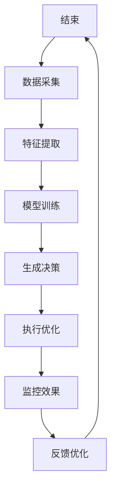
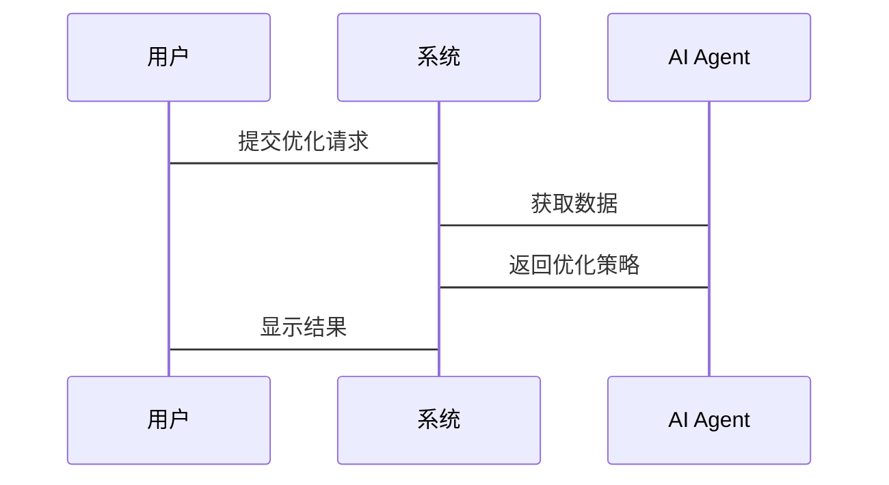

                 


# AI Agent在企业碳排放管理与可持续发展中的应用

## 关键词：企业碳排放管理、AI Agent、可持续发展、人工智能、能源优化

## 摘要：  
随着全球气候变化问题的日益严重，企业碳排放管理已成为实现可持续发展的重要组成部分。本文深入探讨了AI Agent（人工智能代理）在企业碳排放管理中的应用，分析了其核心概念、算法原理、系统架构及实际项目案例。通过详细的技术分析和实际应用，本文揭示了AI Agent如何帮助企业优化碳排放管理，实现可持续发展目标。

---

## 第一部分：AI Agent与企业碳排放管理概述

### 第1章：AI Agent的基本概念与应用背景

#### 1.1 AI Agent的定义与特点
- **1.1.1 AI Agent的定义**  
  AI Agent是一种智能实体，能够感知环境、自主决策并执行任务，以实现特定目标。它可以是一个软件程序或物理设备，具备学习、推理和自适应能力。

- **1.1.2 AI Agent的核心特点**  
  | 特性 | 描述 |
  |------|------|
  | 智能性 | 能够理解环境并做出决策 |
  | 自主性 | 无需人工干预即可执行任务 |
  | 反应性 | 能够实时感知并响应环境变化 |
  | 学习性 | 通过数据和经验不断优化性能 |

- **1.1.3 AI Agent与传统自动化系统的区别**  
  AI Agent不仅仅是自动化的工具，它具备智能性和适应性，能够处理复杂和动态的环境问题。

#### 1.2 企业碳排放管理的现状与挑战
- **1.2.1 碳排放的定义与重要性**  
  碳排放是指温室气体（如二氧化碳、甲烷）的排放，主要来源于能源消耗、工业生产和交通运输等。减少碳排放是应对气候变化的关键。

- **1.2.2 当前企业碳排放管理的主要挑战**  
  - 数据收集困难：企业需要整合来自不同来源的实时数据。  
  - 模型复杂性：碳排放管理涉及多学科的优化问题。  
  - 可持续性目标与经济效益的平衡：企业需要在减少碳排放的同时保持竞争力。

- **1.2.3 可持续发展的目标与企业责任**  
  可持续发展要求企业在追求经济利益的同时，减少对环境的负面影响。企业通过优化碳排放管理，可以降低运营成本、提升品牌形象并符合政策要求。

#### 1.3 AI Agent在碳排放管理中的作用
- **1.3.1 AI Agent如何优化碳排放管理**  
  AI Agent可以通过实时数据分析、预测建模和优化算法，帮助企业制定更高效的能源使用策略。

- **1.3.2 AI Agent在可持续发展中的应用前景**  
  AI Agent可以用于能源消耗预测、碳排放优化、绿色供应链管理等场景，推动企业向低碳转型。

- **1.3.3 企业采用AI Agent的优势与挑战**  
  - 优势：提高效率、降低成本、增强决策能力。  
  - 挑战：数据隐私、技术复杂性、初期投入高。

---

### 第2章：AI Agent与碳排放管理的核心概念

#### 2.1 碳排放管理的核心要素
- **2.1.1 碳排放的来源与分类**  
  碳排放主要来源于能源消耗（如电力、燃气）、交通（如汽车、飞机）、工业生产（如制造过程）等。  
  - 主要来源：电力消耗、交通、工业过程。  
  - 次要来源：建筑、废弃物处理。

- **2.1.2 碳排放管理的流程与方法**  
  - 数据采集：通过传感器和系统日志收集能源使用数据。  
  - 数据分析：利用统计和机器学习方法识别碳排放的热点区域。  
  - 优化策略：制定减排计划并监控执行效果。

- **2.1.3 碳排放管理的指标体系**  
  - 总碳排放量（CO2e）：企业整个生命周期的碳排放总量。  
  - 单位产品碳排放：单位产品或服务的碳排放强度。  
  - 减排目标达成率：与基准或目标相比的减排效果。

#### 2.2 AI Agent在碳排放管理中的功能模块
- **2.2.1 数据采集与处理**  
  AI Agent通过物联网（IoT）设备实时采集能源消耗数据，清洗和预处理后用于后续分析。  
  - 数据采集：传感器、日志文件。  
  - 数据清洗：去除噪声数据、填补缺失值。  

- **2.2.2 智能分析与决策**  
  AI Agent利用机器学习模型预测碳排放趋势，并优化能源使用策略。  
  - 预测模型：基于历史数据的回归分析、时间序列预测。  
  - 优化策略：动态调整设备运行参数以降低碳排放。

- **2.2.3 优化与执行**  
  AI Agent根据分析结果生成优化方案，并通过自动化系统执行。  
  - 执行策略：智能调度设备、优化能源采购计划。  
  - 监控效果：实时跟踪减排效果并反馈到系统。

#### 2.3 碳排放管理与AI Agent的关系
- **2.3.1 碳排放管理的系统架构**  
  - 数据层：采集、存储和管理碳排放数据。  
  - 计算层：分析数据并生成优化建议。  
  - 执行层：根据建议执行减排措施。

- **2.3.2 AI Agent在系统中的位置与作用**  
  AI Agent作为系统的核心，负责协调数据采集、分析和执行的全流程，实现闭环管理。

- **2.3.3 碳排放管理与AI Agent的协同机制**  
  - 数据驱动：AI Agent通过实时数据优化管理策略。  
  - 智能决策：AI Agent提供基于数据的科学决策支持。  
  - 闭环反馈：系统根据执行效果调整下一步行动。

---

### 第3章：AI Agent的算法原理与数学模型

#### 3.1 AI Agent的核心算法
- **3.1.1 强化学习算法**  
  强化学习（Reinforcement Learning）是一种通过试错学习的方法，AI Agent通过与环境交互获得奖励，逐步优化决策策略。  
  - Q-Learning算法：通过Q值表记录状态-动作的最优值，更新公式为：$$ Q(s,a) = Q(s,a) + \alpha (r + \gamma \max Q(s',a') - Q(s,a)) $$  

- **3.1.2 监督学习算法**  
  监督学习（Supervised Learning）通过训练数据预测目标变量，常用于碳排放预测。  
  - 线性回归：预测碳排放量与能源消耗量的关系：$$ y = \beta x + \epsilon $$  

- **3.1.3 聚类与分类算法**  
  聚类算法（如K-means）用于识别碳排放的高消耗区域，分类算法（如决策树）用于分类不同场景的碳排放水平。

#### 3.2 碳排放管理中的数学模型
- **3.2.1 碳排放预测模型**  
  使用ARIMA模型预测未来的碳排放量：$$ \hat{y}_t = \alpha y_{t-1} + \beta y_{t-2} + \gamma \epsilon_t $$  

- **3.2.2 能源消耗优化模型**  
  利用线性规划优化能源使用，降低碳排放：  
  $$ \min \sum_{i=1}^n c_i x_i $$  
  $$ \text{subject to } \sum_{i=1}^n a_i x_i \leq C $$  

- **3.2.3 可持续发展目标分解模型**  
  将总体减排目标分解到各部门，采用层次分析法（AHP）确定权重。

#### 3.3 算法流程图（使用Mermaid）


---

### 第4章：系统分析与架构设计

#### 4.1 系统功能设计
- **领域模型类图**  
  ```mermaid
  classDiagram
      class 碳排放管理 {
          采集数据
          分析数据
          优化策略
      }
      class AI Agent {
          接收数据
          处理数据
          输出决策
      }
      碳排放管理 <-->> AI Agent
  ```

- **系统架构图**  
  ```mermaid
  architecture
      Client --HTTP--> API Gateway
      API Gateway --RPC--> 数据采集模块
      数据采集模块 --> 数据存储模块
      数据存储模块 --> AI Agent
      AI Agent --> 优化执行模块
      优化执行模块 --> 监控模块
  ```

- **系统接口设计**  
  - 数据接口：采集设备与系统交互的接口。  
  - API接口：提供给其他系统调用优化结果的接口。  
  - 监控接口：实时显示碳排放数据和优化效果的接口。

#### 4.2 系统交互流程图


---

### 第5章：项目实战

#### 5.1 环境安装
- **Python版本**：Python 3.8以上。  
- **依赖库安装**：`pip install numpy pandas scikit-learn`

#### 5.2 核心代码实现
```python
import numpy as np
from sklearn.linear_model import LinearRegression

# 示例：碳排放预测模型
class CarbonEmissionModel:
    def __init__(self):
        self.model = LinearRegression()
    
    def train(self, X, y):
        self.model.fit(X, y)
    
    def predict(self, X):
        return self.model.predict(X)

# 数据准备
X = np.array([[1], [2], [3], [4]])
y = np.array([2, 3, 4, 5])

model = CarbonEmissionModel()
model.train(X, y)
print(model.predict(np.array([[5]])))  # 输出: [[6.0]]
```

#### 5.3 代码解读与分析
- **代码功能**：上述代码实现了简单的线性回归模型，用于预测碳排放量。  
- **数据输入**：X为输入特征（如能源消耗量），y为目标变量（碳排放量）。  
- **模型训练**：使用训练数据拟合模型。  
- **预测结果**：输入新的能源消耗量，预测对应的碳排放量。

#### 5.4 案例分析
- **实际场景**：某企业希望通过AI Agent优化电力消耗。  
- **实施步骤**：  
  1. 采集电力消耗数据和碳排放数据。  
  2. 使用机器学习模型预测碳排放趋势。  
  3. 制定优化策略，如调整设备运行时间、优化能源采购计划。  
  4. 监控执行效果并反馈优化。

#### 5.5 项目小结
- **效果评估**：通过实际案例分析，验证AI Agent在碳排放管理中的有效性。  
- **优化建议**：持续优化模型和系统架构，提升减排效果。

---

## 第六章：最佳实践与未来展望

#### 6.1 最佳实践
- 数据质量管理：确保数据的准确性和完整性。  
- 模型可解释性：选择易于解释的模型，便于企业理解和优化。  
- 人机协同：AI Agent辅助人类决策，而非完全替代人类。

#### 6.2 小结
本文详细探讨了AI Agent在企业碳排放管理中的应用，从理论到实践，展示了其在优化碳排放管理中的巨大潜力。

#### 6.3 注意事项
- 数据隐私：确保数据的安全性和合规性。  
- 技术可行性：根据企业实际情况选择合适的技术方案。  
- 持续优化：定期更新模型和优化策略，适应环境变化。

#### 6.4 拓展阅读
- 推荐阅读《机器学习实战》、《可持续发展技术导论》等书籍，深入了解AI Agent和可持续发展的更多内容。

---

## 作者：AI天才研究院 & 禅与计算机程序设计艺术

---

通过以上内容，我们可以看到AI Agent在企业碳排放管理中的巨大潜力。通过技术与业务的深度融合，企业可以更高效地实现可持续发展目标，为全球气候变化的应对作出贡献。

