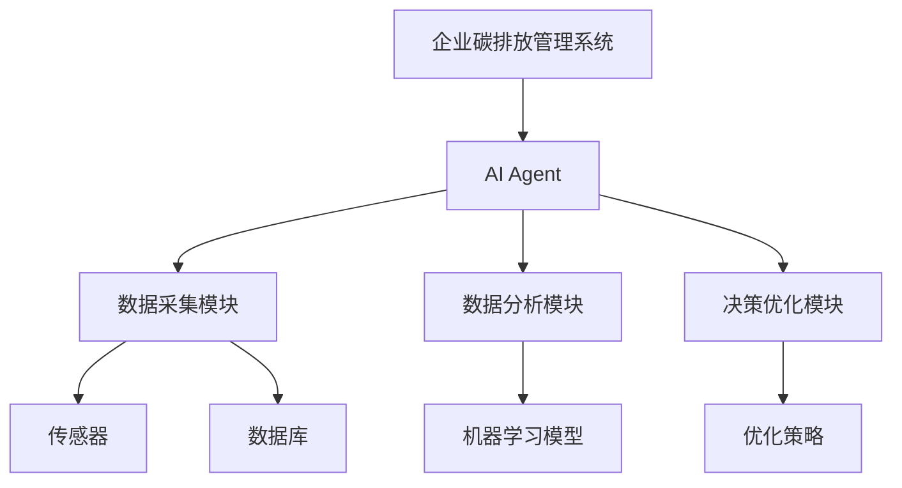
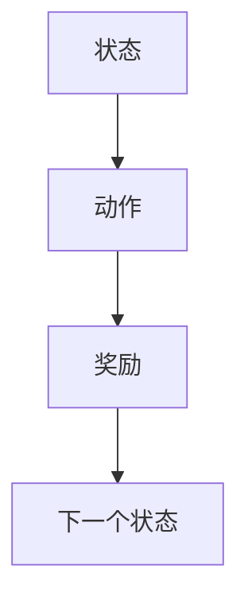
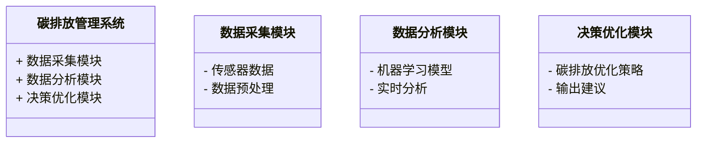
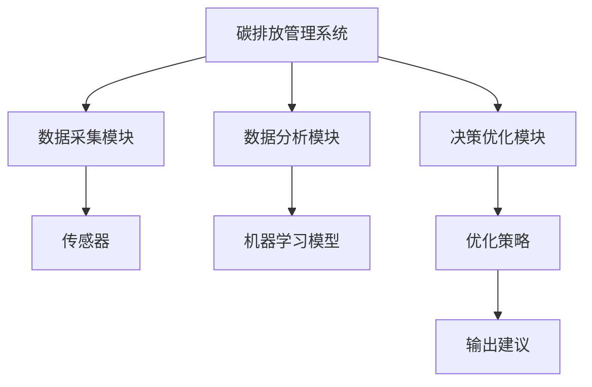
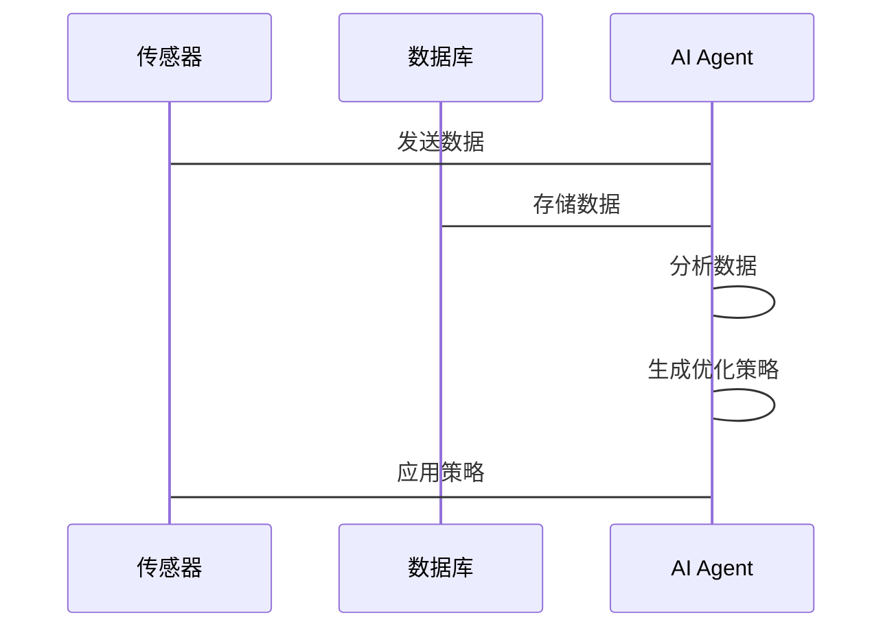

                 


# AI Agent在企业碳排放管理与环保合规中的应用

> 关键词：AI Agent，企业碳排放管理，环保合规，人工智能，强化学习，系统架构设计

> 摘要：随着全球对环境保护的关注不断增加，企业碳排放管理变得至关重要。本文探讨了AI Agent在企业碳排放管理与环保合规中的应用，从背景、核心概念、算法原理到系统设计和项目实战，全面分析AI Agent如何优化碳排放管理，确保企业合规。

---

## 第一部分：背景介绍

### 第1章：AI Agent与企业碳排放管理概述

#### 1.1 问题背景

- **企业碳排放管理的重要性**：随着全球气候变化加剧，企业减少碳排放已成为全球关注的焦点。碳排放管理不仅帮助企业在环保方面达标，还能降低成本，提升企业形象。

- **当前碳排放管理的挑战**：传统方法依赖人工操作，效率低下，难以实时监控和优化。数据量大、变量多，难以快速响应和决策。

#### 1.2 问题描述

- **碳排放管理的主要问题**：数据采集复杂，排放源多样，难以精确监控和预测。此外，环保法规不断变化，合规难度增加。

- **环保合规的复杂性**：不同地区法规差异大，企业需实时调整策略，确保合规。

#### 1.3 问题解决

- **引入AI Agent的必要性**：AI Agent能够实时监控、分析数据，优化决策，提升效率。

- **AI Agent的优势与潜力**：自动化、实时响应、自适应学习，能显著提高管理效率和合规能力。

#### 1.4 边界与外延

- **AI Agent的应用范围**：适用于企业内部的碳排放监测、优化和合规管理。

- **碳排放管理的边界条件**：涉及能源消耗、运输、生产过程等多个方面。

#### 1.5 核心概念

- **AI Agent的定义与核心要素**：AI Agent是具备感知、决策、执行能力的智能体，用于优化碳排放管理。

---

## 第二部分：核心概念与联系

### 第2章：AI Agent的核心原理

#### 2.1 核心原理

- **感知与决策机制**：AI Agent通过传感器和数据源收集信息，利用机器学习模型进行分析，生成优化策略。

- **自适应学习能力**：通过强化学习，AI Agent能从经验中学习，优化决策策略。

#### 2.2 对比分析

| **传统方法**       | **AI Agent**             |
|--------------------|--------------------------|
| 人工监控，效率低    | 自动化实时监控            |
| 数据处理能力有限    | 强大的数据处理与分析能力  |
| 响应速度慢          | 实时响应，快速决策        |

#### 2.3 系统架构图



---

## 第三部分：算法原理讲解

### 第3章：AI Agent的算法实现

#### 3.1 强化学习算法

- **强化学习机制**：AI Agent通过与环境互动，学习最优策略，减少碳排放。



- **代码实现**：

```python
import numpy as np
import gym

class Agent:
    def __init__(self, env):
        self.env = env
        self.learning_rate = 0.01
        self.gamma = 0.99
        self.memory = []
        
    def act(self, state):
        # 这里简化为随机选择动作
        return self.env.action_space.sample()
    
    def remember(self, state, action, reward, next_state):
        self.memory.append((state, action, reward, next_state))
    
    def replay(self):
        # 简化为随机采样
        if len(self.memory) > 0:
            sample = self.memory.pop()
            # 处理样本
            pass
    
    def train(self):
        pass

# 初始化环境
env = gym.make('CartPole-v1')
agent = Agent(env)

for episode in range(100):
    state = env.reset()
    total_reward = 0
    while True:
        action = agent.act(state)
        next_state, reward, done, info = env.step(action)
        agent.remember(state, action, reward, next_state)
        agent.train()
        state = next_state
        total_reward += reward
        if done:
            break
    print(f"Episode {episode}, Reward: {total_reward}")
```

- **数学模型**：

$$ Q(s, a) = Q(s, a) + \alpha (r + \gamma \max Q(s', a') - Q(s, a)) $$

---

## 第四部分：系统分析与架构设计方案

### 第4章：系统设计与架构

#### 4.1 项目场景介绍

- **项目介绍**：设计一个AI Agent驱动的碳排放管理系统，帮助某制造企业优化能源使用，减少碳排放。

#### 4.2 系统功能设计



#### 4.3 系统架构图



#### 4.4 接口设计与交互

- **接口设计**：AI Agent与传感器、数据库的接口。

- **交互设计**：



---

## 第五部分：项目实战

### 第5章：项目实现与案例分析

#### 5.1 环境安装

- 安装Python、TensorFlow、Keras、Mermaid等工具。

#### 5.2 核心代码实现

```python
import pandas as pd
from sklearn import linear_model

# 数据预处理
data = pd.read_csv('carbon_emission.csv')
features = data[['energy_usage', 'production_output']]
labels = data['emissions']

# 训练模型
model = linear_model.LinearRegression()
model.fit(features, labels)

# 预测
new_data = pd.DataFrame({'energy_usage': [1000], 'production_output': [200]})
predicted_emissions = model.predict(new_data)
print(predicted_emissions)
```

#### 5.3 案例分析

- **案例分析**：AI Agent如何优化某制造企业的能源使用，减少碳排放。

#### 5.4 项目总结

- 成功实现AI Agent在碳排放管理中的应用，显著降低碳排放，提高合规性。

---

## 第六部分：最佳实践与总结

### 第6章：总结与展望

#### 6.1 最佳实践

- 数据质量至关重要，需确保数据准确性和实时性。
- 定期更新模型，适应法规变化和企业需求。

#### 6.2 小结

AI Agent在企业碳排放管理中的应用前景广阔，通过优化决策和实时监控，帮助企业实现环保合规，降低碳排放。

#### 6.3 注意事项

- 数据隐私和安全需严格保护。
- 确保系统的稳定性和可靠性。

#### 6.4 拓展阅读

- 推荐阅读相关书籍和论文，深入学习AI在环保领域的应用。

---

作者：AI天才研究院/AI Genius Institute & 禅与计算机程序设计艺术/Zen And The Art of Computer Programming

