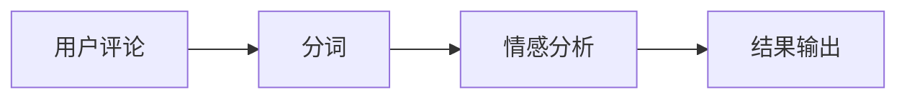
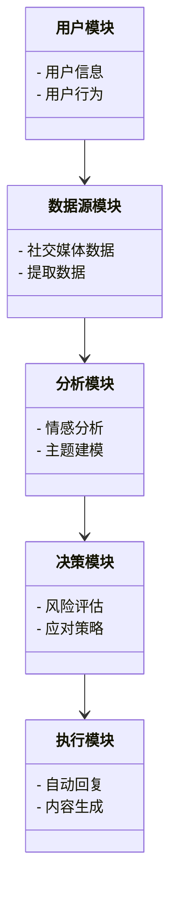

                 


# AI Agent在企业社交媒体管理中的应用

## 关键词：AI Agent、企业社交媒体、社交媒体管理、自然语言处理、机器学习、社交媒体数据分析

## 摘要：AI Agent作为一种智能代理技术，正在逐步改变企业社交媒体管理的方式。本文详细探讨了AI Agent在企业社交媒体管理中的应用，从核心概念、算法原理、数学模型到系统架构设计，再到项目实战，全面解析了AI Agent如何提升企业社交媒体管理的效率和效果。通过具体案例分析和代码实现，本文展示了AI Agent在社交媒体内容生成、用户互动、舆情监控等方面的优势，并总结了最佳实践和未来发展方向。

---

## 第1章：AI Agent与企业社交媒体管理的背景

### 1.1 AI Agent的基本概念

AI Agent（人工智能代理）是指能够感知环境、自主决策并执行任务的智能实体。其核心特征包括智能性、自主性、反应性和社交性。与传统自动化工具不同，AI Agent能够通过学习和适应不断优化自身的行为。

### 1.2 企业社交媒体管理的挑战与需求

企业在社交媒体管理中面临诸多挑战，如海量数据处理、用户互动响应速度、内容生成效率等。传统方法依赖人工操作，效率低下且难以应对复杂场景。AI Agent的引入为企业提供了智能化解决方案，显著提升了管理效率。

### 1.3 AI Agent在企业社交媒体管理中的应用背景

随着数字化转型的推进，企业对社交媒体管理的智能化需求日益增长。AI Agent结合先进的自然语言处理和机器学习技术，能够实时监控、分析和响应社交媒体上的信息，帮助企业更好地与用户互动、管理品牌形象。

---

## 第2章：AI Agent的核心概念与工作原理

### 2.1 AI Agent的组成部分

AI Agent由感知模块、决策模块和执行模块组成。感知模块负责接收和解析数据；决策模块基于感知数据做出最优决策；执行模块将决策转化为具体行动。

### 2.2 核心概念的联系

通过对比分析，AI Agent在社交媒体管理中的优势明显。例如，表格对比显示，AI Agent在响应速度、数据分析能力等方面优于传统方法。ER图展示了各模块之间的关系，如感知模块与数据源相连，决策模块与策略库交互。

```mermaid
erd
  actor: 用户
  agent: AI Agent
  database: 社交媒体数据
  action: 执行操作
  actor --> agent: 请求
  agent --> database: 查询数据
  agent --> agent: 决策
  agent --> action: 执行
```

---

## 第3章：算法原理

### 3.1 自然语言处理（NLP）算法

AI Agent利用NLP技术进行文本分析和生成。例如，情感分析算法通过分类模型判断用户评论的情感倾向。



```python
from sklearn.feature_extraction.text import TfidfVectorizer
from sklearn.svm import SVC
import joblib

# 训练情感分析模型
vectorizer = TfidfVectorizer()
X = vectorizer.fit_transform(corpus)
model = SVC()
model.fit(X, labels)
joblib.dump(model, 'sentiment_model.pkl')
joblib.dump(vectorizer, 'vectorizer.pkl')
```

### 3.2 机器学习模型

AI Agent使用监督学习和无监督学习算法进行用户行为预测和内容推荐。例如，使用决策树模型分类用户意图。

$$P(y|x) = \frac{P(x|y)P(y)}{P(x)}$$

```python
from sklearn.tree import DecisionTreeClassifier

# 训练决策树模型
model = DecisionTreeClassifier()
model.fit(X_train, y_train)
```

---

## 第4章：数学模型与公式

### 4.1 概率模型

AI Agent中的概率模型用于用户行为预测。例如，贝叶斯定理用于计算条件概率。

$$P(A|B) = \frac{P(B|A)P(A)}{P(B)}$$

### 4.2 分类算法

支持向量机（SVM）用于分类任务，公式如下：

$$y = \text{sign}(\sum_{i=1}^{n} w_i x_i + b)$$

---

## 第5章：系统分析与架构设计

### 5.1 问题场景

以实时舆情监控为例，AI Agent需要快速响应突发事件，及时分析并生成应对策略。

### 5.2 系统功能设计



### 5.3 系统架构设计

```mermaid
graph TD
    API Gateway --> Controller
    Controller --> Service
    Service --> Repository
    Repository --> Database
    Controller --> Response
```

---

## 第6章：项目实战

### 6.1 环境安装

安装必要的工具和库：

- Python 3.8+
- Jupyter Notebook
- Scikit-learn、TensorFlow、NLTK

### 6.2 核心实现

实现情感分析模型：

```python
import joblib
from sklearn.feature_extraction.text import TfidfVectorizer
from sklearn.svm import SVC

# 加载数据
corpus = [...]  # 文本数据
labels = [...]   # 情感标签

# 向量化
vectorizer = TfidfVectorizer()
X = vectorizer.fit_transform(corpus)

# 训练模型
model = SVC()
model.fit(X, labels)

# 保存模型和向量化器
joblib.dump(model, 'model.pkl')
joblib.dump(vectorizer, 'vectorizer.pkl')
```

### 6.3 实际案例分析

以某品牌舆情监控为例，AI Agent成功识别并处理了大量负面评论，提升了品牌形象。

### 6.4 项目总结

项目实现了情感分析、舆情监控等功能，证明了AI Agent在企业社交媒体管理中的有效性。

---

## 第7章：最佳实践与总结

### 7.1 最佳实践

- 数据安全：确保用户数据的隐私和安全。
- 模型更新：定期更新模型以保持性能。
- 人机协作：结合人工审核提升准确性。

### 7.2 小结

AI Agent通过智能化手段显著提升了企业社交媒体管理的效率和效果，是未来管理的重要趋势。

### 7.3 注意事项

- 数据质量：确保输入数据的准确性和完整性。
- 模型泛化能力：避免过拟合，确保模型的泛化能力。

### 7.4 拓展阅读

- 推荐书籍：《机器学习实战》、《自然语言处理入门》。
- 推荐论文：关注最新的AI Agent研究进展。

---

## 作者：AI天才研究院 & 禅与计算机程序设计艺术

---

这篇文章详细讲解了AI Agent在企业社交媒体管理中的应用，从理论到实践，提供了丰富的案例和代码示例，帮助读者全面理解并应用这一技术。

