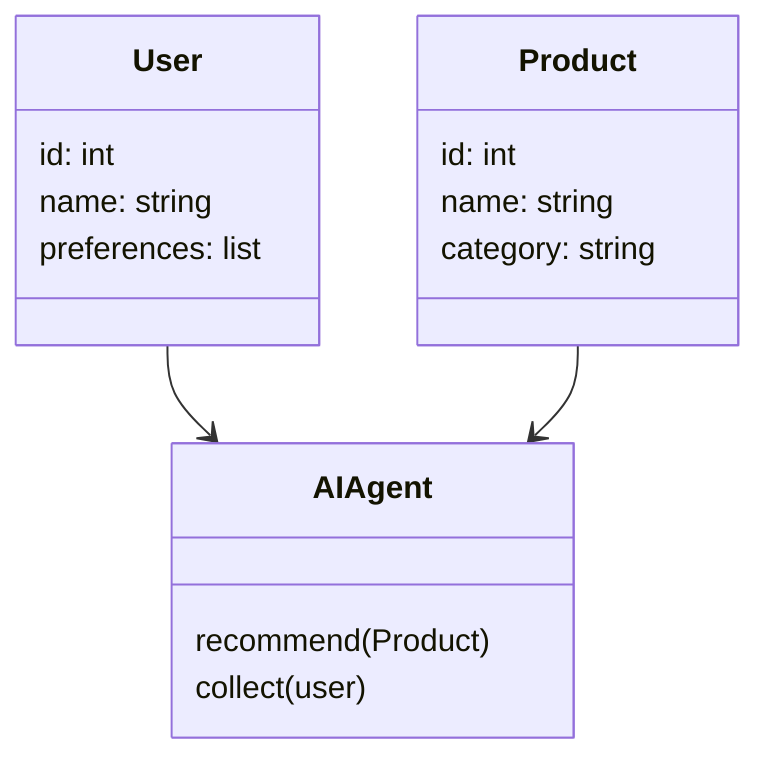
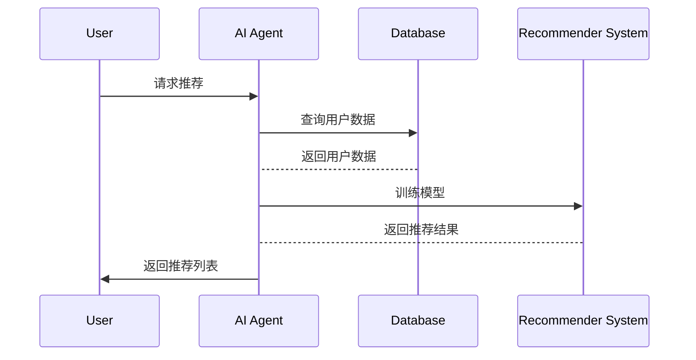

                 


# AI Agent在企业精准营销与个性化推荐中的深度应用

> 关键词：AI Agent、精准营销、个性化推荐、协同过滤、深度学习、数学模型

> 摘要：本文深入探讨了AI Agent在企业精准营销与个性化推荐中的应用，分析了其背后的算法原理、系统架构设计以及实际案例。通过详细的技术分析和通俗易懂的例子，揭示了AI Agent如何帮助企业实现高效精准的营销策略。

---

# 第1章: 背景与问题背景

## 1.1 问题背景

### 1.1.1 传统营销与推荐的局限性

传统营销方式依赖于人工筛选和推送，这种方式效率低下，难以满足大规模用户的个性化需求。例如，企业通过邮件营销或短信通知用户，但这种“一刀切”的方式忽视了用户之间的差异性，导致用户体验差，转化率低。

### 1.1.2 企业精准营销的需求

随着市场竞争的加剧，企业需要更精准的营销策略来吸引和留住用户。精准营销的核心在于根据用户的兴趣、行为和需求，提供定制化的产品和服务。然而，如何高效地实现这一点，是企业在数字化转型中面临的主要挑战。

### 1.1.3 个性化推荐的重要性

个性化推荐是精准营销的重要组成部分。通过分析用户的历史行为、偏好和购买记录，企业可以为用户提供符合其需求的产品推荐，从而提高用户满意度和转化率。然而，传统的推荐算法在面对海量数据时，往往难以实现真正的个性化。

---

## 1.2 问题描述

### 1.2.1 精准营销的核心挑战

精准营销的核心挑战在于如何高效地收集、处理和分析海量数据，并实时生成个性化的推荐结果。这需要强大的计算能力和先进的算法支持。

### 1.2.2 个性化推荐的实现难点

个性化推荐的实现难点包括数据的稀疏性、实时性要求高、用户行为的动态变化等。传统的基于协同过滤的推荐算法在面对这些挑战时显得力不从心。

### 1.2.3 AI Agent在其中的角色与价值

AI Agent（人工智能代理）通过自动化数据处理、模型训练和实时推荐，帮助企业实现精准营销和个性化推荐。AI Agent的核心价值在于其能够快速响应用户需求，提供实时的、个性化的推荐结果，从而提升用户体验和企业的营销效果。

---

## 1.3 问题解决

### 1.3.1 AI Agent如何实现精准营销

AI Agent通过分析用户的行为数据、偏好数据和上下文信息，构建用户画像，并基于这些画像生成个性化的推荐结果。例如，AI Agent可以根据用户的购买历史和浏览行为，预测用户的兴趣偏好，并推荐相关的产品。

### 1.3.2 个性化推荐的AI Agent解决方案

AI Agent通过集成多种推荐算法（如协同过滤、基于内容的推荐、深度学习推荐）构建混合推荐模型，从而实现更精准的推荐效果。例如，结合用户的点击行为和产品属性，AI Agent可以生成更符合用户需求的推荐列表。

### 1.3.3 问题边界与外延

AI Agent的应用范围不仅限于推荐系统，还包括用户行为分析、市场趋势预测等领域。然而，本文主要关注其在精准营销和个性化推荐中的应用，不涉及其在其他领域的扩展。

---

# 第2章: 核心概念与原理

## 2.1 AI Agent的基本概念

### 2.1.1 AI Agent的定义与特点

AI Agent是一种能够感知环境、执行任务并做出决策的智能实体。它具有自主性、反应性、目标导向性和社交能力等特性。例如，AI Agent可以自主收集数据、分析数据并生成推荐结果，无需人工干预。

### 2.1.2 AI Agent的核心要素

AI Agent的核心要素包括感知能力、推理能力、决策能力和执行能力。例如，AI Agent需要能够感知用户的行为数据（如点击、浏览、购买），并基于这些数据推理出用户的兴趣偏好，最终做出推荐决策。

### 2.1.3 AI Agent与传统推荐算法的对比

以下是AI Agent与传统推荐算法的对比表格：

| 对比维度       | AI Agent                   | 传统推荐算法             |
|----------------|---------------------------|-------------------------|
| 自主性         | 高，能够自主学习和优化    | 低，依赖预设的算法和规则 |
| 数据处理能力   | 强大，支持实时数据处理    | 较弱，处理能力有限       |
| 个性化程度     | 极高，支持动态调整         | 较低，难以实时更新       |

---

## 2.2 核心概念联系

### 2.2.1 ER实体关系图

以下是ER实体关系图：

```mermaid
graph TD
User --> AI Agent
Product --> AI Agent
Recommendation --> AI Agent
```

---

# 第3章: 算法原理与数学模型

## 3.1 协同过滤算法

### 3.1.1 基于用户的协同过滤

基于用户的协同过滤算法通过分析用户的行为数据，找到与目标用户兴趣相似的其他用户，并基于这些用户的偏好推荐产品。例如，如果用户A和用户B的购买历史相似，那么用户A可能会对用户B喜欢的产品感兴趣。

#### 协同过滤的数学模型

协同过滤的相似度计算公式如下：

$$
sim(i, j) = \frac{\sum_{k} r_{ik} r_{jk}}{\sqrt{\sum_{k} r_{ik}^2} \cdot \sqrt{\sum_{k} r_{jk}^2}}
$$

其中，$sim(i, j)$ 表示用户i和用户j之间的相似度，$r_{ik}$ 表示用户i对产品k的评分。

### 3.1.2 基于物品的协同过滤

基于物品的协同过滤算法通过分析产品的属性和用户的行为数据，找到与目标产品相似的其他产品，并推荐给目标用户。例如，如果用户喜欢购买连衣裙，系统会推荐其他类似风格的连衣裙。

### 3.1.3 协同过滤的数学模型

协同过滤的矩阵分解公式如下：

$$
X = U \cdot V^T
$$

其中，$X$ 是用户-产品评分矩阵，$U$ 是用户特征矩阵，$V$ 是产品特征矩阵。

---

## 3.2 基于内容的推荐算法

### 3.2.1 基于内容的推荐原理

基于内容的推荐算法通过分析产品的属性和描述，生成产品的特征向量，并基于这些特征向量推荐相似的产品。例如，如果用户喜欢购买科技类书籍，系统会推荐其他科技类书籍。

### 3.2.2 基于内容的推荐模型

基于内容的推荐模型通常使用TF-IDF（Term Frequency-Inverse Document Frequency）算法提取文本特征，并基于余弦相似度计算推荐结果。

---

## 3.3 深度学习推荐模型

### 3.3.1 基于神经网络的推荐模型

基于神经网络的推荐模型通过构建深度神经网络，自动提取数据中的高阶特征，并生成推荐结果。例如，使用多层感知机（MLP）模型对用户和产品的特征进行非线性变换，并生成推荐评分。

### 3.3.2 深度强化学习推荐模型

深度强化学习推荐模型通过构建强化学习框架，基于用户的实时行为和反馈，动态调整推荐策略。例如，使用Q-learning算法优化推荐策略，以最大化用户点击率。

---

# 第4章: 系统分析与架构设计

## 4.1 系统功能设计

### 4.1.1 领域模型

以下是领域模型的Mermaid类图：



### 4.1.2 系统架构设计

以下是系统架构设计的Mermaid图：

```mermaid
graph TD
    User --> API Gateway
    API Gateway --> AI Agent
    AI Agent --> Database
    Database --> AI Agent
    AI Agent --> Recommender System
    Recommender System --> Output
```

### 4.1.3 系统交互流程

以下是系统交互流程的Mermaid序列图：



---

# 第5章: 项目实战

## 5.1 环境安装

### 5.1.1 安装Python和相关库

```bash
pip install numpy pandas scikit-learn tensorflow
```

---

## 5.2 系统核心实现

### 5.2.1 协同过滤算法实现

```python
from sklearn.metrics.pairwise import cosine_similarity

# 用户-产品评分矩阵
user_product_matrix = ...

# 计算相似度矩阵
similarity_matrix = cosine_similarity(user_product_matrix)
```

### 5.2.2 深度学习模型实现

```python
import tensorflow as tf
from tensorflow.keras import layers

# 定义模型
model = tf.keras.Sequential([
    layers.Dense(64, activation='relu'),
    layers.Dense(1, activation='sigmoid')
])

# 编译模型
model.compile(optimizer='adam', loss='binary_crossentropy', metrics=['accuracy'])
```

---

## 5.3 代码解读与分析

### 5.3.1 协同过滤代码解读

上述代码使用了Scikit-learn库中的`cosine_similarity`函数，计算用户之间的相似度。相似度矩阵可以帮助我们找到与目标用户兴趣相似的其他用户，并基于这些用户的评分推荐产品。

### 5.3.2 深度学习模型代码解读

上述代码定义了一个包含两个全连接层的深度神经网络模型。第一层使用ReLU激活函数，第二层使用Sigmoid激活函数。模型的目标是最小化二进制交叉熵损失，并优化准确率。

---

## 5.4 案例分析

### 5.4.1 案例背景

假设我们有一个电子商务平台，用户可以浏览和购买商品。我们需要为用户提供个性化的商品推荐。

### 5.4.2 数据准备

我们需要收集用户的行为数据，包括用户的点击、浏览、购买记录，以及商品的属性信息。

### 5.4.3 模型训练与预测

使用协同过滤算法或深度学习模型对数据进行训练，并生成推荐列表。

---

## 5.5 项目小结

通过上述项目实战，我们可以看到AI Agent在企业精准营销和个性化推荐中的巨大潜力。通过结合协同过滤、基于内容的推荐和深度学习模型，我们可以实现更精准、更高效的推荐效果。

---

# 第6章: 最佳实践

## 6.1 小结

AI Agent通过自动化数据处理、模型训练和实时推荐，帮助企业实现精准营销和个性化推荐。本文详细探讨了AI Agent的核心概念、算法原理和系统架构设计，并通过实际案例展示了其在企业中的应用。

## 6.2 注意事项

在实际应用中，需要注意以下几点：

1. 数据隐私和安全问题。
2. 模型的实时性和响应速度。
3. 模型的可解释性和透明性。

## 6.3 拓展阅读

建议进一步阅读以下内容：

1. 《推荐系统实践》
2. 《深度学习推荐系统》
3. 《人工智能导论》

---

# 作者

作者：AI天才研究院/AI Genius Institute & 禅与计算机程序设计艺术/Zen And The Art of Computer Programming

---

**完**

