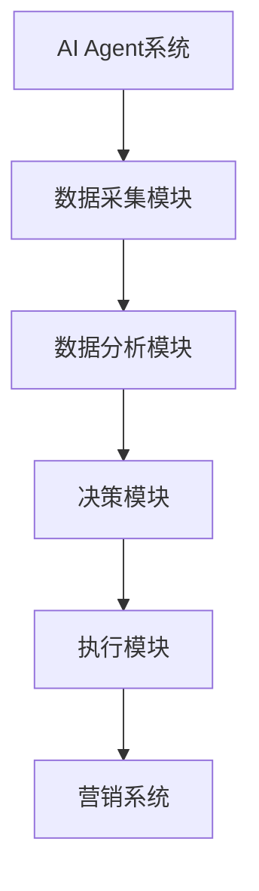

                 


# AI Agent在企业精准营销策略制定中的应用

> 关键词：AI Agent，精准营销，企业策略，人工智能，营销系统

> 摘要：本文深入探讨了AI Agent在企业精准营销策略制定中的应用，从基本概念、核心原理到实际应用，系统地分析了AI Agent如何通过数据驱动的方式优化营销策略。文章结合实际案例，详细阐述了AI Agent在精准营销中的优势和实现路径。

---

# 第1章: AI Agent与精准营销概述

## 1.1 AI Agent的基本概念

### 1.1.1 AI Agent的定义与特点

AI Agent（人工智能代理）是一种能够感知环境、自主决策并执行任务的智能系统。它通过数据驱动的方式，帮助企业在复杂环境中做出最优决策。AI Agent的核心特点包括：

- **智能性**：能够理解和分析数据，识别模式和趋势。
- **自主性**：能够在没有人工干预的情况下执行任务。
- **适应性**：能够根据环境变化动态调整策略。
- **学习能力**：通过机器学习算法不断优化性能。

### 1.1.2 AI Agent在企业中的作用

AI Agent在企业中的作用主要体现在以下几个方面：

- **数据处理与分析**：通过收集和分析大量数据，为企业决策提供支持。
- **智能推荐**：基于用户行为和偏好，提供个性化的产品推荐。
- **自动化决策**：在复杂场景中，AI Agent能够快速做出决策，提高效率。

### 1.1.3 精准营销的核心概念

精准营销是指通过分析客户数据，识别目标客户群体，并根据客户需求制定个性化的营销策略。其核心目标是提高营销效率、降低成本，并提升客户满意度。

---

## 1.2 AI Agent与精准营销的结合

### 1.2.1 精准营销的背景与挑战

随着市场竞争的加剧，企业需要更加精准地定位目标客户，以提高营销效果。然而，传统营销方式存在以下问题：

- **数据量大**：企业每天需要处理海量数据，人工分析效率低下。
- **客户行为复杂**：客户的购买行为受到多种因素影响，难以预测。
- **营销效果难以量化**：传统营销方式难以准确评估营销活动的效果。

### 1.2.2 AI Agent在精准营销中的优势

AI Agent通过数据驱动的方式，能够帮助企业克服传统营销的局限性：

- **高效数据处理**：AI Agent能够快速处理大量数据，提取有价值的信息。
- **个性化推荐**：通过机器学习算法，AI Agent可以为每个客户制定个性化的推荐方案。
- **动态调整策略**：AI Agent能够实时监控市场变化，动态调整营销策略。

### 1.2.3 企业营销策略的演变

从传统营销到精准营销，企业营销策略经历了以下几个阶段：

1. **传统营销**：基于经验和直觉制定营销策略。
2. **数据驱动营销**：利用数据分析技术优化营销策略。
3. **智能营销**：通过AI Agent实现自动化、智能化的营销策略制定。

---

## 1.3 本章小结

本章介绍了AI Agent的基本概念及其在企业中的作用，重点分析了精准营销的核心概念和AI Agent在精准营销中的优势。通过对比传统营销和智能营销的差异，我们可以看到，AI Agent的应用能够显著提升企业的营销效率和效果。

---

# 第2章: AI Agent的核心原理

## 2.1 AI Agent的感知机制

### 2.1.1 数据采集与处理

AI Agent的感知机制主要包括数据采集和数据处理两个步骤。

- **数据采集**：通过API、数据库等方式，采集客户行为数据、市场数据等。
- **数据处理**：对采集到的数据进行清洗、转换和特征提取，为后续分析提供基础。

### 2.1.2 数据分析与特征提取

数据分析的核心目标是提取有价值的信息。常见的数据分析方法包括：

- **统计分析**：通过统计方法分析数据分布、趋势等。
- **机器学习模型**：使用聚类、分类等算法，识别数据中的模式和特征。

### 2.1.3 数据驱动的决策支持

基于分析结果，AI Agent能够为企业的决策提供支持。例如，通过分析客户行为数据，AI Agent可以识别出潜在客户，并为营销策略制定提供参考。

---

## 2.2 AI Agent的决策机制

### 2.2.1 监督学习与无监督学习

AI Agent的决策机制主要依赖于机器学习算法。常用的算法包括：

- **监督学习**：基于标签数据，训练模型进行分类或回归预测。
- **无监督学习**：在无标签数据中发现潜在模式和结构。

### 2.2.2 强化学习与策略优化

强化学习是一种通过试错方式优化决策策略的方法。AI Agent可以通过强化学习，在复杂环境中找到最优策略。

### 2.2.3 多目标优化与权衡

在实际应用中，AI Agent需要在多个目标之间进行权衡。例如，在制定营销策略时，需要在销售额、客户满意度和成本之间找到平衡点。

---

## 2.3 AI Agent的执行机制

### 2.3.1 行为规划与策略执行

AI Agent根据决策结果制定执行计划，并通过API或其他方式将指令传递给营销系统。

### 2.3.2 动态调整与反馈优化

在执行过程中，AI Agent会实时监控执行效果，并根据反馈调整策略。

### 2.3.3 执行效果的评估与分析

通过评估执行效果，AI Agent可以不断优化自身的决策模型，提升未来决策的准确性。

---

## 2.4 本章小结

本章详细介绍了AI Agent的核心原理，包括感知、决策和执行三个主要环节。通过机器学习算法，AI Agent能够高效地处理数据、制定决策，并通过动态调整优化执行效果。

---

# 第3章: 精准营销的背景与挑战

## 3.1 精准营销的核心目标

### 3.1.1 提高营销效率

通过精准定位目标客户，减少无效营销，提高营销效率。

### 3.1.2 降低营销成本

通过个性化推荐和自动化营销，降低营销成本。

### 3.1.3 提升客户满意度

通过个性化服务，提升客户满意度和忠诚度。

---

## 3.2 传统营销的局限性

### 3.2.1 盲目营销的问题

传统营销方式往往基于经验而非数据，导致资源浪费。

### 3.2.2 营销效果难以量化

传统营销方式难以准确评估营销活动的效果。

### 3.2.3 客户行为的不确定性

客户行为受到多种因素影响，难以预测。

---

## 3.3 AI Agent在精准营销中的优势

### 3.3.1 数据驱动的个性化推荐

通过分析客户数据，AI Agent能够为每个客户制定个性化的推荐方案。

### 3.3.2 智能决策支持

AI Agent能够快速分析数据，为营销策略制定提供支持。

### 3.3.3 动态调整与优化

AI Agent能够实时监控市场变化，动态调整营销策略。

---

## 3.4 本章小结

本章分析了精准营销的核心目标和传统营销的局限性，重点阐述了AI Agent在精准营销中的优势。通过AI Agent的应用，企业能够实现更高效的营销策略制定。

---

# 第4章: AI Agent的算法原理

## 4.1 监督学习算法

### 4.1.1 线性回归模型

线性回归是一种常用的回归算法，其数学模型如下：

$$ y = \beta_0 + \beta_1 x + \epsilon $$

其中，$\beta_0$ 是截距，$\beta_1$ 是回归系数，$\epsilon$ 是误差项。

### 4.1.2 支持向量机(SVM)

SVM是一种常用的分类算法，其核心思想是通过找到一个超平面，将数据分为两类。SVM的数学模型如下：

$$ y = \text{sign}(\sum_{i=1}^n \alpha_i y_i x_i \cdot x + b) $$

其中，$\alpha_i$ 是拉格朗日乘子，$y_i$ 是类别标签，$x_i$ 是支持向量。

### 4.1.3 随机森林与梯度提升树

随机森林是一种基于决策树的集成算法，其核心思想是通过组合多个决策树的预测结果，提高模型的准确性和稳定性。梯度提升树是一种通过迭代优化决策树的算法。

---

## 4.2 强化学习算法

### 4.2.1 Q-learning算法

Q-learning是一种常用的强化学习算法，其核心思想是通过维护一个Q表，记录每个状态-动作对的期望奖励。Q-learning的更新公式如下：

$$ Q(s,a) = Q(s,a) + \alpha [r + \gamma \max_{a'} Q(s',a') - Q(s,a)] $$

其中，$\alpha$ 是学习率，$\gamma$ 是折扣因子。

### 4.2.2 Deep Q-Network (DQN)

DQN是一种基于深度学习的强化学习算法，其核心思想是通过神经网络近似Q函数。DQN的网络结构通常包括输入层、隐藏层和输出层。

### 4.2.3 Policy Gradient方

Policy Gradient是一种基于策略梯度的强化学习算法，其核心思想是通过优化策略函数，找到最优动作策略。Policy Gradient的优化目标是最大化累积奖励。

---

## 4.3 本章小结

本章详细介绍了AI Agent中常用的算法原理，包括监督学习和强化学习两大类。通过这些算法，AI Agent能够高效地处理数据、制定决策，并不断优化自身性能。

---

# 第5章: AI Agent的系统架构设计

## 5.1 系统功能设计

AI Agent的系统功能设计包括以下几个模块：

- **数据采集模块**：负责采集客户行为数据、市场数据等。
- **数据分析模块**：对采集到的数据进行清洗、转换和特征提取。
- **决策模块**：基于数据分析结果，制定营销策略。
- **执行模块**：将决策结果传递给营销系统执行。

---

## 5.2 系统架构设计

### 5.2.1 系统架构图



### 5.2.2 系统接口设计

AI Agent系统需要与企业现有的营销系统进行对接，常见的接口包括：

- **API接口**：通过REST API与营销系统进行数据交互。
- **数据库接口**：通过JDBC等接口与企业数据库进行数据交互。

---

## 5.3 本章小结

本章详细介绍了AI Agent的系统架构设计，包括功能模块设计、系统架构图和接口设计。通过合理的系统架构设计，AI Agent能够高效地支持企业的精准营销需求。

---

# 第6章: 项目实战

## 6.1 环境安装

要实现AI Agent系统，需要安装以下工具和库：

- **Python**：编程语言
- **TensorFlow**：深度学习框架
- **Pandas**：数据处理库
- **Scikit-learn**：机器学习库
- **Flask**：Web框架

安装命令示例：

```bash
pip install python-tensorflow pandas scikit-learn flask
```

---

## 6.2 系统核心实现

### 6.2.1 数据采集模块

```python
import requests

def fetch_data(api_key):
    response = requests.get(f'http://api.example.com/data?api_key={api_key}')
    return response.json()
```

### 6.2.2 数据分析模块

```python
import pandas as pd

def process_data(data):
    df = pd.DataFrame(data)
    df.dropna(inplace=True)
    return df
```

### 6.2.3 决策模块

```python
from sklearn.ensemble import RandomForestClassifier

def train_model(X, y):
    model = RandomForestClassifier()
    model.fit(X, y)
    return model
```

### 6.2.4 执行模块

```python
def execute_strategy(model, data):
    predictions = model.predict(data)
    return predictions
```

---

## 6.3 实际案例分析

以一个电商企业的精准营销为例，AI Agent可以通过分析客户的购买记录和浏览行为，预测客户的购买偏好，并制定个性化的推荐策略。

---

## 6.4 本章小结

本章通过实际案例分析，详细介绍了AI Agent系统的实现过程。从环境安装到系统核心实现，再到案例分析，读者可以逐步掌握AI Agent在精准营销中的具体应用。

---

# 第7章: 最佳实践与小结

## 7.1 最佳实践

在实际应用中，建议企业采取以下措施：

- **数据质量**：确保数据的准确性和完整性。
- **模型优化**：定期更新模型，避免过时。
- **安全性**：保护客户数据的安全，防止数据泄露。

---

## 7.2 小结

本文详细探讨了AI Agent在企业精准营销策略制定中的应用。通过分析AI Agent的核心原理、系统架构设计和实际应用案例，我们可以看到，AI Agent能够显著提升企业的营销效率和效果。

---

## 7.3 注意事项

在实际应用中，企业需要注意以下几点：

- **数据隐私**：遵守相关法律法规，保护客户隐私。
- **模型解释性**：确保模型的可解释性，便于调整和优化。
- **技术可行性**：根据企业实际情况，选择合适的技术方案。

---

## 7.4 拓展阅读

- **《机器学习实战》**：深入学习机器学习算法的实现。
- **《深度学习》**：了解深度学习的核心原理和应用。
- **《Python编程：从入门到实践》**：掌握Python编程技能。

---

# 作者

作者：AI天才研究院/AI Genius Institute & 禅与计算机程序设计艺术/Zen And The Art of Computer Programming

