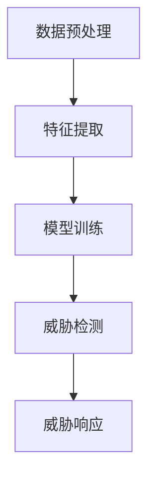
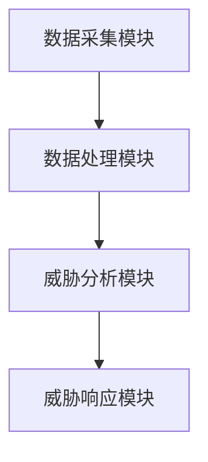

                 


# AI Agent在企业网络安全威胁情报分析中的应用

> 关键词：AI Agent, 企业网络安全, �威脅情報分析, 人工智能, 网络安全, 机器学习

> 摘要：随着企业网络安全威胁的复杂性和多样性的不断增加，传统的网络安全防护手段已难以应对日益 sophisticated 的威胁。基于人工智能（AI）的代理（AI Agent）在企业网络安全威胁情报分析中展现了巨大的潜力。本文系统地探讨了AI Agent在企业网络安全中的核心作用，分析了其在威胁情报分析中的具体应用，详细阐述了其算法原理、系统架构设计、项目实战案例，以及在实际应用中的优势与挑战。文章最后总结了AI Agent在企业网络安全威胁情报分析中的未来发展方向。

---

# 第一部分: AI Agent与企业网络安全威胁情报分析概述

## 第1章: AI Agent与网络安全威胁情报分析概述

### 1.1 AI Agent的基本概念与原理

#### 1.1.1 AI Agent的定义与核心特征
- **AI Agent**（人工智能代理）是指能够感知环境、自主决策并执行任务的智能实体。
- **核心特征**：自主性、反应性、目标导向性、学习能力。
- **AI Agent的类型**：
  - **反应式代理**：基于当前感知做出反应，如实时威胁检测。
  - **认知式代理**：具备复杂推理和规划能力，如威胁情报分析。

#### 1.1.2 AI Agent在网络安全中的应用价值
- **优势**：
  - 自主性：能够独立执行任务，减少人工干预。
  - 实时性：快速响应网络安全威胁。
  - 学习能力：通过机器学习不断优化威胁检测和分析能力。
- **应用场景**：
  - 威胁检测、漏洞发现、攻击溯源、风险评估。

#### 1.1.3 威胁情报分析的基本概念与流程
- **威胁情报**：关于潜在或已发生网络安全威胁的信息。
- **分析流程**：
  1. 数据采集：收集日志、流量、漏洞等数据。
  2. 数据处理：清洗、归一化、特征提取。
  3. 分析：基于机器学习模型进行分类、聚类、关联分析。
  4. 响应：生成告警、采取防护措施。

---

## 第2章: AI Agent在企业网络安全中的应用背景

### 2.1 企业网络安全威胁的现状与挑战

#### 2.1.1 当前企业网络安全的主要威胁
- **网络攻击**：如DDoS、APT（高级持续性威胁）、钓鱼攻击。
- **数据泄露**：内部员工或外部攻击者窃取敏感数据。
- **漏洞利用**：利用系统漏洞进行攻击。

#### 2.1.2 威胁情报分析的传统方法与局限性
- **传统方法**：
  - 基于规则的检测：依赖预定义的规则，难以应对未知威胁。
  - 人工分析：耗时、效率低，难以应对海量数据。
- **局限性**：
  - 灵活性差：难以应对新型攻击手法。
  - 处理能力有限：无法实时处理大规模数据。

#### 2.1.3 AI技术在网络安全中的应用趋势
- **趋势分析**：
  - AI驱动的威胁检测：利用深度学习模型识别异常行为。
  - 自动化响应：基于AI的自动防护措施。
  - 智能化威胁情报分析：利用AI生成动态威胁情报。

### 2.2 AI Agent在威胁情报分析中的优势

#### 2.2.1 AI Agent的自主性与实时性
- **自主性**：AI Agent能够独立执行任务，无需人工干预。
- **实时性**：能够实时感知网络环境并快速响应。

#### 2.2.2 AI Agent的自我学习与进化能力
- **自我学习**：通过机器学习模型不断优化威胁检测算法。
- **进化能力**：适应不断变化的网络安全威胁。

#### 2.2.3 AI Agent在威胁情报分析中的效率提升
- **效率提升**：
  - 快速分析海量数据，提高威胁检测速度。
  - 准确识别隐藏在噪声中的异常行为。

### 2.3 企业网络安全中的AI Agent应用案例

#### 2.3.1 典型企业网络安全威胁分析案例
- **案例背景**：某企业遭受APT攻击，利用员工邮件进行内网渗透。
- **AI Agent的应用**：
  - 数据采集：收集邮件流量、系统日志。
  - 数据分析：利用NLP模型识别异常邮件内容。
  - 威胁检测：基于深度学习模型发现异常行为。
  - 自动响应：隔离受感染设备，阻止进一步攻击。

#### 2.3.2 AI Agent在威胁情报分析中的实际应用
- **实际应用**：
  - 实时监控网络流量，发现可疑连接。
  - 分析系统日志，识别潜在入侵行为。
  - 自动生成威胁情报报告，协助安全团队决策。

#### 2.3.3 应用效果与经验总结
- **效果**：
  - 提高威胁检测的准确性和及时性。
  - 减少人工干预，降低运营成本。
- **经验总结**：
  - 数据质量是关键：确保数据的完整性和准确性。
  - 模型优化是核心：定期更新和优化AI模型。
  - 人机协同是保障：结合人工分析，提升威胁分析的全面性。

---

# 第二部分: AI Agent在威胁情报分析中的核心算法与实现

## 第3章: AI Agent的核心算法与实现

### 3.1 AI Agent的算法原理

#### 3.1.1 基于监督学习的威胁检测算法
- **算法原理**：
  - 数据预处理：清洗、归一化、特征提取。
  - 模型训练：使用随机森林、SVM等监督学习算法。
  - 预测与评估：基于准确率、召回率等指标评估模型性能。

#### 3.1.2 基于无监督学习的异常检测算法
- **算法原理**：
  - 数据预处理：降维、聚类。
  - 模型训练：使用K-Means、DBSCAN等聚类算法。
  - 异常检测：基于聚类结果发现异常样本。

#### 3.1.3 基于强化学习的威胁响应算法
- **算法原理**：
  - 状态定义：网络状态、威胁类型。
  - 动作空间：安全策略调整、隔离措施。
  - 奖励机制：根据威胁缓解效果给予奖励。

#### 3.1.4 算法流程图（使用 Mermaid）


#### 3.1.5 算法实现代码示例
```python
# 基于监督学习的威胁检测示例
import pandas as pd
from sklearn.ensemble import RandomForestClassifier

# 数据预处理
data = pd.read_csv('network_logs.csv')
X = data.drop('label', axis=1)
y = data['label']

# 模型训练
model = RandomForestClassifier()
model.fit(X, y)

# 预测与评估
from sklearn.metrics import accuracy_score
y_pred = model.predict(X)
print(f'Accuracy: {accuracy_score(y, y_pred)}')
```

---

## 第4章: AI Agent的系统架构设计

### 4.1 系统架构设计

#### 4.1.1 系统功能模块
- **数据采集模块**：收集网络流量、日志等数据。
- **数据处理模块**：清洗、归一化、特征提取。
- **威胁分析模块**：基于机器学习模型进行威胁检测。
- **威胁响应模块**：生成告警、执行防护措施。

#### 4.1.2 系统架构图（使用 Mermaid）


#### 4.1.3 数据流设计
- 数据流：从数据源（网络日志、流量）到数据存储，再到处理模块，最终输出威胁情报。

---

## 第5章: AI Agent的系统实现

### 5.1 项目实战

#### 5.1.1 环境搭建
- **工具**：Python、Jupyter Notebook、Scikit-learn、TensorFlow。
- **数据集**：公开威胁日志数据集（如KDD Cup）。

#### 5.1.2 核心实现
- **数据预处理**：
  ```python
  import pandas as pd
  data = pd.read_csv('network_logs.csv')
  data = data.dropna()
  data = pd.get_dummies(data)
  ```

- **模型训练**：
  ```python
  from sklearn.model_selection import train_test_split
  from sklearn.ensemble import RandomForestClassifier

  X_train, X_test, y_train, y_test = train_test_split(data.drop('label', axis=1), data['label'], test_size=0.2)
  model = RandomForestClassifier()
  model.fit(X_train, y_train)
  ```

- **结果分析**：
  ```python
  y_pred = model.predict(X_test)
  print(classification_report(y_test, y_pred))
  ```

#### 5.1.3 案例分析
- **案例背景**：某企业遭受DDoS攻击。
- **AI Agent的应用**：
  - 数据采集：收集网络流量数据。
  - 数据处理：提取特征（如包大小、频率）。
  - 威胁检测：基于随机森林模型识别异常流量。
  - 威胁响应：自动调整防火墙策略，限制异常IP访问。

---

## 第6章: 高级主题与总结

### 6.1 高级主题

#### 6.1.1 基于多模态分析的威胁情报
- **多模态分析**：结合文本、流量、日志等多种数据源。
- **应用场景**：复杂威胁场景下的全面分析。

#### 6.1.2 基于实时数据流的威胁检测
- **实时分析**：基于流处理技术（如Flink）进行实时威胁检测。
- **挑战**：高吞吐量下的模型性能优化。

#### 6.1.3 基于对抗攻击的威胁防御
- **对抗攻击**：利用生成模型（如GAN）生成对抗样本。
- **防御策略**：增强模型的鲁棒性，提升威胁检测的准确性。

### 6.2 总结与展望

#### 6.2.1 总结
- AI Agent在企业网络安全威胁情报分析中的应用价值显著。
- 基于机器学习的威胁检测算法提升了威胁分析的效率和准确性。
- 系统架构设计确保了AI Agent的高效运行和实际应用效果。

#### 6.2.2 展望
- **技术发展**：深度学习和强化学习在威胁分析中的应用将进一步深化。
- **应用场景**：AI Agent将更加智能化、自动化，实现企业网络安全的全面防护。
- **挑战**：数据隐私、模型解释性、算法对抗性等问题仍需进一步研究。

---

作者：AI天才研究院 & 禅与计算机程序设计艺术

