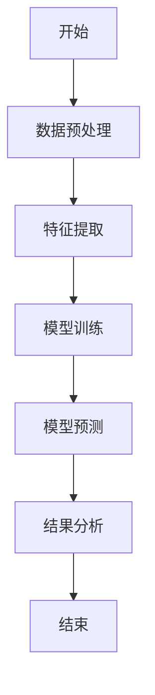
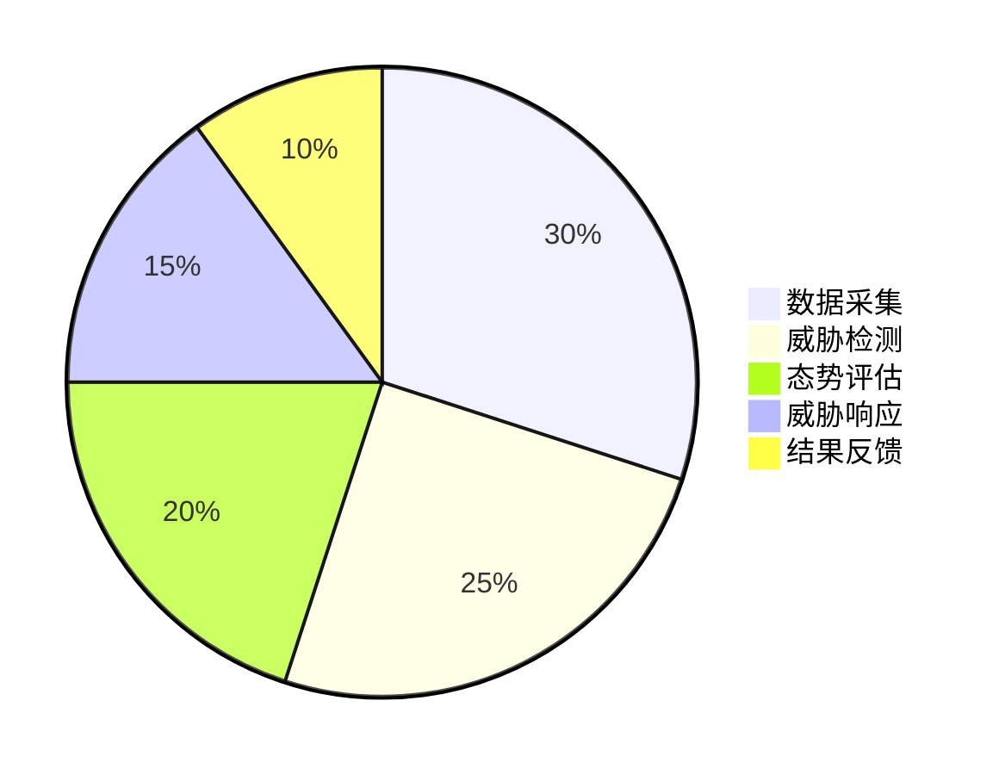
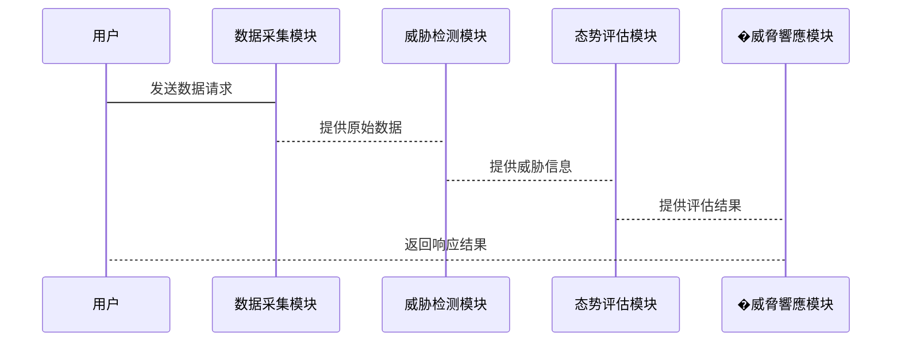

                 


# AI Agent在企业网络安全态势感知与威胁响应中的应用

## 关键词：AI Agent，网络安全，态势感知，威胁响应，自动化安全

## 摘要：随着网络安全威胁的日益复杂化，传统的安全监控手段已难以应对新型攻击方式。本文深入探讨了AI Agent在企业网络安全态势感知与威胁响应中的应用，分析了其核心概念、算法原理、系统架构，并通过实际案例展示了其在项目中的应用，最后给出了最佳实践建议。文章内容涵盖了从基础概念到高级应用的各个方面，为读者提供了全面的视角。

---

# 第1章: AI Agent与网络安全态势感知概述

## 1.1 AI Agent的基本概念

### 1.1.1 AI Agent的定义
AI Agent（人工智能代理）是一种能够感知环境、自主决策并执行任务的智能实体。它可以基于传感器输入、历史数据或用户指令，通过学习和推理，主动采取行动以实现目标。

### 1.1.2 AI Agent的核心特征
- **自主性**：能够独立决策和行动。
- **反应性**：能够实时感知环境变化并做出响应。
- **学习能力**：通过数据和经验不断优化自身行为。
- **协作性**：能够与其他系统或AI Agent协同工作。

### 1.1.3 AI Agent与传统安全工具的区别
传统安全工具通常基于规则或静态配置进行威胁检测和响应，而AI Agent具备动态学习和自主决策能力，能够应对未知威胁和复杂场景。

## 1.2 网络安全态势感知的定义与特点

### 1.2.1 网络安全态势感知的定义
网络安全态势感知是指通过对网络环境中的各种安全事件、威胁情报和系统状态的综合分析，评估网络安全的整体状态，并预测未来安全趋势的过程。

### 1.2.2 网络安全态势感知的核心特点
- **实时性**：能够实时采集和分析网络数据。
- **全面性**：覆盖网络中的各种安全要素。
- **智能化**：通过AI技术进行分析和预测。
- **可操作性**：提供可执行的威胁响应建议。

### 1.2.3 网络安全态势感知与传统安全监控的区别
传统安全监控主要依赖人工或简单规则进行威胁检测，而态势感知通过大数据分析和AI技术，能够发现隐藏的威胁模式，并提供更全面的威胁情报。

## 1.3 AI Agent在网络安全态势感知中的应用背景

### 1.3.1 当前网络安全威胁的复杂性
现代网络安全威胁日益复杂，攻击者采用高级持续性威胁（APT）、零日攻击等新型攻击方式，传统安全手段难以应对。

### 1.3.2 传统网络安全监控的局限性
传统监控系统依赖固定规则，难以应对未知威胁，且缺乏智能化的分析能力，导致漏报和误报现象严重。

### 1.3.3 AI Agent的优势与潜力
AI Agent具备自主学习和动态适应能力，能够实时感知网络环境变化，并快速响应威胁，是提升网络安全态势感知能力的关键技术。

## 1.4 本章小结
本章介绍了AI Agent和网络安全态势感知的基本概念，并分析了AI Agent在网络安全态势感知中的应用背景。通过对比传统安全监控手段的局限性，突出了AI Agent的优势和潜力。

---

# 第2章: AI Agent与网络安全态势感知的核心概念

## 2.1 网络安全态势感知的模型与方法

### 2.1.1 基于AI Agent的态势感知模型
基于AI Agent的态势感知模型是一种动态、自适应的模型，能够根据网络环境的变化实时调整分析策略。

### 2.1.2 基于规则的态势感知方法
基于规则的态势感知方法依赖预定义的安全规则和特征，适用于已知威胁的检测和分析。

### 2.1.3 基于统计的态势感知方法
基于统计的态势感知方法通过分析网络流量和日志数据中的异常行为，发现潜在威胁。

## 2.2 威胁响应的核心机制

### 2.2.1 威胁检测与识别
通过AI Agent实时监控网络流量和日志数据，识别潜在威胁事件。

### 2.2.2 威胁评估与优先级排序
根据威胁的严重性、影响范围和发生概率，对威胁进行评估和优先级排序。

### 2.2.3 自动化威胁响应
基于评估结果，AI Agent自动执行相应的威胁响应措施，如封锁可疑IP、隔离受感染设备等。

## 2.3 AI Agent在威胁响应中的角色

### 2.3.1 AI Agent作为威胁检测器
AI Agent能够实时监控网络环境，发现异常行为和潜在威胁。

### 2.3.2 AI Agent作为威胁响应器
在检测到威胁后，AI Agent能够快速采取行动，如阻断攻击、隔离设备等。

### 2.3.3 AI Agent作为威胁学习者
通过学习历史威胁数据和攻击模式，AI Agent不断优化自身的威胁检测和响应能力。

## 2.4 核心概念对比与分析

### 2.4.1 不同态势感知模型的对比分析
| 模型类型       | 优势                       | 局限性                     |
|----------------|---------------------------|--------------------------|
| 基于AI Agent   | 高度动态适应，自主学习     | 对计算资源要求较高         |
| 基于规则       | 易于实现，规则明确           | 难以应对未知威胁             |
| 基于统计       | 能发现异常模式             | 结果可能存在误报或漏报         |

### 2.4.2 不同威胁响应机制的对比分析
| 响应机制       | 优势                       | 局限性                     |
|----------------|---------------------------|--------------------------|
| 自动化响应     | 快速响应，减少人工干预       | 可能出现误操作             |
| 半自动化响应   | 人工辅助，降低误操作风险     | 响应速度较慢               |
| 手动响应       | 适用于复杂情况，可人为判断   | 响应速度最慢               |

### 2.4.3 AI Agent与其他安全工具的协同关系
AI Agent可以与防火墙、入侵检测系统（IDS）、安全信息和事件管理（SIEM）等工具协同工作，形成完整的安全防护体系。

## 2.5 本章小结
本章分析了网络安全态势感知的不同模型和威胁响应机制，探讨了AI Agent在其中的角色，并通过对比分析突出了AI Agent的优势和应用价值。

---

# 第3章: AI Agent的算法原理与实现

## 3.1 基于AI Agent的网络安全态势感知算法

### 3.1.1 算法概述
基于AI Agent的网络安全态势感知算法通常包括数据预处理、特征提取、模型训练和预测几个阶段。

### 3.1.2 算法流程图



### 3.1.3 算法实现代码
以下是基于机器学习的威胁检测算法实现示例：

```python
import numpy as np
from sklearn import datasets
from sklearn.ensemble import RandomForestClassifier

# 示例数据集
X, y = datasets.make_classification(n_samples=1000, n_features=20, n_classes=2)

# 模型训练
model = RandomForestClassifier()
model.fit(X, y)

# 预测
new_samples = np.random.rand(10, 20)
predictions = model.predict(new_samples)
print("预测结果:", predictions)
```

## 3.2 算法实现细节

### 3.2.1 数据预处理
数据预处理包括数据清洗、特征选择和数据标准化等步骤，以提高模型的准确性和稳定性。

### 3.2.2 特征提取
特征提取是将原始数据转换为能够反映威胁特征的向量或指标，例如IP地址、流量大小、时间戳等。

### 3.2.3 模型训练与优化
通过训练数据优化模型参数，选择合适的算法（如随机森林、支持向量机等）以提高分类准确率。

## 3.3 算法的数学模型与公式

### 3.3.1 概率计算公式
$$ P(class|data) = \frac{P(data|class) \cdot P(class)}{P(data)} $$

### 3.3.2 分类算法公式
$$ y = f(x) $$

其中，\( y \) 是预测结果，\( x \) 是输入数据，\( f \) 是分类模型。

## 3.4 本章小结
本章详细介绍了基于AI Agent的网络安全态势感知算法的实现过程，包括数据预处理、特征提取、模型训练和预测等步骤，并通过代码示例和数学公式进行了详细讲解。

---

# 第4章: 网络安全态势感知的系统架构与设计

## 4.1 系统分析与架构设计

### 4.1.1 系统功能设计
系统功能包括数据采集、威胁检测、态势评估、威胁响应和结果反馈等模块。

### 4.1.2 系统架构图



### 4.1.3 系统接口设计
系统需要与网络设备、日志系统、威胁情报平台等进行接口对接，确保数据的实时性和完整性。

### 4.1.4 系统交互流程图



## 4.2 系统实现细节

### 4.2.1 数据采集模块
数据采集模块负责从网络设备、日志系统等来源获取实时数据，并进行初步处理。

### 4.2.2 威胁检测模块
威胁检测模块基于AI算法对采集的数据进行分析，识别潜在威胁。

### 4.2.3 态势评估模块
态势评估模块综合分析当前网络环境的威胁情况，评估整体安全态势。

### 4.2.4 威胁响应模块
威胁响应模块根据评估结果，执行相应的响应措施，如封锁IP、隔离设备等。

## 4.3 系统优化与调优

### 4.3.1 性能优化
通过并行计算、分布式处理等技术优化系统性能，提高处理效率。

### 4.3.2 模型调优
通过交叉验证、网格搜索等方法优化模型参数，提高分类准确率。

### 4.3.3 系统可扩展性设计
设计模块化架构，确保系统能够适应未来业务扩展需求。

## 4.4 本章小结
本章详细分析了网络安全态势感知系统的架构设计与实现细节，探讨了系统各模块的功能和交互关系，并提出了性能优化和系统扩展的建议。

---

# 第5章: 项目实战——基于AI Agent的网络安全态势感知系统

## 5.1 项目背景与目标

### 5.1.1 项目背景
随着企业网络规模的不断扩大，网络安全威胁日益复杂，传统的安全监控手段已难以应对。

### 5.1.2 项目目标
开发一个基于AI Agent的网络安全态势感知系统，实现对网络威胁的实时检测、评估和响应。

## 5.2 项目实施步骤

### 5.2.1 环境安装
安装必要的开发工具和依赖库，如Python、Jupyter Notebook、Scikit-learn等。

### 5.2.2 数据采集与预处理
通过网络设备和日志系统采集数据，并进行清洗和特征提取。

### 5.2.3 模型训练与部署
选择合适的机器学习算法，训练模型并部署到生产环境。

### 5.2.4 系统集成与测试
将各模块集成到统一的系统中，并进行功能测试和性能调优。

## 5.3 项目核心代码实现

### 5.3.1 数据预处理代码
```python
import pandas as pd

# 示例数据集
data = {
    'ip_address': ['192.168.1.1', '192.168.1.2', ...],
    'timestamp': ['2023-10-01 10:00:00', ...],
    'traffic_volume': [100, 200, ...]
}
df = pd.DataFrame(data)
```

### 5.3.2 威胁检测代码
```python
from sklearn.model_selection import train_test_split
from sklearn.metrics import accuracy_score

# 数据分割
X_train, X_test, y_train, y_test = train_test_split(df.drop('label', axis=1), df['label'], test_size=0.2)

# 模型训练
model = RandomForestClassifier()
model.fit(X_train, y_train)

# 模型预测
y_pred = model.predict(X_test)
print("准确率:", accuracy_score(y_test, y_pred))
```

### 5.3.3 威胁响应代码
```python
def automated_response(predicted_threats):
    for threat in predicted_threats:
        if threat['severity'] >= 0.8:
            # 封锁IP
            block_ip(threat['ip_address'])
            # 隔离设备
            isolate_device(threat['device_id'])
```

## 5.4 项目案例分析

### 5.4.1 案例背景
某企业遭受勒索软件攻击，AI Agent系统成功检测并快速响应，阻止了攻击的进一步蔓延。

### 5.4.2 案例分析
- **数据采集**：系统采集了网络流量和日志数据。
- **威胁检测**：AI Agent检测到异常的网络通信和可疑文件下载行为。
- **态势评估**：系统评估威胁为高风险，优先级最高。
- **威胁响应**：系统自动封锁了可疑IP并隔离了受感染设备。

## 5.5 项目小结
本章通过一个实际项目展示了基于AI Agent的网络安全态势感知系统的开发与应用，详细讲解了项目的实施步骤和核心代码实现，并通过案例分析验证了系统的有效性和实用性。

---

# 第6章: 数学模型与公式深度分析

## 6.1 基于概率论的威胁评估模型

### 6.1.1 概率计算公式
$$ P(威胁发生) = P(特征1) \cdot P(特征2) \cdot ... \cdot P(特征n) $$

### 6.1.2 模型优势
- 能够量化威胁发生的概率，提供决策依据。
- 可以根据特征的重要性进行加权计算。

## 6.2 基于统计学习的分类模型

### 6.2.1 分类算法公式
$$ y = f(x) $$

其中，\( f \) 是训练好的分类模型，\( x \) 是输入特征向量。

### 6.2.2 模型优化
通过交叉验证和网格搜索优化模型参数，提高分类准确率。

## 6.3 数学模型的实现与应用

### 6.3.1 模型实现
```python
from sklearn.naive_bayes import GaussianNB

model = GaussianNB()
model.fit(X_train, y_train)
```

### 6.3.2 模型应用
将实时采集的数据输入模型，进行威胁检测和分类。

## 6.4 本章小结
本章通过数学模型和公式分析了基于AI Agent的网络安全态势感知系统的实现原理，详细讲解了概率计算和分类算法的应用。

---

# 第7章: 最佳实践与小结

## 7.1 最佳实践

### 7.1.1 系统部署建议
- 确保系统具备足够的计算资源。
- 定期更新模型和规则库。
- 建立完善的日志和监控体系。

### 7.1.2 安全策略优化
- 制定合理的威胁响应策略。
- 定期进行安全演练和漏洞测试。
- 加强员工的安全意识培训。

## 7.2 小结
本文系统地探讨了AI Agent在企业网络安全态势感知与威胁响应中的应用，分析了其核心概念、算法原理和系统架构，并通过项目实战展示了其应用价值。通过本文的分析，读者可以深入了解AI Agent在网络安全中的重要作用，并为实际应用提供参考。

## 7.3 注意事项

### 7.3.1 数据隐私保护
在数据采集和处理过程中，必须严格遵守数据隐私保护法规，确保用户数据的安全。

### 7.3.2 系统稳定性保障
确保系统的高可用性和稳定性，避免因系统故障导致安全漏洞。

## 7.4 拓展阅读
- 《AI在网络安全中的应用》
- 《基于机器学习的威胁检测技术研究》
- 《网络安全态势感知系统设计与实现》

---

# 作者：AI天才研究院 & 禅与计算机程序设计艺术

---

以上是《AI Agent在企业网络安全态势感知与威胁响应中的应用》的技术博客文章，内容涵盖从基础概念到实际应用的各个方面，结合理论分析和实践案例，为读者提供了全面的视角和深入的见解。

