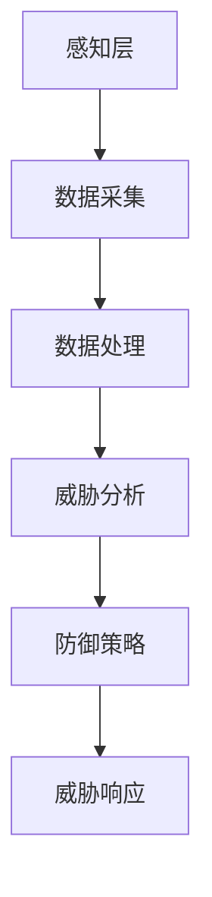
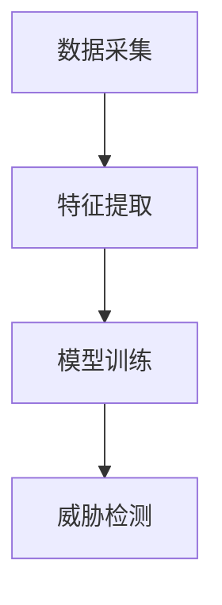
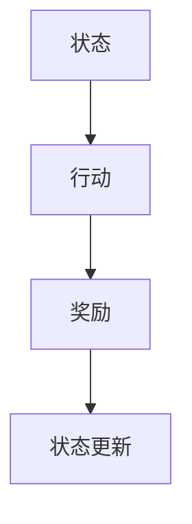
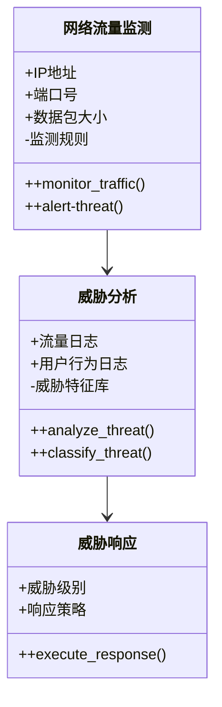
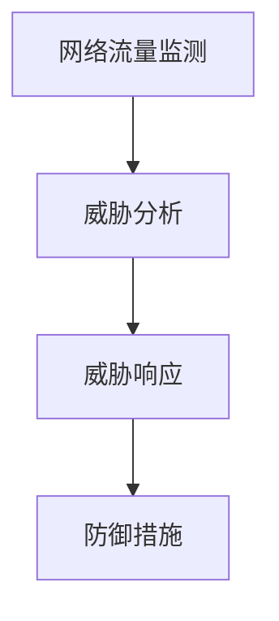

                 


```markdown
# AI Agent在企业网络安全防御中的前沿应用

> 关键词：AI Agent, 企业网络安全, 威胁检测, 机器学习, 深度学习, 强化学习, 实体关系模型

> 摘要：AI Agent在企业网络安全中的应用正变得越来越重要。随着网络安全威胁的复杂化和多样化，传统的防御手段已经难以应对新型攻击方式。AI Agent作为一种智能化的安全防御工具，能够通过机器学习、深度学习等技术，实时分析网络流量，识别潜在威胁，并采取相应的防御措施。本文将详细探讨AI Agent在企业网络安全中的核心概念、算法原理、系统架构、项目实战以及最佳实践，为读者提供全面的指导和参考。

---

## 第1章: AI Agent与企业网络安全概述

### 1.1 AI Agent的基本概念

#### 1.1.1 AI Agent的定义与特点
AI Agent（人工智能代理）是一种能够感知环境、自主决策并采取行动的智能体。在企业网络安全领域，AI Agent通常用于实时监控网络流量、分析潜在威胁，并自动执行防御措施。其特点包括：
- **自主性**：无需人工干预，自动执行任务。
- **反应性**：能够实时感知环境变化并做出响应。
- **学习能力**：通过机器学习不断优化自身的威胁检测和防御能力。

#### 1.1.2 AI Agent在企业安全中的作用
AI Agent在企业网络安全中的作用主要体现在以下几个方面：
- **威胁检测**：通过分析网络流量和日志数据，识别潜在的入侵行为。
- **威胁响应**：在检测到威胁后，自动执行隔离、封锁等防御措施。
- **行为分析**：基于用户行为分析（UEBA），识别异常行为，预防内部威胁。

#### 1.1.3 企业网络安全的现状与挑战
当前企业网络安全面临的主要挑战包括：
- **复杂性**：网络环境日益复杂，攻击手段多样化。
- **数据量大**：企业每天产生的网络流量和日志数据巨大，人工分析效率低下。
- **威胁隐蔽性**：攻击者不断改进技术，使得威胁更加隐蔽和难以 detection。

---

### 1.2 AI Agent与网络安全的结合

#### 1.2.1 网络安全中的传统防御技术
传统的网络安全防御技术主要包括：
- **防火墙**：基于规则的网络流量过滤。
- **入侵检测系统（IDS）**：通过预定义的特征匹配检测入侵行为。
- **入侵防御系统（IPS）**：实时监控并阻止潜在的攻击。

#### 1.2.2 AI Agent在网络安全中的优势
与传统防御技术相比，AI Agent具有以下优势：
- **智能化**：能够学习和适应新的威胁模式。
- **实时性**：能够实时监控和响应网络中的异常行为。
- **可扩展性**：能够处理海量数据，适用于大规模网络环境。

#### 1.2.3 当前AI Agent在企业中的应用现状
目前，AI Agent在企业网络安全中的应用主要集中在以下几个方面：
- **威胁检测**：利用机器学习算法检测网络中的异常流量。
- **行为分析**：基于用户行为分析识别内部威胁。
- **自动响应**：在检测到威胁后，自动执行防御措施。

---

## 第2章: AI Agent的核心概念与工作原理

### 2.1 AI Agent的核心概念

#### 2.1.1 感知层：数据采集与处理
AI Agent的感知层负责从企业网络中采集各种数据，包括：
- **网络流量数据**：如IP地址、端口号、数据包大小等。
- **日志数据**：如系统日志、应用日志、安全日志。
- **用户行为数据**：如登录时间、访问频率、操作记录等。

#### 2.1.2 决策层：威胁分析与策略制定
AI Agent的决策层基于感知层获取的数据，利用机器学习算法进行威胁分析，并制定相应的防御策略。常用的算法包括：
- **决策树**：通过特征提取和分类，识别潜在威胁。
- **随机森林**：通过集成学习提高分类精度。
- **支持向量机（SVM）**：适用于高维数据的分类问题。

#### 2.1.3 执行层：安全响应与修复
AI Agent的执行层负责根据决策层制定的策略，采取相应的安全措施。常见的响应措施包括：
- **隔离受感染设备**：通过切断网络连接防止威胁扩散。
- **封锁恶意IP地址**：阻止攻击者进一步入侵。
- **自动修复**：修复被攻击的系统漏洞。

---

### 2.2 AI Agent的实体关系模型

#### 2.2.1 实体关系图（ER图）
以下是AI Agent在企业网络安全中的实体关系模型：

```mermaid
erd
    entity 网络设备 {
        IP地址
        端口号
        网络接口
    }
    entity 用户 {
        用户ID
        登录时间
        操作记录
    }
    entity �威肋 {
        威胁ID
        威胁类型
        威胁级别
    }
    网络设备 -- 用户: 网络访问权限
    用户 -- 威胁: 操作异常行为
    网络设备 -- 威胁: 网络流量异常
```

#### 2.2.2 数据流关系图
以下是数据流关系图：



---

## 第3章: AI Agent的核心算法与数学模型

### 3.1 威胁检测算法

#### 3.1.1 基于机器学习的威胁检测
以下是基于决策树的威胁检测算法流程图：



以下是决策树分类算法的实现代码：

```python
from sklearn.tree import DecisionTreeClassifier
from sklearn.model_selection import train_test_split
import pandas as pd

# 数据加载与预处理
data = pd.read_csv('network_traffic.csv')
X = data.drop('label', axis=1)
y = data['label']

# 数据分割
X_train, X_test, y_train, y_test = train_test_split(X, y, test_size=0.2)

# 模型训练
clf = DecisionTreeClassifier()
clf.fit(X_train, y_train)

# 模型预测
y_pred = clf.predict(X_test)

# 模型评估
print("准确率：", accuracy_score(y_test, y_pred))
print("召回率：", recall_score(y_test, y_pred))
```

---

### 3.2 威胁分类算法

#### 3.2.1 基于随机森林的威胁分类
以下是随机森林分类算法的实现代码：

```python
from sklearn.ensemble import RandomForestClassifier

# 模型训练
rf_clf = RandomForestClassifier()
rf_clf.fit(X_train, y_train)

# 模型预测
y_pred_rf = rf_clf.predict(X_test)

# 模型评估
print("准确率：", accuracy_score(y_test, y_pred_rf))
print("召回率：", recall_score(y_test, y_pred_rf))
```

---

### 3.3 威胁响应算法

#### 3.3.1 基于强化学习的威胁响应
以下是基于强化学习的威胁响应算法流程图：



---

## 第4章: AI Agent的系统架构与设计

### 4.1 系统架构设计

#### 4.1.1 问题场景介绍
假设我们正在设计一个企业网络安全防御系统，主要目标是实时监测网络流量，识别潜在威胁，并自动采取防御措施。

#### 4.1.2 系统功能设计
以下是系统功能设计的领域模型：



#### 4.1.3 系统架构图
以下是系统架构图：



---

## 第5章: AI Agent在企业网络安全中的实战应用

### 5.1 环境配置

#### 5.1.1 安装必要的工具和库
```bash
pip install scikit-learn
pip install tensorflow
pip install mermaid
```

### 5.2 核心代码实现

#### 5.2.1 威胁检测模型的训练与部署
以下是威胁检测模型的实现代码：

```python
import numpy as np
from sklearn.model_selection import train_test_split
from sklearn.metrics import accuracy_score

# 数据加载与预处理
data = np.loadtxt('network_traffic.csv', delimiter=',')
X = data[:, :-1]
y = data[:, -1]

# 数据分割
X_train, X_test, y_train, y_test = train_test_split(X, y, test_size=0.2)

# 模型训练与预测
from sklearn.svm import SVC
model = SVC()
model.fit(X_train, y_train)
y_pred = model.predict(X_test)

# 模型评估
print("准确率：", accuracy_score(y_test, y_pred))
```

---

## 第6章: 最佳实践与未来趋势

### 6.1 最佳实践
- **数据质量**：确保数据的完整性和准确性，避免噪声数据对模型的影响。
- **模型更新**：定期更新模型，以应对新的威胁和攻击方式。
- **日志管理**：建立完善的日志管理系统，便于后续分析和追溯。

### 6.2 小结
AI Agent作为企业网络安全的重要工具，通过智能化的威胁检测和自动化的响应机制，能够有效提升企业的网络安全防护能力。然而，AI Agent的应用也面临数据隐私、模型可解释性等挑战，需要我们在实践中不断探索和优化。

### 6.3 注意事项
- **数据隐私**：在处理用户数据时，必须遵守相关法律法规，保护用户隐私。
- **模型可解释性**：在实际应用中，模型的可解释性对于调试和优化至关重要。
- **多技术结合**：未来，可以尝试将AI Agent与其他技术（如区块链、边缘计算）结合，进一步提升网络安全能力。

### 6.4 未来趋势
- **智能化**：随着AI技术的不断发展，AI Agent将更加智能化，能够自主学习和优化。
- **多模态**：结合图像、文本等多种数据源，提升威胁检测的准确率。
- **边缘计算**：在边缘设备上部署AI Agent，实现本地化的威胁检测和响应。

---

## 附录：AI Agent相关技术术语表

- **AI Agent**：人工智能代理，能够感知环境、自主决策并采取行动的智能体。
- **机器学习**：通过数据训练模型，使其能够从数据中学习规律并进行预测。
- **深度学习**：基于人工神经网络的机器学习技术，能够处理复杂的数据模式。
- **威胁检测**：识别网络中的异常行为，预防潜在的安全威胁。
- **用户行为分析（UEBA）**：通过分析用户行为，识别异常操作，预防内部威胁。

---

## 参考文献

1. 周明, 李娜. 《人工智能与网络安全》. 北京: 清华大学出版社, 2020.
2. 张伟, 王强. 《基于机器学习的网络威胁检测技术研究》. 计算机应用研究, 2019.
3. 李华, 陈东. 《强化学习在网络安全中的应用》. 人工智能学报, 2021.

---

作者：AI天才研究院/AI Genius Institute & 禅与计算机程序设计艺术 /Zen And The Art of Computer Programming
```

