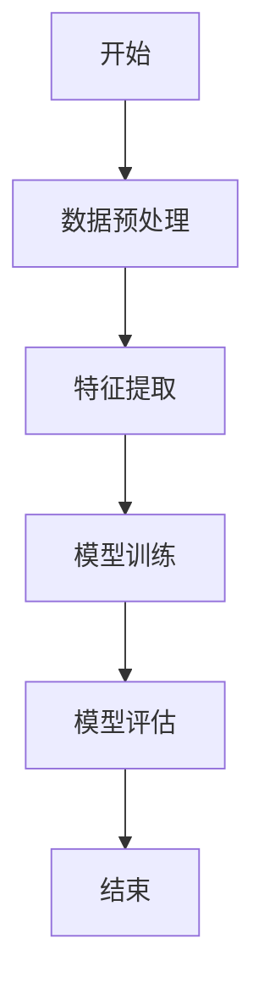
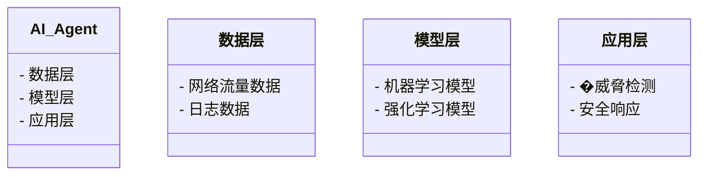
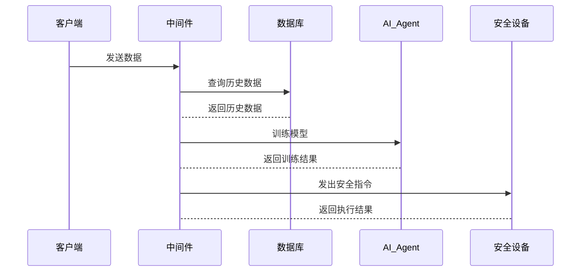

                 


# AI Agent在企业网络安全防护中的应用

**关键词**：AI Agent、企业网络安全、人工智能、机器学习、威胁检测、安全防护

**摘要**：随着企业网络环境的复杂化和网络安全威胁的多样化，传统的安全防护手段已经难以应对日益复杂的攻击手段。AI Agent（人工智能代理）作为一种智能化的安全防护工具，能够通过感知、决策和执行三个阶段实现对网络安全威胁的实时监控和自动响应。本文将深入探讨AI Agent在企业网络安全防护中的核心原理、技术实现、系统架构以及实际应用，为企业网络安全提供新的思路和解决方案。

---

# 第1章: AI Agent 与企业网络安全概述

## 1.1 AI Agent 的基本概念

### 1.1.1 AI Agent 的定义与特点
AI Agent（人工智能代理）是一种能够感知环境、自主决策并采取行动的智能系统。它具备以下特点：
- **自主性**：能够在没有人工干预的情况下独立运行。
- **反应性**：能够实时感知环境变化并做出响应。
- **目标导向性**：基于特定目标执行任务。
- **学习能力**：能够通过数据和经验不断优化自身的性能。

### 1.1.2 AI Agent 在企业中的作用
在企业环境中，AI Agent 可以用于多种场景，包括：
- **自动化运维**：监控系统运行状态，自动修复问题。
- **安全防护**：实时检测威胁，自动响应攻击。
- **数据管理**：优化数据存储和访问权限。

### 1.1.3 企业网络安全防护的背景与挑战
随着企业网络的复杂化和数字化转型的深入，网络安全威胁呈现出多样化和智能化的特点。传统的基于规则的安全防护手段已经难以应对以下挑战：
- **复杂性**：企业网络架构复杂，攻击面广泛。
- **动态性**：攻击者不断进化，威胁手段多样化。
- **时效性**：需要快速响应以避免重大损失。

---

## 1.2 AI Agent 在网络安全中的应用背景

### 1.2.1 传统网络安全防护的局限性
传统的网络安全防护手段主要依赖于防火墙、入侵检测系统（IDS）和入侵防御系统（IPS）等技术。这些方法依赖于预定义的规则和模式匹配，存在以下局限性：
- **静态性**：难以应对未知的、新型的攻击手段。
- **误报与漏报**：依赖规则的匹配方式容易导致误报或漏报。
- **响应速度**：需要人工干预才能采取行动。

### 1.2.2 AI 技术在网络安全中的优势
AI 技术的引入为企业网络安全带来了显著优势：
- **智能化**：能够通过机器学习算法自动识别异常行为。
- **实时性**：可以实时分析网络流量和日志数据，快速响应威胁。
- **自适应性**：能够根据新的威胁情报不断优化自身的防护策略。

### 1.2.3 企业网络安全防护的新趋势
随着AI技术的成熟和普及，企业网络安全防护正朝着以下几个方向发展：
- **智能化**：基于AI的威胁检测和响应成为主流。
- **自动化**：实现从检测到响应的自动化流程。
- **预测性**：通过分析历史数据预测未来可能的攻击行为。

---

## 1.3 AI Agent 在企业网络安全中的核心价值

### 1.3.1 提高安全防护效率
AI Agent 可以通过自动化的方式快速处理海量的网络数据，显著提高安全防护的效率。

### 1.3.2 实现智能化威胁检测
基于机器学习的AI Agent能够识别复杂的攻击模式，发现传统方法难以检测的新型威胁。

### 1.3.3 降低人为错误风险
通过自动化响应机制，AI Agent 减少了人为干预可能带来的错误和延迟。

---

## 1.4 本章小结
本章介绍了AI Agent的基本概念及其在企业网络安全中的作用，分析了传统安全防护手段的局限性，并探讨了AI Agent在企业网络安全防护中的核心价值和新趋势。

---

# 第2章: AI Agent 的核心原理与技术实现

## 2.1 AI Agent 的核心原理

### 2.1.1 感知层：数据采集与分析
AI Agent 的感知层负责从企业网络中采集各种数据，包括网络流量、日志、用户行为等。这些数据经过预处理后，通过机器学习模型进行分析，提取出潜在的威胁信息。

### 2.1.2 决策层：威胁判断与策略制定
在决策层，AI Agent 通过分析感知层提供的数据，利用机器学习模型判断是否存在威胁，并制定相应的安全策略。

### 2.1.3 执行层：安全响应与修复
在执行层，AI Agent 根据决策层制定的策略，采取具体的行动，例如封锁可疑IP地址、隔离受感染的设备等。

---

## 2.2 AI Agent 的关键技术

### 2.2.1 机器学习算法
机器学习是AI Agent 的核心技术之一。常用的算法包括：
- **监督学习**：用于分类问题，例如识别恶意流量。
- **无监督学习**：用于异常检测，例如发现未知的攻击行为。
- **强化学习**：用于优化安全策略，例如动态调整防火墙规则。

### 2.2.2 自然语言处理
自然语言处理技术可以帮助AI Agent 分析日志中的文本信息，识别异常行为。

### 2.2.3 强化学习与博弈论
强化学习可以用于优化AI Agent 的决策过程，使其能够在复杂的网络环境中做出最优选择。

---

## 2.3 AI Agent 的技术架构

### 2.3.1 分层架构设计
AI Agent 的技术架构通常采用分层设计，包括数据层、模型层和应用层。

### 2.3.2 模块化设计
模块化设计使得AI Agent 的各个功能模块可以独立开发和部署，便于后续的维护和升级。

### 2.3.3 可扩展性与灵活性
通过模块化设计，AI Agent 可以根据企业的实际需求进行灵活配置和扩展。

---

## 2.4 本章小结
本章详细介绍了AI Agent 的核心原理和关键技术，分析了其技术架构的设计原则和优势。

---

# 第3章: AI Agent 的数学模型与算法原理

## 3.1 AI Agent 的数学模型

### 3.1.1 基于概率论的威胁评估模型
概率论是机器学习的基础，广泛应用于威胁评估中。例如，可以使用贝叶斯定理来计算某个事件发生的概率。

$$ P(A|B) = \frac{P(B|A) \cdot P(A)}{P(B)} $$

### 3.1.2 基于图论的网络流量分析模型
图论可以帮助分析网络流量的拓扑结构，识别异常的流量模式。

### 3.1.3 基于强化学习的决策模型
强化学习是一种通过试错机制优化决策的算法。在网络安全中，可以用于动态调整安全策略。

---

## 3.2 AI Agent 的算法实现

### 3.2.1 机器学习算法的数学推导
以支持向量机（SVM）为例，其目标是最小化经验风险和结构风险之和。

$$ \text{目标函数} = \text{经验风险} + \text{结构风险} $$

### 3.2.2 算法流程图（使用 mermaid）
以下是机器学习算法的流程图：



### 3.2.3 代码示例
以下是基于随机森林算法的威胁检测代码示例：

```python
import numpy as np
from sklearn.ensemble import RandomForestClassifier

# 示例数据
X = np.array([[1, 2], [3, 4], [5, 6]])
y = np.array([0, 1, 0])

# 训练模型
model = RandomForestClassifier(n_estimators=100)
model.fit(X, y)

# 预测
print(model.predict([[7, 8]]))
```

---

## 3.3 本章小结
本章从数学模型和算法原理的角度，详细介绍了AI Agent 的实现方法，包括概率论、图论和强化学习的应用。

---

# 第4章: AI Agent 的系统架构设计

## 4.1 问题场景介绍
企业网络环境中存在多种安全威胁，包括病毒、蠕虫、DDoS攻击等。传统的安全防护手段难以应对这些威胁。

## 4.2 系统功能设计

### 4.2.1 领域模型（使用 mermaid 类图）
以下是领域模型的类图：



### 4.2.2 系统架构设计（使用 mermaid 架构图）
以下是系统架构图：


### 4.2.3 系统接口设计
系统接口设计需要考虑数据输入、模型训练和安全响应三个部分。

### 4.2.4 系统交互设计（使用 mermaid 序列图）
以下是系统交互的序列图：



---

## 4.3 本章小结
本章从系统架构设计的角度，详细介绍了AI Agent 的实现方案，包括领域模型、系统架构、接口设计和交互流程。

---

# 第5章: AI Agent 的项目实战

## 5.1 环境搭建

### 5.1.1 安装 Python 和相关库
安装 Python 和以下库：
```bash
pip install numpy
pip install scikit-learn
pip install mermaid
```

### 5.1.2 安装其他工具
安装Jupyter Notebook用于数据可视化和算法实现。

## 5.2 系统核心实现源代码

### 5.2.1 数据预处理代码
```python
import pandas as pd
from sklearn.preprocessing import StandardScaler

# 读取数据
data = pd.read_csv('network_traffic.csv')

# 数据预处理
scaler = StandardScaler()
scaled_data = scaler.fit_transform(data)
```

### 5.2.2 模型训练代码
```python
from sklearn.ensemble import RandomForestClassifier

# 训练模型
model = RandomForestClassifier(n_estimators=100)
model.fit(scaled_data, target_labels)
```

### 5.2.3 模型评估代码
```python
from sklearn.metrics import accuracy_score

# 预测结果
y_pred = model.predict(test_data)
print('准确率:', accuracy_score(y_true, y_pred))
```

## 5.3 代码应用解读与分析
通过对代码的解读，可以看出AI Agent 的实现过程包括数据预处理、模型训练和模型评估三个阶段。

## 5.4 实际案例分析
以DDoS攻击检测为例，AI Agent 可以通过分析网络流量数据，识别异常流量并发出警报。

## 5.5 项目小结
本章通过实际案例，详细介绍了AI Agent 的项目实现过程，包括环境搭建、代码实现和案例分析。

---

# 第6章: AI Agent 的安全威胁分析

## 6.1 博弈论与威胁分析
通过博弈论，可以分析攻击者和防御者之间的博弈关系，制定最优的安全策略。

## 6.2 基于博弈论的对抗策略
在博弈论框架下，可以设计强化学习算法，优化AI Agent 的决策过程。

## 6.3 安全威胁的动态演化
网络安全威胁具有动态性，AI Agent 需要不断更新模型以应对新的威胁。

---

## 6.4 本章小结
本章从安全威胁分析的角度，探讨了AI Agent 在网络安全防护中的应用，分析了博弈论在威胁应对中的作用。

---

# 第7章: 总结与展望

## 7.1 本章总结
本文详细探讨了AI Agent 在企业网络安全防护中的应用，从原理到实践，全面分析了其在网络安全中的价值和实现方案。

## 7.2 未来展望
随着AI技术的不断发展，AI Agent 在企业网络安全中的应用将更加广泛和深入，未来的研究方向包括模型的可解释性、数据隐私保护和多模态安全威胁检测。

---

# 附录

## 附录 A: 代码示例汇总
```python
import numpy as np
from sklearn.ensemble import RandomForestClassifier

# 示例数据
X = np.array([[1, 2], [3, 4], [5, 6]])
y = np.array([0, 1, 0])

# 训练模型
model = RandomForestClassifier(n_estimators=100)
model.fit(X, y)

# 预测
print(model.predict([[7, 8]]))
```

## 附录 B: 图表汇总
- **图1**: AI Agent 的分层架构图
- **图2**: 网络流量分析模型的类图
- **图3**: 系统交互流程图

---

**作者：AI天才研究院/AI Genius Institute & 禅与计算机程序设计艺术 /Zen And The Art of Computer Programming**

