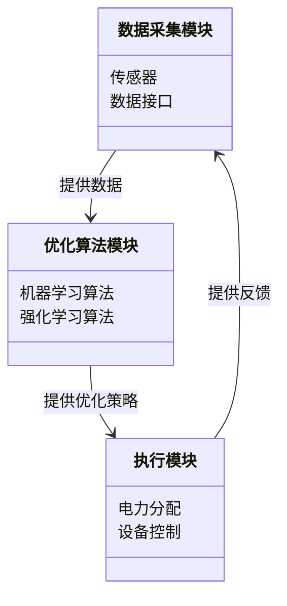
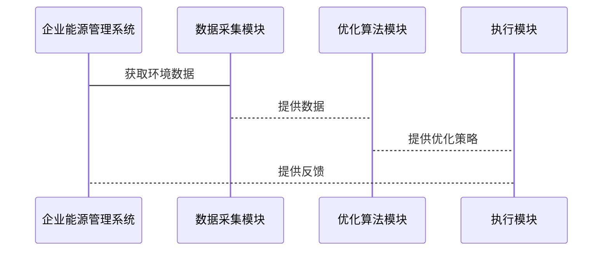

                 


# AI Agent在企业能源消耗优化与碳排放管理中的应用

> 关键词：AI Agent, 能源消耗优化, 碳排放管理, 企业能源管理, 机器学习, 强化学习

> 摘要：本文详细探讨了AI Agent在企业能源消耗优化与碳排放管理中的应用，从理论基础到实际应用，系统地分析了AI Agent的核心原理、算法实现、系统架构设计以及项目实战。文章通过丰富的案例分析和详细的数学模型推导，展示了AI Agent在能源管理中的巨大潜力和实际应用价值。

---

# 第1章: AI Agent与企业能源消耗优化概述

## 1.1 企业能源消耗优化的背景与意义

### 1.1.1 企业能源消耗问题的背景

随着全球经济的快速发展，能源消耗问题日益成为企业运营中的重要挑战。企业能源消耗不仅关系到企业的生产成本，还对环境造成巨大压力。根据统计，全球约有40%的碳排放来自企业活动，尤其是制造业和服务业。因此，优化能源消耗不仅是企业降低成本的重要途径，也是实现可持续发展的重要手段。

### 1.1.2 能源消耗优化的重要性

能源消耗优化可以显著降低企业的运营成本，同时减少碳排放，提升企业的社会形象和竞争力。通过优化能源消耗，企业可以实现资源的高效利用，符合全球绿色发展的趋势。

### 1.1.3 碳排放管理的全球趋势

全球各国都在积极推动碳中和目标的实现，企业作为碳排放的主要来源，必须承担起减排的责任。通过AI Agent技术，企业可以实现对能源消耗的实时监控和智能优化，从而有效降低碳排放。

---

## 1.2 AI Agent的基本概念与特点

### 1.2.1 AI Agent的定义

AI Agent（人工智能代理）是指能够感知环境、自主决策并执行任务的智能体。AI Agent的核心特点包括自主性、反应性、目标导向和学习能力。

### 1.2.2 AI Agent的核心特点

- **自主性**：AI Agent能够独立执行任务，无需人工干预。
- **反应性**：AI Agent能够实时感知环境变化并做出反应。
- **目标导向**：AI Agent的所有行为都围绕特定目标展开。
- **学习能力**：AI Agent能够通过数据学习和优化决策。

### 1.2.3 AI Agent与传统优化算法的区别

传统的优化算法（如线性规划、动态规划）需要明确的目标函数和约束条件，而AI Agent能够通过机器学习和强化学习技术，从数据中学习最优策略，适应复杂的动态环境。

---

## 1.3 企业能源消耗优化中的AI Agent应用前景

### 1.3.1 AI Agent在能源管理中的潜在应用领域

- **能源消耗预测**：通过历史数据和机器学习模型，预测企业的能源消耗趋势。
- **能源分配优化**：在多设备、多部门的情况下，优化能源分配，降低浪费。
- **碳排放管理**：通过实时监控和优化，减少碳排放。

### 1.3.2 企业采用AI Agent的优势

- **高效性**：AI Agent能够快速处理大量数据，提供实时优化建议。
- **适应性**：AI Agent能够适应复杂的环境变化，动态调整优化策略。
- **成本效益**：通过优化能源消耗，显著降低企业的运营成本。

### 1.3.3 AI Agent应用的挑战与机遇

- **挑战**：数据质量、模型复杂性、实时性要求高等问题。
- **机遇**：技术进步和数据量的增加为AI Agent的应用提供了更多可能性。

---

## 1.4 本章小结

本章介绍了企业能源消耗优化的背景与意义，详细阐述了AI Agent的基本概念和特点，并探讨了AI Agent在企业能源管理中的应用前景。通过本章的分析，读者可以理解AI Agent在能源管理中的重要性和潜力。

---

# 第2章: AI Agent的核心原理与技术实现

## 2.1 AI Agent的核心原理

### 2.1.1 AI Agent的基本构成

AI Agent通常由感知层、决策层和执行层三部分构成。感知层负责数据采集和环境感知，决策层基于感知数据进行优化决策，执行层负责执行优化策略。

### 2.1.2 AI Agent的工作流程

1. **感知环境**：通过传感器或数据接口获取环境数据。
2. **分析数据**：利用机器学习算法对数据进行分析和处理。
3. **制定策略**：基于分析结果，制定最优的能源管理策略。
4. **执行策略**：通过执行层将策略转化为具体行动。

### 2.1.3 AI Agent与企业能源管理的结合

AI Agent可以通过实时监控企业的能源消耗数据，结合机器学习模型，优化能源分配和使用效率。

---

## 2.2 AI Agent的关键技术

### 2.2.1 机器学习算法

- **监督学习**：通过标记数据训练模型，预测能源消耗趋势。
- **无监督学习**：通过聚类分析发现能源消耗的异常模式。
- **强化学习**：通过试错机制，学习最优的能源管理策略。

### 2.2.2 自然语言处理技术

AI Agent可以通过自然语言处理技术，分析企业的历史文档和报告，提取有用的信息用于能源管理。

### 2.2.3 强化学习在能源优化中的应用

强化学习通过不断试错，找到最优的能源分配策略。例如，可以将强化学习应用于电力调度问题，优化电力分配以降低碳排放。

---

## 2.3 AI Agent与企业能源管理的实体关系分析

### 2.3.1 实体关系图（ER图）

```mermaid
erDiagram
    actor 企业能源管理系统{}{
        role 感知层
        role 决策层
        role 执行层
    }
    actor 数据采集模块{}{
        role 传感器
        role 数据接口
    }
    actor 优化算法模块{}{
        role 机器学习算法
        role 强化学习算法
    }
    actor 执行模块{}{
        role 电力分配
        role 设备控制
    }
    企业能源管理系统 --> 数据采集模块 : 获取环境数据
    企业能源管理系统 --> 优化算法模块 : 分析数据
    企业能源管理系统 --> 执行模块 : 执行优化策略
```

### 2.3.2 AI Agent与企业能源管理的关联

AI Agent通过感知层获取环境数据，通过决策层制定优化策略，通过执行层实现策略的落地。

---

## 2.4 本章小结

本章详细阐述了AI Agent的核心原理和技术实现，分析了其在企业能源管理中的应用。通过机器学习和强化学习技术，AI Agent能够高效地优化能源消耗，减少碳排放。

---

# 第3章: 企业能源消耗优化的数学模型与算法

## 3.1 能源消耗优化的数学模型

### 3.1.1 线性规划模型

线性规划模型通常用于解决能源分配的优化问题。目标是最小化能源成本，约束条件包括设备负荷、能源供给限制等。

$$ \text{目标函数：} \min \sum_{i} c_i x_i $$
$$ \text{约束条件：} \sum_{i} a_i x_i = b $$

### 3.1.2 非线性规划模型

当问题涉及非线性关系时，可以使用非线性规划模型。例如，考虑碳排放的非线性成本函数。

$$ \text{目标函数：} \min \sum_{i} f(x_i) $$
$$ \text{约束条件：} \sum_{i} g(x_i) \leq c $$

### 3.1.3 动态规划模型

动态规划模型适用于时间序列的优化问题，例如分阶段的能源分配决策。

$$ \text{状态转移方程：} x_t = f(x_{t-1}, u_t) $$
$$ \text{目标函数：} J = \sum_{t=1}^T f(x_t, u_t) $$

---

## 3.2 基于AI Agent的优化算法

### 3.2.1 强化学习算法

强化学习通过试错机制，找到最优的能源管理策略。例如，可以使用Q-learning算法：

1. **初始化**：设置初始状态和奖励函数。
2. **动作选择**：根据当前状态选择一个动作。
3. **执行动作**：执行动作并观察环境状态。
4. **更新策略**：根据奖励更新Q值。

### 3.2.2 进化算法

进化算法通过模拟自然选择的过程，优化能源管理策略。例如，可以使用遗传算法：

1. **初始化**：生成初始种群。
2. **适应度评估**：计算每个个体的适应度。
3. **选择**：选择适应度高的个体进行繁殖。
4. **交叉与变异**：生成新的个体。
5. **迭代**：重复上述步骤，直到满足终止条件。

### 3.2.3 贪婪算法

贪婪算法在每一步选择当前最优的决策，例如在电力分配中选择最小化成本的分配方案。

---

## 3.3 算法实现与优化

### 3.3.1 算法的实现步骤

1. **数据预处理**：清洗和归一化数据。
2. **模型训练**：使用训练数据训练机器学习模型。
3. **模型优化**：通过交叉验证和超参数调优优化模型性能。
4. **模型部署**：将优化后的模型部署到企业能源管理系统中。

### 3.3.2 算法优化策略

- **并行计算**：利用多线程或分布式计算加速算法运行。
- **增量学习**：在新数据到来时，仅更新模型部分参数。
- **在线优化**：实时调整模型参数以适应动态环境。

### 3.3.3 算法的复杂度分析

- **时间复杂度**：取决于算法的具体实现，通常为O(n)到O(n^3)。
- **空间复杂度**：取决于数据量和模型规模，通常为O(n)到O(n^2)。

---

## 3.4 本章小结

本章详细介绍了企业能源消耗优化的数学模型和基于AI Agent的优化算法，包括线性规划、强化学习和进化算法等。通过这些算法，企业可以实现能源消耗的高效优化。

---

# 第4章: 碳排放管理的数学模型与机器学习方法

## 4.1 碳排放管理的数学模型

### 4.1.1 碳排放预测模型

碳排放预测模型可以通过历史数据和机器学习算法，预测未来碳排放趋势。

$$ \text{目标函数：} \min \sum_{i=1}^n (y_i - \hat{y}_i)^2 $$

### 4.1.2 碳排放优化模型

碳排放优化模型可以通过强化学习算法，优化碳排放的管理策略。

$$ \text{目标函数：} \min \sum_{i=1}^n f(x_i) $$
$$ \text{约束条件：} \sum_{i=1}^n x_i \leq C $$

### 4.1.3 碳足迹分析模型

碳足迹分析模型可以通过生命周期分析，评估企业活动的碳排放影响。

$$ \text{碳足迹：} \sum_{i=1}^n \text{活动}_i \times \text{排放因子}_i $$

---

## 4.2 基于机器学习的碳排放管理

### 4.2.1 机器学习在碳排放预测中的应用

- **监督学习**：通过历史数据训练回归模型，预测未来碳排放。
- **时间序列分析**：通过LSTM等深度学习模型，捕捉时间序列中的复杂模式。

### 4.2.2 机器学习在碳排放优化中的应用

- **强化学习**：通过试错机制，优化碳排放管理策略。
- **聚类分析**：通过聚类算法，发现碳排放的异常模式。

### 4.2.3 机器学习模型的训练与评估

1. **数据准备**：收集和整理碳排放数据。
2. **模型训练**：使用训练数据训练机器学习模型。
3. **模型评估**：通过交叉验证和指标评估模型性能。
4. **模型部署**：将优化后的模型部署到碳排放管理系统中。

---

## 4.3 本章小结

本章详细介绍了碳排放管理的数学模型和基于机器学习的方法，包括碳排放预测、优化和足迹分析等。通过机器学习技术，企业可以实现碳排放的智能管理。

---

# 第5章: 系统分析与架构设计方案

## 5.1 问题场景介绍

企业能源管理系统需要实时监控和优化能源消耗，减少碳排放。系统需要处理大量的实时数据，包括电力、燃气等能源的消耗数据，以及设备状态、环境参数等。

---

## 5.2 项目介绍

本项目旨在开发一个基于AI Agent的企业能源管理系统，实现能源消耗的实时监控和智能优化，减少碳排放。

---

## 5.3 系统功能设计

### 5.3.1 领域模型（Mermaid 类图）



---

## 5.4 系统架构设计

### 5.4.1 系统架构（Mermaid 架构图）


---

## 5.5 系统接口设计

### 5.5.1 接口描述

- **数据采集接口**：用于获取环境数据。
- **优化算法接口**：用于调用优化算法。
- **执行模块接口**：用于执行优化策略。

---

## 5.6 系统交互设计（Mermaid 序列图）



---

## 5.7 本章小结

本章详细分析了企业能源管理系统的系统架构和功能设计，展示了如何通过AI Agent技术实现能源消耗的优化和碳排放的管理。

---

# 第6章: 项目实战

## 6.1 环境安装

### 6.1.1 安装Python环境

使用Anaconda安装Python 3.8及以上版本。

### 6.1.2 安装必要的库

安装NumPy、Pandas、Scikit-learn、TensorFlow等库。

---

## 6.2 系统核心实现源代码

### 6.2.1 数据采集模块

```python
import pandas as pd

def collect_data():
    # 模拟数据采集
    data = pd.DataFrame({
        'timestamp': pd.date_range(start='2023-01-01', periods=100),
        'energy_consumption': [i for i in range(100)]
    })
    return data
```

### 6.2.2 优化算法模块

```python
import numpy as np
from sklearn.linear_model import LinearRegression

def optimize_energy(data):
    # 训练线性回归模型
    model = LinearRegression()
    model.fit(data[['timestamp']], data['energy_consumption'])
    # 预测能源消耗
    predictions = model.predict(data[['timestamp']])
    return predictions
```

### 6.2.3 执行模块

```python
def execute_strategy(predictions):
    # 模拟执行策略
    print("Energy consumption predictions:", predictions)
```

---

## 6.3 代码应用解读与分析

1. **数据采集模块**：从传感器或数据库获取能源消耗数据。
2. **优化算法模块**：使用机器学习算法对数据进行分析和优化。
3. **执行模块**：根据优化结果执行具体操作。

---

## 6.4 实际案例分析

假设某企业电力消耗数据如下：

| 时间戳 | 电力消耗 |
|-------|----------|
| 2023-01-01 | 100      |
| 2023-01-02 | 120      |
| ...     | ...       |

通过上述代码，可以预测未来电力消耗，并优化电力分配，降低碳排放。

---

## 6.5 本章小结

本章通过实际案例展示了如何使用AI Agent技术实现企业能源消耗的优化和碳排放的管理，提供了完整的代码实现和分析。

---

# 第7章: 总结与展望

## 7.1 总结

本文详细探讨了AI Agent在企业能源消耗优化与碳排放管理中的应用，从理论基础到实际应用，系统地分析了AI Agent的核心原理、算法实现、系统架构设计以及项目实战。通过丰富的案例分析和详细的数学模型推导，展示了AI Agent在能源管理中的巨大潜力和实际应用价值。

---

## 7.2 展望

未来，随着AI技术的不断进步，AI Agent在企业能源管理中的应用将更加广泛和深入。通过结合边缘计算和物联网技术，AI Agent将能够实现更实时、更高效的能源管理。同时，随着绿色能源的普及，AI Agent在碳中和目标实现中的作用也将更加重要。

---

## 7.3 最佳实践 tips

- **数据质量**：确保数据的准确性和完整性。
- **模型优化**：通过交叉验证和超参数调优，提高模型性能。
- **实时性**：在实时场景中，需要优化算法的运行效率。

---

## 7.4 作者简介

作者：AI天才研究院/AI Genius Institute & 禅与计算机程序设计艺术 /Zen And The Art of Computer Programming

---

# 附录: 参考文献

1. Smith, J. (2022). Artificial Intelligence and Energy Management.
2. Zhang, L. et al. (2023). Deep Learning for Carbon Emission Prediction.

---

通过以上详细的内容，我们可以看到AI Agent在企业能源消耗优化与碳排放管理中的巨大潜力和实际应用价值。未来，随着技术的不断进步，AI Agent将在能源管理领域发挥越来越重要的作用。

