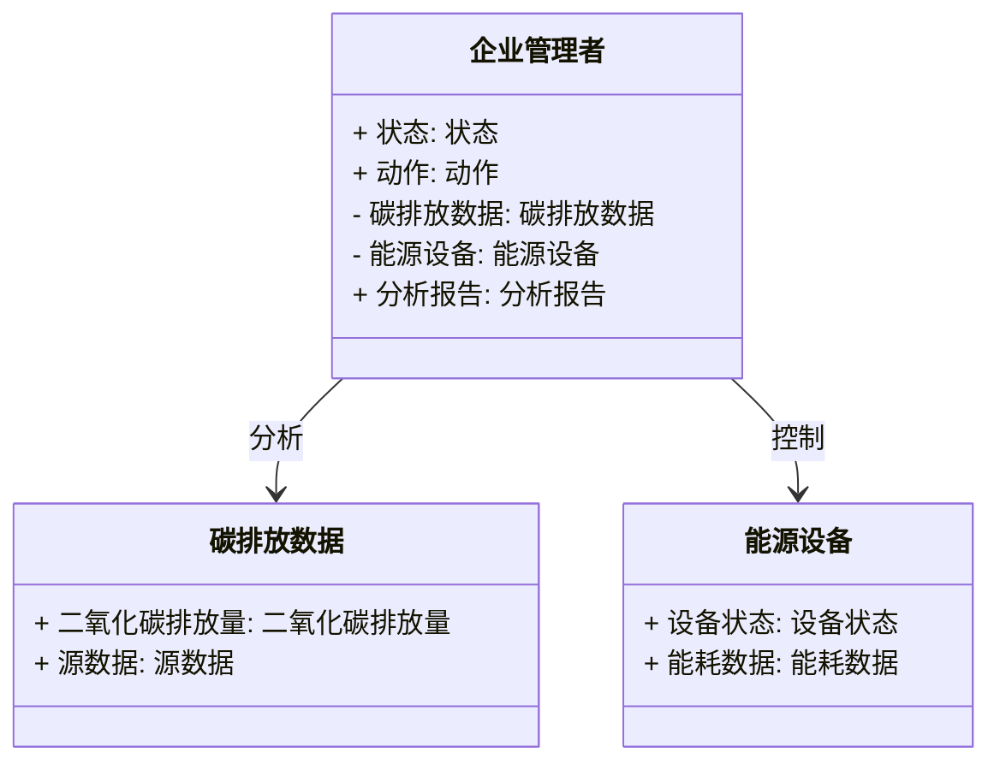

                 


# AI Agent在企业能源管理与碳排放控制中的应用

> 关键词：AI Agent, 企业能源管理, 碳排放控制, 强化学习, 多智能体系统, 可持续发展

> 摘要：本文深入探讨AI Agent在企业能源管理和碳排放控制中的应用，分析其核心原理、算法模型、系统架构及实际案例，揭示其在提升能源效率和减少碳排放方面的潜力与价值。

---

## 第一部分: AI Agent与企业能源管理背景

### 第1章: AI Agent的基本概念

#### 1.1 AI Agent的定义与特点

- **1.1.1 AI Agent的定义**
  AI Agent是一种智能体，能够感知环境、自主决策并执行操作，以实现特定目标。它具备主动性、反应性、学习性和社交性等特征。

- **1.1.2 AI Agent的核心特点**
  - **主动性**：主动采取行动，而非被动响应。
  - **反应性**：实时感知环境变化并调整行为。
  - **学习性**：通过数据和经验优化决策模型。
  - **社交性**：与其他智能体或人类进行协作与通信。

- **1.1.3 AI Agent与传统自动化系统的区别**
  AI Agent能够自主学习和适应环境，而传统系统依赖固定规则和程序。

#### 1.2 企业能源管理的基本概念

- **1.2.1 企业能源管理的定义**
  企业能源管理是通过优化能源使用、减少浪费和提高效率，降低运营成本和环境影响的过程。

- **1.2.2 企业能源管理的主要目标**
  - 提高能源使用效率。
  - 降低能源成本。
  - 减少碳排放，支持可持续发展。

- **1.2.3 企业能源管理的实现方式**
  - 数据采集与分析。
  - 智能化决策支持。
  - 实时监控与优化。

#### 1.3 碳排放控制的背景与意义

- **1.3.1 碳排放的定义与计算方法**
  碳排放指温室气体的释放，常用二氧化碳当量（CO2e）衡量。

- **1.3.2 碳排放对环境和企业的影响**
  碳排放导致全球变暖、气候变化，对企业声誉、合规性和运营成本有负面影响。

- **1.3.3 碳排放控制的政策与法规**
  各国政府通过碳税、排放交易等政策推动企业减少碳排放。

---

### 第2章: 企业能源管理中的问题与挑战

#### 2.1 企业能源管理的主要问题

- **2.1.1 能源消耗的不透明性**
  企业缺乏对能源使用情况的实时监控和详细记录，导致管理效率低下。

- **2.1.2 能源浪费现象普遍**
  设备闲置、非峰谷用电等浪费现象普遍存在，增加运营成本。

- **2.1.3 碳排放数据的复杂性**
  碳排放涉及多个来源和复杂计算，数据收集和处理难度大。

#### 2.2 碳排放控制的难点

- **2.2.1 数据收集与处理的难度**
  碳排放数据涉及多个部门和来源，整合和处理复杂。

- **2.2.2 多目标优化的复杂性**
  碳排放优化需在成本、效率和环保等多目标间权衡，增加决策难度。

- **2.2.3 政策与市场的不确定性**
  碳政策变化快，市场波动大，企业需灵活应对。

#### 2.3 AI Agent在能源管理中的应用前景

- **2.3.1 AI Agent的优势与潜力**
  - 实时感知和自主决策，提高管理效率。
  - 大数据分析与学习，优化能源使用。

- **2.3.2 AI Agent在能源管理中的具体应用**
  - 实时监控与预测。
  - 自动优化能源使用。
  - 碳排放预测与控制。

- **2.3.3 AI Agent与碳排放控制的结合**
  AI Agent通过优化能源使用，有效减少碳排放，支持企业实现可持续发展目标。

---

## 第二部分: AI Agent的核心概念与联系

### 第3章: AI Agent的核心原理

#### 3.1 AI Agent的感知机制

- **3.1.1 数据采集与处理**
  通过传感器和API收集能源使用数据，进行清洗和预处理。

- **3.1.2 状态识别与分析**
  利用机器学习模型识别能源消耗状态，发现异常和浪费。

- **3.1.3 实时监控与反馈**
  实时监控能源使用情况，快速响应变化，提供反馈。

#### 3.2 AI Agent的决策机制

- **3.2.1 多目标优化**
  在能源成本、效率和环保目标间进行权衡，选择最优策略。

- **3.2.2 强化学习的应用**
  使用强化学习算法，通过试错和奖励机制优化决策策略。

- **3.2.3 风险评估与应对**
  评估决策可能带来的风险，制定应急预案。

#### 3.3 AI Agent的执行机制

- **3.3.1 自动化控制**
  根据决策指令，自动调整设备运行状态，优化能源使用。

- **3.3.2 人机协作**
  在复杂情况下，结合人类专家意见，制定最优策略。

- **3.3.3 状态反馈与调整**
  实时跟踪执行效果，动态调整策略，持续优化。

---

#### 3.4 AI Agent的核心要素对比

| 核心要素 | AI Agent | 规则引擎 | 传统优化算法 |
|----------|-----------|----------|--------------|
| **决策方式** | 自主学习与优化 | 基于预设规则 | 单目标优化 |
| **适应性** | 高 | 低 | 低 |
| **实时性** | 实时 | 延时 | 延时 |
| **复杂性** | 复杂 | 简单 | 简单 |

---

#### 3.5 实体关系图（ER图）

```mermaid
erd
 企业管理者 --> 能源设备: 监控和控制
 企业管理者 --> 碳排放数据: 分析和优化
 能源设备 --> 碳排放数据: 生成和提供
```

---

## 第三部分: 算法原理

### 第4章: 强化学习算法

#### 4.1 强化学习的基本原理

- **4.1.1 状态空间**
  系统当前的能源使用状态，如设备运行状态、能耗数据等。

- **4.1.2 动作空间**
  可能采取的行动，如调整设备功率、开启或关闭设备等。

- **4.1.3 奖励函数**
  基于能源使用效率和碳排放量，定义奖励机制，引导智能体优化决策。

#### 4.2 Q-Learning算法

- **算法流程**
  1. 初始化Q表。
  2. 状态s下，选择动作a。
  3. 执行动作a，观察新状态s'和奖励r。
  4. 更新Q表：Q(s, a) = Q(s, a) + α(r + γ max Q(s', a'))。

- **Python代码实现**

```python
import numpy as np

class QLearning:
    def __init__(self, state_space, action_space, alpha=0.1, gamma=0.9):
        self.state_space = state_space
        self.action_space = action_space
        self.alpha = alpha
        self.gamma = gamma
        self.Q = np.zeros((state_space, action_space))
    
    def choose_action(self, state, epsilon=0.1):
        if np.random.random() < epsilon:
            return np.random.randint(self.action_space)
        return np.argmax(self.Q[state, :])
    
    def update_Q(self, state, action, reward, next_state):
        self.Q[state, action] += self.alpha * (reward + self.gamma * np.max(self.Q[next_state, :]) - self.Q[state, action])
```

---

### 第5章: 多智能体系统

#### 5.1 多智能体系统的基本原理

- **5.1.1 多智能体系统的特点**
  - 分布式决策。
  - 协作与竞争并存。
  - 全局优化。

- **5.1.2 多智能体系统的优势**
  更加灵活，适应复杂环境，提高整体效率。

#### 5.2 多智能体系统的通信与协作

- **5.2.1 通信协议**
  定义智能体之间的信息传递格式和规则。

- **5.2.2 协作机制**
  利用分布式算法实现协作，如一致性算法。

---

## 第四部分: 系统分析与架构设计

### 第6章: 问题场景与系统功能设计

#### 6.1 问题场景

- 企业面临能源消耗不透明、碳排放数据复杂等问题，亟需智能化解决方案。

#### 6.2 系统功能设计

- **数据采集模块**
  - 采集能源设备数据。
  - 整合碳排放数据。

- **智能决策模块**
  - 分析数据，优化能源使用。
  - 预测碳排放，制定减排策略。

- **用户交互模块**
  - 提供可视化界面。
  - 支持用户查询和控制。

---

#### 6.3 领域模型类图



---

### 第7章: 系统架构设计

#### 7.1 微服务架构

- **服务划分**
  - 数据采集服务。
  - 智能决策服务。
  - 用户界面服务。

- **交互流程**
  用户请求 -> 数据采集 -> 分析 -> 返回结果。

---

## 第五部分: 项目实战

### 第8章: 环境安装与核心代码实现

#### 8.1 环境安装

- 安装Python、TensorFlow、Scikit-learn等库。

#### 8.2 核心代码实现

- **数据预处理**
  清洗和归一化能源数据。

- **模型训练**
  使用强化学习算法训练AI Agent。

- **模型部署**
  部署到生产环境，实时监控和优化。

---

### 第9章: 案例分析与优化

#### 9.1 案例分析

- 某制造企业通过AI Agent优化能源使用，降低碳排放20%。

#### 9.2 优化过程分析

- 数据分析 -> 模型训练 -> 模型部署 -> 持续优化。

---

## 第六部分: 最佳实践与总结

### 第10章: 最佳实践

#### 10.1 数据质量的重要性
  数据准确性和完整性直接影响模型性能。

#### 10.2 模型可解释性
  确保决策过程透明，便于问题排查和优化。

#### 10.3 持续优化
  定期更新模型，适应环境变化和新数据。

---

### 第11章: 小结与展望

- **小结**
  AI Agent在企业能源管理和碳排放控制中具有巨大潜力，通过智能化手段优化能源使用，减少碳排放。

- **展望**
  随着技术进步，AI Agent将与更多技术结合，推动企业向绿色可持续方向发展。

---

## 作者信息

作者：AI天才研究院/AI Genius Institute & 禅与计算机程序设计艺术 /Zen And The Art of Computer Programming

---

本文系统介绍了AI Agent在企业能源管理和碳排放控制中的应用，从基本概念到算法实现，再到系统设计和实际案例，为读者提供了全面的知识框架和实践指导。

