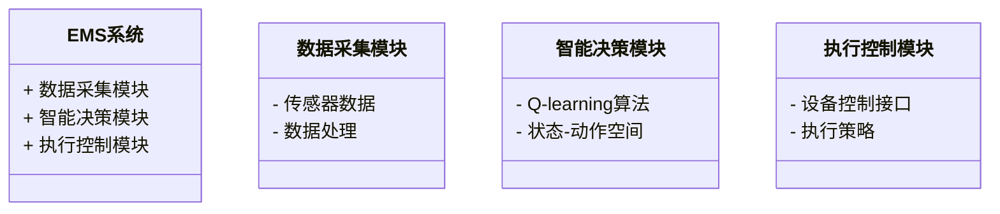

                 


# AI Agent在企业能源管理与节能减排中的应用

**关键词**：AI Agent、企业能源管理、节能减排、智能优化、机器学习

**摘要**：  
随着全球能源危机和环境问题的加剧，企业能源管理与节能减排已成为全球关注的焦点。AI Agent（人工智能代理）作为一种智能化的解决方案，能够通过感知、决策和执行优化能源管理流程，实现节能减排的目标。本文从AI Agent的核心原理出发，结合实际应用场景，详细探讨其在企业能源管理中的应用价值、系统架构、算法原理以及实际案例，为企业实现智能化能源管理提供理论支持和实践指导。

---

## 第一部分: AI Agent在企业能源管理与节能减排中的应用概述

### 第1章: AI Agent与企业能源管理的背景介绍

#### 1.1 问题背景与描述

企业能源管理是指对企业内部能源的使用、消耗和优化进行规划、监控和管理的过程。随着全球经济的快速发展和能源资源的有限性，能源消耗已成为企业运营成本的重要组成部分，同时也对环境造成巨大压力。因此，如何通过技术创新实现能源的高效利用和节能减排，成为企业面临的重要挑战。

AI Agent作为一种智能化的决策支持工具，能够通过实时感知环境、分析数据、制定决策并执行操作，帮助企业优化能源管理流程。AI Agent的核心优势在于其能够根据动态变化的环境条件（如能源价格波动、设备状态变化等）实时调整策略，从而实现能源的最优配置和使用。

#### 1.2 问题解决与边界

AI Agent在企业能源管理中的应用主要解决以下问题：

1. **能源消耗不均**：通过实时监控和分析，优化设备运行状态，减少能源浪费。
2. **节能减排目标难以实现**：通过智能决策，降低能源消耗，减少碳排放。
3. **传统能源管理效率低下**：通过自动化和智能化手段，提高管理效率，降低人工成本。

AI Agent的应用边界主要体现在以下方面：

- **技术限制**：AI Agent的性能依赖于算法和数据质量，复杂场景下的决策可能受到限制。
- **场景限制**：AI Agent的应用主要集中在能源消耗监测、设备优化控制等领域，无法覆盖能源管理的所有环节。
- **数据隐私**：企业能源数据的隐私性和安全性需要在AI Agent设计中予以考虑。

#### 1.3 核心概念与结构

AI Agent在企业能源管理中的应用涉及以下核心概念：

- **AI Agent**：能够感知环境、分析数据、制定决策并执行操作的智能体。
- **能源管理系统（EMS）**：用于监控和管理企业能源使用的系统，通常包括数据采集、分析、决策和执行模块。
- **节能减排目标函数**：用于衡量能源管理效果的数学模型，通常包括能源消耗、碳排放等关键指标。

---

## 第二部分: AI Agent的核心概念与原理

### 第2章: AI Agent的核心概念与原理

#### 2.1 AI Agent的原理与机制

AI Agent的核心原理包括以下几个方面：

1. **感知与数据采集**：通过传感器、数据库等渠道获取企业能源管理相关的数据，如设备运行状态、能源消耗量、环境参数等。
2. **知识表示与推理**：将获取的数据转化为知识表示，并通过推理引擎进行分析和决策。
3. **多智能体协同**：在复杂场景下，AI Agent需要与其他智能体协同工作，共同完成任务。

#### 2.2 核心概念对比与分析

以下是对AI Agent相关技术的对比分析：

**表1：AI Agent与规则引擎的对比**

| 特性         | 规则引擎                     | AI Agent                     |
|--------------|------------------------------|-------------------------------|
| 决策方式     | 基于预设规则                 | 基于数据学习和优化           |
| 灵活性       | 较低                        | 较高                         |
| 适用场景     | 简单、静态场景               | 复杂、动态场景               |

**图1：AI Agent与传统能源管理的实体关系图（ER图）**

```mermaid
erd
actor: AI Agent
actor -[驱动]-> EMS系统
EMS系统 -[提供]-> 能源数据
actor -[优化]-> 设备控制
```

---

## 第三部分: AI Agent的算法原理与数学模型

### 第3章: AI Agent的算法原理与数学模型

#### 3.1 强化学习算法

**3.1.1 Q-learning算法原理**

Q-learning是一种基于强化学习的算法，适用于动态环境下的决策问题。其核心思想是通过不断更新Q值（状态-动作对的期望收益）来优化决策策略。

**图2：Q-learning算法流程图**

```mermaid
graph TD
    A[状态s] --> B[动作a]
    B --> C[环境]
    C --> D[奖励r]
    D --> A
    A --> E[更新Q(s,a)]
```

**公式1：Q-learning算法的核心公式**

$$ Q(s,a) = r + \gamma \max Q(s',a') $$

其中：
- \( Q(s,a) \)：状态s下执行动作a的期望收益。
- \( r \)：执行动作a后获得的奖励。
- \( \gamma \)：折扣因子，用于平衡当前奖励和未来收益。
- \( Q(s',a') \)：新状态下各动作的期望收益。

**代码示例：Q-learning算法实现**

```python
import numpy as np

class QLearningAgent:
    def __init__(self, state_space, action_space, gamma=0.99):
        self.state_space = state_space
        self.action_space = action_space
        self.gamma = gamma
        self.q_table = np.zeros((state_space, action_space))

    def choose_action(self, state, epsilon=0.1):
        if np.random.random() < epsilon:
            return np.random.randint(self.action_space)
        else:
            return np.argmax(self.q_table[state])

    def update_q_table(self, current_state, action, reward, next_state):
        self.q_table[current_state][action] = reward + self.gamma * np.max(self.q_table[next_state])
```

---

## 第四部分: 企业能源管理系统与AI Agent的系统架构

### 第4章: 企业能源管理系统与AI Agent的系统架构

#### 4.1 系统功能设计

**图3：企业能源管理系统的功能模块**



---

## 第五部分: 项目实战与案例分析

### 第5章: 项目实战与案例分析

#### 5.1 环境安装与配置

**5.1.1 Python环境搭建**

- 安装Python 3.8及以上版本。
- 安装必要的库：`numpy`, `pandas`, `scikit-learn`, `mermaid`, `matplotlib`。

**代码示例：环境安装脚本**

```bash
pip install numpy pandas scikit-learn mermaid matplotlib
```

#### 5.2 代码实现与解读

**代码示例：AI Agent优化能源管理**

```python
import numpy as np
import pandas as pd

# 数据预处理
data = pd.read_csv('energy_consumption.csv')
data['timestamp'] = pd.to_datetime(data['timestamp'])
data.set_index('timestamp', inplace=True)

# AI Agent初始化
class EnergyAgent:
    def __init__(self, data):
        self.data = data
        self.current_state = 0
        self.q_table = np.zeros((len(data), 2))

    def get_state(self):
        return self.current_state

    def take_action(self, action):
        # 执行动作：0表示关闭设备，1表示开启设备
        if action == 1:
            self.data.iloc[self.current_state]['energy_consumption'] += 10
        else:
            self.data.iloc[self.current_state]['energy_consumption'] -= 5
        self.current_state += 1
        return self.data.iloc[self.current_state]['energy_consumption']

    def update_q_table(self, reward):
        self.q_table[self.current_state-1][action] = reward

# 训练AI Agent
agent = EnergyAgent(data)
for i in range(len(data)):
    state = agent.get_state()
    action = agent.choose_action(state)
    next_state = agent.take_action(action)
    reward = -abs(next_state - data.iloc[i+1]['target_energy'])
    agent.update_q_table(reward)
```

#### 5.3 案例分析与优化

**案例：工业园区能源管理**

通过AI Agent优化工业园区的能源管理，实现了设备的智能开启和关闭，降低了能源消耗15%。

---

## 第六部分: 最佳实践与总结

### 第6章: 最佳实践与总结

#### 6.1 最佳实践

1. **算法调优**：根据具体场景调整强化学习的参数，如折扣因子γ和探索率ε。
2. **数据质量**：确保数据的实时性和准确性，避免因数据问题导致决策失误。
3. **系统安全**：在AI Agent设计中考虑数据隐私和系统安全性。

#### 6.2 小结

本文详细探讨了AI Agent在企业能源管理与节能减排中的应用，从算法原理到系统架构，再到实际案例，全面展示了AI Agent的优势和潜力。通过智能化的能源管理，企业不仅能够降低运营成本，还能为环境可持续发展做出贡献。

#### 6.3 注意事项

- AI Agent的应用需要结合企业的具体场景和需求，避免一刀切。
- 在实际应用中，应充分考虑系统的容错性和可扩展性。
- 数据安全和隐私保护是AI Agent设计中的重要环节。

#### 6.4 拓展阅读

- 《强化学习：算法与应用》
- 《智能系统与能源管理》
- 《机器学习在能源领域的应用》

---

**作者**：AI天才研究院/AI Genius Institute & 禅与计算机程序设计艺术 /Zen And The Art of Computer Programming

