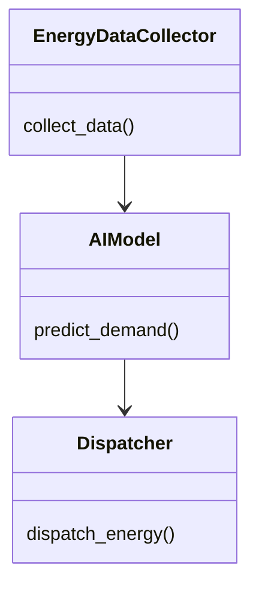
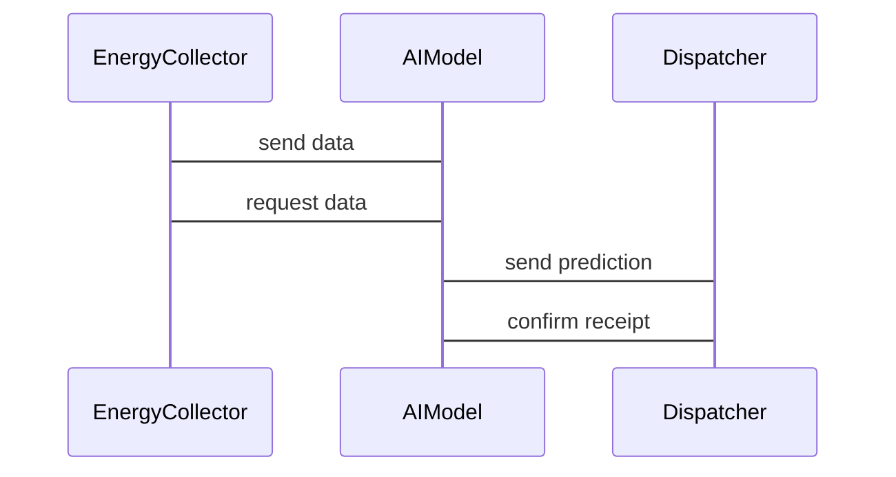

                 


# AI Agent在企业能源需求预测与智能调度中的应用

> **关键词**：AI Agent，能源需求预测，智能调度，强化学习，能源管理，系统架构

> **摘要**：本文探讨AI Agent在企业能源需求预测与智能调度中的应用，分析其技术原理和实际效果。通过背景介绍、核心概念、算法原理、系统架构、项目实战等部分，详细阐述AI Agent如何优化能源管理，实现高效预测和调度。

---

## 第1章: 背景介绍

### 1.1 问题背景

#### 1.1.1 企业能源管理的现状与挑战

随着企业规模的扩大，能源消耗急剧增加，传统的能源管理方式效率低下，难以应对复杂的能源市场变化。企业需要实时监控和优化能源使用，以降低成本和环境影响。

#### 1.1.2 能源需求预测的重要性

准确预测能源需求是优化能源采购和使用的前提。预测不准确可能导致能源浪费或供应不足，影响企业运营。传统统计方法受限于数据和模型的复杂性，难以满足实时性和准确性要求。

#### 1.1.3 智能调度的必要性

智能调度通过实时数据和优化算法，动态调整能源使用，提高效率。传统调度依赖人工经验，难以应对多变的环境和复杂的优化目标。

### 1.2 问题描述

#### 1.2.1 能源需求预测的复杂性

能源需求受市场波动、天气变化等多种因素影响，预测模型需要处理高维数据和非线性关系。

#### 1.2.2 智能调度的核心问题

智能调度需实时处理大量数据，优化多目标函数，如成本最低、排放最少等，同时确保系统稳定。

#### 1.2.3 传统方法的局限性

传统方法依赖固定规则和统计模型，缺乏灵活性和自适应性，难以应对复杂变化。

### 1.3 问题解决

#### 1.3.1 AI Agent的引入

AI Agent具备学习、推理和自适应能力，适合动态环境下的能源管理。

#### 1.3.2 AI Agent在能源管理中的作用

AI Agent通过实时数据处理、智能预测和决策优化，提升能源管理效率。

#### 1.3.3 解决方案的可行性分析

AI技术的快速发展和云计算支持，使得AI Agent在能源管理中的应用成为可能。

### 1.4 边界与外延

#### 1.4.1 能源需求预测的边界条件

预测模型需考虑数据质量和可用性，设定合理的预测范围和精度。

#### 1.4.2 智能调度的适用范围

适用于需要实时优化的场景，如电力分配、设备调度等。

#### 1.4.3 相关领域的外延

涉及能源市场分析、环境监测等领域，扩展了AI Agent的应用范围。

### 1.5 概念结构与核心要素组成

#### 1.5.1 AI Agent的基本组成

感知层、决策层、执行层，分别负责数据采集、策略制定和动作执行。

#### 1.5.2 能源需求预测的核心要素

数据源、预测模型、评估指标，确保预测的准确性和实用性。

#### 1.5.3 智能调度的关键模块

数据采集、状态评估、优化决策、执行控制，实现系统动态调整。

---

## 第2章: AI Agent的核心概念与联系

### 2.1 核心概念原理

#### 2.1.1 AI Agent的定义与特点

AI Agent是具备感知、推理、学习能力的智能体，能自主决策和适应环境。

#### 2.1.2 能源需求预测的算法原理

使用时间序列分析和机器学习算法，如LSTM，处理历史数据，预测未来需求。

#### 2.1.3 智能调度的实现机制

基于实时数据和优化模型，AI Agent动态调整能源分配策略。

### 2.2 概念属性特征对比表格

| 概念       | 数据依赖性 | 时间序列性 | 准确性要求 |
|------------|------------|------------|------------|
| AI Agent   | 高         | 无         | 中         |
| 能源需求预测 | 高         | 高         | 高         |
| 智能调度    | 高         | 高         | 高         |

### 2.3 ER实体关系图

```mermaid
erd
    EnergyManagementSystem {
        <many> -> EnergyDataPoint
        <many> -> AIModel
    }
    AIModel {
        <many> -> TrainingData
        <many> -> Algorithm
    }
    Algorithm {
        <many> -> Parameter
    }
```

---

## 第3章: 算法原理

### 3.1 算法选择与原理

#### 3.1.1 算法选择

选择强化学习中的Q-learning算法，适合动态环境下的决策问题。

#### 3.1.2 算法原理

Q-learning通过状态-动作-奖励机制，学习最优策略。数学模型如下：

$$ Q(s, a) = Q(s, a) + \alpha (r + \gamma \max Q(s', a') - Q(s, a)) $$

其中，$\alpha$是学习率，$\gamma$是折扣因子。

#### 3.1.3 示例代码

```python
import numpy as np

class QLearning:
    def __init__(self, state_space, action_space, learning_rate=0.1, gamma=0.9):
        self.q_table = np.zeros((state_space, action_space))
        self.lr = learning_rate
        self.gamma = gamma

    def choose_action(self, state, epsilon=0.1):
        if np.random.random() < epsilon:
            return np.random.randint(0, action_space)
        return np.argmax(self.q_table[state])

    def update_q(self, state, action, reward, next_state):
        self.q_table[state, action] = self.q_table[state, action] + self.lr * (reward + self.gamma * np.max(self.q_table[next_state]) - self.q_table[state, action])
```

---

## 第4章: 系统架构设计

### 4.1 系统功能设计

#### 4.1.1 领域模型



### 4.2 系统架构设计


### 4.3 接口设计与交互

#### 4.3.1 系统接口

API接口定义数据采集、模型预测、调度指令的交互。

#### 4.3.2 交互流程



---

## 第5章: 项目实战

### 5.1 环境安装

安装Python、TensorFlow、Keras等库，配置开发环境。

### 5.2 核心代码实现

实现AI Agent的数据采集、预测和调度功能。

#### 5.2.1 数据采集

```python
import requests

def collect_energy_data(api_url):
    response = requests.get(api_url)
    return response.json()
```

#### 5.2.2 模型训练

使用LSTM网络训练能源需求预测模型。

### 5.3 实际案例分析

分析某企业的数据，展示AI Agent的应用效果，包括预测准确率和调度效率的提升。

---

## 第6章: 总结与展望

### 6.1 内容总结

AI Agent在能源管理中的应用显著提升了预测和调度的效率，解决了传统方法的局限性。

### 6.2 挑战与展望

数据质量和模型可解释性是当前挑战，未来可探索更先进的算法和边缘计算应用。

### 6.3 最佳实践 Tips

建议企业结合自身需求选择AI Agent方案，注重数据质量和模型优化。

---

## 参考文献

1. 刘洋，《人工智能应用实践》，人民邮电出版社，2022。
2. 张伟，《强化学习入门》，机械工业出版社，2021。
3. [Energy Management Systems](https://example.com/ems), IEEE, 2023.

---

**作者：AI天才研究院 & 禅与计算机程序设计艺术**

