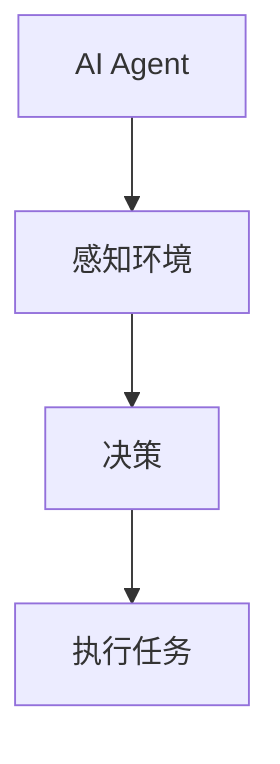
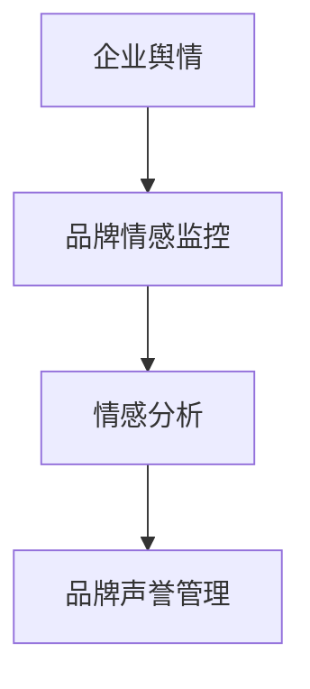
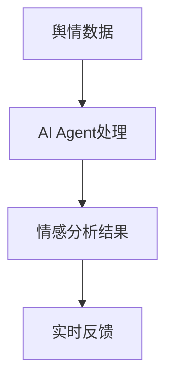
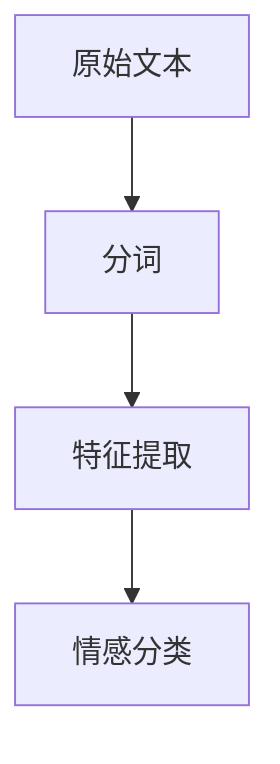
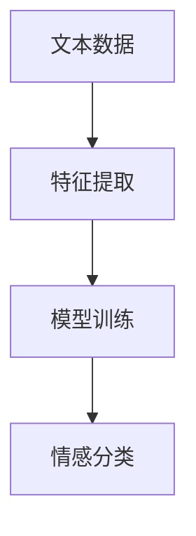
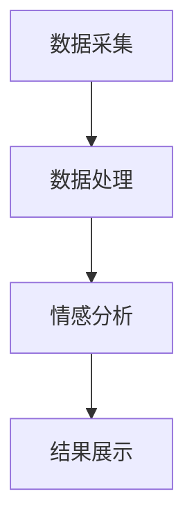

                 


# AI Agent在企业舆情分析与品牌情感监控中的应用

> 关键词：AI Agent，企业舆情分析，品牌情感监控，自然语言处理，情感分析，深度学习

> 摘要：本文探讨了AI Agent在企业舆情分析与品牌情感监控中的应用，分析了其核心概念、算法原理、系统架构，并通过实际案例展示了其在企业中的价值与应用前景。

---

## 第一部分: AI Agent在企业舆情分析与品牌情感监控中的应用概述

### 第1章: AI Agent的基本概念与应用背景

#### 1.1 什么是AI Agent

AI Agent（人工智能代理）是指能够感知环境并采取行动以实现目标的智能实体。AI Agent可以是软件程序，也可以是硬件设备，其核心能力包括自主决策、学习优化和与环境交互。

- **定义**：AI Agent是一种能够感知环境、自主决策并执行任务的智能系统。
- **特征**：
  - 自主性：无需人工干预，自主完成任务。
  - 反应性：能够实时感知环境并做出反应。
  - 学习能力：通过数据和经验优化自身性能。

**图1-1 AI Agent的基本概念框架**



#### 1.2 企业舆情分析与品牌情感监控的背景

企业舆情分析是指对企业在媒体、社交平台等渠道上的公众意见进行监测和分析。品牌情感监控则是进一步将这些意见转化为情感数据，帮助企业了解品牌在市场中的形象和声誉。

- **背景**：
  - 随着社交媒体的普及，企业舆情的数量激增，人工分析效率低下。
  - 品牌情感监控能够帮助企业及时发现并处理负面舆情，维护品牌形象。

**图1-2 企业舆情分析与品牌情感监控的关系**



#### 1.3 AI Agent在舆情分析中的作用

AI Agent能够显著提高舆情分析的效率和准确性，具体表现在以下几个方面：

- **提高效率**：AI Agent可以实时监测海量数据，快速提取关键信息。
- **增强准确性**：通过深度学习算法，AI Agent能够准确识别文本中的情感倾向。
- **实时反馈**：AI Agent能够在舆情发生时立即触发预警，帮助企业及时应对。

**图1-3 AI Agent在舆情分析中的作用**



---

## 第二部分: AI Agent的核心技术与原理

### 第2章: 自然语言处理与情感分析

#### 2.1 自然语言处理的概述

自然语言处理（NLP）是研究如何让计算机理解和处理人类语言的学科。在舆情分析中，NLP主要用于文本的分词、语义分析和情感分类。

- **NLP的基本任务**：
  - 分词：将连续的文本分割成词语或短语。
  - 语义分析：理解文本的含义。
  - 情感分类：判断文本的情感倾向（正面、负面、中性）。

**图2-1 NLP在情感分析中的应用流程**



#### 2.2 情感分析的原理与方法

情感分析是利用NLP技术对文本的情感倾向进行判断的过程。常见的方法包括基于规则的方法和基于机器学习的方法。

- **基于规则的方法**：
  - 使用情感词典，通过统计正面和负面词汇的数量来判断情感倾向。
  - 优点：简单易实现。
  - 缺点：难以处理复杂语境。

- **基于机器学习的方法**：
  - 使用训练好的模型对文本进行分类。
  - 常见算法：SVM、随机森林、神经网络。

**图2-2 基于机器学习的情感分析流程**



#### 2.3 基于深度学习的情感分析模型

深度学习模型在情感分析中表现优异，常用的模型包括RNN、LSTM和Transformer。

- **RNN与LSTM**：
  - RNN（循环神经网络）适用于处理序列数据。
  - LSTM（长短期记忆网络）能够有效捕捉长距离依赖关系。

- **Transformer**：
  - 通过自注意力机制捕捉文本中的全局关系。
  - 常见实现：BERT、GPT。

**公式2-1 BERT模型的核心公式**

$$
\text{BERT}(x) = \text{MLM}(x) + \text{NSP}(x)
$$

其中，MLM表示遮蔽语言模型，NSP表示下文关系预测。

---

## 第三部分: AI Agent在企业舆情分析中的系统架构与实现

### 第3章: 系统架构设计

#### 3.1 系统整体架构

AI Agent在企业舆情分析中的系统架构包括以下几个模块：

- **数据采集模块**：负责从社交媒体、新闻网站等渠道采集舆情数据。
- **数据处理模块**：对采集到的数据进行清洗、分词和特征提取。
- **情感分析模块**：利用深度学习模型对文本进行情感分类。
- **结果展示与反馈模块**：将分析结果以可视化形式呈现，并提供反馈机制。

**图3-1 系统整体架构**



#### 3.2 数据流与模块交互

数据从采集模块进入系统，经过处理模块的清洗和分词后，进入情感分析模块进行分类，最后由结果展示模块呈现给用户。

**图3-2 数据流与模块交互**


---

## 第四部分: 项目实战与优化建议

### 第4章: 项目实战

#### 4.1 项目背景与目标

某大型企业希望通过AI Agent实时监测社交媒体上的品牌舆情，及时发现并处理负面评论。

#### 4.2 系统实现

- **环境安装**：
  - Python 3.8+
  - TensorFlow 2.0+
  - Keras 2.4+
  - NLTK 3.6+

- **核心代码实现**：
  ```python
  import tensorflow as tf
  from tensorflow.keras import layers

  # 模型定义
  model = tf.keras.Sequential([
      layers.Embedding(input_dim=10000, output_dim=16),
      layers.LSTM(64, return_sequences=True),
      layers.Dense(1, activation='sigmoid')
  ])

  # 模型训练
  model.compile(optimizer='adam', loss='binary_crossentropy', metrics=['accuracy'])
  model.fit(x_train, y_train, epochs=10, batch_size=32)
  ```

- **结果展示**：
  - 情感分析结果以图表形式展示，包括正面、负面、中性情感的比例。
  - 实时预警机制：当负面评论超过阈值时，触发警报。

#### 4.3 项目优化建议

- **数据增强**：通过数据增强技术提高模型的泛化能力。
- **模型优化**：使用迁移学习和超参数调优进一步提升模型性能。
- **实时反馈**：建立完善的实时反馈机制，及时处理舆情。

---

## 第五部分: 总结与展望

### 5.1 总结

本文详细探讨了AI Agent在企业舆情分析与品牌情感监控中的应用，从核心概念到系统架构，再到实际案例，全面阐述了其在企业中的价值与应用前景。

### 5.2 展望

随着AI技术的不断发展，AI Agent在舆情分析中的应用将更加广泛和深入。未来的研究方向包括更复杂的模型设计、多语言情感分析以及与企业其他系统的深度集成。

---

## 作者信息

作者：AI天才研究院/AI Genius Institute & 禅与计算机程序设计艺术 /Zen And The Art of Computer Programming

---

以上是《AI Agent在企业舆情分析与品牌情感监控中的应用》的技术博客文章，涵盖了从基础概念到系统实现的完整内容，结合了理论与实践，旨在为企业和技术人员提供有价值的参考和指导。

