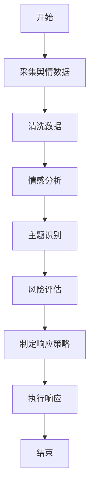
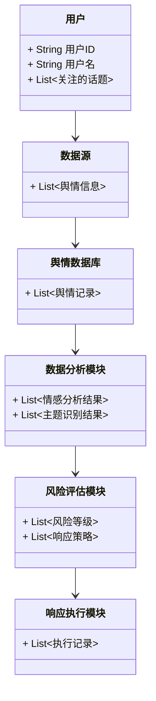

                 


# AI Agent在企业舆情危机预警与响应中的应用

## 关键词：AI Agent，企业舆情，自然语言处理，机器学习，舆情预警，智能响应

## 摘要：本文详细探讨了AI Agent在企业舆情危机预警与响应中的应用，从核心概念到算法原理，再到系统架构和项目实战，全面分析了如何利用AI技术提升企业舆情管理的智能化水平。

---

## 第1章: 企业舆情与AI Agent概述

### 1.1 企业舆情的概念与特征

#### 1.1.1 企业舆情的定义
企业舆情是指在企业运营过程中，社会各界对其产品、服务、管理等方面所持有的看法、评价和态度。舆情可以通过新闻、社交媒体、论坛等多种渠道体现。

#### 1.1.2 企业舆情的特征
- **实时性**：舆情信息随时可能发生，需要及时处理。
- **多样性**：舆情信息来源广泛，形式多样。
- **情感性**：舆情信息往往带有情感色彩，需要进行情感分析。
- **突发性**：负面舆情可能突然爆发，对企业声誉造成重大影响。

#### 1.1.3 企业舆情的重要性
良好的舆情管理可以帮助企业维护品牌形象，及时发现潜在危机，提升公众信任度。

### 1.2 AI Agent的基本原理

#### 1.2.1 AI Agent的定义
AI Agent是一种智能体，能够感知环境、自主决策并执行任务。它能够处理复杂问题，具备学习和适应能力。

#### 1.2.2 AI Agent的核心特征
- **自主性**：能够在没有人工干预的情况下完成任务。
- **反应性**：能够实时感知环境变化并做出响应。
- **智能性**：具备问题解决和学习能力。

#### 1.2.3 AI Agent与传统软件的区别
- AI Agent具备智能性和自主性，而传统软件依赖于固定规则。
- AI Agent能够处理非结构化数据，传统软件通常处理结构化数据。

### 1.3 企业舆情危机预警与响应的背景

#### 1.3.1 舆情危机对企业的影响
负面舆情可能导致企业声誉受损、客户流失和股价下跌。

#### 1.3.2 传统舆情管理的局限性
- 依赖人工分析，效率低。
- 响应速度慢，难以应对突发事件。
- 分析结果可能存在主观性。

#### 1.3.3 AI Agent在舆情管理中的作用
- 实时监测舆情，快速发现潜在危机。
- 智能分析舆情，提供决策支持。
- 自动化响应，减少人为失误。

---

## 第2章: AI Agent在企业舆情中的应用背景

### 2.1 企业舆情管理的需求分析

#### 2.1.1 舆情数据的多样性
舆情信息来源广泛，包括社交媒体、新闻网站、论坛等，数据格式多样。

#### 2.1.2 舆情分析的实时性要求
负面舆情可能迅速扩散，需要实时监测和分析。

#### 2.1.3 舆情响应的智能化需求
企业需要快速制定应对策略，避免舆情扩大化。

### 2.2 AI Agent在舆情管理中的优势

#### 2.2.1 自动化数据采集能力
AI Agent能够从多种数据源自动采集舆情信息，节省时间和人力资源。

#### 2.2.2 智能化分析能力
通过自然语言处理和机器学习技术，AI Agent能够准确识别舆情中的情感倾向和主题。

#### 2.2.3 实时响应能力
AI Agent能够实时监测舆情，快速识别潜在危机并触发响应机制。

### 2.3 企业舆情危机预警与响应的场景

#### 2.3.1 危机预警场景
AI Agent通过分析舆情数据，识别潜在危机信号，提前发出预警。

#### 2.3.2 危机响应场景
当负面舆情爆发时，AI Agent自动触发响应机制，例如发布澄清声明或联系相关方。

#### 2.3.3 危机后分析场景
AI Agent对危机响应效果进行评估，总结经验教训，优化未来应对策略。

---

## 第3章: AI Agent与舆情分析的核心概念

### 3.1 AI Agent的舆情分析原理

#### 3.1.1 数据采集与处理
AI Agent通过爬虫技术从社交媒体、新闻网站等数据源采集舆情信息，并进行清洗和预处理。

#### 3.1.2 情感分析与主题识别
利用自然语言处理技术，AI Agent对舆情信息进行情感分析，识别关键词和主题。

#### 3.1.3 风险评估与决策
基于分析结果，AI Agent评估舆情风险，并制定应对策略。

### 3.2 舆情分析的核心要素

#### 3.2.1 数据源
社交媒体、新闻网站、论坛等。

#### 3.2.2 分析模型
情感分析模型、主题模型等。

#### 3.2.3 决策机制
基于分析结果的决策规则和策略。

### 3.3 AI Agent与舆情分析的关系

#### 3.3.1 协同工作模式
AI Agent与舆情分析系统协同工作，实现数据采集、分析和响应的闭环。

#### 3.3.2 数据流与信息处理
舆情信息从数据源流向AI Agent，经过处理后生成决策信号。

#### 3.3.3 交互机制
AI Agent与用户或其他系统进行交互，提供实时反馈和建议。

---

## 第4章: 核心概念的属性与特征对比

### 4.1 AI Agent的属性特征

#### 4.1.1 智能性
具备学习和推理能力，能够处理复杂问题。

#### 4.1.2 自主性
能够在无外部干预的情况下完成任务。

#### 4.1.3 反应性
能够实时感知环境变化并做出响应。

### 4.2 舆情分析的属性特征

#### 4.2.1 数据驱动性
依赖大量数据进行分析和建模。

#### 4.2.2 实时性
需要快速处理和分析实时数据。

#### 4.2.3 准确性
分析结果的准确性直接影响决策的正确性。

### 4.3 AI Agent与舆情分析的对比分析

#### 4.3.1 核心目标对比
- AI Agent：实现智能化任务处理。
- 舆情分析：提供数据支持和决策建议。

#### 4.3.2 技术手段对比
- AI Agent：结合自然语言处理和机器学习。
- 舆情分析：依赖统计分析和文本挖掘。

#### 4.3.3 应用场景对比
- AI Agent：广泛应用于多个领域。
- 舆情分析：主要应用于舆情管理。

---

## 第5章: 实体关系图与流程图

### 5.1 实体关系图（ER图）

```mermaid
erDiagram
    actor 用户
    actor 系统
    actor 数据源
    database 舆情数据库
    process 情感分析
    process 主题识别
    process 风险评估
    process 响应策略

    用户 --> 数据源
    系统 --> 数据源
    数据源 --> 舆情数据库
    舆情数据库 --> 情感分析
    情感分析 --> 主题识别
    主题识别 --> 风险评估
    风险评估 --> 响应策略
    响应策略 --> 用户
    响应策略 --> 系统
```

### 5.2 流程图



---

## 第6章: 算法原理

### 6.1 基于规则的舆情分类算法

#### 6.1.1 算法流程
1. 采集舆情数据。
2. 预处理数据（去停用词、分词）。
3. 基于规则进行分类（例如，关键词匹配）。
4. 输出分类结果。

#### 6.1.2 Python代码实现

```python
import re
from collections import defaultdict

def preprocess(text):
    # 分词处理
    words = text.split()
    return words

def classify(text, keyword_rules):
    words = preprocess(text)
    for category, keywords in keyword_rules.items():
        for keyword in keywords:
            if keyword in words:
                return category
    return "其他"

# 示例规则
keyword_rules = {
    "正面": ["好", "满意"],
    "负面": ["差", "不满"],
    "中性": ["一般", "还可以"]
}

text = "这个产品还可以，但有一些小问题"
result = classify(text, keyword_rules)
print(f"分类结果：{result}")
```

---

## 第7章: 系统分析与架构设计

### 7.1 问题场景介绍

#### 7.1.1 问题描述
企业需要实时监测舆情，快速识别负面信息并制定应对策略。

#### 7.1.2 问题边界
仅关注公开的社交媒体和新闻网站数据，不涉及内部数据。

### 7.2 系统功能设计

#### 7.2.1 功能模块
- 数据采集模块：负责采集舆情数据。
- 数据分析模块：进行情感分析和主题识别。
- 风险评估模块：评估舆情风险并制定响应策略。
- 响应执行模块：执行预定义的响应策略。

#### 7.2.2 领域模型



---

## 第8章: 项目实战

### 8.1 环境安装

#### 8.1.1 安装Python
```bash
python --version
pip install --upgrade pip
```

#### 8.1.2 安装依赖库
```bash
pip install requests
pip install beautifulsoup4
pip install nltk
```

### 8.2 系统核心实现

#### 8.2.1 数据采集
```python
import requests
from bs4 import BeautifulSoup

def fetch_data(url):
    response = requests.get(url)
    soup = BeautifulSoup(response.text, 'html.parser')
    return soup.find_all('div', class_='tweet')
```

#### 8.2.2 数据分析
```python
from nltk.sentiment import SentimentIntensityAnalyzer

def analyze_sentiment(text):
    sia = SentimentIntensityAnalyzer()
    return sia.polarity_scores(text)
```

#### 8.2.3 风险评估
```python
def assess_risk(score):
    if score['compound'] < -0.5:
        return "高风险"
    elif score['compound'] < 0:
        return "中风险"
    else:
        return "低风险"
```

### 8.3 代码应用解读

#### 8.3.1 数据采集模块
从社交媒体平台获取最新舆情信息。

#### 8.3.2 数据分析模块
对采集到的舆情信息进行情感分析，识别关键词和主题。

#### 8.3.3 风险评估模块
根据分析结果评估舆情风险，制定相应的响应策略。

### 8.4 案例分析

#### 8.4.1 案例背景
某企业发现社交媒体上出现大量负面评论，需要快速响应。

#### 8.4.2 数据采集与分析
AI Agent采集到负面评论后，立即触发预警机制。

#### 8.4.3 响应策略
AI Agent自动发布澄清声明，并联系相关部门处理问题。

### 8.5 项目小结

通过AI Agent实现企业舆情的智能化管理，能够显著提升舆情响应效率和准确性。

---

## 第9章: 最佳实践

### 9.1 小结

AI Agent在企业舆情管理中的应用前景广阔，能够帮助企业更好地应对舆情危机。

### 9.2 注意事项

- 数据隐私和合规性问题需要注意。
- 算法模型需要不断优化，提高准确性和效率。
- 系统需要具备良好的可扩展性和容错性。

### 9.3 拓展阅读

- 《自然语言处理入门》
- 《机器学习实战》
- 《企业舆情管理》

---

## 作者：AI天才研究院/AI Genius Institute & 禅与计算机程序设计艺术/Zen And The Art of Computer Programming

