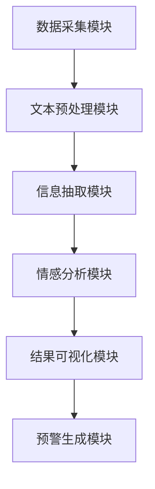
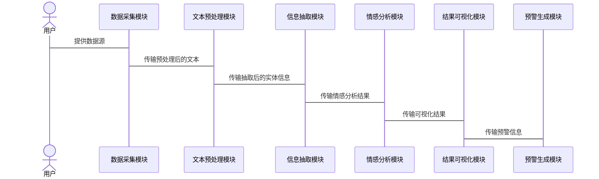

                 


# AI Agent在企业舆情监测与危机公关中的应用

> 关键词：AI Agent，舆情监测，危机公关，自然语言处理，情感分析，实体识别

> 摘要：本文详细探讨了AI Agent在企业舆情监测与危机公关中的应用，分析了其核心技术和实现原理，并通过实际案例展示了如何利用AI Agent提升企业舆情监测与危机公关的能力。文章内容涵盖背景介绍、技术原理、系统架构设计、项目实战以及最佳实践等方面，旨在为企业提供一份全面的技术指南。

---

## 第1章: AI Agent的概述

### 1.1 AI Agent的基本概念

#### 1.1.1 AI Agent的定义与特点
AI Agent（人工智能代理）是一种能够感知环境、自主决策并执行任务的智能实体。它能够通过传感器获取信息，利用算法进行分析，并通过执行器与环境交互。AI Agent的特点包括智能化、自主性、反应性和社会性。

#### 1.1.2 AI Agent的技术基础
AI Agent的核心技术包括自然语言处理（NLP）、机器学习（ML）、知识图谱构建和推理引擎。这些技术使其能够理解和处理人类语言，识别情感和意图，并基于上下文进行推理和决策。

#### 1.1.3 AI Agent的应用场景
AI Agent在企业中的应用场景包括舆情监测、客户支持、市场分析和危机公关等。其中，舆情监测和危机公关是AI Agent应用的重要领域。

### 1.2 舆情监测与危机公关的背景

#### 1.2.1 舆情监测的定义与重要性
舆情监测是指通过收集、分析和评估公众对某个品牌、产品或事件的舆论，为企业提供决策支持。其重要性在于帮助企业及时发现潜在风险，优化品牌形象，提升客户满意度。

#### 1.2.2 危机公关的定义与挑战
危机公关是指企业在面临突发事件或负面舆情时，通过快速响应和有效沟通来降低负面影响的过程。其挑战在于时间紧迫、信息复杂和决策难度大。

#### 1.2.3 传统舆情监测与危机公关的局限性
传统舆情监测依赖人工分析，效率低、覆盖面窄且成本高。危机公关往往依赖经验丰富的公关团队，但难以在短时间内制定最优策略。

### 1.3 AI Agent在舆情监测与危机公关中的优势

#### 1.3.1 提高舆情监测的效率与准确性
AI Agent能够实时收集和分析海量数据，快速识别潜在风险，显著提高舆情监测的效率和准确性。

#### 1.3.2 增强危机公关的响应能力
AI Agent能够快速生成应对策略，帮助企业在危机发生时迅速做出反应，降低负面影响。

#### 1.3.3 数据驱动的决策支持
AI Agent通过分析历史数据和实时信息，为企业提供数据支持的决策，提升舆情监测和危机公关的科学性。

### 1.4 本章小结
本章介绍了AI Agent的基本概念、技术基础和应用场景，分析了舆情监测和危机公关的背景及其传统方法的局限性，并重点阐述了AI Agent在提升企业舆情监测和危机公关能力方面的优势。

---

## 第2章: 自然语言处理（NLP）与情感分析

### 2.1 自然语言处理的概述

#### 2.1.1 NLP的基本概念与技术
NLP是研究如何让计算机理解和生成人类语言的学科。其核心技术包括分词、句法分析、语义理解、情感分析和文本生成等。

#### 2.1.2 NLP在舆情监测中的应用
在舆情监测中，NLP技术用于文本分类、情感分析和实体识别，帮助识别公众对企业和产品的看法。

### 2.2 情感分析的原理与实现

#### 2.2.1 情感分析的定义与分类
情感分析是通过分析文本内容，判断文本中表达的情感倾向。其分类包括正面、负面和中性。

#### 2.2.2 基于深度学习的情感分析模型
基于深度学习的情感分析模型如BERT，能够通过预训练和微调任务，实现高精度的情感分析。

#### 2.2.3 情感分析在舆情监测中的应用
情感分析帮助企业在舆情监测中快速识别公众情绪，评估品牌形象和产品口碑。

### 2.3 实例分析: 基于BERT的情感分析模型

#### 2.3.1 BERT模型的介绍
BERT（Bidirectional Encoder Representations from Transformers）是一种基于 transformer 的预训练语言模型，能够通过双向编码器实现上下文理解。

#### 2.3.2 情感分析任务的模型训练
在情感分析任务中，BERT模型通过微调任务，在大规模数据集上训练情感分类器。

#### 2.3.3 模型在舆情中的应用
通过BERT模型，企业可以快速分析海量文本，识别公众情感倾向，制定针对性的舆情应对策略。

### 2.4 本章小结
本章详细介绍了自然语言处理和情感分析的基本概念、技术原理及其在舆情监测中的应用，通过实例分析展示了基于BERT的情感分析模型的实现和应用。

---

## 第3章: 信息抽取与实体识别

### 3.1 信息抽取的定义与技术

#### 3.1.1 信息抽取的基本概念
信息抽取是从文本中提取结构化信息的过程，包括命名实体识别、关系抽取和事件抽取。

#### 3.1.2 基于规则的信息抽取与基于深度学习的信息抽取
基于规则的信息抽取依赖预定义的规则，适用于特定场景；基于深度学习的信息抽取利用神经网络模型，具有更强的泛化能力。

### 3.2 实体识别的原理与应用

#### 3.2.1 实体识别的定义与技术
实体识别是指从文本中识别出人名、地名、组织名等命名实体的过程。

#### 3.2.2 实体识别在舆情监测中的应用
实体识别帮助企业在舆情监测中识别出关键人物、机构和事件，提升舆情分析的精确性。

### 3.3 实例分析: 基于CRF的实体识别模型

#### 3.3.1 CRF模型的介绍
CRF（Conditional Random Fields）是一种用于序列标注的无监督学习算法，常用于命名实体识别任务。

#### 3.3.2 实体识别任务的模型训练
在实体识别任务中，CRF模型通过训练数据学习特征和标签之间的关系，实现高精度的实体识别。

#### 3.3.3 模型在舆情中的应用
通过CRF模型，企业可以从海量文本中提取出关键实体信息，为舆情分析提供有力支持。

### 3.4 本章小结
本章详细介绍了信息抽取与实体识别的基本概念、技术原理及其在舆情监测中的应用，通过实例分析展示了基于CRF的实体识别模型的实现和应用。

---

## 第4章: 基于深度学习的舆情监测系统架构设计

### 4.1 问题场景介绍
舆情监测系统需要实时收集、分析和评估海量文本数据，快速识别潜在风险并生成预警报告。

### 4.2 系统功能设计
系统功能包括数据采集、文本预处理、信息抽取、情感分析、结果可视化和预警生成。

### 4.3 系统架构设计

#### 4.3.1 系统架构图


#### 4.3.2 系统接口设计
系统接口包括数据输入接口、模型调用接口和结果输出接口。

#### 4.3.3 系统交互设计


### 4.4 本章小结
本章详细设计了基于深度学习的舆情监测系统的架构，包括功能模块、系统接口和系统交互流程，展示了如何利用AI Agent技术实现高效的舆情监测。

---

## 第5章: 项目实战: 基于BERT的情感分析模型实现

### 5.1 环境配置
项目需要Python 3.6及以上版本，安装库包括`transformers`、`tensorflow`和`numpy`。

### 5.2 系统核心实现源代码

#### 5.2.1 数据预处理代码
```python
from transformers import BertTokenizer, TFBertModel
import tensorflow as tf

tokenizer = BertTokenizer.from_pretrained('bert-base-chinese')
model = TFBertModel.from_pretrained('bert-base-chinese')

def preprocess(text):
    inputs = tokenizer(text, padding=True, truncation=True, max_length=128, return_tensors='tf')
    return inputs
```

#### 5.2.2 情感分析模型代码
```python
def build_model():
    inputs = layers.Input(shape=(128,), dtype='int64')
    embedding = model.bert(inputs)[0]
    dense = layers.Dense(256, activation='relu')(embedding[:, 0])
    output = layers.Dense(3, activation='softmax')(dense)
    model = Model(inputs=inputs, outputs=output)
    model.compile(optimizer='adam', loss='sparse_categorical_crossentropy', metrics=['accuracy'])
    return model

model = build_model()
model.summary()
```

#### 5.2.3 模型训练代码
```python
from tensorflow.keras.callbacks import EarlyStopping

callbacks = [EarlyStopping(patience=3)]
model.fit(X_train, y_train, epochs=10, batch_size=32, callbacks=callbacks, validation_data=(X_val, y_val))
```

### 5.3 实际案例分析
通过实际案例分析，展示了如何利用BERT模型实现情感分析任务，并为舆情监测提供支持。

### 5.4 项目小结
本章通过实际案例展示了基于BERT的情感分析模型的实现过程，包括环境配置、数据预处理、模型构建和训练，为企业提供了舆情监测的技术实现参考。

---

## 第6章: 最佳实践与注意事项

### 6.1 最佳实践
- 数据质量：确保数据的多样性和代表性，避免过拟合。
- 模型优化：通过调参和模型融合提升性能。
- 实时性：优化系统架构，确保实时舆情监测。

### 6.2 注意事项
- 数据隐私：遵守相关法律法规，保护用户隐私。
- 系统稳定性：确保系统运行稳定，避免因故障导致数据丢失。
- 人机协同：结合人工审核，提升系统准确率。

### 6.3 本章小结
本章总结了在实际应用中需要注意的最佳实践和注意事项，强调了数据质量、模型优化和系统稳定性的重要性。

---

## 第7章: 总结与未来展望

### 7.1 总结
本文详细探讨了AI Agent在企业舆情监测与危机公关中的应用，分析了其核心技术、系统架构和实现方法，并通过实际案例展示了其应用价值。

### 7.2 未来展望
未来，AI Agent在舆情监测和危机公关中的应用将更加智能化和自动化。随着NLP和深度学习技术的不断发展，AI Agent将具备更强的语义理解和决策能力，为企业提供更高效的舆情监测和危机公关支持。

### 7.3 本章小结
本文总结了AI Agent在企业舆情监测与危机公关中的应用，并展望了其未来的发展方向。

---

## 作者：AI天才研究院/AI Genius Institute & 禅与计算机程序设计艺术 /Zen And The Art of Computer Programming

---

以上是《AI Agent在企业舆情监测与危机公关中的应用》的完整目录大纲和文章内容。希望对您有所帮助！

