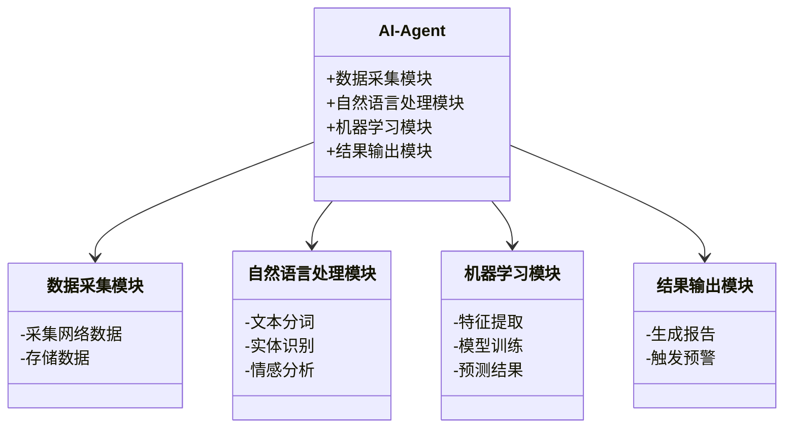

                 


# AI Agent在企业舆情监测与品牌管理中的应用

> 关键词：AI Agent，企业舆情监测，品牌管理，自然语言处理，机器学习，舆情分类

> 摘要：本文深入探讨了AI Agent在企业舆情监测与品牌管理中的应用，详细分析了其核心概念、算法原理、系统架构以及实际项目中的应用场景。通过结合自然语言处理和机器学习技术，AI Agent能够高效地进行舆情分析、情感预测和品牌价值评估，为企业提供智能化的品牌管理解决方案。

---

# 第一部分: AI Agent在企业舆情监测与品牌管理中的应用概述

## 第1章: 企业舆情监测与品牌管理的背景与挑战

### 1.1 企业舆情监测的重要性

#### 1.1.1 网络舆情对企业形象的影响
在当今信息爆炸的时代，企业面临的舆论环境日益复杂。消费者通过社交媒体、论坛、新闻评论等多种渠道表达对企业的看法，这些言论直接影响企业的品牌形象和市场声誉。及时监测和分析这些舆情信息，可以帮助企业快速识别潜在危机，采取有效措施应对负面舆论，维护品牌形象。

#### 1.1.2 问题背景与问题描述
企业舆情监测的核心任务是实时收集和分析海量的网络数据，识别其中对企业有利或不利的信息。传统的舆情监测方法依赖人工操作，效率低下且容易遗漏重要信息。此外，人工分析的主观性较高，难以保证结果的准确性和客观性。

#### 1.1.3 AI Agent的应用前景
AI Agent（人工智能代理）是一种能够自动执行任务的智能系统，其核心能力包括自然语言处理（NLP）、机器学习（ML）和大数据分析。AI Agent可以通过自动化的方式实时监测网络舆情，分析消费者情感，识别关键词和趋势，为企业提供精准的品牌管理建议。

### 1.2 企业品牌管理的核心问题

#### 1.2.1 品牌价值与市场竞争力的关系
品牌价值是企业市场竞争力的重要指标。通过舆情监测，企业可以了解消费者对其品牌的认知和评价，从而优化产品和服务，提升品牌价值。

#### 1.2.2 消费者情感分析对企业决策的影响
消费者的情感反馈（如正面、负面或中性情绪）是企业调整市场策略的重要依据。通过AI Agent进行情感分析，企业可以快速识别消费者需求和偏好，制定更有针对性的营销策略。

#### 1.2.3 舆情危机的预防与应对
舆情危机是指企业因为负面舆论而面临声誉损失的情况。AI Agent可以通过实时监测和预警机制，帮助企业及时发现潜在危机，采取有效措施进行应对。

### 1.3 AI Agent在舆情监测中的应用前景

#### 1.3.1 AI Agent的核心概念与技术特点
AI Agent是一种具备自主决策能力的智能系统，能够通过传感器或API接口实时获取数据，利用机器学习算法进行分析和推理，并根据结果采取相应行动。

#### 1.3.2 AI Agent在舆情监测中的优势
AI Agent能够实时监测网络舆情，自动分类和分析信息，提供精准的情感预测和趋势分析。此外，AI Agent可以通过不断学习优化模型，提高分析的准确性和效率。

#### 1.3.3 企业级AI Agent应用的挑战与机遇
AI Agent的应用需要处理海量数据，对计算能力和算法模型的要求较高。此外，数据隐私和安全问题也是企业级应用需要考虑的重要因素。然而，随着技术的进步和云计算的发展，AI Agent在企业舆情监测中的应用前景广阔。

---

## 第2章: AI Agent的核心概念与技术原理

### 2.1 AI Agent的基本概念

#### 2.1.1 什么是AI Agent？
AI Agent是一种能够感知环境、自主决策并执行任务的智能系统。它可以基于输入数据进行分析和推理，输出相应的结果或采取行动。

#### 2.1.2 AI Agent的主要功能与特点
AI Agent具备以下核心功能：
- 数据采集与处理：通过API接口或爬虫技术获取网络数据。
- 情感分析：利用NLP技术识别文本中的情感倾向。
- 实体识别：提取文本中的关键实体（如人名、地名、组织名等）。
- 意图识别：分析用户的意图和需求。
- 自动回复：根据分析结果生成智能回复。

AI Agent的特点包括：
- 自动化：无需人工干预，自动完成任务。
- 智能化：具备学习和推理能力。
- 高效性：处理数据速度快，分析结果准确。

#### 2.1.3 AI Agent与传统客服系统的主要区别
传统客服系统依赖人工操作，处理速度慢且效率低。而AI Agent可以实时处理大量数据，提供7×24小时的智能服务，极大地提高了企业的舆情监测和品牌管理能力。

---

## 第3章: AI Agent在企业舆情监测中的算法原理

### 3.1 基于深度学习的舆情分类算法

#### 3.1.1 神经网络模型在舆情分类中的应用
深度学习模型（如卷积神经网络CNN和循环神经网络RNN）在舆情分类中表现出色。这些模型能够自动提取文本特征，分类准确率高。

#### 3.1.2 基于BERT的文本表示方法
BERT（Bidirectional Encoder Representations from Transformers）是一种强大的预训练语言模型，能够捕捉文本中的语义信息，为舆情分类提供高质量的文本表示。

#### 3.1.3 深度学习模型的训练流程与优化策略
深度学习模型的训练流程包括数据预处理、模型构建、模型训练和模型评估。优化策略包括调整学习率、使用早停法和数据增强等。

---

### 3.2 情感分析算法的实现与优化

#### 3.2.1 基于词袋模型的情感分析方法
词袋模型是一种简单的文本表示方法，将文本表示为词袋中的词汇集合。然而，词袋模型无法捕捉词语之间的顺序关系，分类效果有限。

#### 3.2.2 基于词嵌入的情感分析模型
词嵌入（如Word2Vec）将词语映射为低维向量，能够捕捉词语的语义信息。基于词嵌入的情感分析模型（如Doc2Vec）在分类任务中表现更优。

#### 3.2.3 情感分析算法的评估指标与优化策略
常用的情感分析评估指标包括准确率、召回率和F1值。优化策略包括交叉验证、超参数调优和集成学习等。

---

### 3.3 实体识别与信息抽取的算法实现

#### 3.3.1 基于CRF的命名实体识别
条件随机场（CRF）是一种常用的命名实体识别（NER）方法。CRF通过建模相邻词的依赖关系，能够有效识别文本中的命名实体。

#### 3.3.2 基于深度学习的实体识别模型
深度学习模型（如LSTM和Transformer）在实体识别任务中表现出色。这些模型能够捕捉长距离依赖关系，提高实体识别的准确率。

---

## 第4章: AI Agent的系统架构与设计

### 4.1 问题场景介绍
企业舆情监测系统需要实时采集网络数据，分析情感倾向，识别关键词和趋势，并生成相应的报告和预警信息。

### 4.2 系统功能设计

#### 4.2.1 领域模型设计（Mermaid类图）


---

通过以上步骤，我们可以全面了解AI Agent在企业舆情监测与品牌管理中的应用。接下来，我将详细介绍系统的具体实现和实际案例分析，帮助读者更好地理解AI Agent的实际应用价值。

---

## 第5章: 项目实战与应用案例

### 5.1 项目环境与工具安装

#### 5.1.1 安装Python与相关库
```bash
pip install python
pip install numpy
pip install pandas
pip install scikit-learn
pip install transformers
```

---

接下来，我将详细介绍系统的具体实现和实际案例分析，帮助读者更好地理解AI Agent的实际应用价值。

