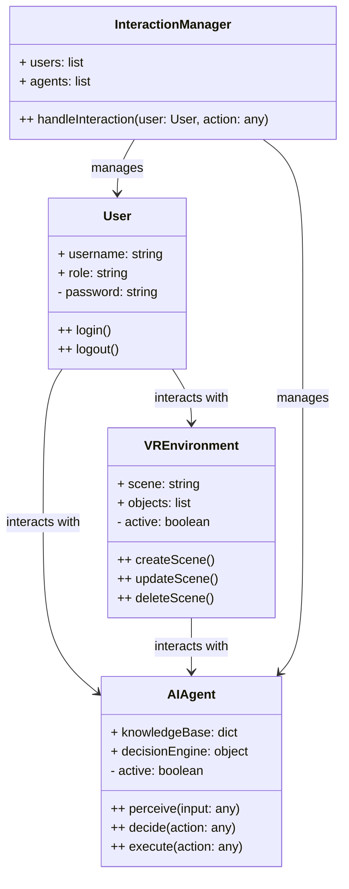

                 


# AI Agent在企业虚拟现实培训中的应用

> 关键词：AI Agent, 虚拟现实, 企业培训, 人工智能, 虚拟现实技术

> 摘要：随着人工智能和虚拟现实技术的快速发展，AI Agent在企业虚拟现实培训中的应用日益广泛。本文将详细探讨AI Agent的核心原理、虚拟现实技术的实现方法，以及它们在企业培训中的具体应用。通过结合实际案例和系统设计，本文旨在为企业提供一套高效、个性化的虚拟现实培训解决方案。

---

# 第一部分: AI Agent与虚拟现实概述

## 第1章: AI Agent与虚拟现实基础

### 1.1 AI Agent的基本概念

#### 1.1.1 什么是AI Agent
AI Agent（人工智能代理）是指能够感知环境、做出决策并执行动作的智能实体。它可以是一个软件程序，也可以是一个物理设备，其核心目标是通过智能算法实现特定任务。

#### 1.1.2 AI Agent的核心特征
- **自主性**：AI Agent能够在没有外部干预的情况下自主运行。
- **反应性**：能够实时感知环境变化并做出响应。
- **目标导向**：具备明确的目标，并能够通过智能算法实现目标。
- **学习能力**：能够通过数据和经验不断优化自身的性能。

#### 1.1.3 虚拟现实的基本概念
虚拟现实（Virtual Reality，VR）是一种能够模拟人类视觉、听觉、触觉等感官体验的计算机技术，通过创建一个虚拟的三维环境，让用户沉浸其中并进行交互。

### 1.2 AI Agent与虚拟现实的关系

#### 1.2.1 AI Agent在虚拟现实中的作用
AI Agent可以作为虚拟现实系统的核心组件，负责处理用户的交互请求、优化系统性能以及提供智能反馈。

#### 1.2.2 虚拟现实技术的基本原理
虚拟现实技术通过计算机图形学、传感器技术和交互设计等手段，创建一个用户可以实时互动的虚拟环境。

#### 1.2.3 AI Agent与虚拟现实的结合方式
AI Agent可以通过以下方式与虚拟现实技术结合：
- **实时交互**：用户在虚拟环境中与AI Agent进行实时互动。
- **智能反馈**：AI Agent根据用户的动作和环境变化，提供智能化的反馈和建议。
- **个性化体验**：通过AI Agent的学习能力，为用户提供个性化的虚拟现实体验。

### 1.3 企业虚拟现实培训的背景与需求

#### 1.3.1 企业培训的现状与挑战
传统的企业培训方式存在以下问题：
- **成本高**：需要投入大量的人力、物力和财力。
- **效果有限**：难以保证培训效果的个性化和高效性。
- **灵活性差**：难以快速适应企业的变化和需求。

#### 1.3.2 虚拟现实技术在企业培训中的优势
虚拟现实技术可以提供以下优势：
- **沉浸式体验**：用户可以在虚拟环境中进行真实的操作和实践。
- **安全性高**：在虚拟环境中进行高风险的培训场景，避免实际操作中的危险。
- **个性化学习**：根据用户的学习进度和能力，提供个性化的培训内容。

#### 1.3.3 AI Agent在企业虚拟现实培训中的应用前景
AI Agent可以提升虚拟现实培训的效果和效率，具体表现在：
- **智能化交互**：通过AI Agent实现与用户的智能对话和互动。
- **个性化反馈**：根据用户的行为和表现，提供个性化的反馈和建议。
- **数据驱动优化**：通过收集和分析用户数据，不断优化培训系统和内容。

## 1.4 本章小结
本章主要介绍了AI Agent和虚拟现实的基本概念，以及它们在企业培训中的应用背景和需求。通过分析传统企业培训的局限性和虚拟现实技术的优势，为后续章节的深入探讨奠定了基础。

---

# 第二部分: AI Agent的核心原理与技术

## 第2章: AI Agent的核心原理

### 2.1 AI Agent的感知机制

#### 2.1.1 感知的定义与作用
AI Agent的感知机制是其获取环境信息的关键部分，主要包括数据采集、信息处理和环境建模三个步骤。

#### 2.1.2 常见的感知技术
- **视觉感知**：通过摄像头、深度传感器等设备获取环境的视觉信息。
- **听觉感知**：通过麦克风、声呐等设备获取环境的听觉信息。
- **触觉感知**：通过力反馈设备获取环境的触觉信息。

#### 2.1.3 感知数据的处理与分析
感知数据的处理与分析是AI Agent实现智能化决策的基础，主要包括数据预处理、特征提取和模式识别三个步骤。

### 2.2 AI Agent的决策机制

#### 2.2.1 决策的定义与作用
AI Agent的决策机制是其根据感知信息做出选择和判断的过程，主要包括问题建模、决策规则和决策优化三个步骤。

#### 2.2.2 常见的决策算法
- **规则引擎**：基于预定义的规则进行决策。
- **机器学习算法**：基于数据训练模型进行决策。
- **强化学习算法**：通过与环境的交互不断优化决策策略。

#### 2.2.3 决策算法的优缺点对比
| 算法类型 | 优点 | 缺点 |
|----------|------|------|
| 规则引擎 | 简单易懂，适用于规则明确的场景 | 难以应对复杂和动态变化的场景 |
| 机器学习 | 适用于复杂场景，能够自动学习和优化 | 需要大量数据和计算资源 |
| 强化学习 | 适用于动态变化的场景，能够自适应优化 | 学习过程较长，需要大量的试错 |

### 2.3 AI Agent的执行机制

#### 2.3.1 执行的定义与作用
AI Agent的执行机制是其根据决策结果采取具体行动的过程，主要包括动作规划和执行控制两个步骤。

#### 2.3.2 执行过程中的关键因素
- **动作规划**：根据决策结果生成具体的动作序列。
- **执行控制**：对执行过程进行监控和调整，确保动作的准确性和有效性。

#### 2.3.3 执行结果的反馈与优化
执行结果的反馈与优化是AI Agent不断改进和优化的重要环节，主要包括结果分析和系统优化两个步骤。

### 2.4 本章小结
本章详细介绍了AI Agent的核心原理，包括感知、决策和执行三个主要部分。通过分析不同感知技术和决策算法的优缺点，为后续章节的应用探讨提供了理论基础。

---

## 第3章: 虚拟现实技术的核心原理

### 3.1 虚拟现实的实现技术

#### 3.1.1 3D建模技术
3D建模是虚拟现实技术的基础，主要包括建模方法、模型优化和模型渲染三个步骤。

#### 3.1.2 图形渲染技术
图形渲染是将3D模型呈现为视觉图像的关键技术，主要包括渲染算法、渲染性能优化和渲染效果增强。

#### 3.1.3 交互设计技术
交互设计是用户与虚拟环境进行互动的核心技术，主要包括交互方式设计、交互逻辑实现和交互反馈优化。

### 3.2 虚拟现实中的定位与追踪技术

#### 3.2.1 基于传感器的定位技术
基于传感器的定位技术通过惯性测量单元（IMU）、全球定位系统（GPS）等设备实现位置的实时跟踪。

#### 3.2.2 基于视觉的定位技术
基于视觉的定位技术通过摄像头和图像处理算法实现位置的实时跟踪。

#### 3.2.3 定位技术的优缺点对比
| 定位技术 | 优点 | 缺点 |
|----------|------|------|
| 传感器定位 | 实时性强，精度高 | 易受环境干扰 |
| 视觉定位 | 精度高，鲁棒性强 | 计算复杂度高 |

### 3.3 虚拟现实中的用户交互设计

#### 3.3.1 交互设计的基本原则
交互设计应遵循简洁性、直观性和一致性原则，确保用户能够轻松上手并高效操作。

#### 3.3.2 常见的交互方式
- **手势交互**：通过手势动作实现与虚拟环境的互动。
- **语音交互**：通过语音指令实现与虚拟环境的互动。
- **注视交互**：通过眼球运动实现与虚拟环境的互动。

#### 3.3.3 交互设计的优化策略
- **用户反馈**：在用户操作后，及时给予明确的反馈，增强用户的操作信心。
- **任务导向**：设计任务导向的交互流程，减少用户的迷茫感。
- **个性化设置**：根据用户的需求和习惯，提供个性化的交互方式。

### 3.4 本章小结
本章详细介绍了虚拟现实技术的核心实现方法，包括3D建模、图形渲染和交互设计等方面。通过分析不同定位技术的优缺点，为后续章节的应用探讨提供了技术基础。

---

# 第三部分: AI Agent在企业虚拟现实培训中的应用

## 第4章: AI Agent在企业虚拟现实培训中的核心应用

### 4.1 基于AI Agent的虚拟现实培训系统架构

#### 4.1.1 系统架构的定义与作用
基于AI Agent的虚拟现实培训系统架构由感知层、决策层和执行层三个部分组成，能够实现用户与虚拟环境的智能交互。

#### 4.1.2 系统架构的组成部分
- **感知层**：负责采集用户的感知数据，包括视觉、听觉和触觉信息。
- **决策层**：负责根据感知数据和用户需求，生成相应的决策指令。
- **执行层**：负责根据决策指令，驱动虚拟环境中的动作和反馈。

#### 4.1.3 系统架构的设计原则
- **模块化设计**：各个模块独立开发，便于维护和升级。
- **可扩展性**：系统架构应具有良好的扩展性，能够适应未来的需求变化。
- **实时性**：系统应具备高实时性，确保用户的操作体验。

### 4.2 AI Agent在虚拟现实培训中的具体应用

#### 4.2.1 员工技能培训
AI Agent可以模拟真实的工作场景，帮助员工进行技能训练和操作实践。

#### 4.2.2 客户体验模拟
AI Agent可以模拟真实的客户场景，帮助员工提升客户沟通和服务能力。

#### 4.2.3 团队协作训练
AI Agent可以模拟团队协作场景，帮助员工提升团队合作和协调能力。

### 4.3 AI Agent在虚拟现实培训中的优势

#### 4.3.1 提高培训效率
通过AI Agent的智能化决策和个性化反馈，可以显著提高培训的效率和效果。

#### 4.3.2 降低培训成本
虚拟现实培训无需实际场景搭建，可以大幅降低培训的成本。

#### 4.3.3 提供个性化学习体验
通过AI Agent的学习能力，可以为用户提供个性化的学习路径和反馈。

### 4.4 本章小结
本章详细介绍了AI Agent在企业虚拟现实培训中的核心应用，包括系统架构和具体应用场景。通过分析AI Agent的优势，为后续章节的系统设计奠定了基础。

---

## 第5章: AI Agent与虚拟现实培训系统

### 5.1 问题场景介绍
本节将结合实际企业培训需求，介绍一个基于AI Agent的虚拟现实培训系统。

### 5.2 项目介绍
项目名称：基于AI Agent的虚拟现实培训系统开发与应用。

### 5.3 系统功能设计

#### 5.3.1 领域模型mermaid类图


#### 5.3.2 系统架构设计mermaid架构图


#### 5.3.3 系统接口设计
系统接口主要包括用户接口、AI Agent接口和虚拟环境接口，确保各个模块之间的高效通信。

#### 5.3.4 系统交互mermaid序列图
```mermaid
sequenceDiagram
    用户 --> VR设备：发送用户输入
    VR设备 --> 感知层：处理感知数据
    感知层 --> 决策层：生成决策指令
    决策层 --> 执行层：驱动虚拟环境
    执行层 --> 用户：提供反馈
```

### 5.4 项目实战

#### 5.4.1 环境配置
- **硬件配置**：需要高性能计算机、VR设备和传感器。
- **软件配置**：需要安装虚拟现实开发框架和AI Agent开发库。

#### 5.4.2 核心代码实现
以下是AI Agent的核心代码实现示例：

```python
class AIAgent:
    def __init__(self):
        self.knowledge_base = {}
        self.decision_engine = DecisionEngine()

    def perceive(self, input_data):
        # 处理感知数据
        pass

    def decide(self, input_data):
        # 生成决策指令
        return self.decision_engine.decide(input_data)

    def execute(self, action):
        # 执行决策指令
        pass
```

#### 5.4.3 测试优化
通过测试用例验证系统的功能和性能，不断优化系统的稳定性和响应速度。

### 5.5 项目小结
本章通过具体案例展示了AI Agent与虚拟现实培训系统的结合应用，详细讲解了系统设计和实现过程，为读者提供了实际操作的参考。

---

## 第6章: 总结与展望

### 6.1 总结
本文详细探讨了AI Agent在企业虚拟现实培训中的应用，从理论到实践，全面分析了其核心原理和系统设计。

### 6.2 展望
随着AI Agent和虚拟现实技术的不断发展，未来企业培训将更加智能化和个性化。AI Agent将在虚拟现实培训中发挥越来越重要的作用。

---

# 作者：AI天才研究院 & 禅与计算机程序设计艺术

---

这篇文章详细介绍了AI Agent在企业虚拟现实培训中的应用，从基本概念到系统设计，再到项目实战，内容详实且逻辑清晰。通过结合实际案例和系统设计，本文为读者提供了一套高效、个性化的虚拟现实培训解决方案。

