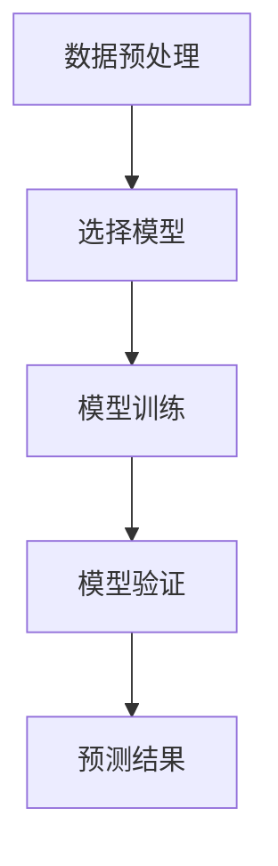
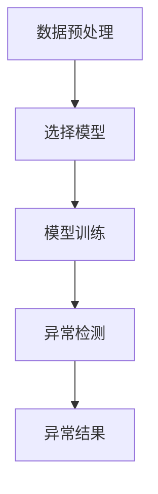
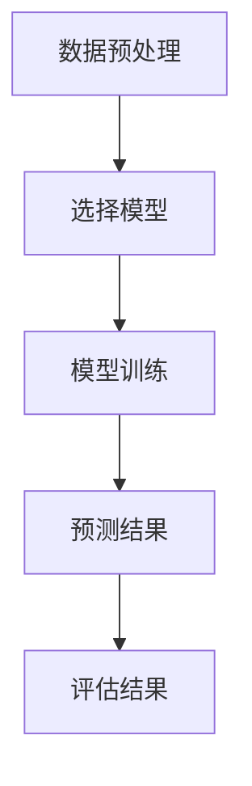
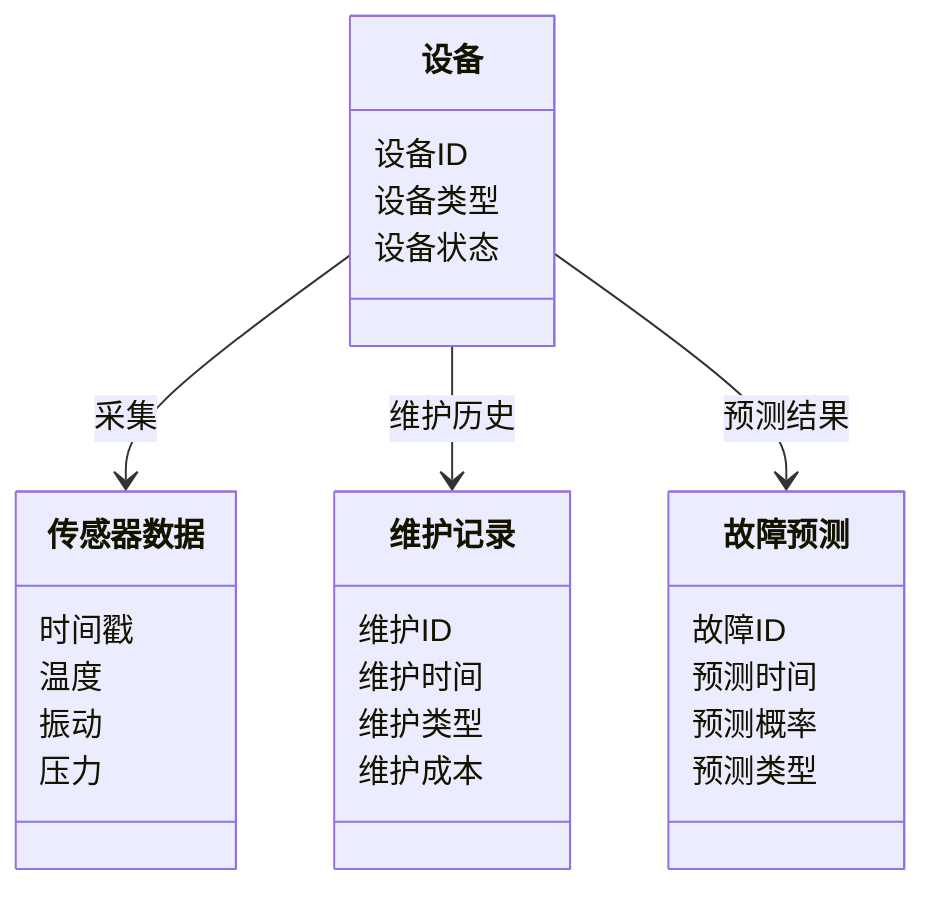
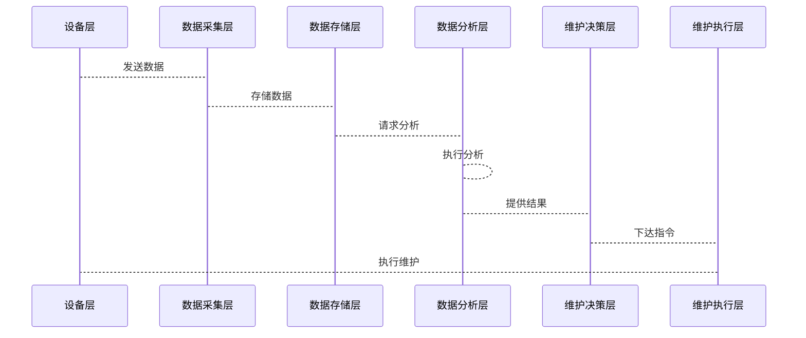

                 


# AI Agent在企业设备预测性维护中的应用

> 关键词：AI Agent, 预测性维护, 设备维护, 工业智能化, 人工智能

> 摘要：本文详细探讨了AI Agent在企业设备预测性维护中的应用，分析了其核心概念、算法原理、系统架构设计，并通过实际案例展示了其在提升设备维护效率和降低运营成本方面的巨大潜力。文章内容包括背景介绍、核心概念对比、算法流程图、系统架构设计以及项目实战，旨在为读者提供全面而深入的技术指导。

---

# 第1章: AI Agent与预测性维护的背景与概念

## 1.1 预测性维护的背景与价值

### 1.1.1 传统设备维护模式的局限性

传统的企业设备维护模式主要依赖于定期检查和故障维修。这种方式存在以下问题：

1. **高成本**：定期检查和故障维修需要大量的人力和时间，导致维护成本居高不下。
2. **低效率**：设备故障往往在发生后才被发现，导致停机时间长，影响生产效率。
3. **不可预测性**：设备故障的发生往往没有明确的规律，难以提前规划维护计划。

### 1.1.2 预测性维护的定义与特点

预测性维护是一种基于设备运行数据的分析，通过预测设备可能出现的故障，提前安排维护活动。其特点包括：

- **预防性**：通过数据分析提前发现潜在问题，防患于未然。
- **数据驱动**：依赖传感器数据和历史维护数据进行分析。
- **智能化**：结合AI技术，实现自动化预测和决策。

### 1.1.3 预测性维护在企业中的应用价值

预测性维护可以帮助企业降低维护成本、减少停机时间、提高设备利用率，并延长设备寿命。具体价值体现在：

- **降低维护成本**：通过精准预测，避免不必要的维护操作，降低维护费用。
- **提高生产效率**：减少设备故障停机时间，保障生产连续性。
- **延长设备寿命**：通过早期预测和维护，延长设备使用寿命。

## 1.2 AI Agent的核心概念

### 1.2.1 AI Agent的定义与基本特征

AI Agent是一种智能代理系统，能够感知环境、理解问题、做出决策并采取行动。其基本特征包括：

1. **感知能力**：通过传感器、数据库等获取环境信息。
2. **推理能力**：利用机器学习算法分析数据，识别模式。
3. **决策能力**：基于分析结果，做出维护决策。
4. **行动能力**：通过执行系统执行维护操作或发出警报。

### 1.2.2 AI Agent在预测性维护中的作用

AI Agent在预测性维护中扮演关键角色，主要负责数据收集、分析、预测和决策。具体作用包括：

- **数据采集**：从设备传感器获取实时数据。
- **数据分析**：利用机器学习算法分析数据，识别潜在故障。
- **预测与决策**：基于分析结果，预测设备故障时间，并制定维护计划。

### 1.2.3 AI Agent与预测性维护的关系

AI Agent是实现预测性维护的核心技术，通过其智能决策能力，预测性维护得以实现从被动维护向主动维护的转变。AI Agent通过实时数据分析，帮助企业在设备出现故障前采取预防性措施，显著提高设备维护效率。

## 1.3 本章小结

本章主要介绍了预测性维护的背景、价值以及AI Agent的核心概念。预测性维护作为一种先进的设备维护模式，能够有效降低维护成本、提高生产效率。AI Agent作为实现预测性维护的关键技术，通过其感知、分析、决策和执行能力，为企业的设备维护提供了智能化的解决方案。

---

# 第2章: AI Agent与预测性维护的核心原理

## 2.1 预测性维护的实现流程

### 2.1.1 数据采集与预处理

预测性维护的第一步是数据采集。通过设备传感器获取设备运行数据，包括温度、振动、压力等参数。数据预处理包括数据清洗、标准化和特征提取。

### 2.1.2 数据分析与建模

通过机器学习算法对预处理后的数据进行建模，识别设备的健康状态和潜在故障。常用的算法包括时间序列分析、异常检测和分类与回归算法。

### 2.1.3 预测与决策

基于建模结果，预测设备的故障时间，并制定维护计划。决策过程需要考虑设备的重要性、维护成本和停机时间等因素。

## 2.2 AI Agent在预测性维护中的工作流程

### 2.2.1 数据输入与感知

AI Agent通过传感器和数据库获取设备运行数据，作为分析的基础。

### 2.2.2 状态分析与预测

利用机器学习算法对设备状态进行分析和预测，识别潜在故障。

### 2.2.3 决策与反馈

根据预测结果，制定维护计划，并通过执行系统反馈维护结果，优化预测模型。

## 2.3 AI Agent与预测性维护的核心要素对比

### 2.3.1 核心要素对比表格

| 核心要素       | 预测性维护                          | AI Agent在预测性维护中的作用                  |
|----------------|-------------------------------------|-----------------------------------------------|
| 数据来源       | 设备传感器、历史数据                | 数据采集与处理                               |
| 分析方法       | 时间序列分析、异常检测             | 数据分析与建模                               |
| 决策依据       | 设备状态、维护成本、停机时间         | 智能决策与优化                               |
| 执行方式       | 维护计划、故障修复                  | 自动化决策与执行                             |

### 2.3.2 ER实体关系图架构

```mermaid
er
  entity 设备 {
    key 设备ID
    attribute 设备类型, 设备型号, 生产日期
  }
  entity 传感器数据 {
    key 时间戳
    attribute 温度, 振动, 压力
  }
  entity 维护记录 {
    key 维护ID
    attribute 维护时间, 维护类型, 维护成本
  }
  entity 故障预测 {
    key 故障ID
    attribute 预测时间, 预测概率, 预测类型
  }
  设备 --> 传感器数据: 采集
  设备 --> 维护记录: 维护历史
  设备 --> 故障预测: 预测结果
```

## 2.4 本章小结

本章详细介绍了预测性维护的实现流程和AI Agent在其中的核心作用。通过数据采集、分析和预测，AI Agent能够帮助企业在设备出现故障前采取预防性措施，显著提高设备维护效率。

---

# 第3章: AI Agent在预测性维护中的算法原理

## 3.1 时间序列分析算法

### 3.1.1 时间序列分析的基本原理

时间序列分析是一种基于历史数据预测未来趋势的方法。其基本步骤包括数据预处理、模型选择和模型验证。

### 3.1.2 ARIMA算法的数学模型

ARIMA（自回归积分滑动平均）模型是一种常用的时间序列预测模型。其数学公式为：

$$ ARIMA(p, d, q) $$

其中：
- \( p \) 表示自回归阶数
- \( d \) 表示差分阶数
- \( q \) 表示滑动平均阶数

### 3.1.3 LSTM算法的原理与实现

LSTM（长短期记忆网络）是一种基于深度学习的时间序列预测方法。其核心在于通过记忆单元保存长期信息，能够有效捕捉时间序列中的长期依赖关系。

### 3.1.4 时间序列分析算法流程图



## 3.2 异常检测算法

### 3.2.1 基于统计的方法

基于统计的异常检测方法通过计算数据的均值、标准差等统计量，判断数据点是否偏离正常范围。

### 3.2.2 基于深度学习的异常检测

基于深度学习的异常检测方法通过训练神经网络模型，学习正常数据的分布，识别异常数据点。

### 3.2.3 One-Class SVM算法的实现

One-Class SVM是一种用于异常检测的无监督学习算法。其数学模型如下：

$$ y = sign(w^T x + b) $$

其中：
- \( w \) 表示权重向量
- \( b \) 表示偏置项
- \( y \) 表示类别标签（1表示正常，-1表示异常）

### 3.2.4 异常检测算法流程图



## 3.3 分类与回归算法

### 3.3.1 支持向量机（SVM）的原理

SVM是一种监督学习算法，通过构建超平面将数据点分为不同类别。

### 3.3.2 随机森林（Random Forest）的实现

随机森林是一种基于树的集成学习算法，通过构建多个决策树并进行投票或平均，提高模型的准确性和鲁棒性。

### 3.3.3 线性回归模型的应用

线性回归是一种简单而有效的回归算法，适用于线性关系明显的场景。

### 3.3.4 分类与回归算法流程图



## 3.4 本章小结

本章详细介绍了时间序列分析、异常检测和分类与回归算法的原理和实现。这些算法为AI Agent在预测性维护中的应用提供了坚实的技术基础。

---

# 第4章: 系统分析与架构设计

## 4.1 问题场景介绍

企业设备预测性维护系统需要解决设备故障预测、维护计划制定和维护执行等问题。

## 4.2 系统功能设计

### 4.2.1 领域模型类图



### 4.2.2 系统架构设计


### 4.2.3 系统接口设计

系统接口包括数据采集接口、数据分析接口和维护执行接口。

### 4.2.4 系统交互序列图



## 4.3 本章小结

本章详细介绍了预测性维护系统的功能设计和架构设计。通过合理的系统架构和接口设计，确保系统的高效运行和良好扩展性。

---

# 第5章: 项目实战

## 5.1 环境安装

安装Python、TensorFlow、Keras等必要的开发工具和库。

## 5.2 核心实现

### 5.2.1 数据预处理

对传感器数据进行清洗、标准化和特征提取。

### 5.2.2 模型训练

选择合适的算法（如LSTM）进行模型训练，并进行模型验证。

### 5.2.3 系统集成

将训练好的模型集成到预测性维护系统中，实现设备故障预测和维护计划制定。

## 5.3 代码示例

### 5.3.1 LSTM模型实现

```python
import numpy as np
from tensorflow.keras.models import Sequential
from tensorflow.keras.layers import LSTM, Dense

model = Sequential()
model.add(LSTM(64, input_shape=(timesteps, features)))
model.add(Dense(1))
model.compile(loss='mean_squared_error', optimizer='adam')
model.fit(x_train, y_train, epochs=10, batch_size=32)
```

### 5.3.2 One-Class SVM实现

```python
from sklearn.svm import OneClassSVM

model = OneClassSVM(gamma='auto')
model.fit(X_train)
y_pred = model.predict(X_test)
```

## 5.4 案例分析

通过实际案例分析，验证系统的预测准确性和维护效率。

## 5.5 本章小结

本章通过实际项目案例，详细介绍了AI Agent在预测性维护中的实现过程，包括环境安装、模型训练和系统集成。

---

# 第6章: 最佳实践与注意事项

## 6.1 小结

本章总结了AI Agent在预测性维护中的应用价值和实现过程。

## 6.2 注意事项

- 数据质量：确保数据的准确性和完整性。
- 模型选择：根据实际场景选择合适的算法。
- 系统维护：定期更新模型和维护系统。

## 6.3 拓展阅读

推荐相关书籍和论文，进一步深入学习AI Agent和预测性维护的技术细节。

---

# 作者：AI天才研究院/AI Genius Institute & 禅与计算机程序设计艺术 /Zen And The Art of Computer Programming

---

通过以上详细的内容，读者可以全面了解AI Agent在企业设备预测性维护中的应用，从理论到实践，从算法到系统设计，为企业的智能化转型提供有力的技术支持。

