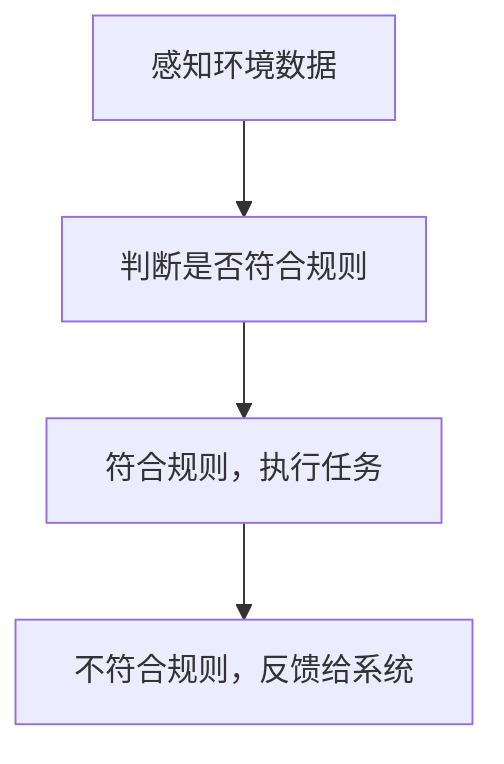
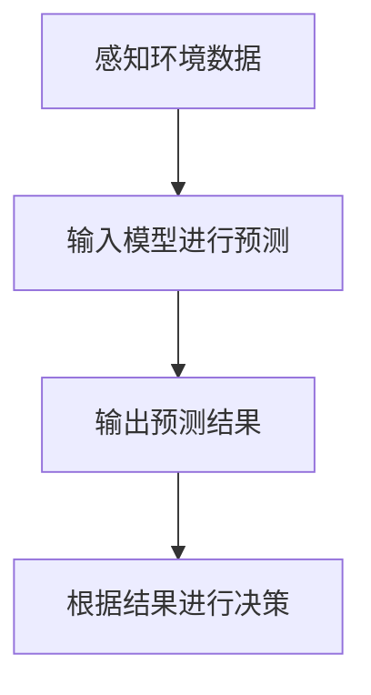
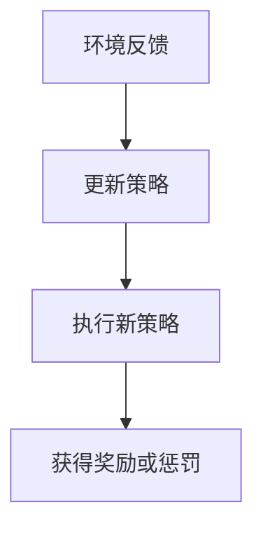
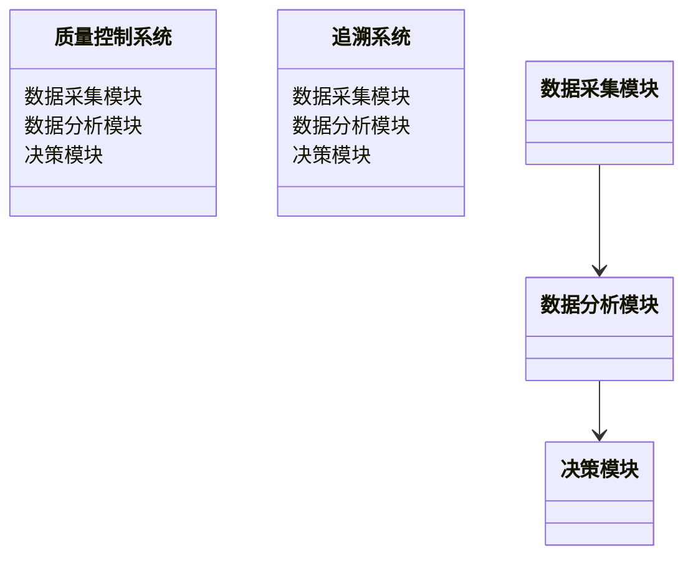
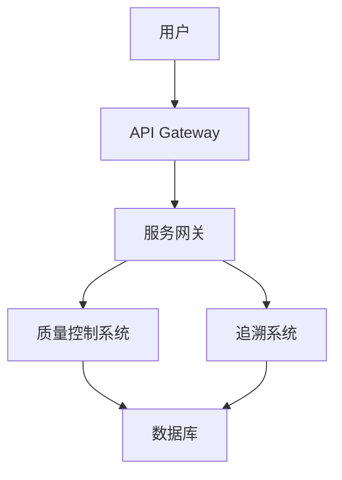
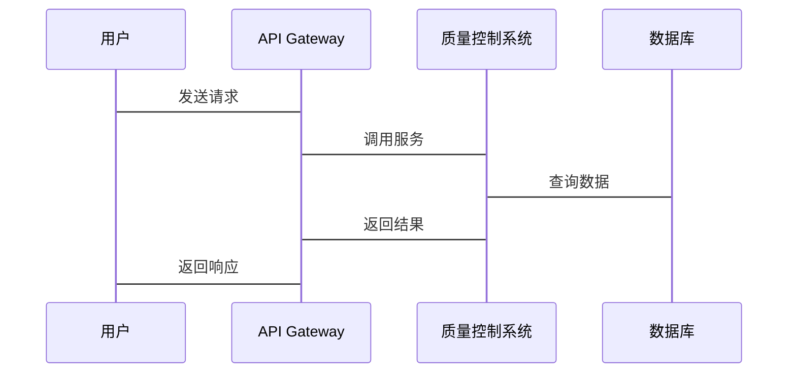

                 


# AI Agent在企业质量控制与产品追溯中的应用

> 关键词：AI Agent, 企业质量控制, 产品追溯, 人工智能, 质量管理

> 摘要：本文详细探讨了AI Agent在企业质量控制和产品追溯中的应用，从基本概念、算法原理到系统设计和项目实战，全面分析了AI Agent如何提升企业的质量控制效率和产品追溯能力。通过实际案例和详细的技术解析，展示了AI Agent在现代企业中的巨大潜力和实际价值。

---

# 第一部分: AI Agent在企业质量控制与产品追溯中的应用概述

---

## 第1章: AI Agent与企业质量控制的背景介绍

### 1.1 AI Agent的基本概念

#### 1.1.1 什么是AI Agent
AI Agent（人工智能代理）是指能够感知环境、自主决策并执行任务的智能体。它通过传感器获取信息，利用算法进行分析和推理，并通过执行器采取行动，以实现特定目标。

#### 1.1.2 AI Agent的核心属性
- **自主性**：AI Agent能够自主决策，无需外部干预。
- **反应性**：能够实时感知环境变化并做出反应。
- **目标导向**：基于目标进行决策和行动。
- **学习能力**：通过数据和经验不断优化自身性能。

#### 1.1.3 AI Agent的分类与特点
- **基于规则的AI Agent**：通过预定义的规则进行决策。
- **基于模型的AI Agent**：利用模型预测和优化决策。
- **基于强化学习的AI Agent**：通过强化学习不断优化行为策略。

### 1.2 企业质量控制的背景与挑战

#### 1.2.1 传统质量控制的局限性
- **人工检查效率低**：依赖人工检查，效率低且容易出错。
- **数据孤岛**：各部门数据分散，难以整合分析。
- **实时性不足**：无法实现实时监控和快速响应。

#### 1.2.2 现代企业对质量控制的新要求
- **高效性**：快速处理大量数据，提高质量控制效率。
- **准确性**：通过智能化手段提高结果的准确性。
- **实时性**：实现产品质量的实时监控和反馈。

#### 1.2.3 AI Agent在质量控制中的应用前景
AI Agent能够通过实时数据分析、自主决策和快速响应，显著提升质量控制的效率和准确性，为企业带来竞争优势。

### 1.3 产品追溯的重要性与实现难点

#### 1.3.1 产品追溯的基本概念
产品追溯是指通过记录和追踪产品在生产、加工、运输和销售过程中的信息，确保在出现问题时能够快速定位问题源头。

#### 1.3.2 产品追溯的实现难点
- **数据分散**：生产、运输、销售等环节数据分散，难以整合。
- **实时性要求高**：需要快速响应，及时追溯问题。
- **技术实现复杂**：需要高效的数据存储和分析技术。

#### 1.3.3 AI Agent在产品追溯中的潜在价值
AI Agent能够实时监控生产过程，快速分析数据，实现产品全生命周期的追踪和管理，提升企业的追溯能力。

---

## 第2章: AI Agent的核心概念与原理

### 2.1 AI Agent的核心概念

#### 2.1.1 AI Agent的定义与特征
AI Agent通过感知环境、分析数据并执行任务，实现预定目标。其核心特征包括自主性、反应性和目标导向。

#### 2.1.2 AI Agent与传统自动化的区别
- **传统自动化**：基于固定的规则和程序，执行预定义的任务。
- **AI Agent**：能够自主学习和适应环境，具备决策能力。

#### 2.1.3 AI Agent的决策机制与学习能力
AI Agent通过感知环境数据，利用算法进行分析和推理，制定最优决策并执行。

### 2.2 AI Agent的类型与应用场景

#### 2.2.1 基于规则的AI Agent
- **特点**：基于预定义的规则进行决策，适用于规则明确的场景。
- **应用场景**：简单的产品质量检查和分类。

#### 2.2.2 基于模型的AI Agent
- **特点**：利用数学模型进行预测和优化，适用于复杂场景。
- **应用场景**：复杂产品的质量预测和优化。

#### 2.2.3 基于强化学习的AI Agent
- **特点**：通过与环境互动，不断优化行为策略。
- **应用场景**：动态环境下的质量控制和优化。

### 2.3 AI Agent的核心算法原理

#### 2.3.1 基于规则的决策算法


#### 2.3.2 基于模型的预测算法


#### 2.3.3 基于强化学习的优化算法


### 2.4 AI Agent的优缺点分析

#### 2.4.1 AI Agent的优点
- **高效性**：能够快速处理大量数据，提高决策效率。
- **准确性**：通过智能化分析，减少人为错误。
- **适应性**：能够适应环境变化，优化自身行为。

#### 2.4.2 AI Agent的缺点
- **技术复杂性**：需要复杂的算法和模型。
- **成本高**：开发和维护成本较高。
- **依赖数据质量**：需要高质量的数据支持。

---

## 第3章: AI Agent在企业质量控制中的应用

### 3.1 企业质量控制的流程与关键环节

#### 3.1.1 企业质量控制的基本流程
1. **数据采集**：通过传感器等设备采集生产过程中的数据。
2. **数据分析**：利用AI算法分析数据，识别潜在问题。
3. **决策与反馈**：根据分析结果做出决策并反馈给系统。

#### 3.1.2 质量控制的关键环节与挑战
- **数据采集**：需要高精度的传感器。
- **数据分析**：需要高效的算法支持。
- **决策反馈**：需要快速响应和反馈机制。

#### 3.1.3 AI Agent在质量控制中的具体应用场景
- **实时监控**：实时监测生产过程中的关键参数。
- **异常检测**：快速识别和定位生产中的异常情况。
- **质量预测**：预测产品质量，优化生产流程。

### 3.2 AI Agent在质量控制中的实现原理

#### 3.2.1 数据采集与处理
- **数据采集**：通过传感器采集生产过程中的各项数据。
- **数据预处理**：对数据进行清洗和标准化处理。
- **数据存储**：将数据存储在数据库中，供后续分析使用。

#### 3.2.2 数据分析与决策
- **数据分析**：利用机器学习算法对数据进行分析，识别潜在问题。
- **决策制定**：根据分析结果，制定相应的决策策略。
- **决策反馈**：将决策结果反馈给生产系统，优化生产流程。

#### 3.2.3 决策结果的反馈与优化
- **反馈机制**：将决策结果反馈给AI Agent，用于优化后续决策。
- **优化策略**：通过不断优化算法，提升决策的准确性和效率。

### 3.3 AI Agent在质量控制中的优势

#### 3.3.1 提高质量控制的效率
- AI Agent能够快速处理大量数据，显著提高质量控制的效率。

#### 3.3.2 增强质量控制的准确性
- 通过智能化分析，减少人为错误，提高质量控制的准确性。

#### 3.3.3 实现质量控制的智能化
- AI Agent能够自主学习和优化，实现质量控制的智能化和自动化。

---

## 第4章: AI Agent在产品追溯中的应用

### 4.1 产品追溯的基本概念与实现难点

#### 4.1.1 产品追溯的基本概念
产品追溯是指通过记录和追踪产品在生产、加工、运输和销售过程中的信息，确保在出现问题时能够快速定位问题源头。

#### 4.1.2 产品追溯的实现难点
- **数据分散**：生产、运输、销售等环节数据分散，难以整合。
- **实时性要求高**：需要快速响应，及时追溯问题。
- **技术实现复杂**：需要高效的数据存储和分析技术。

### 4.2 AI Agent在产品追溯中的实现原理

#### 4.2.1 数据采集与处理
- **数据采集**：通过传感器和物联网设备采集产品在各环节的数据。
- **数据预处理**：对数据进行清洗和标准化处理。
- **数据存储**：将数据存储在数据库中，供后续分析使用。

#### 4.2.2 数据分析与决策
- **数据分析**：利用机器学习算法对数据进行分析，识别潜在问题。
- **决策制定**：根据分析结果，制定相应的决策策略。
- **决策反馈**：将决策结果反馈给追溯系统，优化后续操作。

#### 4.2.3 决策结果的反馈与优化
- **反馈机制**：将决策结果反馈给AI Agent，用于优化后续决策。
- **优化策略**：通过不断优化算法，提升决策的准确性和效率。

### 4.3 AI Agent在产品追溯中的优势

#### 4.3.1 提高追溯效率
- AI Agent能够快速处理大量数据，显著提高追溯的效率。

#### 4.3.2 增强追溯的准确性
- 通过智能化分析，减少人为错误，提高追溯的准确性。

#### 4.3.3 实现追溯的智能化
- AI Agent能够自主学习和优化，实现追溯的智能化和自动化。

---

## 第5章: 系统分析与架构设计

### 5.1 问题场景介绍

#### 5.1.1 质量控制场景
- **背景**：某企业生产过程中存在产品质量不稳定的问题，需要通过AI Agent实现智能化的质量控制。

#### 5.1.2 产品追溯场景
- **背景**：某企业需要实现产品的全生命周期追溯，以快速定位和解决问题。

### 5.2 项目介绍

#### 5.2.1 项目目标
- 提升产品质量控制的效率和准确性。
- 实现产品的全生命周期追溯，快速定位问题。

#### 5.2.2 项目范围
- 数据采集与处理。
- 数据分析与决策。
- 决策反馈与优化。

### 5.3 系统功能设计

#### 5.3.1 领域模型


#### 5.3.2 系统架构设计


#### 5.3.3 系统接口设计
- **API接口**：提供RESTful API，供其他系统调用。
- **数据接口**：与传感器和数据库进行数据交互。

#### 5.3.4 系统交互流程


---

## 第6章: 项目实战

### 6.1 环境安装

#### 6.1.1 安装Python环境
```bash
python --version
pip install --upgrade pip
```

#### 6.1.2 安装必要的库
```bash
pip install numpy
pip install scikit-learn
pip install matplotlib
```

### 6.2 系统核心实现

#### 6.2.1 数据采集模块
```python
import numpy as np
import pandas as pd

# 采集数据
data = np.random.randn(100, 5)
df = pd.DataFrame(data, columns=['温度', '湿度', '压力', '速度', '振动'])
```

#### 6.2.2 数据分析模块
```python
from sklearn import tree

# 训练决策树模型
model = tree.DecisionTreeClassifier()
model.fit(df[['温度', '湿度', '压力', '速度']], df['振动'])
```

#### 6.2.3 决策模块
```python
# 预测结果
new_data = np.array([[25, 60, 100, 50]], dtype=float)
prediction = model.predict(new_data)
print('预测结果:', prediction)
```

### 6.3 代码应用解读与分析

#### 6.3.1 数据采集模块
- 使用numpy和pandas生成模拟数据，模拟生产过程中的各项参数。

#### 6.3.2 数据分析模块
- 使用scikit-learn中的决策树算法，训练模型以预测产品质量。

#### 6.3.3 决策模块
- 使用训练好的模型进行预测，输出预测结果。

### 6.4 实际案例分析

#### 6.4.1 案例背景
某制造企业希望利用AI Agent实现生产过程中的质量控制。

#### 6.4.2 数据分析
通过对生产过程中的数据进行分析，识别出关键影响因素。

#### 6.4.3 决策优化
根据分析结果，优化生产参数，提高产品质量。

### 6.5 项目小结
通过本项目的实施，企业能够显著提升质量控制的效率和准确性，同时实现产品的全生命周期追溯。

---

## 第7章: 总结与展望

### 7.1 总结
本文详细探讨了AI Agent在企业质量控制与产品追溯中的应用，从基本概念、算法原理到系统设计和项目实战，全面分析了AI Agent如何提升企业的质量控制效率和产品追溯能力。

### 7.2 展望
随着人工智能技术的不断发展，AI Agent在企业质量控制和产品追溯中的应用将更加广泛和深入，为企业带来更大的竞争优势。

---

## 作者：AI天才研究院/AI Genius Institute & 禅与计算机程序设计艺术 /Zen And The Art of Computer Programming

---

# 本文到此结束，感谢您的阅读！

