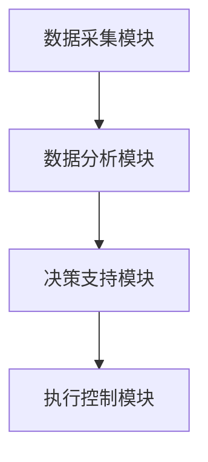
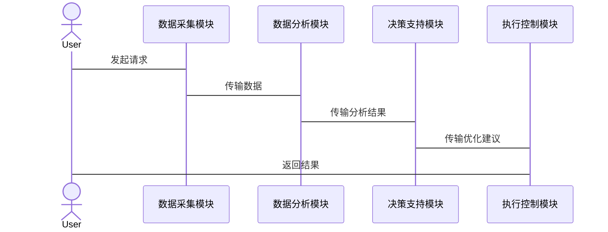

                 


# AI Agent在企业质量管理体系优化中的全面应用

> 关键词：AI Agent，企业质量管理，质量管理优化，智能化管理，流程优化

> 摘要：本文详细探讨了AI Agent在企业质量管理体系优化中的应用，从基本概念到具体应用场景，再到算法原理和系统架构设计，系统性地分析了AI Agent如何提升企业质量管理效率和质量水平。通过实际案例分析，展示了AI Agent在质量管理中的优势和价值。

---

# 第一部分: AI Agent与企业质量管理体系概述

## 第1章: AI Agent的基本概念与企业质量管理概述

### 1.1 AI Agent的基本概念

#### 1.1.1 AI Agent的定义与核心特征
AI Agent（人工智能代理）是指具有感知环境、理解任务目标，并能够自主决策和执行任务的智能实体。其核心特征包括：

- **自主性**：能够自主决策，无需人工干预。
- **反应性**：能够实时感知环境变化并做出反应。
- **学习性**：能够通过数据和经验不断优化自身的决策能力。
- **协作性**：能够与其他系统或人类进行协作。

#### 1.1.2 AI Agent与传统自动化的区别
AI Agent与传统自动化系统的主要区别在于其智能化和自主性。传统自动化系统通常是基于固定的规则和程序运行，而AI Agent能够通过学习和适应环境来优化自身的操作流程。例如：

- **传统自动化**：基于固定规则执行任务，如简单的流程自动化。
- **AI Agent**：能够理解上下文、分析问题并提出优化建议。

| 特性 | 传统自动化 | AI Agent |
|------|------------|----------|
| 决策方式 | 固定规则 | 灵活决策 |
| 学习能力 | 无 | 有 |
| 环境适应性 | 无 | 强 |

#### 1.1.3 AI Agent在企业中的应用价值
AI Agent在企业中的应用价值主要体现在以下几个方面：

1. **提升效率**：通过自动化和智能化的方式优化企业流程。
2. **降低错误率**：通过数据分析和预测减少人为错误。
3. **实时监控**：能够实时监控企业运营中的关键指标。

### 1.2 企业质量管理体系的基本框架

#### 1.2.1 质量管理体系的定义与目标
质量管理体系（QMS）是企业为了保证产品质量和服务质量而建立的一套管理方法和流程。其目标是通过系统化的管理手段，确保企业的产品和服务符合相关标准和客户需求。

#### 1.2.2 质量管理体系的核心要素
质量管理体系的核心要素包括：

1. **组织结构**：明确质量管理的组织架构和职责。
2. **程序**：制定质量管理的流程和标准。
3. **过程**：监控和优化关键质量管理过程。
4. **绩效**：评估质量管理的成果并持续改进。

#### 1.2.3 质量管理体系的PDCA循环
PDCA循环（计划-执行-检查-处理）是质量管理体系的核心方法论。它包括以下四个阶段：

1. **计划（Plan）**：制定质量管理目标和计划。
2. **执行（Do）**：按照计划执行质量管理活动。
3. **检查（Check）**：监控和评估质量管理活动的效果。
4. **处理（Act）**：根据检查结果进行优化和改进。

### 1.3 AI Agent与企业质量管理的结合

#### 1.3.1 AI Agent在质量管理中的优势
AI Agent在质量管理中的优势主要体现在以下几个方面：

1. **智能化分析**：能够通过大数据分析快速识别质量问题。
2. **实时监控**：能够实时监控生产过程中的关键指标。
3. **自适应优化**：能够根据环境变化自动优化质量管理流程。

#### 1.3.2 AI Agent与质量管理流程的融合
AI Agent可以通过以下方式与质量管理流程融合：

1. **数据采集**：实时采集生产过程中的数据。
2. **数据分析**：对数据进行分析，识别潜在质量问题。
3. **决策支持**：根据分析结果提供优化建议。

#### 1.3.3 企业质量管理智能化的必要性
随着市场竞争的加剧，企业需要不断提高产品质量和服务质量。通过引入AI Agent，企业可以实现质量管理的智能化，从而提高效率、降低成本。

---

## 第2章: AI Agent的核心原理与技术实现

### 2.1 AI Agent的基本原理

#### 2.1.1 AI Agent的感知机制
AI Agent的感知机制主要通过以下几种方式实现：

1. **数据采集**：通过传感器、数据库等采集环境数据。
2. **信息处理**：对采集到的数据进行清洗、转换和分析。
3. **知识表示**：将分析结果表示为知识图谱或规则库。

#### 2.1.2 AI Agent的决策机制
AI Agent的决策机制通常基于以下几种方法：

1. **基于规则的决策**：根据预定义的规则进行决策。
2. **基于模型的决策**：通过机器学习模型进行预测和决策。
3. **基于强化学习的决策**：通过强化学习不断优化决策策略。

#### 2.1.3 AI Agent的执行机制
AI Agent的执行机制包括以下步骤：

1. **目标设定**：根据当前环境和任务目标设定行动。
2. **行动规划**：制定具体的行动步骤。
3. **行动执行**：执行预设的行动并实时监控效果。

#### 2.1.4 AI Agent的反馈机制
AI Agent的反馈机制用于优化决策和行动。通过不断收集和分析反馈信息，AI Agent可以逐步优化自身的决策策略。

### 2.2 AI Agent的关键技术

#### 2.2.1 自然语言处理技术
自然语言处理（NLP）技术用于理解和处理人类语言。在质量管理中，NLP技术可以用于分析客户反馈、文档审核等。

#### 2.2.2 机器学习算法
机器学习算法用于从数据中学习模式和规律。在质量管理中，机器学习算法可以用于质量预测、异常检测等。

#### 2.2.3 知识图谱构建技术
知识图谱构建技术用于构建企业的知识库。在质量管理中，知识图谱可以用于存储质量管理相关的知识和经验。

#### 2.2.4 加强学习算法
强化学习算法是一种通过试错学习优化决策策略的方法。在质量管理中，强化学习算法可以用于优化质量控制流程。

### 2.3 AI Agent的实现架构

#### 2.3.1 基于规则的AI Agent架构
基于规则的AI Agent架构通过预定义的规则进行决策。例如，在质量管理中，可以预定义一些质量标准，当检测到不符合标准的数据时，触发报警。

#### 2.3.2 基于模型的AI Agent架构
基于模型的AI Agent架构通过机器学习模型进行决策。例如，可以使用随机森林或神经网络模型对质量数据进行分类和预测。

#### 2.3.3 基于强化学习的AI Agent架构
基于强化学习的AI Agent架构通过不断试错优化决策策略。例如，在质量管理中，AI Agent可以通过调整质量控制参数来优化产品质量。

---

## 第3章: AI Agent在企业质量管理中的应用场景

### 3.1 质量管理体系优化的常见问题

#### 3.1.1 质量管理流程的复杂性
质量管理流程通常涉及多个环节和部门，流程复杂容易导致效率低下。

#### 3.1.2 数据分析的滞后性
传统的数据分析通常基于历史数据，缺乏实时性，难以及时发现和解决问题。

#### 3.1.3 人工干预的局限性
人工干预容易受到主观因素和疲劳的影响，容易出现错误和遗漏。

### 3.2 AI Agent在质量管理中的具体应用

#### 3.2.1 质量数据的实时监控与分析
AI Agent可以通过实时采集和分析质量数据，快速识别潜在质量问题。例如，在制造业中，AI Agent可以实时监控生产线上的温度、压力等参数，及时发现异常情况。

#### 3.2.2 质量问题的自动识别与预警
AI Agent可以通过机器学习算法对质量数据进行分类和预测，自动识别潜在质量问题并发出预警。例如，当预测到某批次产品可能出现缺陷时，AI Agent可以提前通知相关部门进行处理。

#### 3.2.3 质量改进方案的自动生成
AI Agent可以根据分析结果自动生成质量改进方案。例如，当发现某个环节存在瓶颈时，AI Agent可以提出优化建议，如调整工艺参数、优化流程等。

### 3.3 AI Agent在质量管理中的优势

#### 3.3.1 提高质量管理效率
AI Agent可以通过自动化和智能化的方式优化质量管理流程，显著提高效率。

#### 3.3.2 降低质量管理成本
通过AI Agent的实时监控和预警功能，可以减少因质量问题导致的返工和浪费，从而降低成本。

#### 3.3.3 提升质量管理水平
AI Agent可以提供基于数据的决策支持，帮助企业更科学地优化质量管理流程，提升整体质量管理水平。

---

## 第4章: AI Agent在质量管理中的算法实现

### 4.1 基于强化学习的优化算法

#### 4.1.1 强化学习的基本原理
强化学习是一种通过试错学习优化决策策略的方法。其基本原理是通过不断与环境交互，学习最优的行动策略。

#### 4.1.2 基于强化学习的优化算法流程
基于强化学习的优化算法流程包括以下几个步骤：

1. **状态定义**：定义质量管理中的状态，如当前质量指标。
2. **动作定义**：定义可能的行动，如调整参数。
3. **奖励机制**：定义奖励函数，根据行动效果给予奖励或惩罚。
4. **策略优化**：通过不断试错优化决策策略。

#### 4.1.3 基于强化学习的优化算法代码实现

```python
import gym
import numpy as np

class Agent:
    def __init__(self, env):
        self.env = env
        self.learning_rate = 0.01
        self.discount_factor = 0.99
        self.q_table = np.zeros(env.observation_space.shape)

    def take_action(self, state):
        if np.random.random() < 0.9:
            action = np.argmax(self.q_table[state])
        else:
            action = self.env.action_space.sample()
        return action

    def update_q_table(self, state, action, reward, next_state):
        self.q_table[state][action] += self.learning_rate * (reward + self.discount_factor * np.max(self.q_table[next_state]) - self.q_table[state][action])

# 创建环境
env = gym.make('CartPole-v0')

# 初始化代理
agent = Agent(env)

# 开始训练
for episode in range(1000):
    state = env.reset()
    total_reward = 0
    done = False
    while not done:
        action = agent.take_action(state)
        next_state, reward, done, info = env.step(action)
        agent.update_q_table(state, action, reward, next_state)
        total_reward += reward
        state = next_state
    print(f"Episode {episode}: Total Reward = {total_reward}")
```

#### 4.1.4 算法的数学模型
基于强化学习的优化算法的数学模型如下：

$$ Q(s, a) = Q(s, a) + \alpha [r + \gamma \max Q(s', a') - Q(s, a)] $$

其中：
- \( Q(s, a) \)：状态-动作对的价值
- \( \alpha \)：学习率
- \( r \)：奖励
- \( \gamma \)：折扣因子
- \( s' \)：下一个状态
- \( a' \)：下一个动作

---

## 第5章: 系统分析与架构设计

### 5.1 问题场景介绍
假设我们正在优化一个制造企业的质量管理系统。该系统需要实时监控生产线上的质量指标，并根据数据自动优化生产参数。

### 5.2 系统功能设计

#### 5.2.1 功能模块设计
系统主要包括以下几个功能模块：

1. **数据采集模块**：实时采集生产线上的质量数据。
2. **数据分析模块**：对采集到的数据进行分析，识别潜在质量问题。
3. **决策支持模块**：根据分析结果提供优化建议。
4. **执行控制模块**：根据优化建议调整生产参数。

#### 5.2.2 功能模块之间的关系
以下是功能模块之间的关系图：



### 5.3 系统架构设计

#### 5.3.1 系统架构图
以下是系统的架构图：


### 5.4 系统接口设计

#### 5.4.1 数据采集模块接口
- **输入**：传感器数据
- **输出**：清洗后的数据

#### 5.4.2 数据分析模块接口
- **输入**：清洗后的数据
- **输出**：分析结果

#### 5.4.3 决策支持模块接口
- **输入**：分析结果
- **输出**：优化建议

#### 5.4.4 执行控制模块接口
- **输入**：优化建议
- **输出**：调整后的参数

### 5.5 系统交互流程图



---

## 第6章: 项目实战

### 6.1 环境配置

#### 6.1.1 安装必要的库
需要安装以下Python库：

- `gym`
- `numpy`

#### 6.1.2 配置开发环境
推荐使用Jupyter Notebook进行开发和调试。

### 6.2 系统核心实现

#### 6.2.1 数据采集模块实现
```python
import gym
import numpy as np

class DataCollector:
    def __init__(self, env):
        self.env = env
        self.data = []

    def collect_data(self, num_episodes):
        for _ in range(num_episodes):
            state = self.env.reset()
            done = False
            while not done:
                action = self.env.action_space.sample()
                next_state, reward, done, info = self.env.step(action)
                self.data.append((state, action, reward, next_state))
                state = next_state
```

#### 6.2.2 数据分析模块实现
```python
import numpy as np

class DataAnalyzer:
    def __init__(self, data):
        self.data = data

    def analyze(self):
        # 示例分析：计算平均奖励
        rewards = [d[2] for d in self.data]
        return np.mean(rewards)
```

#### 6.2.3 决策支持模块实现
```python
class DecisionSupport:
    def __init__(self, analyzer):
        self.analyzer = analyzer

    def provide_recommendation(self):
        avg_reward = self.analyzer.analyze()
        if avg_reward > 0.8:
            return "参数正常，无需调整"
        else:
            return "参数需要调整，建议重新优化"
```

#### 6.2.4 执行控制模块实现
```python
class Executor:
    def __init__(self, env):
        self.env = env

    def execute(self, recommendation):
        if recommendation == "参数正常，无需调整":
            return "执行正常"
        else:
            # 示例优化：调整学习率
            self.env.learning_rate *= 0.9
            return "执行优化"
```

### 6.3 代码应用解读与分析
通过上述代码，我们可以实现一个简单的AI Agent系统，用于优化质量管理流程。数据采集模块负责收集数据，数据分析模块负责分析数据，决策支持模块负责提供优化建议，执行控制模块负责调整参数。

### 6.4 实际案例分析
以制造业为例，假设我们正在优化一条生产线的质量管理流程。通过上述系统，我们可以实时监控生产线上的质量指标，自动识别潜在质量问题，并提供优化建议。

### 6.5 项目小结
通过本项目的实践，我们可以看到AI Agent在质量管理中的巨大潜力。通过实时监控和优化，AI Agent可以帮助企业显著提高质量管理效率和质量水平。

---

## 第7章: 最佳实践与总结

### 7.1 最佳实践

#### 7.1.1 小结
AI Agent在质量管理中的应用可以帮助企业实现质量管理的智能化和自动化，显著提高效率和质量水平。

#### 7.1.2 注意事项
在实际应用中，需要注意以下几点：

1. **数据质量**：确保数据的准确性和完整性。
2. **模型优化**：根据实际情况不断优化AI Agent的决策模型。
3. **系统集成**：确保AI Agent能够与现有系统无缝集成。

#### 7.1.3 拓展阅读
推荐以下书籍和资料：

- 《强化学习入门：基于Python的算法实现》
- 《机器学习实战》
- 《深入浅出机器学习》

### 7.2 作者总结
AI Agent作为一项前沿技术，正在逐渐改变企业的质量管理方式。通过本文的分析和实践，我们看到了AI Agent在质量管理中的巨大潜力。未来，随着技术的不断发展，AI Agent将在企业质量管理中发挥越来越重要的作用。

---

# 作者：AI天才研究院/AI Genius Institute & 禅与计算机程序设计艺术 /Zen And The Art of Computer Programming

