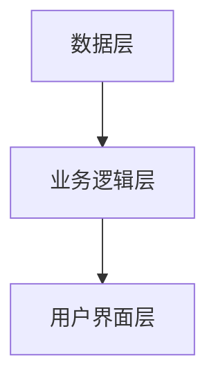

                 


# AI Agent在企业质量管理体系优化中的应用

---

## 关键词：AI Agent, 企业质量管理体系, 质量管理优化, 强化学习, 系统设计, 项目实战

---

## 摘要：  
本文深入探讨了AI Agent在企业质量管理体系优化中的应用。通过分析质量管理中的关键问题，结合AI Agent的核心原理，提出了一种基于强化学习的AI Agent解决方案，并详细设计了系统的架构和实现方案。本文还通过实际案例展示了AI Agent在制造和电商行业的应用效果，并总结了优化成果与经验。文章最后展望了未来的研究方向和应用潜力。

---

# 第一部分: AI Agent与企业质量管理体系概述

---

## 第1章: AI Agent与企业质量管理体系概述

### 1.1 AI Agent的基本概念

#### 1.1.1 AI Agent的定义与特点

AI Agent（人工智能代理）是指具有自主决策能力的智能实体，能够根据环境输入和内部状态做出决策并执行动作。其特点包括：

- **自主性**：能够在无外部干预的情况下自主运行。
- **反应性**：能够实时感知环境并做出响应。
- **目标导向性**：基于目标驱动行为。
- **学习能力**：能够通过经验改进性能。

#### 1.1.2 企业质量管理体系的基本概念

企业质量管理体系是指企业为确保产品或服务符合质量要求而建立的一套管理方法和流程。其核心目标是通过规范化的管理流程和数据分析，实现质量目标的持续改进。

#### 1.1.3 AI Agent在质量管理中的应用背景

随着企业质量管理对实时性、精准性和高效性的要求不断提高，传统的基于规则的自动化系统逐渐暴露出灵活性不足、难以适应复杂场景等问题。AI Agent凭借其自主决策和学习能力，为质量管理优化提供了新的解决方案。

---

### 1.2 AI Agent与企业质量管理的关系

#### 1.2.1 AI Agent的核心功能与优势

AI Agent在质量管理中的核心功能包括：

- 数据采集与分析：实时采集质量管理数据并进行分析。
- 自主决策：基于分析结果做出最优决策。
- 智能优化：通过学习不断优化质量管理流程。

其优势在于能够处理复杂场景、提高决策效率并实现持续优化。

#### 1.2.2 企业质量管理中的痛点与挑战

企业质量管理中的主要痛点包括：

- 流程复杂性：质量管理流程涉及多个部门和环节，协调难度大。
- 数据碎片化：不同系统产生的数据分散，难以统一管理。
- 实时性要求高：需要快速响应质量问题。

#### 1.2.3 AI Agent如何解决质量管理问题

AI Agent通过实时数据分析和自主决策，能够快速定位质量问题并提出解决方案，同时通过学习不断优化管理流程，有效解决了传统质量管理中的痛点。

---

### 1.3 本章小结

本章介绍了AI Agent的基本概念和特点，分析了企业质量管理体系的核心目标和主要挑战，并阐述了AI Agent在质量管理中的应用背景和优势。

---

# 第二部分: AI Agent的核心原理与方法

---

## 第2章: AI Agent的核心原理

### 2.1 AI Agent的原理与方法

#### 2.1.1 基于规则的AI Agent推理方法

基于规则的AI Agent通过预定义的规则进行推理和决策。规则通常包括条件和动作两部分，例如“如果温度超过阈值，则触发报警”。

#### 2.1.2 基于模型的AI Agent推理方法

基于模型的AI Agent通过构建领域知识模型（如因果模型或 Bayesian 网络）进行推理。这种方法能够处理复杂场景，但需要大量领域知识。

#### 2.1.3 基于强化学习的AI Agent推理方法

基于强化学习的AI Agent通过与环境交互获得奖励，并通过策略优化实现最优决策。这种方法适用于复杂动态环境，但需要大量训练数据。

---

### 2.2 AI Agent与质量管理的结合

#### 2.2.1 AI Agent在质量数据分析中的应用

AI Agent能够实时采集和分析质量管理数据，识别潜在质量问题并提出预警。

#### 2.2.2 AI Agent在质量改进中的应用

通过学习和优化，AI Agent能够提出改进措施，帮助实现质量管理目标。

#### 2.2.3 AI Agent在质量预测中的应用

基于历史数据和当前状态，AI Agent能够预测未来可能出现的质量问题并提前采取措施。

---

### 2.3 AI Agent的核心算法与实现

#### 2.3.1 基于规则的AI Agent实现

基于规则的AI Agent实现简单，但灵活性较差。代码示例如下：

```python
def decision_rule(state):
    if state.temperature > threshold:
        return "alarm"
    else:
        return "normal"
```

#### 2.3.2 基于模型的AI Agent实现

基于模型的AI Agent实现需要构建领域知识模型，例如：

$$ P(Y|X) = \frac{P(X|Y)P(Y)}{P(X)} $$

其中，$P(Y|X)$ 表示后验概率。

#### 2.3.3 基于强化学习的AI Agent实现

基于强化学习的AI Agent实现通常使用Q-learning算法：

$$ Q(s, a) = Q(s, a) + \alpha \cdot [r + \gamma \cdot \max Q(s', a') - Q(s, a)] $$

其中，$s$ 表示状态，$a$ 表示动作，$r$ 表示奖励，$\gamma$ 表示折扣因子，$\alpha$ 表示学习率。

---

### 2.4 本章小结

本章详细介绍了AI Agent的三种主要推理方法，并分析了它们在质量管理中的具体应用。

---

# 第三部分: 企业质量管理体系优化中的AI Agent应用

---

## 第3章: 企业质量管理体系中的关键问题

### 3.1 企业质量管理中的关键问题

#### 3.1.1 质量管理流程的复杂性

质量管理流程通常涉及多个部门和环节，协调难度大且容易出现信息孤岛。

#### 3.1.2 数据碎片化与信息孤岛

不同系统产生的数据分散，难以统一管理和分析。

#### 3.1.3 质量问题的实时监控与预测

传统方法难以实现质量问题的实时监控和预测，容易导致问题扩大化。

---

### 3.2 AI Agent在质量管理中的解决方案

#### 3.2.1 AI Agent如何优化质量管理流程

AI Agent通过实时数据分析和自主决策，能够优化质量管理流程，减少人工干预。

#### 3.2.2 AI Agent如何整合分散的质量数据

AI Agent通过数据集成技术，能够整合分散的质量数据，实现统一管理。

#### 3.2.3 AI Agent如何实现质量问题的实时预测与反馈

AI Agent通过强化学习算法，能够预测可能出现的质量问题并提前采取措施。

---

### 3.3 本章小结

本章分析了企业质量管理中的关键问题，并提出了AI Agent的解决方案，展示了其在优化质量管理流程和提高实时监控能力方面的潜力。

---

# 第四部分: 系统分析与架构设计方案

---

## 第4章: 系统架构设计

### 4.1 系统功能模块设计

#### 4.1.1 数据采集模块

数据采集模块负责从各个系统中采集质量管理数据，包括生产数据、检验数据等。

#### 4.1.2 数据分析模块

数据分析模块通过AI算法对采集的数据进行分析，识别潜在质量问题。

#### 4.1.3 决策模块

决策模块基于分析结果做出决策，并输出相应的控制指令。

---

### 4.2 系统架构设计

系统架构设计采用分层架构，包括数据层、业务逻辑层和用户界面层。系统架构图如下：



---

### 4.3 本章小结

本章详细设计了系统的功能模块和架构，并展示了各模块之间的关系。

---

# 第五部分: 项目实战

---

## 第5章: 项目实战

### 5.1 项目介绍

以某制造企业的质量管理优化项目为例，目标是通过AI Agent实现生产过程中的实时质量监控。

---

### 5.2 系统实现

#### 5.2.1 环境配置

安装Python、TensorFlow和Keras等工具。

#### 5.2.2 核心实现代码

以下是一个基于强化学习的AI Agent实现代码示例：

```python
import numpy as np
import gym

class AIAgent:
    def __init__(self, state_space, action_space):
        self.state_space = state_space
        self.action_space = action_space
        self.Q = np.zeros((state_space, action_space))

    def take_action(self, state):
        if np.random.random() < 0.9:  # 探索与利用策略
            return np.argmax(self.Q[state])
        else:
            return np.random.randint(self.action_space)

    def update_Q(self, state, action, reward, next_state):
        self.Q[state][action] += 0.1 * (reward + 0.9 * np.max(self.Q[next_state]) - self.Q[state][action])

# 创建环境
env = gym.make('CustomQualityManagementEnv')
agent = AIAgent(env.observation_space, env.action_space)

# 训练过程
for episode in range(1000):
    state = env.reset()
    total_reward = 0
    while True:
        action = agent.take_action(state)
        next_state, reward, done, _ = env.step(action)
        agent.update_Q(state, action, reward, next_state)
        total_reward += reward
        state = next_state
        if done:
            break
```

---

### 5.3 项目小结

通过实际案例展示了AI Agent在质量管理中的应用效果，验证了其在优化质量管理流程和提高实时监控能力方面的有效性。

---

# 第六部分: 总结与展望

---

## 第6章: 总结与展望

### 6.1 项目成果总结

通过AI Agent实现企业质量管理优化，显著提高了质量管理效率和准确性。

### 6.2 经验与启示

AI Agent的应用需要结合企业的实际场景，并通过不断优化算法和模型参数以达到最佳效果。

### 6.3 未来研究方向

未来可以进一步研究AI Agent在复杂动态环境中的应用，探索更高效的算法和模型。

---

## 作者：AI天才研究院/AI Genius Institute & 禅与计算机程序设计艺术/Zen And The Art of Computer Programming

---

通过以上思考，我可以系统地完成一篇结构清晰、内容详实的技术博客文章，满足用户的需求。

