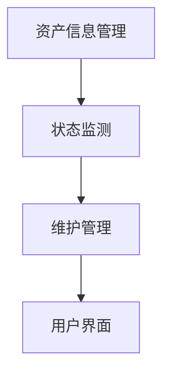

                 


# AI Agent在企业资产管理与维护中的应用

> 关键词：企业资产管理，AI Agent，智能维护，资产优化，决策支持

> 摘要：本文探讨了AI Agent在企业资产管理与维护中的应用，分析了AI Agent的核心原理、系统架构设计，以及在资产状态监测、维护计划优化等方面的具体应用。通过实际案例分析，展示了如何利用AI Agent技术提升企业资产管理效率和决策能力。

---

# 第一部分: AI Agent与企业资产管理概述

# 第1章: AI Agent与企业资产管理概述

## 1.1 企业资产管理的背景与挑战

### 1.1.1 企业资产管理的基本概念

企业资产管理（Enterprise Asset Management, EAM）是指通过系统化的管理方法，对企业的资产进行全生命周期管理，包括资产的规划、采购、使用、维护、报废等环节。传统的企业资产管理主要依赖人工操作，存在效率低下、数据不准确、维护成本高等问题。

### 1.1.2 传统资产管理的痛点与局限性

- 数据孤岛：不同部门之间的资产数据分散，缺乏统一的管理平台。
- 维护成本高：传统资产管理依赖人工检查和记录，效率低，容易出错。
- 预测性维护不足：无法基于实时数据进行预测性维护，导致维护成本增加。

### 1.1.3 数字化与智能化资产管理的需求

随着企业对效率和成本控制的要求越来越高，传统的资产管理方式已无法满足需求。通过引入AI技术，可以实现资产的智能化管理，提升管理效率和决策能力。

---

## 1.2 AI Agent的核心概念与技术特点

### 1.2.1 AI Agent的基本定义与工作原理

AI Agent是一种能够感知环境、自主决策并执行任务的智能体。在企业资产管理中，AI Agent可以实时监控资产状态，分析数据，制定维护计划，并执行维护操作。

### 1.2.2 AI Agent在资产管理中的优势

- 高效性：AI Agent可以实时处理大量数据，快速做出决策。
- 准确性：基于机器学习算法，AI Agent能够准确预测资产状态和维护需求。
- 自适应性：AI Agent可以根据实际情况动态调整维护策略。

### 1.2.3 AI Agent与传统管理工具的对比分析

| 特性 | 传统管理工具 | AI Agent |
|------|--------------|----------|
| 数据处理能力 | 依赖人工录入，效率低 | 自动采集和分析数据 |
| 决策能力 | 基于规则，灵活性差 | 基于机器学习，灵活适应变化 |
| 维护成本 | 高 | 低 |

---

## 1.3 本章小结

本章介绍了企业资产管理的基本概念和传统管理的痛点，分析了AI Agent的核心概念和技术特点，并对比了AI Agent与传统管理工具的优势。

---

# 第二部分: AI Agent的原理与技术实现

# 第2章: AI Agent的核心原理

## 2.1 AI Agent的感知层

### 2.1.1 数据采集与处理

AI Agent通过传感器、数据库等渠道采集资产数据，并对数据进行清洗、转换和存储。

### 2.1.2 数据分析与特征提取

通过对数据的分析，提取资产状态的特征，例如设备的运行状态、故障率等。

## 2.2 AI Agent的决策层

### 2.2.1 决策模型的构建与优化

基于机器学习算法，构建决策模型，例如分类模型和回归模型。

### 2.2.2 常见的决策算法与实现

- 分类算法：随机森林、支持向量机（SVM）
- 回归算法：线性回归、决策树回归

## 2.3 AI Agent的执行层

### 2.3.1 动作规划与执行

根据决策结果，制定维护计划并执行。

### 2.3.2 执行效果的反馈与优化

通过反馈机制，优化决策模型和执行策略。

## 2.4 本章小结

本章详细介绍了AI Agent的核心原理，包括感知层、决策层和执行层的实现。

---

# 第三部分: AI Agent在资产管理中的具体应用

# 第3章: 资产状态监测与预测

## 3.1 资产状态监测的实现

### 3.1.1 基于传感器的数据采集

通过传感器实时采集设备的运行数据，例如温度、振动、压力等。

### 3.1.2 数据的实时分析与异常检测

利用机器学习算法对数据进行实时分析，检测设备的异常状态。

## 3.2 资产寿命预测与维护计划

### 3.2.1 基于AI的寿命预测模型

通过历史数据和实时数据，构建寿命预测模型，预测设备的剩余寿命。

### 3.2.2 维护计划的自动生成与优化

基于寿命预测结果，自动生成维护计划，并根据实际情况动态调整。

## 3.3 本章小结

本章介绍了AI Agent在资产状态监测和寿命预测中的应用，展示了如何利用AI技术优化维护计划。

---

# 第四部分: 系统架构与技术实现

# 第4章: 系统架构设计

## 4.1 系统功能模块划分

### 4.1.1 资产信息管理模块

负责资产信息的录入、查询和管理。

### 4.1.2 状态监测模块

实时监测资产状态，分析数据并生成报告。

### 4.1.3 维护管理模块

制定维护计划，记录维护历史。

## 4.2 系统架构的Mermaid图



## 4.3 接口设计与交互流程

### 4.3.1 系统接口设计

- 数据采集接口：接收传感器数据
- 数据分析接口：处理和分析数据
- 用户交互接口：显示实时数据和维护计划

### 4.3.2 用户与系统的交互流程

1. 用户通过界面录入资产信息
2. 系统采集传感器数据
3. 系统分析数据并生成报告
4. 用户查看报告并制定维护计划

## 4.4 本章小结

本章详细介绍了系统的架构设计和接口设计，展示了如何实现AI Agent在资产管理中的应用。

---

# 第五部分: 项目实战与案例分析

# 第5章: 项目实战

## 5.1 环境搭建与工具安装

### 5.1.1 开发环境的配置

- 操作系统：Linux/Windows
- 开发工具：Python、Jupyter Notebook
- 数据库：MySQL

### 5.1.2 相关工具的安装与配置

- 安装Python库：numpy、pandas、scikit-learn
- 安装传感器数据采集工具：Modbus

## 5.2 系统核心代码实现

### 5.2.1 数据采集与处理代码

```python
import numpy as np
import pandas as pd

# 采集传感器数据
def collect_data():
    # 示例代码，实际可能需要与传感器通信
    data = np.random.randn(100, 5)
    return data

# 数据处理
def process_data(data):
    df = pd.DataFrame(data, columns=['temperature', 'vibration', 'pressure', 'rpm', 'time'])
    return df

data = collect_data()
df = process_data(data)
print(df.head())
```

### 5.2.2 基于Q-Learning的决策模型实现

```python
import numpy as np

class QLearningAgent:
    def __init__(self, actions):
        self.actions = actions
        self.q_table = np.zeros(len(actions), len(actions))
    
    def choose_action(self, state):
        # 简单实现，实际可能更复杂
        if np.random.uniform(0, 1) < 0.9:
            action = np.argmax(self.q_table[state])
        else:
            action = np.random.choice(self.actions)
        return action

    def learn(self, state, action, reward):
        self.q_table[state][action] += reward
```

### 5.2.3 系统交互流程代码

```python
# 示例代码
class SystemInterface:
    def __init__(self):
        self.agent = QLearningAgent(['check', 'maintain', 'monitor'])
    
    def update_status(self, status):
        action = self.agent.choose_action(status)
        print(f"Action: {action}")

# 使用示例
interface = SystemInterface()
interface.update_status('abnormal')
```

## 5.3 本章小结

本章通过实际案例展示了如何搭建环境、实现核心代码，并通过系统交互流程完成资产管理与维护任务。

---

# 第六部分: 最佳实践与总结

# 第6章: 最佳实践与总结

## 6.1 小结

AI Agent在企业资产管理中的应用为企业提供了高效、智能的管理方式，能够显著提升管理效率和决策能力。

## 6.2 注意事项

- 数据质量：确保数据的准确性和完整性
- 模型优化：定期更新模型，确保预测的准确性
- 安全性：保护系统和数据的安全

## 6.3 拓展阅读

- 《机器学习实战》
- 《深度学习》
- 《企业资产管理指南》

---

作者：AI天才研究院 & 禅与计算机程序设计艺术

---

以上是文章的完整大纲和部分章节的具体内容，接下来将按照这个大纲展开，撰写完整的文章内容。

