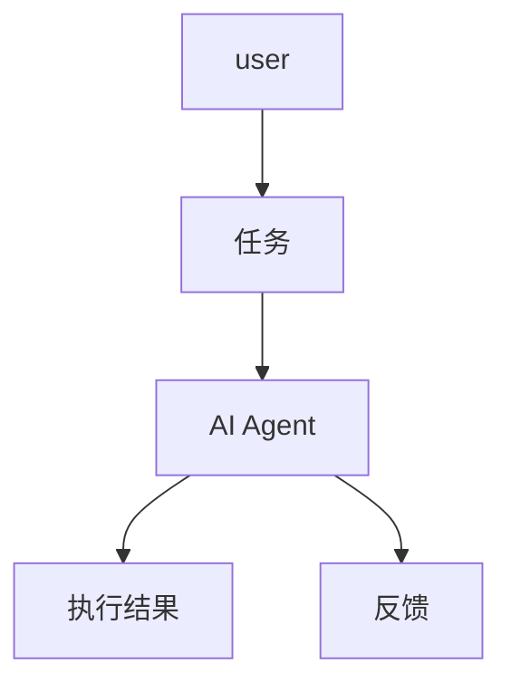
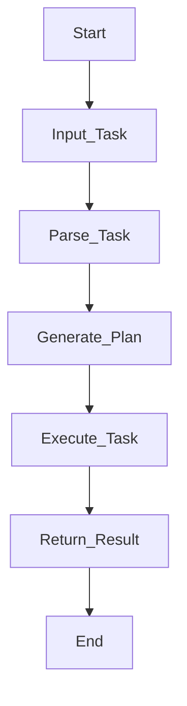
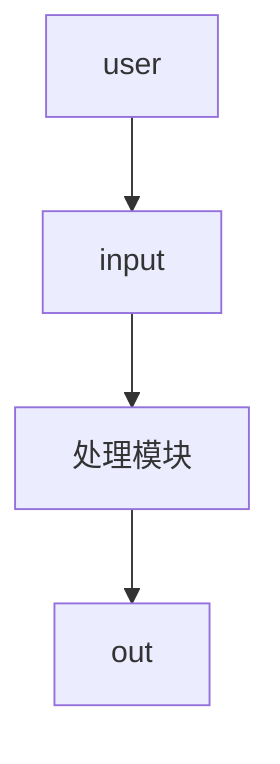
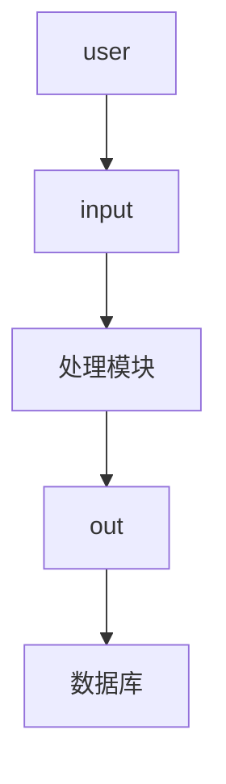

                 


# AI Agent在企业远程办公支持中的应用

## 关键词：AI Agent, 企业远程办公, 自然语言处理, 任务调度, 系统架构, 项目实战, 应用案例

## 摘要：  
随着远程办公的普及，企业对智能化办公工具的需求日益增加。AI Agent（人工智能代理）作为一种能够自主执行任务的智能体，正在成为企业远程办公支持的核心技术。本文将从AI Agent的基本概念、算法原理、系统架构、项目实战到实际应用案例，全面探讨AI Agent在企业远程办公中的应用，分析其优势、挑战及未来发展方向。

---

## 第1章: AI Agent与远程办公的背景介绍

### 1.1 问题背景与问题描述
#### 1.1.1 远程办公的兴起与挑战
近年来，远程办公模式因疫情和企业灵活管理需求而迅速普及。然而，传统远程办公工具（如视频会议软件、协作平台）存在效率低下、缺乏智能化、难以实现自动化操作等问题。

#### 1.1.2 传统远程办公工具的局限性
- 信息孤岛：各部门使用的工具互不兼容，数据难以整合。
- 人工干预过多：需要手动处理的任务（如安排会议、提醒）增加了员工负担。
- 缺乏智能化：难以根据上下文主动提供决策支持。

#### 1.1.3 AI Agent在远程办公中的潜在价值
AI Agent能够通过自然语言处理、任务调度和自动化执行能力，解决远程办公中的效率问题，提升协作体验。

### 1.2 AI Agent的核心概念与定义
#### 1.2.1 AI Agent的基本定义
AI Agent是一种能够感知环境、自主决策并执行任务的智能系统。在企业远程办公场景中，AI Agent可以执行任务调度、信息检索、自动化操作等。

#### 1.2.2 AI Agent的核心属性与特征
- **自主性**：无需人工干预，自动完成任务。
- **反应性**：能够根据环境变化调整行为。
- **学习能力**：通过数据不断优化决策模型。
- **可扩展性**：支持多种任务和场景。

#### 1.2.3 AI Agent与传统办公工具的区别
| 特性                | 传统办公工具          | AI Agent             |
|---------------------|-----------------------|----------------------|
| 智能化水平          | 低                   | 高                   |
| 自动化能力          | 有限                 | 强大                 |
| 任务执行方式        | 人工驱动             | 自动驱动             |

### 1.3 问题解决与边界外延
#### 1.3.1 AI Agent如何解决远程办公问题
AI Agent可以通过以下方式提升远程办公效率：
- **任务自动化**：自动安排会议、分配任务。
- **信息整合**：从多个工具中提取数据，提供统一视图。
- **智能提醒**：根据优先级主动提醒待办事项。

#### 1.3.2 AI Agent的应用边界与限制
- **技术限制**：AI Agent的性能依赖于算法和数据质量。
- **隐私问题**：处理企业数据时需注意隐私保护。
- **环境适应性**：需要适配不同的办公工具和系统。

#### 1.3.3 AI Agent与其他技术的协同作用
AI Agent可以与自然语言处理（NLP）、机器学习（ML）、区块链等技术结合，形成更强大的解决方案。

### 1.4 核心概念结构与组成要素
#### 1.4.1 AI Agent的系统架构
AI Agent的系统架构通常包括感知层、决策层和执行层。

#### 1.4.2 核心要素的对比分析
| 组件                | 功能描述             | 示例场景             |
|---------------------|----------------------|----------------------|
| 感知层              | 采集环境信息         | 监听会议安排提醒     |
| 决策层              | 根据信息制定策略     | 自动分配任务优先级   |
| 执行层              | 执行具体操作         | 发送提醒邮件         |

#### 1.4.3 系统组成与功能模块
- **输入模块**：接收用户指令或环境数据。
- **处理模块**：解析任务并制定执行计划。
- **输出模块**：执行任务并反馈结果。

---

## 第2章: AI Agent的核心概念与原理

### 2.1 核心概念原理
#### 2.1.1 AI Agent的基本原理
AI Agent通过感知环境、分析任务、制定计划并执行任务来实现目标。其核心是任务调度和自动化执行。

#### 2.1.2 AI Agent的核心算法
常用的算法包括：
- **任务调度算法**：基于优先级的任务排序。
- **自然语言处理算法**：用于理解和生成自然语言。

#### 2.1.3 AI Agent的任务规划机制
任务规划是AI Agent的核心，通常涉及状态空间搜索和启发式算法。

### 2.2 核心概念属性对比
#### 2.2.1 功能对比分析
| 功能                | 基于规则的系统      | AI Agent             |
|---------------------|--------------------|----------------------|
| 任务处理能力        | 单一任务处理        | 多任务处理           |
| 环境适应能力        | 适应性有限          | 高适应性             |

#### 2.2.2 性能对比分析
| 性能指标            | 基于规则的系统      | AI Agent             |
|---------------------|--------------------|----------------------|
| 执行效率            | 较低               | 较高                 |
| 系统扩展性          | 有限               | 强大                 |

#### 2.2.3 优缺点对比分析
| 优缺点              | 基于规则的系统      | AI Agent             |
|---------------------|--------------------|----------------------|
| 优点                | 实现简单            | 高智能化              |
| 缺点                | 扩展性差            | 需要大量数据训练      |

### 2.3 ER实体关系图架构


### 2.4 本章小结
本章详细介绍了AI Agent的核心概念、原理及其与传统办公工具的区别，为后续章节的深入分析奠定了基础。

---

## 第3章: AI Agent的算法原理与实现

### 3.1 算法原理概述
#### 3.1.1 AI Agent的基本算法
AI Agent的核心算法包括：
- **任务调度算法**：基于优先级的贪心算法。
- **自然语言处理算法**：如BERT模型用于语义理解。

#### 3.1.2 算法的数学模型
任务调度的数学模型如下：
$$
\text{优先级} = \sum_{i=1}^{n} w_i \cdot x_i
$$
其中，$w_i$是权重，$x_i$是任务特征。

#### 3.1.3 算法的实现步骤
1. 接收任务请求。
2. 解析任务并提取特征。
3. 计算任务优先级。
4. 制定执行计划。
5. 执行任务并反馈结果。

### 3.2 算法流程图


### 3.3 算法代码实现
```python
def process_task(task):
    # 解析任务
    parsed_task = parse_task(task)
    # 生成执行计划
    execution_plan = generate_plan(parsed_task)
    # 执行操作
    result = execute_plan(execution_plan)
    return result
```

### 3.4 本章小结
本章通过数学模型和流程图详细阐述了AI Agent的核心算法，为后续的系统设计和项目实现提供了理论基础。

---

## 第4章: AI Agent的系统架构与设计

### 4.1 系统架构设计
#### 4.1.1 系统功能设计
AI Agent的系统功能模块包括：
- **输入模块**：接收用户指令。
- **处理模块**：解析任务并制定执行计划。
- **输出模块**：执行任务并反馈结果。

#### 4.1.2 系统架构图


### 4.2 系统接口设计
#### 4.2.1 输入接口
- **HTTP接口**：接收用户请求。
- **API接口**：与其他系统集成。

#### 4.2.2 输出接口
- **消息队列**：发送执行结果。
- **数据库**：存储任务记录。

### 4.3 系统交互流程
#### 4.3.1 交互流程图


### 4.4 本章小结
本章通过系统架构设计和接口设计，详细阐述了AI Agent在企业远程办公中的实现方案。

---

## 第5章: AI Agent的项目实战

### 5.1 环境安装与配置
#### 5.1.1 开发环境
- **Python**：3.8+
- **框架**：Flask或Django。
- **依赖库**：numpy, pandas, scikit-learn。

### 5.2 系统核心实现
#### 5.2.1 代码实现
```python
def main():
    # 初始化系统
    initialize_system()
    # 接收用户输入
    task = receive_input()
    # 处理任务
    result = process_task(task)
    # 输出结果
    output_result(result)

if __name__ == "__main__":
    main()
```

#### 5.2.2 代码解读与分析
- `initialize_system()`：初始化系统配置。
- `receive_input()`：接收用户输入的任务。
- `process_task()`：解析任务并生成执行计划。
- `output_result()`：输出执行结果。

### 5.3 实际案例分析
#### 5.3.1 案例背景
某企业希望用AI Agent自动安排会议。

#### 5.3.2 案例实现
```python
def schedule_meeting(users, time_options):
    # 解析用户需求
    parsed_request = parse_request(users, time_options)
    # 生成会议计划
    plan = generate_plan(parsed_request)
    # 执行会议安排
    result = execute_plan(plan)
    return result
```

#### 5.3.3 案例分析与总结
通过AI Agent自动安排会议，减少了人工干预，提高了效率。

### 5.4 本章小结
本章通过项目实战，详细展示了AI Agent的实现过程和实际应用效果。

---

## 第6章: AI Agent在企业远程办公中的应用案例

### 6.1 应用场景介绍
#### 6.1.1 场景一：任务自动化
AI Agent自动分配任务并跟踪进度。

#### 6.1.2 场景二：信息整合
AI Agent从多个工具中提取数据，提供统一视图。

### 6.2 应用案例分析
#### 6.2.1 案例一：会议安排
通过AI Agent自动安排会议，减少协调时间。

#### 6.2.2 案例二：任务跟踪
AI Agent自动跟踪任务进度，提醒相关人员。

### 6.3 应用总结与展望
AI Agent在企业远程办公中的应用前景广阔，但仍需解决技术与隐私问题。

### 6.4 本章小结
本章通过实际案例，展示了AI Agent在企业远程办公中的应用价值。

---

## 第7章: 总结与展望

### 7.1 总结
AI Agent通过自动化任务、整合信息和提供智能支持，显著提升了企业远程办公的效率。

### 7.2 展望
未来，随着AI技术的进步，AI Agent将在企业远程办公中发挥更大的作用，实现更复杂的任务。

### 7.3 最佳实践Tips
- **数据安全**：确保数据在处理过程中的安全性。
- **用户隐私**：遵守隐私保护法规。
- **系统兼容性**：确保AI Agent能够与现有办公工具无缝集成。

### 7.4 本章小结
本章总结了AI Agent在企业远程办公中的应用，并展望了未来的发展方向。

---

## 作者：AI天才研究院/AI Genius Institute & 禅与计算机程序设计艺术 /Zen And The Art of Computer Programming

