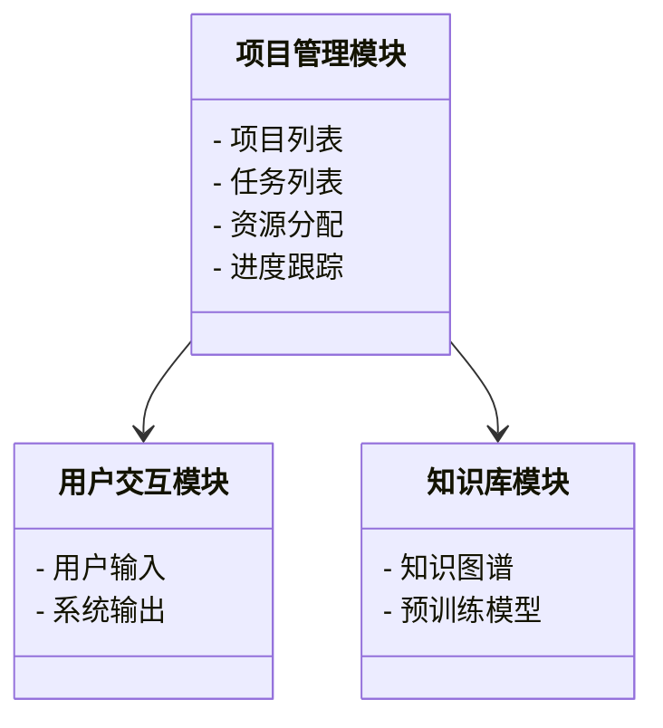
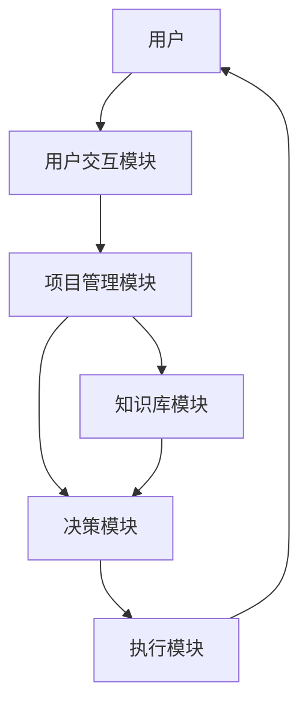

                 


# AI Agent在企业项目管理中的应用

> 关键词：AI Agent, 项目管理, 人工智能, 企业应用, 算法原理, 系统架构

> 摘要：本文详细探讨了AI Agent在企业项目管理中的应用，分析了其核心原理、算法实现、系统架构及实际案例。通过对比传统项目管理方法，展示了AI技术如何提升项目管理效率和决策能力。文章内容包括背景介绍、核心概念、算法原理、数学模型、系统架构、项目实战和最佳实践等部分，为读者提供了全面的技术视角。

---

## 第1章: AI Agent与企业项目管理概述

### 1.1 AI Agent的基本概念

#### 1.1.1 AI Agent的定义与特点
AI Agent（人工智能代理）是指能够感知环境、自主决策并执行任务的智能实体。其特点包括：
- **自主性**：无需外部干预，自主完成任务。
- **反应性**：实时感知环境并做出反应。
- **目标导向**：基于目标驱动行为。
- **学习能力**：通过数据和经验优化自身性能。

#### 1.1.2 AI Agent的核心技术基础
- **知识表示**：将问题转化为计算机可理解的形式，如知识图谱。
- **自然语言处理**：理解并生成人类语言。
- **推理与决策**：基于数据和规则进行逻辑推理和优化决策。

#### 1.1.3 AI Agent在企业中的应用场景
- **任务分配**：智能分配资源和任务，提高效率。
- **进度跟踪**：实时监控项目进展，预测潜在风险。
- **资源优化**：优化资源配置，降低成本。

### 1.2 企业项目管理的基本概念

#### 1.2.1 项目管理的定义与范围
项目管理是通过规划、执行和控制来实现项目目标的过程。其范围包括：
- 项目计划
- 资源分配
- 进度跟踪
- 风险管理

#### 1.2.2 传统项目管理的挑战与痛点
- **复杂性**：涉及多个部门和资源协调。
- **不确定性**：需求变化和技术风险难以预测。
- **效率低下**：人工处理大量重复性任务。

#### 1.2.3 AI技术如何解决项目管理问题
- **自动化**：AI代理自动处理任务分配和进度跟踪。
- **智能化**：基于数据和模型优化决策。
- **实时反馈**：快速响应变化，减少人为错误。

### 1.3 AI Agent在项目管理中的应用前景

#### 1.3.1 AI Agent在项目管理中的潜在价值
- **提高效率**：自动化处理重复性任务。
- **增强决策能力**：基于数据和模型做出最优决策。
- **降低风险**：提前预测和应对潜在问题。

#### 1.3.2 企业采用AI Agent的优势
- **提升竞争力**：通过优化资源配置和提高效率，增强市场竞争力。
- **降低成本**：减少人工干预，降低运营成本。
- **提升客户满意度**：快速响应客户需求，提高服务质量。

#### 1.3.3 AI Agent应用的挑战与机遇
- **挑战**：数据隐私、模型复杂性、技术门槛。
- **机遇**：技术创新、效率提升、市场扩展。

### 1.4 本章小结
本章介绍了AI Agent的基本概念及其在企业项目管理中的应用价值，分析了传统项目管理的痛点和AI技术的优势，为后续章节奠定了基础。

---

## 第2章: AI Agent的核心概念与原理

### 2.1 AI Agent的智能模型

#### 2.1.1 知识表示与推理
知识表示是将信息转化为计算机可处理的形式，如知识图谱。推理是基于知识图谱进行逻辑推理，生成新的知识。

#### 2.1.2 自然语言处理技术
自然语言处理（NLP）使AI Agent能够理解并生成人类语言。主要技术包括分词、词性标注、句法分析和语义理解。

#### 2.1.3 决策与规划算法
决策与规划算法基于当前状态和目标，生成最优行动方案。常用算法包括逻辑推理、强化学习和贝叶斯网络。

### 2.2 AI Agent的交互机制

#### 2.2.1 用户意图识别
通过NLP技术分析用户的输入，识别其意图并生成相应的回应。

#### 2.2.2 自然语言生成
基于预训练语言模型，生成符合用户需求的自然语言输出。

#### 2.2.3 人机交互设计
设计直观的交互界面，确保用户与AI Agent的有效沟通。

### 2.3 AI Agent的系统架构

#### 2.3.1 基于大模型的AI Agent架构
采用大语言模型（如GPT）作为核心，结合领域知识进行推理和决策。

#### 2.3.2 微服务架构在AI Agent中的应用
将系统功能模块化，通过微服务架构实现灵活的扩展和维护。

#### 2.3.3 分布式系统设计
通过分布式架构提高系统的可扩展性和容错能力。

### 2.4 本章小结
本章详细介绍了AI Agent的核心原理和系统架构，为后续章节的算法实现和系统设计提供了理论基础。

---

## 第3章: AI Agent在项目管理中的算法原理

### 3.1 知识表示与推理算法

#### 3.1.1 知识图谱构建
知识图谱是将实体及其关系表示为图结构的数据。构建知识图谱需要进行数据抽取、实体识别和关系抽取。

#### 3.1.2 逻辑推理算法
逻辑推理算法基于知识图谱进行推理，生成新的事实。常用算法包括前向链推理和反向链推理。

#### 3.1.3 概率推理模型
概率推理模型基于概率论进行推理，如贝叶斯网络和马尔可夫决策过程。

### 3.2 自然语言处理算法

#### 3.2.1 分词与词性标注
分词是将文本分割成词，词性标注是为每个词标注其词性。

#### 3.2.2 意图识别算法
意图识别是通过NLP技术识别用户的意图，常用算法包括基于规则的和基于机器学习的方法。

#### 3.2.3 文本生成算法
文本生成算法基于预训练模型生成自然语言文本，如GPT和Transformer模型。

### 3.3 决策与规划算法

#### 3.3.1 状态空间搜索
状态空间搜索算法通过遍历可能的状态，找到最优路径。常用算法包括广度优先搜索（BFS）和深度优先搜索（DFS）。

#### 3.3.2 强化学习算法
强化学习算法通过试错和奖励机制优化决策。常用算法包括Q-learning和Deep Q-Network（DQN）。

#### 3.3.3 贝叶斯网络模型
贝叶斯网络模型用于概率推理和决策，通过概率分布进行计算。

### 3.4 算法实现的数学模型

#### 3.4.1 逻辑推理的数学表达
逻辑推理可以通过逻辑命题和谓词逻辑进行表达。例如，命题逻辑中的蕴含关系：如果A，则B，可以表示为A → B。

#### 3.4.2 概率推理的公式推导
贝叶斯定理用于计算条件概率，公式如下：
$$P(A|B) = \frac{P(B|A)P(A)}{P(B)}$$

#### 3.4.3 强化学习的数学基础
强化学习的核心是通过Q值函数进行价值评估，公式如下：
$$Q(s, a) = r + \gamma \max Q(s', a')$$
其中，\(s\)是状态，\(a\)是动作，\(r\)是奖励，\(\gamma\)是折扣因子。

### 3.5 本章小结
本章详细讲解了AI Agent在项目管理中的算法原理，包括知识表示与推理、自然语言处理和决策规划算法，并通过数学公式和流程图进行了直观展示。

---

## 第4章: AI Agent在项目管理中的系统分析与架构设计

### 4.1 项目管理场景介绍

#### 4.1.1 任务分配
AI Agent根据项目需求和资源情况，智能分配任务给团队成员。

#### 4.1.2 进度跟踪
AI Agent实时监控项目进度，预测潜在风险并提出调整建议。

### 4.2 系统功能设计

#### 4.2.1 领域模型设计
领域模型通过类图展示系统的功能模块及其关系。



### 4.3 系统架构设计



### 4.4 系统接口设计

#### 4.4.1 API接口
- **输入接口**：接收用户的请求和系统反馈。
- **输出接口**：返回处理结果和系统状态。

#### 4.4.2 交互流程
用户通过界面提交请求，系统通过API调用后端服务进行处理，并将结果反馈给用户。

### 4.5 本章小结
本章通过系统分析和架构设计，展示了AI Agent在项目管理中的应用场景和实现方式，为后续的项目实战奠定了基础。

---

## 第5章: AI Agent在项目管理中的项目实战

### 5.1 环境安装

#### 5.1.1 安装Python和相关库
- Python版本：3.8及以上
- 库：numpy、pandas、scikit-learn、transformers、flask

```bash
pip install numpy pandas scikit-learn transformers flask
```

### 5.2 核心代码实现

#### 5.2.1 知识图谱构建
```python
from kgtool import kg_builder

kg = kg_builder()
kg.add_entity("Project", "项目")
kg.add_entity("Task", "任务")
kg.add_relation("has_task", "有任务")
kg.build()
```

#### 5.2.2 自然语言处理
```python
from transformers import pipeline

nlp = pipeline("text-classification", model="snunlp/kcc-base")
result = nlp("项目的进度延迟了。")
print(result)
```

#### 5.2.3 决策与规划
```python
from reinforcement import q_learning

q_learning.train()
action = q_learning.predict(state)
```

### 5.3 代码解读与分析

#### 5.3.1 知识图谱构建代码
- 使用kgtool库构建知识图谱，定义项目和任务实体及其关系。
- 通过构建知识图谱实现知识表示和推理。

#### 5.3.2 自然语言处理代码
- 使用预训练模型进行文本分类，识别用户意图。
- 返回处理结果。

#### 5.3.3 决策与规划代码
- 基于强化学习算法进行决策和规划，生成最优行动方案。

### 5.4 实际案例分析

#### 5.4.1 案例背景
某企业开发项目，需要协调多个团队和资源。

#### 5.4.2 案例实现
通过AI Agent进行任务分配和进度跟踪，优化项目管理流程。

#### 5.4.3 案例分析
- AI Agent自动分配任务，提高了效率。
- 实时跟踪项目进度，提前预测风险。

### 5.5 本章小结
本章通过项目实战展示了AI Agent在项目管理中的具体应用，通过代码实现和案例分析，验证了其实际价值。

---

## 第6章: AI Agent在项目管理中的最佳实践

### 6.1 最佳实践 Tips

#### 6.1.1 数据质量
确保数据的准确性和完整性，提高模型的性能。

#### 6.1.2 模型可解释性
提升模型的可解释性，便于用户理解和信任。

#### 6.1.3 持续优化
定期更新模型和优化算法，适应不断变化的需求。

### 6.2 小结
总结AI Agent在项目管理中的应用价值和成功经验。

### 6.3 注意事项
- 数据隐私和安全问题。
- 模型的可扩展性和维护性。
- 人机协作的有效性。

### 6.4 拓展阅读
推荐相关书籍和论文，进一步深入学习AI Agent和项目管理的知识。

---

## 作者：AI天才研究院 & 禅与计算机程序设计艺术

---

以上是《AI Agent在企业项目管理中的应用》的完整目录和内容概要，涵盖了从基础概念到实际应用的各个方面，为读者提供了全面的技术视角。

