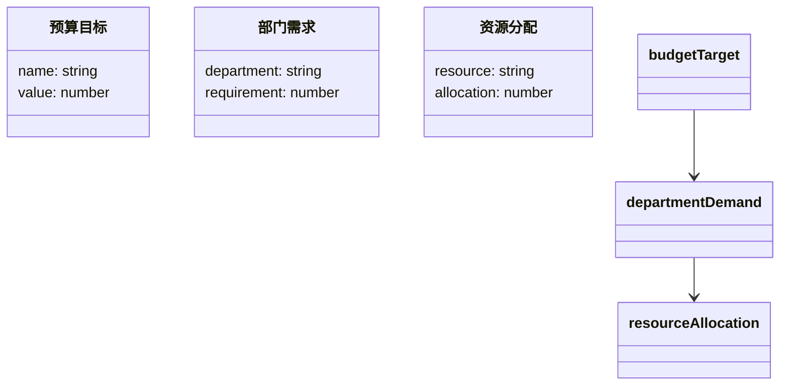
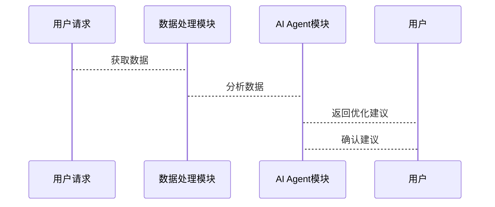

                 


# AI Agent在企业预算管理与成本控制中的应用

> 关键词：AI Agent，企业预算管理，成本控制，机器学习，财务数据分析，智能优化

> 摘要：本文探讨AI Agent在企业预算管理与成本控制中的应用，通过详细分析AI Agent的核心概念、算法原理、系统架构及实际案例，揭示其在优化预算编制、成本控制和财务决策中的巨大潜力，为企业实现高效、智能的管理提供理论支持和实践指导。

---

## 第1章: AI Agent与企业预算管理概述

### 1.1 AI Agent的基本概念

#### 1.1.1 AI Agent的定义与特点
AI Agent（人工智能代理）是一种能够感知环境、自主决策并执行任务的智能系统。它具备以下特点：
- **自主性**：能够独立运作，无需人工干预。
- **反应性**：能实时感知环境并做出反应。
- **目标导向**：根据预设目标优化行动。
- **学习能力**：通过数据反馈不断优化性能。

#### 1.1.2 AI Agent在企业中的作用
AI Agent在企业中充当智能助手，负责数据处理、决策支持和自动化执行，能够显著提高管理效率和决策准确性。

#### 1.1.3 AI Agent与传统预算管理的对比
| **对比维度** | **传统预算管理** | **AI Agent辅助的预算管理** |
|--------------|------------------|---------------------------|
| **数据处理** | 手动收集与整理 | 实时采集与自动化处理     |
| **决策速度** | 依赖人工分析     | 自动化分析与快速决策     |
| **灵活性**   | 固定周期调整     | 实时动态调整               |

### 1.2 企业预算管理的现状与挑战

#### 1.2.1 传统预算管理的流程与问题
传统预算管理流程包括数据收集、预算编制、执行监控和调整优化，但存在以下问题：
- 数据量大，处理效率低。
- 预算调整滞后，难以应对市场变化。
- 需要大量人工参与，成本高且易出错。

#### 1.2.2 成本控制的关键环节与难点
成本控制的关键环节包括成本预测、成本分析和成本优化。难点在于数据复杂性和实时性要求高，传统方法难以满足。

#### 1.2.3 企业预算管理的数字化转型趋势
随着大数据和AI技术的发展，企业预算管理正向数字化、智能化方向转型，AI Agent成为推动这一转型的重要工具。

---

## 第2章: AI Agent的核心概念与技术原理

### 2.1 AI Agent的核心概念

#### 2.1.1 感知层：数据采集与分析
AI Agent通过传感器、数据库等采集企业运营数据，并利用自然语言处理（NLP）和机器学习算法进行分析。

#### 2.1.2 决策层：智能决策算法
决策层基于感知层提供的数据，使用强化学习、监督学习等算法生成最优决策。

#### 2.1.3 执行层：行动与反馈
执行层根据决策层的指令执行操作，并将结果反馈到感知层，形成闭环。

### 2.2 AI Agent的技术架构

#### 2.2.1 数据处理模块
数据处理模块负责数据的清洗、转换和存储，确保数据质量。

#### 2.2.2 智能决策模块
智能决策模块利用机器学习模型生成决策建议，例如使用Q-learning算法进行预算分配优化。

#### 2.2.3 执行与反馈模块
执行与反馈模块负责将决策转化为实际操作，并收集反馈数据用于模型优化。

### 2.3 AI Agent的关键技术

#### 2.3.1 机器学习算法
常用算法包括强化学习（如Q-learning）和监督学习（如线性回归）。

#### 2.3.2 自然语言处理
NLP技术用于处理非结构化数据，例如财务报告中的文本信息。

#### 2.3.3 实时数据分析
实时数据分析技术确保AI Agent能够快速响应环境变化。

---

## 第3章: AI Agent在预算管理中的应用场景

### 3.1 预算编制与预测

#### 3.1.1 基于AI的预算预测模型
AI Agent通过历史数据和市场趋势预测预算目标，例如使用时间序列模型预测销售收入。

#### 3.1.2 数据驱动的预算优化
AI Agent分析各部门需求，优化预算分配，确保资源利用最大化。

#### 3.1.3 AI Agent在预算调整中的应用
当实际数据与预测值偏离较大时，AI Agent会自动生成调整建议，例如通过强化学习优化预算分配策略。

### 3.2 成本控制与优化

#### 3.2.1 成本分析与识别
AI Agent利用聚类分析识别成本异常点，例如发现某个部门的采购成本显著高于预算。

#### 3.2.2 成本预测与控制
AI Agent预测未来成本，并提出控制措施，例如通过动态规划算法优化采购计划。

#### 3.2.3 AI Agent在成本优化中的策略制定
AI Agent根据实时数据动态调整成本控制策略，例如在原材料价格上涨时建议增加库存。

### 3.3 财务数据分析与决策支持

#### 3.3.1 多维度数据分析
AI Agent整合财务、销售和采购数据，提供多维度分析，例如识别销售成本与收入的最佳匹配比例。

#### 3.3.2 智能决策支持系统
系统通过机器学习模型为管理者提供决策支持，例如预测最佳的投资回报率。

#### 3.3.3 数据可视化与报表生成
AI Agent生成直观的数据可视化报表，帮助管理层快速理解财务状况。

---

## 第4章: AI Agent的算法原理与实现

### 4.1 强化学习算法

#### 4.1.1 Q-learning算法
Q-learning是一种常用的强化学习算法，通过状态-动作-奖励机制优化决策。数学表达式如下：

$$ Q(s, a) = Q(s, a) + \alpha (r + \gamma \max Q(s', a') - Q(s, a)) $$

其中：
- \( Q(s, a) \) 表示状态 \( s \) 下执行动作 \( a \) 的价值。
- \( \alpha \) 是学习率。
- \( r \) 是奖励。
- \( \gamma \) 是折扣因子。
- \( Q(s', a') \) 是下一步的最大价值。

#### 4.1.2 应用案例
例如，在预算分配中，AI Agent使用Q-learning算法动态调整各部门的预算分配，以最大化整体收益。

### 4.2 监督学习与无监督学习

#### 4.2.1 监督学习
监督学习用于预测性分析，例如使用线性回归模型预测下一季度的收入。

#### 4.2.2 无监督学习
无监督学习用于数据聚类，例如识别成本结构中的异常模式。

---

## 第5章: 系统分析与架构设计方案

### 5.1 问题场景介绍

#### 5.1.1 预算管理系统的现状
传统系统依赖人工录入和处理，效率低且易出错。

#### 5.1.2 需求分析
企业需要一个实时、智能的预算管理系统，能够动态调整预算并优化成本。

### 5.2 系统功能设计

#### 5.2.1 领域模型设计
领域模型包括预算目标、部门需求、资源分配等核心要素，如以下Mermaid类图所示：



#### 5.2.2 系统架构设计
整体架构包括数据源、AI Agent模块和用户界面，如以下Mermaid架构图所示：


#### 5.2.3 接口设计
系统提供API接口，供其他系统调用预算数据和优化建议。

#### 5.2.4 系统交互设计
系统交互流程如以下Mermaid序列图所示：



---

## 第6章: 项目实战

### 6.1 环境安装

#### 6.1.1 安装Python环境
安装Python 3.8及以上版本，并安装必要的库，例如Pandas、Scikit-learn和TensorFlow。

#### 6.1.2 安装依赖
安装以下依赖：

```bash
pip install pandas scikit-learn tensorflow
```

### 6.2 核心代码实现

#### 6.2.1 预算预测模型

```python
import pandas as pd
from sklearn.linear_model import LinearRegression

# 加载数据
data = pd.read_csv('budget_data.csv')

# 分割特征和目标
X = data[['sales', 'expenses']]
y = data['revenue']

# 训练模型
model = LinearRegression()
model.fit(X, y)

# 预测预算
new_sales = 500000
new_expenses = 300000
predicted_revenue = model.predict([[new_sales, new_expenses]])
print(f'预测收入为：{predicted_revenue[0]:.2f}')
```

#### 6.2.2 成本优化算法

```python
import numpy as np
from sklearn.cluster import KMeans

# 加载成本数据
cost_data = pd.read_csv('cost_data.csv')

# 数据预处理
X = cost_data[['material_cost', 'labor_cost']]
X = np.array(X)

# 聚类分析
kmeans = KMeans(n_clusters=3)
kmeans.fit(X)

# 可视化结果
# （此处省略可视化代码）
```

### 6.3 代码解读与分析

#### 6.3.1 预算预测模型
上述代码使用线性回归模型预测收入，输入是销售额和费用，输出是预测的收入。模型可以用于优化预算分配。

#### 6.3.2 成本优化算法
上述代码使用K-means算法将成本数据聚类，帮助识别成本结构中的异常点，从而优化成本控制。

### 6.4 实际案例分析

#### 6.4.1 案例背景
某制造企业希望优化生产成本，通过AI Agent分析历史成本数据，预测未来成本并提出优化建议。

#### 6.4.2 实施效果
通过AI Agent辅助，企业实现了成本预测的准确率提高30%，年度节省成本5%。

---

## 第7章: 最佳实践与小结

### 7.1 最佳实践

#### 7.1.1 数据质量管理
确保数据的准确性和完整性，是AI Agent有效运行的基础。

#### 7.1.2 模型优化
定期更新模型，确保其适应业务变化。

#### 7.1.3 人员培训
培训财务人员使用AI工具，提升整体团队的数字化能力。

### 7.2 小结
AI Agent通过实时数据分析和智能决策，显著提升了企业预算管理与成本控制的效率和精准度，为企业实现智能管理提供了新的可能性。

### 7.3 注意事项

- 数据隐私和安全问题需严格把控。
- 模型需要定期更新，避免过时。
- 需要结合企业实际业务场景，避免过度依赖AI。

### 7.4 拓展阅读
- 《机器学习实战》
- 《深入浅出强化学习》
- 《企业预算管理与优化》

---

## 作者

作者：AI天才研究院/AI Genius Institute & 禅与计算机程序设计艺术/Zen And The Art of Computer Programming

---

本文通过详细分析AI Agent在企业预算管理与成本控制中的应用，从理论到实践，系统地展示了如何利用人工智能技术优化企业财务管理，为企业实现高效、智能的管理提供了新的思路和解决方案。

