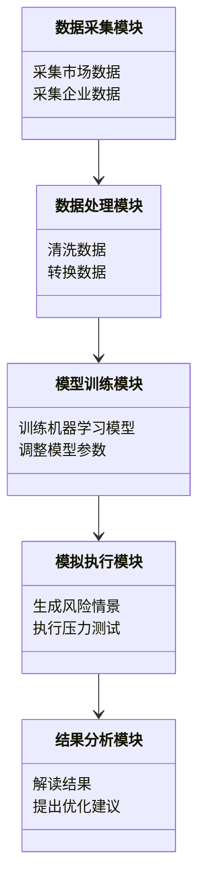
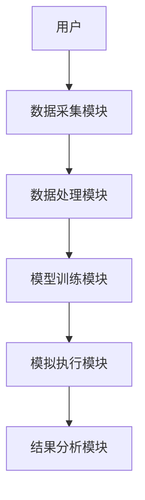
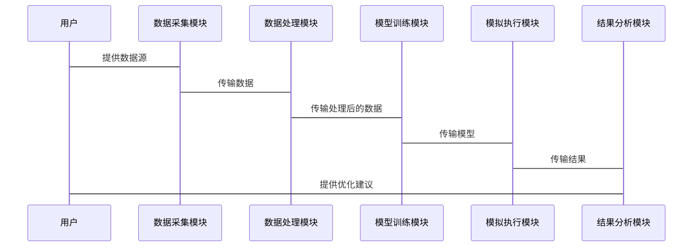

                 


# AI Agent在企业风险情景模拟与压力测试中的应用

> 关键词：AI Agent, 风险情景模拟, 压力测试, 企业风险管理, 人工智能, 系统架构设计

> 摘要：本文探讨了AI Agent在企业风险情景模拟与压力测试中的应用。通过分析AI Agent的核心原理、算法实现、系统架构设计，以及在实际项目中的应用案例，展示了如何利用AI Agent技术提升企业风险管理能力。文章从背景介绍、核心概念、算法原理、系统设计到项目实战，全面解析了AI Agent在企业风险情景模拟与压力测试中的价值与实现方法。

---

## 第1章: 引言

### 1.1 背景介绍

#### 1.1.1 核心概念术语说明

- **AI Agent（人工智能代理）**：一种能够感知环境、自主决策并执行任务的智能体。
- **风险情景模拟**：通过构建可能的风险场景，预测其对企业的影响。
- **压力测试**：评估系统在极端条件下的表现和抗压能力。
- **企业风险管理**：识别、评估和应对企业运营中的各类风险。

#### 1.1.2 问题背景与问题描述

企业在经营过程中面临多种风险，如市场波动、供应链中断、政策变化等。传统风险管理和压力测试方法依赖人工分析，效率低且覆盖面有限。随着AI技术的发展，利用AI Agent进行风险情景模拟与压力测试成为可能。

#### 1.1.3 问题解决与边界外延

AI Agent能够通过数据驱动的方式，快速构建风险场景，模拟极端情况下的企业表现，并提出应对策略。其边界包括数据来源、模型精度和计算能力。

#### 1.1.4 核心要素组成

- 数据输入：历史数据、市场数据、企业运营数据。
- 模型构建：机器学习模型、自然语言处理模型。
- 模拟引擎：风险场景生成、压力测试执行。
- 结果分析：可视化报告、策略优化。

---

## 第2章: AI Agent的核心原理与技术实现

### 2.1 AI Agent的结构与功能

#### 2.1.1 AI Agent的组成要素

- **感知模块**：数据采集与处理。
- **决策模块**：基于数据的决策逻辑。
- **执行模块**：输出结果或触发操作。
- **学习模块**：模型优化与更新。

#### 2.1.2 AI Agent的功能模块

- 数据处理模块：清洗、转换和预处理数据。
- 模型训练模块：构建机器学习模型。
- 模拟执行模块：生成风险场景并执行压力测试。
- 结果分析模块：解读结果并提出优化建议。

### 2.2 AI Agent的核心算法

#### 2.2.1 机器学习算法

- **线性回归**：用于风险因素的量化分析。
- **随机森林**：用于复杂场景的分类与回归。
- **神经网络**：用于非线性关系的建模。

#### 2.2.2 自然语言处理

- **文本分类**：识别风险相关文档。
- **情感分析**：评估市场情绪。

#### 2.2.3 强化学习

- **Q-Learning**：用于策略优化和动态决策。

### 2.3 AI Agent的数学模型与公式

#### 2.3.1 机器学习模型的数学表达

$$ y = \beta_0 + \beta_1 x_1 + \beta_2 x_2 + \dots + \beta_n x_n $$

其中，$y$ 为目标变量，$\beta$ 为系数，$x$ 为输入变量。

#### 2.3.2 强化学习模型的数学表达

$$ Q(s, a) = r + \gamma \max_{a'} Q(s', a') $$

其中，$Q$ 是价值函数，$s$ 是状态，$a$ 是动作，$\gamma$ 是折扣因子。

---

## 第3章: 风险情景模拟的AI Agent实现

### 3.1 风险情景模拟的定义与分类

#### 3.1.1 风险情景模拟的分类

- **市场风险模拟**：预测市场波动对企业的影响。
- **信用风险模拟**：评估贷款组合的风险。
- **操作风险模拟**：模拟潜在的操作失误对企业的影响。

#### 3.1.2 不同类型风险情景模拟的特点

- 市场风险模拟：依赖历史市场数据。
- 信用风险模拟：依赖贷款数据和违约概率。
- 操作风险模拟：依赖历史操作数据和流程。

### 3.2 AI Agent在风险情景模拟中的应用流程

#### 3.2.1 数据收集与预处理

- 数据来源：历史交易数据、市场数据、企业运营数据。
- 数据清洗：去除噪声数据，处理缺失值。
- 数据转换：将数据转换为模型可接受的格式。

#### 3.2.2 模型训练与优化

- 模型选择：根据具体场景选择合适的算法。
- 参数优化：通过交叉验证调整模型参数。
- 模型评估：通过回测评估模型的准确性。

#### 3.2.3 模拟结果的分析与解读

- 结果可视化：生成图表展示模拟结果。
- 结果解读：分析风险敞口和潜在损失。
- 结果优化：提出风险缓解策略。

### 3.3 风险情景模拟的案例分析

#### 3.3.1 案例背景介绍

某金融企业希望通过AI Agent模拟市场波动对企业利润的影响。

#### 3.3.2 AI Agent在案例中的具体应用

- 数据收集：收集过去5年的市场数据和企业财务数据。
- 模型训练：使用随机森林模型预测市场波动。
- 模拟执行：生成多种市场波动情景，模拟对企业利润的影响。

#### 3.3.3 案例结果与分析

- 模拟结果显示，在极端市场波动下，企业利润可能下降20%。
- 提出的风险缓解策略：调整投资组合，分散风险。

---

## 第4章: 压力测试的AI Agent实现

### 4.1 压力测试的定义与分类

#### 4.1.1 压力测试的定义

压力测试是评估系统在极端条件下的表现和抗压能力。

#### 4.1.2 压力测试的分类

- **负载测试**：评估系统在高负载下的表现。
- **故障恢复测试**：评估系统在故障情况下的恢复能力。
- **安全测试**：评估系统在攻击情况下的安全性。

### 4.2 AI Agent在压力测试中的应用流程

#### 4.2.1 数据收集与预处理

- 数据来源：系统日志、用户行为数据、网络流量数据。
- 数据清洗：去除异常数据，处理缺失值。
- 数据转换：将数据转换为模型可接受的格式。

#### 4.2.2 模型训练与优化

- 模型选择：根据具体场景选择合适的算法。
- 参数优化：通过交叉验证调整模型参数。
- 模型评估：通过回测评估模型的准确性。

#### 4.2.3 压力测试的执行与结果分析

- 压力测试执行：生成多种极端情景，模拟系统表现。
- 结果分析：分析系统性能指标，提出优化建议。

### 4.3 压力测试的案例分析

#### 4.3.1 案例背景介绍

某电商平台希望通过AI Agent模拟高并发情况下的系统表现。

#### 4.3.2 AI Agent在案例中的具体应用

- 数据收集：收集过去3年的用户行为数据和系统日志。
- 模型训练：使用神经网络模型预测高并发情况下的系统负载。
- 压力测试执行：生成多种高并发情景，模拟系统表现。

#### 4.3.3 案例结果与分析

- 模拟结果显示，在高并发情况下，系统响应时间可能增加50%。
- 提出的优化策略：增加服务器资源，优化系统架构。

---

## 第5章: 系统架构设计与实现

### 5.1 系统功能设计

#### 5.1.1 系统功能模块

- 数据采集模块：采集企业运营数据。
- 数据处理模块：清洗和转换数据。
- 模型训练模块：训练AI Agent模型。
- 模拟执行模块：生成风险情景并执行压力测试。
- 结果分析模块：解读结果并提出优化建议。

#### 5.1.2 系统功能设计的领域模型



### 5.2 系统架构设计

#### 5.2.1 系统架构设计的总体架构



#### 5.2.2 系统接口设计

- 数据接口：与企业数据源对接。
- 模型接口：与其他系统模块对接。

### 5.3 系统交互设计

#### 5.3.1 系统交互流程



---

## 第6章: 项目实战

### 6.1 环境安装

- 安装Python：建议使用Python 3.8或更高版本。
- 安装依赖库：`numpy`, `pandas`, `scikit-learn`, `tensorflow`.

### 6.2 系统核心实现源代码

#### 6.2.1 数据采集模块

```python
import requests

def fetch_data(api_key):
    url = f"https://api.example.com/data?api_key={api_key}"
    response = requests.get(url)
    return response.json()
```

#### 6.2.2 数据处理模块

```python
import pandas as pd

def process_data(data):
    df = pd.DataFrame(data)
    df.dropna(inplace=True)
    return df
```

#### 6.2.3 模型训练模块

```python
from sklearn.ensemble import RandomForestRegressor

def train_model(X, y):
    model = RandomForestRegressor(n_estimators=100)
    model.fit(X, y)
    return model
```

#### 6.2.4 模拟执行模块

```python
def simulate_scenario(model, input_data):
    prediction = model.predict(input_data)
    return prediction
```

### 6.3 代码应用解读与分析

- **数据采集模块**：从外部API获取数据。
- **数据处理模块**：清洗和转换数据，为模型训练做准备。
- **模型训练模块**：使用随机森林模型训练AI Agent。
- **模拟执行模块**：利用训练好的模型生成风险情景并执行压力测试。

### 6.4 案例分析

#### 6.4.1 案例背景

某企业希望通过AI Agent模拟市场波动对企业利润的影响。

#### 6.4.2 实施过程

1. 采集市场数据和企业财务数据。
2. 清洗数据并训练随机森林模型。
3. 生成多种市场波动情景，模拟对企业利润的影响。

#### 6.4.3 实施结果

- 模拟结果显示，在极端市场波动下，企业利润可能下降20%。
- 提出的风险缓解策略：调整投资组合，分散风险。

---

## 第7章: 总结与展望

### 7.1 本章小结

本文详细介绍了AI Agent在企业风险情景模拟与压力测试中的应用，从核心原理到实际案例，展示了AI Agent如何帮助企业提升风险管理能力。

### 7.2 未来展望

随着AI技术的不断发展，AI Agent在企业风险管理中的应用将更加广泛。未来的研究方向包括更复杂的模型、更高效的数据处理方法以及更智能化的决策支持系统。

---

## 作者信息

作者：AI天才研究院/AI Genius Institute & 禅与计算机程序设计艺术 /Zen And The Art of Computer Programming

---

本文通过系统化的分析与实践，详细阐述了AI Agent在企业风险情景模拟与压力测试中的应用，为企业的风险管理提供了新的思路和方法。

